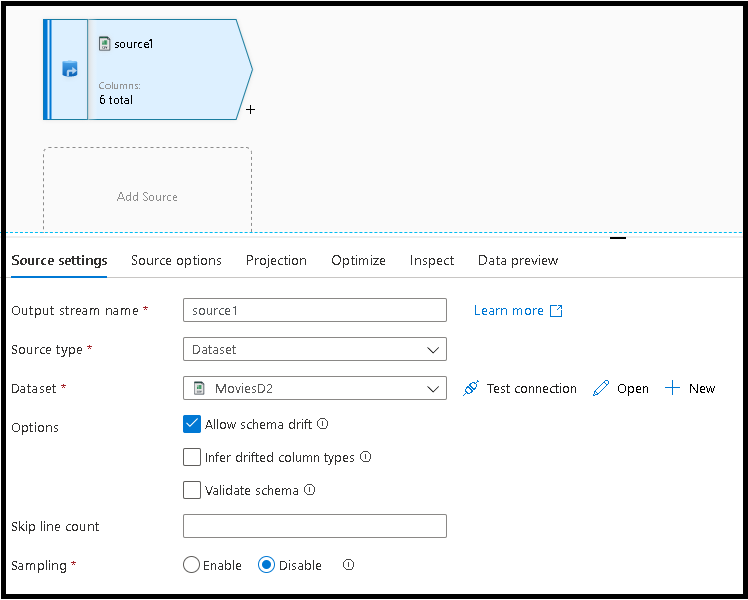
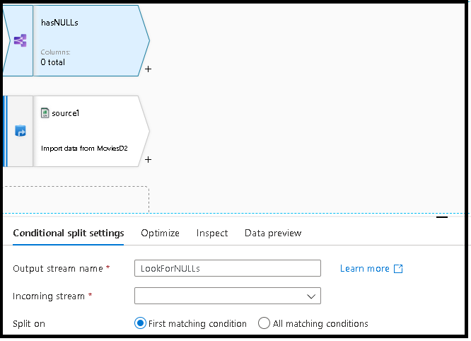
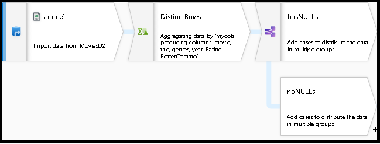

# Dedupe rows and find nulls using data flow snippets

[!INCLUDE[appliesto-adf-asa-md](includes/appliesto-adf-asa-md.md)]

By using code snippets in mapping data flows, you can very easily perform common tasks like data deduplication and null filtering. This how-to guide will explain how to add those functions to your pipelines very easily using data flow script snippets.

> [!VIDEO https://www.microsoft.com/en-us/videoplayer/embed/RE4GnhH]

## Create a pipeline

1. Select **+New Pipeline** to create a new pipeline.

2. Add a data flow activity.

3. Add a Source transformation and connect it to one of your datasets

    

4. The dedupe and NULL check snippets use generic patterns that leverage data flow schema drift so they will work with any schema from your dataset, or with datasets that do not have any pre-defined schema.

5. [Go to the Data Flow Script documentation page and copy the code snippet for Distinct Rows.](https://docs.microsoft.com/azure/data-factory/data-flow-script#distinct-row-using-all-columns)

6. In your data flow designer UI, click the Script button on the top right to open the script editor behind the data flow graph.

    

7. After the definition for ```source1``` in your script, hit Enter and then paste in the code snippet.

8. You will connect this pasted code snippet to the previous Source transformation that you created in the graph by typing "source1" in front of the pasted code.

9. Alternatively, you can connect the new transformation in the designer by selecting the incoming stream from the new transformation node in the graph.

    

10. Now your data flow will remove duplicate rows from your source using the Aggregate transformation that groups by all rows using a general hash across all column values.
    
11. Next, we'll add a code snippet for splitting your data into a stream that contains rows with NULLs and a stream that does not have any NULLs.

12. [Go back to the Snippet library and this time copy the code for the NULL checks.](https://docs.microsoft.com/azure/data-factory/data-flow-script#check-for-nulls-in-all-columns)

13. In your data flow designer, again click Script and paste this new transformation code at the bottom, connecting it to your previous transformation by typing the name of that transformation in front of the pasted snippet.

14. Your data flow graph should now look similar to this:

    

  You now have a working data flow with generic deduping and NULL checks by taking existing code snippets from the Data Flow Script library and adding them into your existing design.

## Next steps

* Build the rest of your data flow logic by using mapping data flows [transformations](concepts-data-flow-overview.md).
