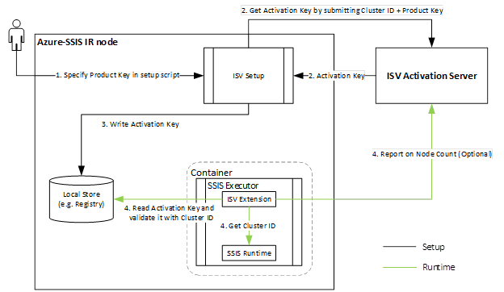

# Install paid or licensed custom components for the Azure-SSIS integration runtime

This article describes how an ISV can develop and install paid or licensed custom components for SQL Server Integration Services (SSIS) packages that run in Azure in the Azure-SSIS integration runtime.

## The problem

The nature of the Azure-SSIS integration runtime presents several challenges, which make the typical licensing methods used for the on-premises installation of custom components inadequate. As a result, the Azure-SSIS IR requires a different approach.

-   The nodes of the Azure-SSIS IR are volatile and can be allocated or released at any time. For example, you can start or stop nodes to manage the cost, or scale up and down through various node sizes. As a result, binding a third-party component license to a particular node by using machine-specific info such as MAC address or CPU ID is no longer viable.

-   You can also scale the Azure-SSIS IR in or out, so that the number of nodes can shrink or expand at any time.

## The solution

As a result of the limitations of traditional licensing methods described in the previous section, the Azure-SSIS IR provides a new solution. This solution uses Windows environment variables and SSIS system variables for the license binding and validation of third-party components. ISVs can use these variables to obtain unique and persistent info for an Azure-SSIS IR, such as Cluster ID and Cluster Node Count. With this info, ISVs can then bind the license for their component to an Azure-SSIS IR *as a cluster*. This binding uses an ID that doesn't change when customers start or stop, scale up or down, scale in or out, or reconfigure the Azure-SSIS IR in any way.

The following diagram shows the typical installation, activation and license binding, and validation flows for third-party components that use these new variables:



## Instructions
1. ISVs can offer their licensed components in various SKUs or tiers (for example, single node, up to 5 nodes, up to 10 nodes, and so forth). The ISV provides the corresponding Product Key when customers purchase a product. The ISV can also provide an Azure Storage blob container that contains an ISV Setup script and associated files. Customers can copy these files into their own storage container and modify them with their own Product Key (for example, by running `IsvSetup.exe -pid xxxx-xxxx-xxxx`). Customers can then provision or reconfigure the Azure-SSIS IR with the SAS URI of their container as parameter. For more info, see [Custom setup for the Azure-SSIS integration runtime](how-to-configure-azure-ssis-ir-custom-setup.md).

2. When the Azure-SSIS IR is provisioned or reconfigured, ISV Setup runs on each node to query the Windows environment variables, `SSIS_CLUSTERID` and `SSIS_CLUSTERNODECOUNT`. Then the Azure-SSIS IR submits its Cluster ID and the Product Key for the licensed product to the ISV Activation Server to generate an Activation Key.

3. After receiving the Activation Key, ISV Setup can store the key locally on each node (for example, in the Registry).

4. When customers run a package that uses the ISV's licensed component on a node of the Azure-SSIS IR, the package reads the locally stored Activation Key and validates it against the node's Cluster ID. The package can also optionally report the Cluster Node Count to the ISV activation server.

    Here is an example of code that validates the activation key and reports the cluster node count:

    ```csharp
    public override DTSExecResult Validate(Connections, VariableDispenser, IDTSComponentEvents componentEvents, IDTSLogging log) 
                                                                                                                               
    {                                                                                                                             
                                                                                                                               
    Variables vars = null;                                                                                                        
                                                                                                                               
    variableDispenser.LockForRead("System::ClusterID");                                                                           
                                                                                                                               
    variableDispenser.LockForRead("System::ClusterNodeCount");                                                                    
                                                                                                                               
    variableDispenser.GetVariables(ref vars);                                                                                     
                                                                                                                               
    // Validate Activation Key with ClusterID                                                                                     
                                                                                                                               
    // Report on ClusterNodeCount                                                                                                 
                                                                                                                               
    vars.Unlock();                                                                                                                
                                                                                                                               
    return base.Validate(connections, variableDispenser, componentEvents, log);                                                   
                                                                                                                               
    }
    ```

## ISV partners

You can find a list of ISV partners who have adapted their components and extensions for the Azure-SSIS IR at the end of this blog post - [Enterprise Edition, Custom Setup, and 3rd Party Extensibility for SSIS in ADF](https://blogs.msdn.microsoft.com/ssis/2018/04/27/enterprise-edition-custom-setup-and-3rd-party-extensibility-for-ssis-in-adf/).

## Next steps

-   [Custom setup for the Azure-SSIS integration runtime](how-to-configure-azure-ssis-ir-custom-setup.md)

-   [Enterprise Edition of the Azure-SSIS Integration Runtime](how-to-configure-azure-ssis-ir-enterprise-edition.md)
