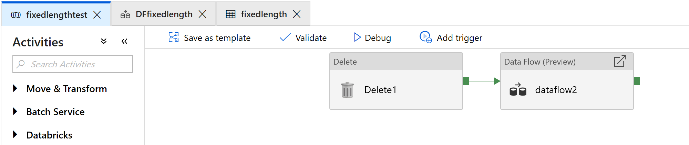
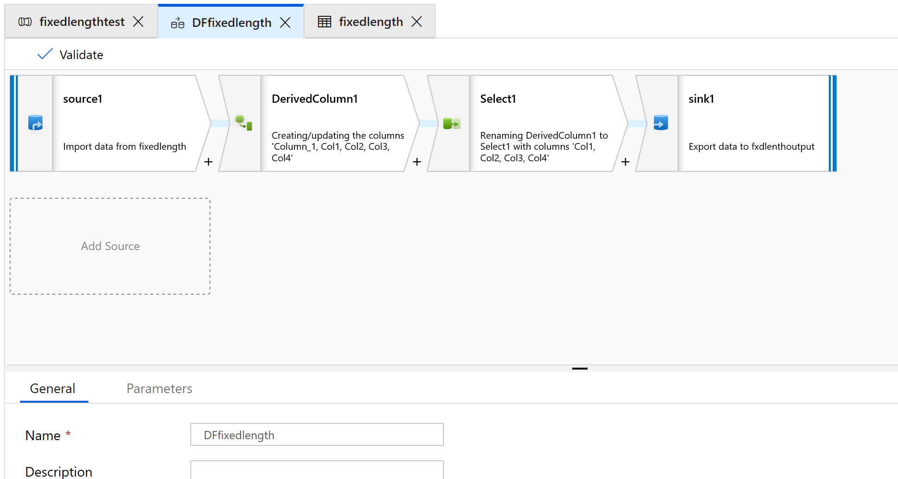
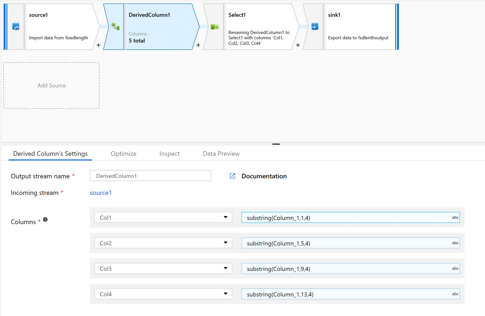
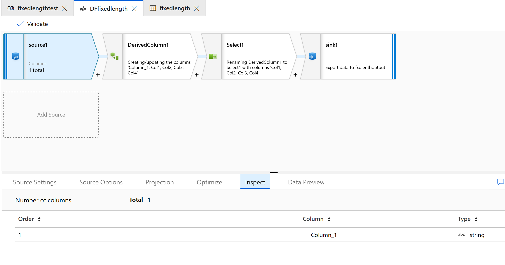
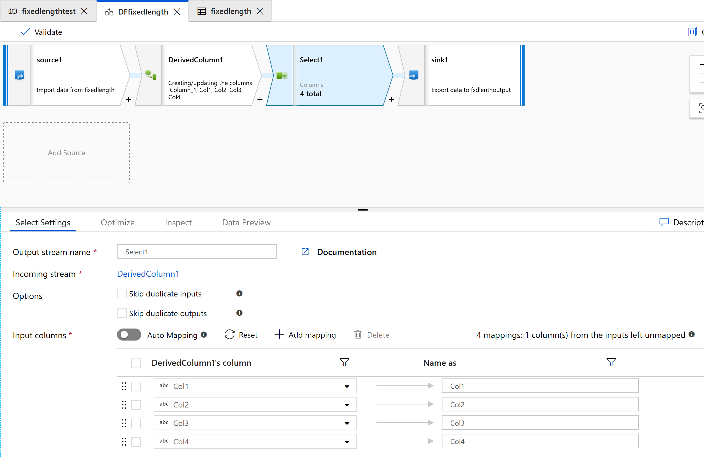
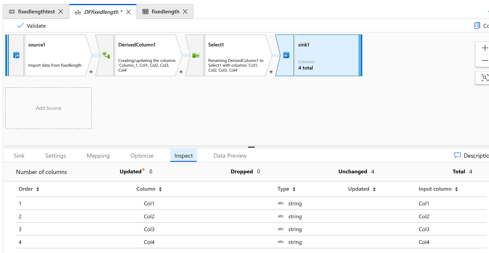
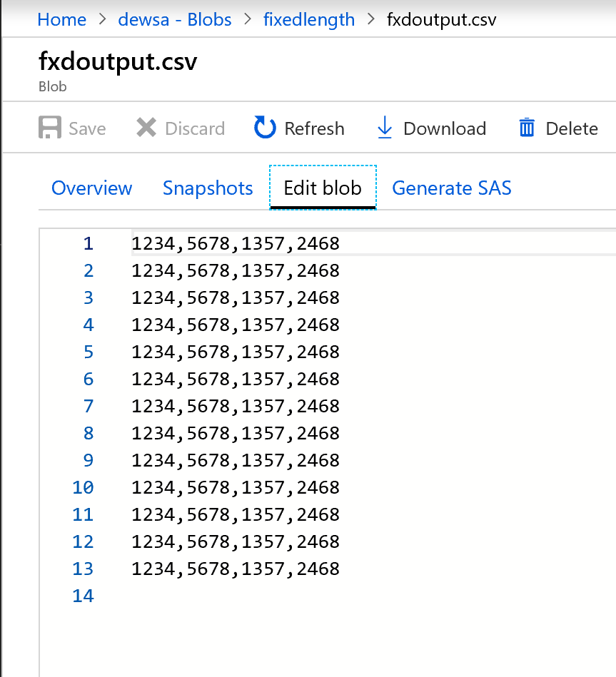

# Process fixed-length text files by using Data Factory mapping data flows

[!INCLUDE[appliesto-adf-asa-md](includes/appliesto-adf-asa-md.md)]

By using mapping data flows in Microsoft Azure Data Factory, you can transform data from fixed-width text files. In the following task, we'll define a dataset for a text file without a delimiter and then set up substring splits based on ordinal position.

## Create a pipeline

1. Select **+New Pipeline** to create a new pipeline.

2. Add a data flow activity, which will be used for processing fixed-width files:

    

3. In the data flow activity, select **New mapping data flow**.

4. Add a Source, Derived Column, Select, and Sink transformation:

    

5. Configure the Source transformation to use a new dataset, which will be of the Delimited Text type.

6. Don't set any column delimiter or headers.

   Now we'll set field starting points and lengths for the contents of this file:

    ```
    1234567813572468
    1234567813572468
    1234567813572468
    1234567813572468
    1234567813572468
    1234567813572468
    1234567813572468
    1234567813572468
    1234567813572468
    1234567813572468
    1234567813572468
    1234567813572468
    1234567813572468
    ```

7. On the **Projection** tab of your Source transformation, you should see a string column that's named *Column_1*.

8. In the Derived column, create a new column.

9. We'll give the columns simple names like *col1*.

10. In the expression builder, type the following:

    ```substring(Column_1,1,4)```

    

11. Repeat step 10 for all the columns you need to parse.

12. Select the **Inspect** tab to see the new columns that will be generated:

    

13. Use the Select transform to remove any of the columns that you don't need for transformation:

    

14. Use Sink to output the data to a folder:

    

    Here's what the output looks like:

    

  The fixed-width data is now split, with four characters each and assigned to Col1, Col2, Col3, Col4, and so on. Based on the preceding example, the data is split into four columns.

## Next steps

* Build the rest of your data flow logic by using mapping data flows [transformations](concepts-data-flow-overview.md).
