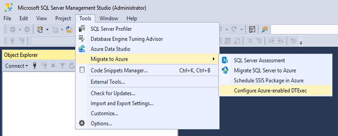
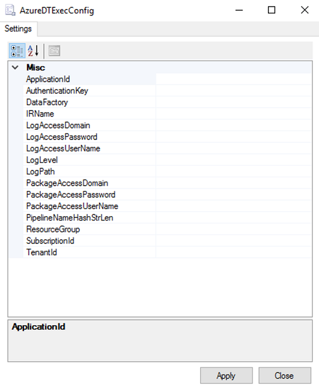

# Run SQL Server Integration Services packages with the Azure-enabled dtexec utility

[!INCLUDE[appliesto-adf-xxx-md](includes/appliesto-adf-xxx-md.md)]

This article describes the Azure-enabled dtexec (AzureDTExec) command prompt utility. It's used to run SQL Server Integration Services (SSIS) packages on the Azure-SSIS Integration Runtime (IR) in Azure Data Factory.

The traditional dtexec utility comes with SQL Server. For more information, see [dtexec utility](https://docs.microsoft.com/sql/integration-services/packages/dtexec-utility?view=sql-server-2017). It's often invoked by third-party orchestrators or schedulers, such as ActiveBatch and Control-M, to run SSIS packages on-premises. 

The modern AzureDTExec utility comes with a SQL Server Management Studio (SSMS) tool. It can also be invoked by third-party orchestrators or schedulers to run SSIS packages in Azure. It facilitates the lifting and shifting or migration of your SSIS packages to the cloud. After migration, if you want to keep using third-party orchestrators or schedulers in your day-to-day operations, they can now invoke AzureDTExec instead of dtexec.

AzureDTExec runs your packages as Execute SSIS Package activities in Data Factory pipelines. For more information, see [Run SSIS packages as Azure Data Factory activities](https://docs.microsoft.com/azure/data-factory/how-to-invoke-ssis-package-ssis-activity). 

AzureDTExec can be configured via SSMS to use an Azure Active Directory (Azure AD) application that generates pipelines in your data factory. It can also be configured to access file systems, file shares, or Azure Files where you store your packages. Based on the values you give for its invocation options, AzureDTExec generates and runs a unique Data Factory pipeline with an Execute SSIS Package activity in it. Invoking AzureDTExec with the same values for its options reruns the existing pipeline.

## Prerequisites
To use AzureDTExec, download and install the latest version of SSMS, which is version 18.3 or later. Download it from [this website](https://docs.microsoft.com/sql/ssms/download-sql-server-management-studio-ssms?view=sql-server-2017).

## Configure the AzureDTExec utility
Installing SSMS on your local machine also installs AzureDTExec. To configure its settings, start SSMS with the **Run as administrator** option. Then select **Tools** > **Migrate to Azure** > **Configure Azure-enabled DTExec**.



This action opens a **AzureDTExecConfig** window that needs to be opened with administrative privileges for it to write into the *AzureDTExec.settings* file. If you haven't run SSMS as an administrator, a User Account Control (UAC) window opens. Enter your admin password to elevate your privileges.



In the **AzureDTExecConfig** window, enter your configuration settings as follows:

- **ApplicationId**: Enter the unique identifier of the Azure AD app that you create with the right permissions to generate pipelines in your data factory. For more information, see [Create an Azure AD app and service principal via Azure portal](https://docs.microsoft.com/azure/active-directory/develop/howto-create-service-principal-portal).
- **AuthenticationKey**: Enter the authentication key for your Azure AD app.
- **TenantId**: Enter the unique identifier of the Azure AD tenant, under which your Azure AD app is created.
- **DataFactory**: Enter the name of your data factory in which unique pipelines with Execute SSIS Package activity in them are generated based on the values of options provided when you invoke AzureDTExec.
- **IRName**: Enter the name of the Azure-SSIS IR in your data factory, on which the packages specified in their Universal Naming Convention (UNC) path will run when you invoke AzureDTExec.
- **PipelineNameHashStrLen**: Enter the length of hash strings to be generated from the values of options you provide when you invoke AzureDTExec. The strings are used to form unique names for Data Factory pipelines that run your packages on the Azure-SSIS IR. Usually a length of 32 characters is sufficient.
- **ResourceGroup**: Enter the name of the Azure resource group in which your data factory was created.
- **SubscriptionId**: Enter the unique identifier of the Azure subscription, under which your data factory was created.
- **LogAccessDomain**: Enter the domain credential to access your log folder in its UNC path when you write log files, which is required when **LogPath** is specified and **LogLevel** isn't **null**.
- **LogAccessPassword**: Enter the password credential to access your log folder in its UNC path when you write log files, which is required when **LogPath** is specified and **LogLevel** isn't **null**.
- **LogAccessUserName**: Enter the username credential to access your log folder in its UNC path when you write log files, which is required when **LogPath** is specified and **LogLevel** isn't **null**.
- **LogLevel**: Enter the selected scope of logging from predefined **null**, **Basic**, **Verbose**, or **Performance** options for your package executions on the Azure-SSIS IR.
- **LogPath**: Enter the UNC path of the log folder, into which log files from your package executions on the Azure-SSIS IR are written.
- **PackageAccessDomain**: Enter the domain credential to access your packages in their UNC path that's specified when you invoke AzureDTExec.
- **PackageAccessPassword**: Enter the password credential to access your packages in their UNC path that's specified when you invoke AzureDTExec.
- **PackageAccessUserName**: Enter the username credential to access your packages in their UNC path that's specified when you invoke AzureDTExec.

To store your packages and log files in file systems or file shares on-premises, join your Azure-SSIS IR to a virtual network connected to your on-premises network so that it can fetch your packages and write your log files. For more information, see [Join an Azure-SSIS IR to a virtual network](https://docs.microsoft.com/azure/data-factory/join-azure-ssis-integration-runtime-virtual-network).

To avoid showing sensitive values written into the *AzureDTExec.settings* file in plain text, we encode them into strings of Base64 encoding. When you invoke AzureDTExec, all Base64-encoded strings are decoded back into their original values. You can further secure the *AzureDTExec.settings* file by limiting the accounts that can access it.

## Invoke the AzureDTExec utility
You can invoke AzureDTExec at the command-line prompt and provide the relevant values for specific options in your use-case scenario.

The utility is installed at `{SSMS Folder}\Common7\IDE\CommonExtensions\Microsoft\SSIS\150\Binn`. You can add its path to the 'PATH' environment variable for it to be invoked from anywhere.

```dos
> cd "C:\Program Files (x86)\Microsoft SQL Server Management Studio 18\Common7\IDE\CommonExtensions\Microsoft\SSIS\150\Binn"
> AzureDTExec.exe  ^
  /F \\MyStorageAccount.file.core.windows.net\MyFileShare\MyPackage.dtsx  ^
  /Conf \\MyStorageAccount.file.core.windows.net\MyFileShare\MyConfig.dtsConfig  ^
  /Conn "MyConnectionManager;Data Source=MyDatabaseServer.database.windows.net;User ID=MyAdminUsername;Password=MyAdminPassword;Initial Catalog=MyDatabase"  ^
  /Set \package.variables[MyVariable].Value;MyValue  ^
  /De MyEncryptionPassword
```

Invoking AzureDTExec offers similar options as invoking dtexec. For more information, see [dtexec Utility](https://docs.microsoft.com/sql/integration-services/packages/dtexec-utility?view=sql-server-2017). Here are the options that are currently supported:

- **/F[ile]**: Loads a package that's stored in file system, file share, or Azure Files. As the value for this option, you can specify the UNC path for your package file in file system, file share, or Azure Files with its .dtsx extension. If the UNC path specified contains any space, put quotation marks around the whole path.
- **/Conf[igFile]**: Specifies a configuration file to extract values from. Using this option, you can set a run-time configuration for your package that differs from the one specified at design time. You can store different settings in an XML configuration file and then load them before your package execution. For more information, see [SSIS package configurations](https://docs.microsoft.com/sql/integration-services/packages/package-configurations?view=sql-server-2017). To specify the value for this option, use the UNC path for your configuration file in file system, file share, or Azure Files with its dtsConfig extension. If the UNC path specified contains any space, put quotation marks around the whole path.
- **/Conn[ection]**: Specifies connection strings for existing connection managers in your package. Using this option, you can set run-time connection strings for existing connection managers in your package that differ from the ones specified at design time. Specify the value for this option as follows: `connection_manager_name_or_id;connection_string [[;connection_manager_name_or_id;connection_string]...]`.
- **/Set**: Overrides the configuration of a parameter, variable, property, container, log provider, Foreach enumerator, or connection in your package. This option can be specified multiple times. Specify the value for this option as follows: `property_path;value`. For example, `\package.variables[counter].Value;1` overrides the value of `counter` variable as 1. You can use the **Package Configuration** wizard to find, copy, and paste the value of `property_path` for items in your package whose value you want to override. For more information, see [Package Configuration wizard](https://docs.microsoft.com/sql/integration-services/package-configuration-wizard-ui-reference?view=sql-server-2014).
- **/De[crypt]**: Sets the decryption password for your package that's configured with the **EncryptAllWithPassword**/**EncryptSensitiveWithPassword** protection level.

> [!NOTE]
> Invoking AzureDTExec with new values for its options generates a new pipeline except for the option **/De[cript]**.

## Next steps

After unique pipelines with the Execute SSIS Package activity in them are generated and run when you invoke AzureDTExec, they can be monitored on the Data Factory portal. You can also assign Data Factory triggers to them if you want to orchestrate/schedule them using Data Factory. For more information, see [Run SSIS packages as Data Factory activities](https://docs.microsoft.com/azure/data-factory/how-to-invoke-ssis-package-ssis-activity).

> [!WARNING]
> The generated pipeline is expected to be used only by AzureDTExec. Its properties or parameters might change in the future, so don't modify or reuse them for any other purposes. Modifications might break AzureDTExec. If this happens, delete the pipeline. AzureDTExec generates a new pipeline the next time it's invoked.