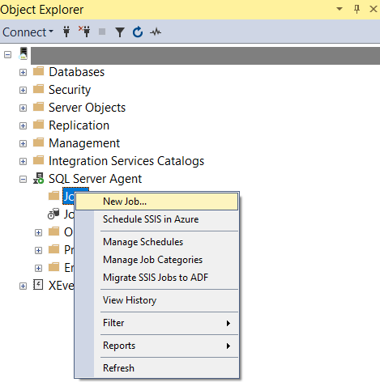
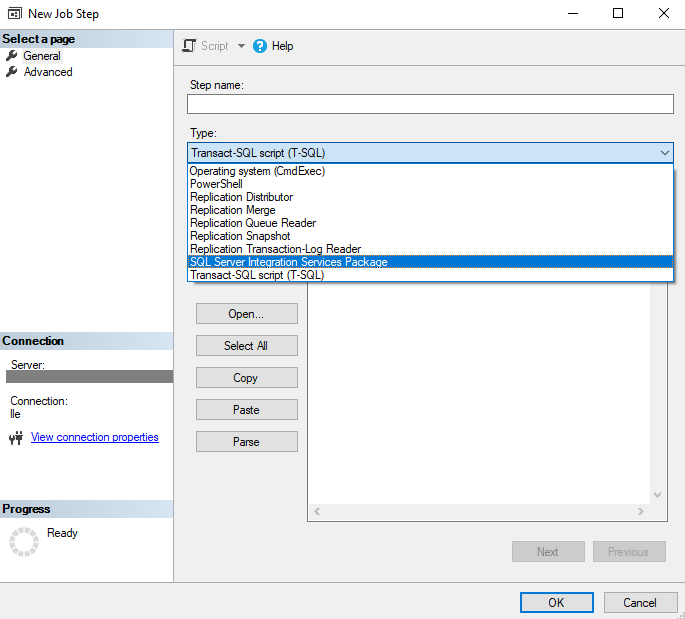
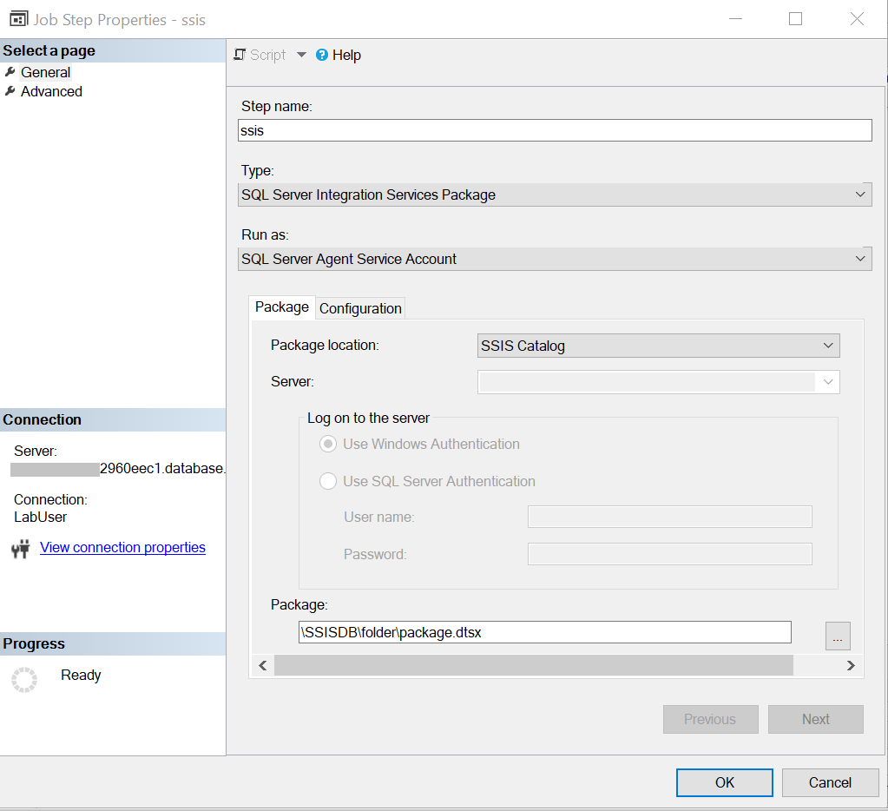
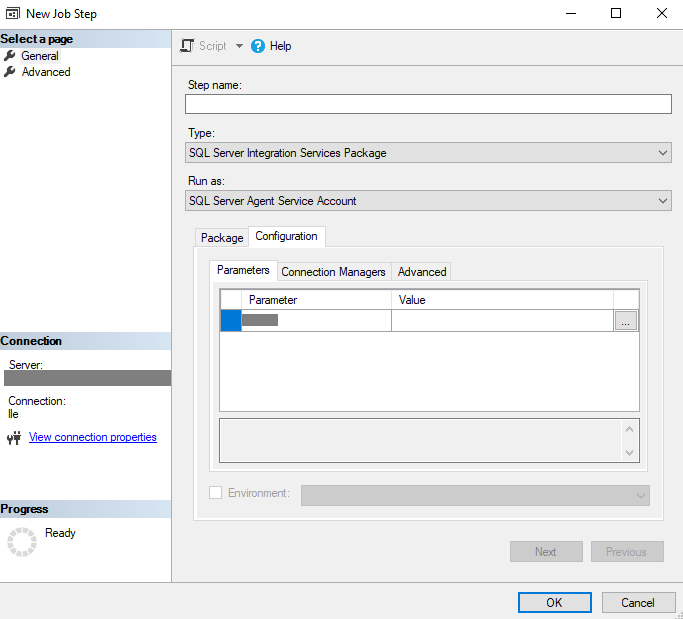
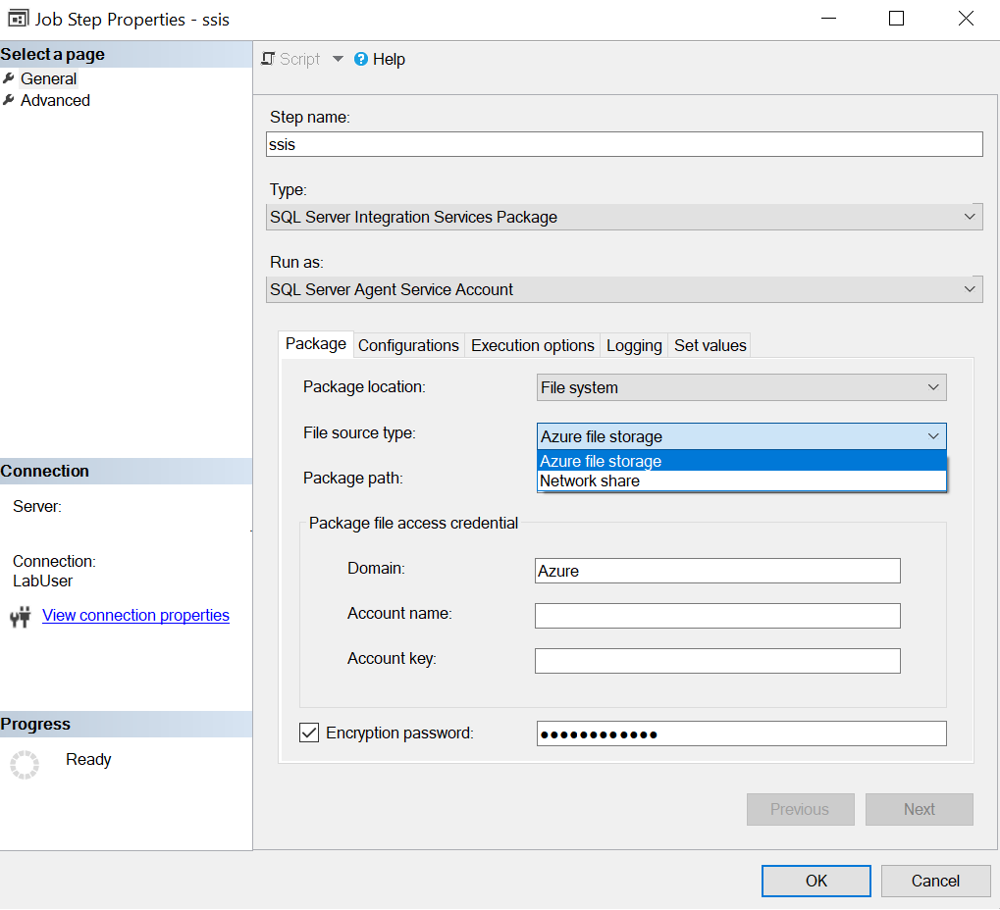
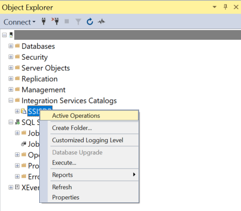

---
<<<<<<< HEAD
title: Execute SSIS packages by Azure SQL Managed instance Agent
description: Learn how to execute SSIS packages by Azure SQL Managed instance Agent. 
=======
title: Run SSIS packages by using Azure SQL Database Managed Instance Agent
description: Learn how to run SSIS packages by using Azure SQL Database Managed Instance Agent. 
>>>>>>> 9ffd1f0859abf804af2d8dd1d7766ba5f8da9ec5
services: data-factory
documentationcenter: ''
ms.service: data-factory
ms.workload: data-services
ms.topic: conceptual
ms.author: lle
author: lle
ms.date: 04/14/2020
---

<<<<<<< HEAD
# Execute SSIS packages by Azure SQL Managed instance Agent
This article describes how to run a SQL Server Integration Services (SSIS) package by using Azure SQL Managed instance Agent. This feature provides similar behaviors just like when you schedule SSIS packages by SQL Server Agent in your on-prem environment.

With this feature, you can run SSIS packages that are stored in SSISDB of Azure SQL Managed instance or File System such as Azure Files.
=======
# Run SSIS packages by using Azure SQL Database Managed Instance Agent
This article describes how to run a SQL Server Integration Services (SSIS) package by using Azure SQL Database Managed Instance Agent. This feature provides behaviors that are similar to when you schedule SSIS packages by using SQL Server Agent in your on-premises environment.

With this feature, you can run SSIS packages that are stored in SSISDB in an Azure SQL Database managed instance or a file system like Azure Files.
>>>>>>> 9ffd1f0859abf804af2d8dd1d7766ba5f8da9ec5

## Prerequisites
To use this feature, [download](https://docs.microsoft.com/sql/ssms/download-sql-server-management-studio-ssms?view=sql-server-2017) and install the latest version of SQL Server Management Studio (SSMS), which is version 18.5.

<<<<<<< HEAD
And you need to provision an Azure-SSIS Integration Runtime in Azure Data Factory, which uses Azure SQL Managed instance as endpoint server. If you have not provisioned it already, provision it by following instructions in the [tutorial](tutorial-create-azure-ssis-runtime-portal.md). 

## Run SSIS packages in SSISDB by Azure SQL Managed instance Agent
In this step, you use Azure SQL Managed instance Agent to invoke SSIS packages that is stored in SSISDB in Azure SQL Managed instance.
1. In the latest version of SSMS, connect to Azure SQL Managed instance.
2. Create a new Agent Job and a new Job step.
=======
You also need to [provision an Azure-SSIS integration runtime](tutorial-create-azure-ssis-runtime-portal.md) in Azure Data Factory. It uses an Azure SQL Database managed instance as an endpoint server. 

## Run an SSIS package in SSISDB
In this procedure, you use Azure SQL Database Managed Instance Agent to invoke an SSIS package that's stored in SSISDB.
>>>>>>> 9ffd1f0859abf804af2d8dd1d7766ba5f8da9ec5

1. In the latest version of SSMS, connect to an Azure SQL Database managed instance.
1. Create a new agent job and a new job step. Under **SQL Server Agent**, right-click the **Jobs** folder, and then select **New Job**.

   

1. On the **New Job Step** page, select **SQL Server Integration Services Package** as the type.

<<<<<<< HEAD
4. In the **Package** tab, choose **SSIS Catalog** as package source type.
5. Because the SSISDB is in the same Azure SQL Managed instance, you don't need to specify authentication.
6. Specify an SSIS package from your SSISDB.
=======
   
>>>>>>> 9ffd1f0859abf804af2d8dd1d7766ba5f8da9ec5

1. On the **Package** tab, select **SSIS Catalog** as the package source type.
1. Because SSISDB is in an Azure SQL Database managed instance, you don't need to specify authentication.
1. Specify an SSIS package from SSISDB.

   

1. On the **Configuration** tab, you can:
  
   - Specify parameter values under **Parameters**.
   - Override values under **Connection Managers**.
   - Override the property and choose the logging level under **Advanced**.

   

1. Select **OK** to save the agent job configuration.
1. Start the agent job to run the SSIS package.

<<<<<<< HEAD
## Run SSIS packages in file system by Azure SQL Managed instance agent
In this step, you use Azure SQL Managed instance Agent to invoke SSIS packages that is stored in File System to run.
1. In the latest version of SSMS, connect to Azure SQL Managed instance.
2. Create a new Agent Job and a new Job step.
=======
>>>>>>> 9ffd1f0859abf804af2d8dd1d7766ba5f8da9ec5

## Run an SSIS package in the file system
In this procedure, you use Azure SQL Database Managed Instance Agent to run an SSIS package that's stored in the file system.

1. In the latest version of SSMS, connect to an Azure SQL Database managed instance.
1. Create a new agent job and a new job step. Under **SQL Server Agent**, right-click the **Jobs** folder, and then select **New Job**.

   

1. On the **New Job Step** page, select **SQL Server Integration Services Package** as the type.

   

1. On the **Package** tab:

   1. For **Package source**, select **File system**.
   
   1. For **File source type**:   

      - If your package is uploaded to Azure Files, select **Azure file share**.

        
      
        The package path is **\\<storage account name>.file.core.windows.net\<file share name>\<package name>.dtsx**.
      
        Under **Package file access credential**, enter the Azure file account name and account key to access the Azure file. The domain is set as **Azure**.

      - If your package is uploaded to a network share, select **Network share**.
      
        The package path is the UNC path of your package file with its .dtsx extension.
      
        Enter the corresponding domain, username, and password to access the network share package file.
   1. If your package file is encrypted with a password, select **Encryption password** and enter the password.
1. On the **Configurations** tab, enter the configuration file path if you need a configuration file to run the SSIS package.
1. On the **Execution options** tab, you can choose whether to use **Windows authentication** or **32-bit runtime** to run the SSIS package.
1. On the **Logging** tab, you can choose the logging path and corresponding logging access credential to store the log files. By default, the logging path is the same as the package folder path, and the logging access credential is the same as the package access credential.
1. On the **Set values** tab, you can enter the property path and value to override the package properties.
 
   For example, to override the value of your user variable, enter its path in the following format: **\Package.Variables[User::<variable name>].Value**.
1. Select **OK** to save the agent job configuration.
1. Start the agent job to run the SSIS package.


## Cancel SSIS package execution
To cancel package execution from an Azure SQL Database Managed Instance Agent job, take the following steps instead of directly stopping the agent job:

1. Find your SQL agent **jobId** from **msdb.dbo.sysjobs**.
1. Find the corresponding SSIS **executionId** based on the job ID, by using this query:
   ```sql
   select * from ssisdb.internal.execution_parameter_values_noncatalog where  parameter_value = 'SQL_Agent_Job_{jobId}' order by execution_id desc
   ```
1. Right-click the SSISDB catalog, and then select **Active Operations**.

   

1. Stop the corresponding operation based on **executionId**.

## Next steps
You can also schedule SSIS packages by using Azure Data Factory. For step-by-step instructions, see [Azure Data Factory event trigger](how-to-create-event-trigger.md). 