# Execute SSIS packages in Azure from SSDT

[!INCLUDE[appliesto-adf-xxx-md](includes/appliesto-adf-xxx-md.md)]

This article describes the feature of Azure-enabled SQL Server Integration Services (SSIS) projects on SQL Server Data Tools (SSDT). It allows you to assess the cloud compatibility of your SSIS packages and run them on Azure-SSIS Integration Runtime (IR) in Azure Data Factory (ADF). You can use this feature to test your existing packages before you lift & shift/migrate them to Azure or to develop new packages to run in Azure.

With this feature, you can attach a newly created/existing Azure-SSIS IR to SSIS projects and then execute your packages on it.  We support running packages to be deployed into SSIS catalog (SSISDB) hosted by your Azure SQL Database server or managed instance in Project Deployment Model. We also support running packages to be deployed into file system/Azure Files/SQL Server database (MSDB) hosted by your Azure SQL managed instance in Package Deployment Model. 

## Prerequisites

To use this feature, please download and install the latest SSDT with SSIS Projects extension for Visual Studio (VS) from [here](https://marketplace.visualstudio.com/items?itemName=SSIS.SqlServerIntegrationServicesProjects). Alternatively, you can also download and install the latest SSDT as a standalone installer from [here](https://docs.microsoft.com/sql/ssdt/download-sql-server-data-tools-ssdt?view=sql-server-2017#ssdt-for-vs-2017-standalone-installer).

## Azure-enable SSIS projects

### Creating new Azure-enabled SSIS projects

On SSDT, you can create new Azure-enabled SSIS projects using the **Integration Services Project (Azure-Enabled)** template.

   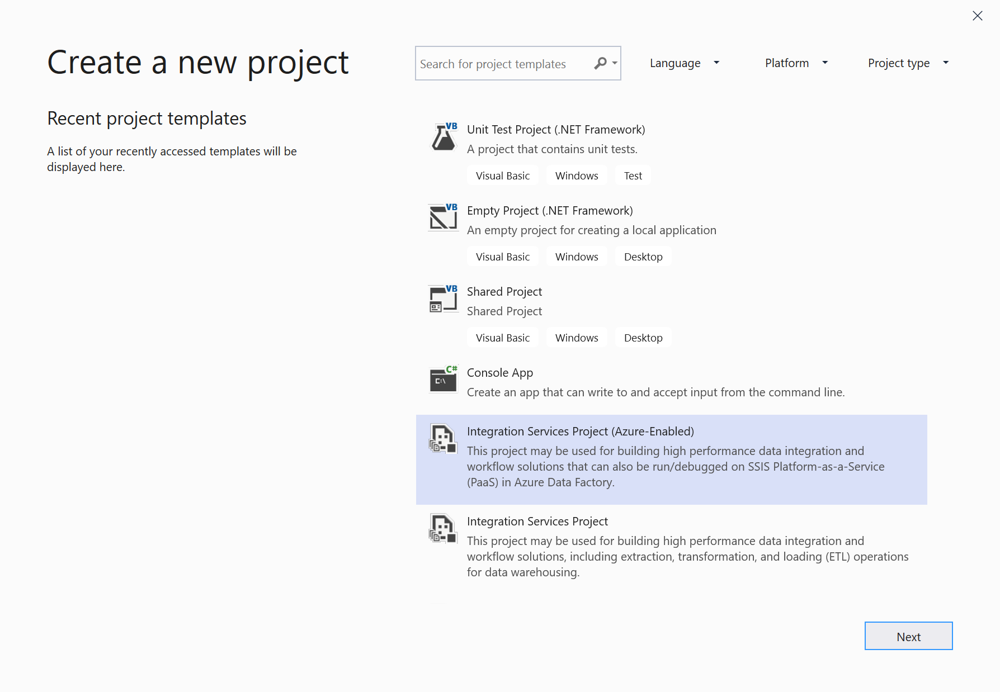

After the Azure-enabled project is created, you will be prompted to connect to SSIS in Azure Data Factory.

   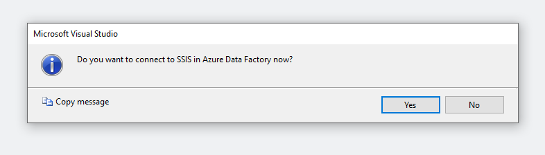

If you want to connect to your Azure-SSIS IR right away, see [Connecting to Azure-SSIS IR](#connectssisir) for more details. You can also connect later by right-clicking on your project node in the Solution Explorer window of SSDT to pop up a menu. Next, select the **Connect to SSIS in Azure Data Factory** item in **SSIS in Azure Data Factory** submenu.

###  Azure-enabling existing SSIS projects

For existing SSIS projects, you can Azure-enable them by following these steps:

1. Right-click on your project node in the Solution Explorer window of SSDT to pop up a menu. Next, select the **Azure-Enabled Project** item in **SSIS in Azure Data Factory** submenu to launch the **Azure-Enabled Project Wizard**.

   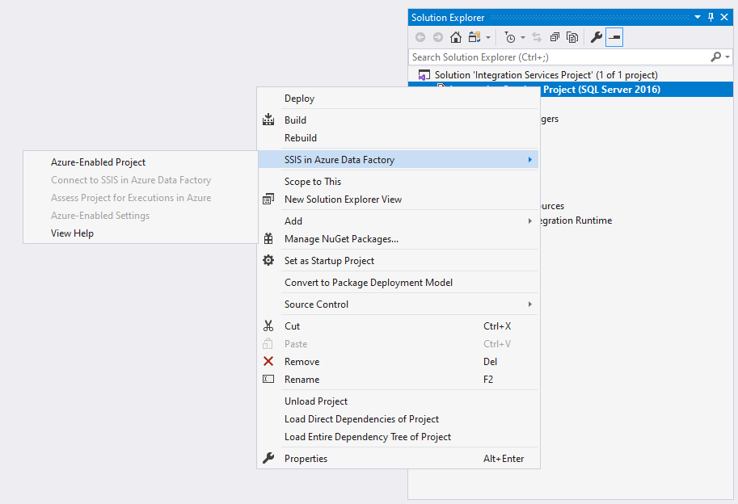

2. On the **Select Visual Studio Configuration** page, select your existing VS configuration to apply package execution settings in Azure. You can also create a new one if you haven't done so already, see [Creating a new VS configuration](https://docs.microsoft.com/visualstudio/ide/how-to-create-and-edit-configurations?view=vs-2019). We recommend that you have at least two different VS configurations for package executions in the local and cloud environments, so you can Azure-enable your project against the cloud configuration. In this way, if you've parameterized your project or packages, you can assign different values to your project or package parameters at run-time based on the different execution environments (either on your local machine or in Azure). For example, see [Switching package execution environments](#switchenvironment).

   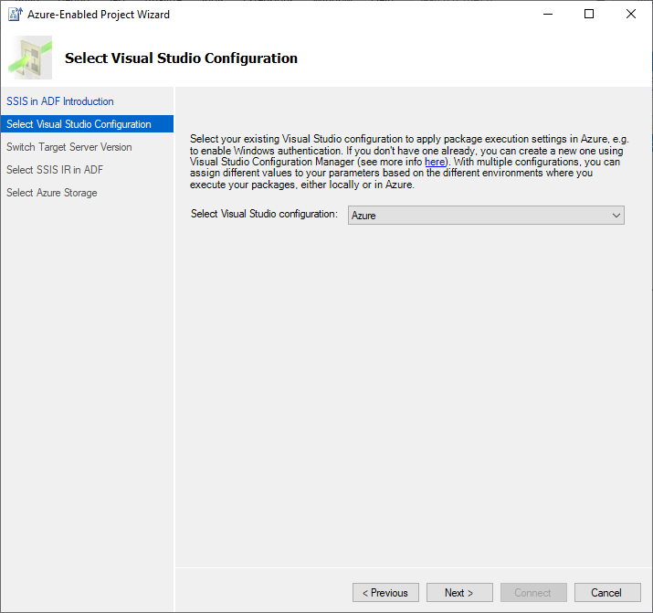

3. Azure-enabling your existing SSIS projects requires you to set their target server version to be the latest one supported by Azure-SSIS IR. Azure-SSIS IR is currently based on **SQL Server 2017**. Please ensure that your packages don't contain additional components that are unsupported on SQL Server 2017. Please also ensure that all compatible additional components have also been installed on your Azure-SSIS IR via custom setups, see [Customizing your Azure-SSIS IR](https://docs.microsoft.com/azure/data-factory/how-to-configure-azure-ssis-ir-custom-setup). Select the **Next** button to continue.

   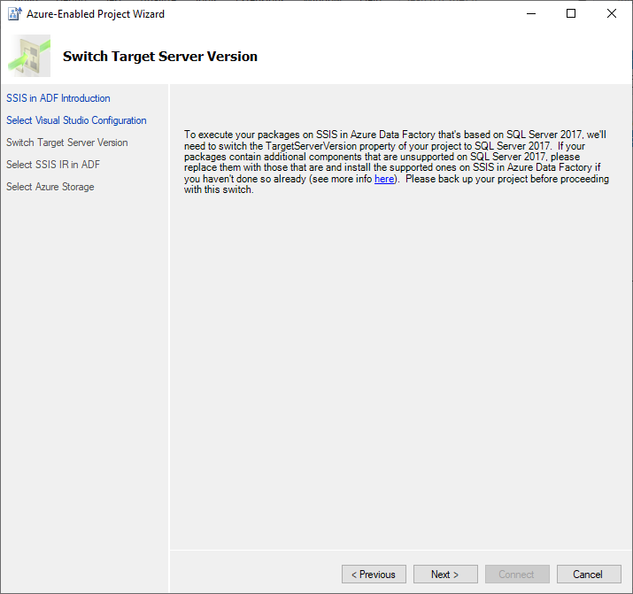

4. See [Connecting to Azure-SSIS IR](#connectssisir) to complete connecting your project to Azure-SSIS IR.

##  Connect Azure-enabled projects to SSIS in Azure Data Factory

By connecting your Azure-enabled projects to SSIS in ADF, you can upload your packages into Azure Files and run them on Azure-SSIS IR. You can do so by following these steps:

1. On the **SSIS in ADF Introduction** page, review the introduction and select the **Next** button to continue.

   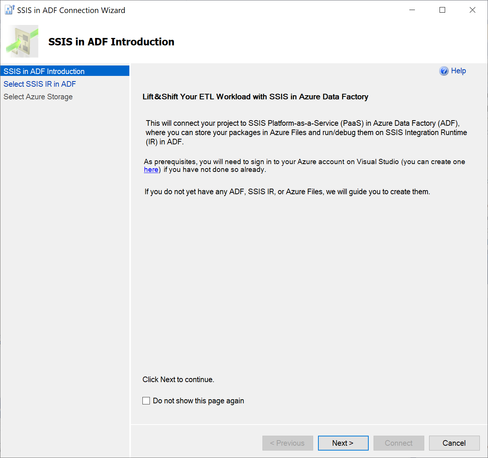

2. On the **Select SSIS IR in ADF** page, select your existing ADF and Azure-SSIS IR to run packages. You can also create new ones if you don't have any.
   - To select your existing Azure-SSIS IR, select the relevant Azure subscription and ADF first.
   - If you select your existing ADF that doesn't have any Azure-SSIS IR, select the **Create SSIS IR** button to create a new one on ADF portal. Once created, you can return to this page to select your new Azure-SSIS IR.
   - If you select your existing Azure subscription that doesn't have any ADF, select the **Create SSIS IR** button to launch the **Integration Runtime Creation Wizard**. On the wizard, you can enter your designated location and prefix for us to automatically create a new Azure Resource Group, Data Factory, and SSIS IR on your behalf, named in the following pattern: **YourPrefix-RG/DF/IR-YourCreationTime**. Once created, you can return to this page to select your new ADF and Azure-SSIS IR.

   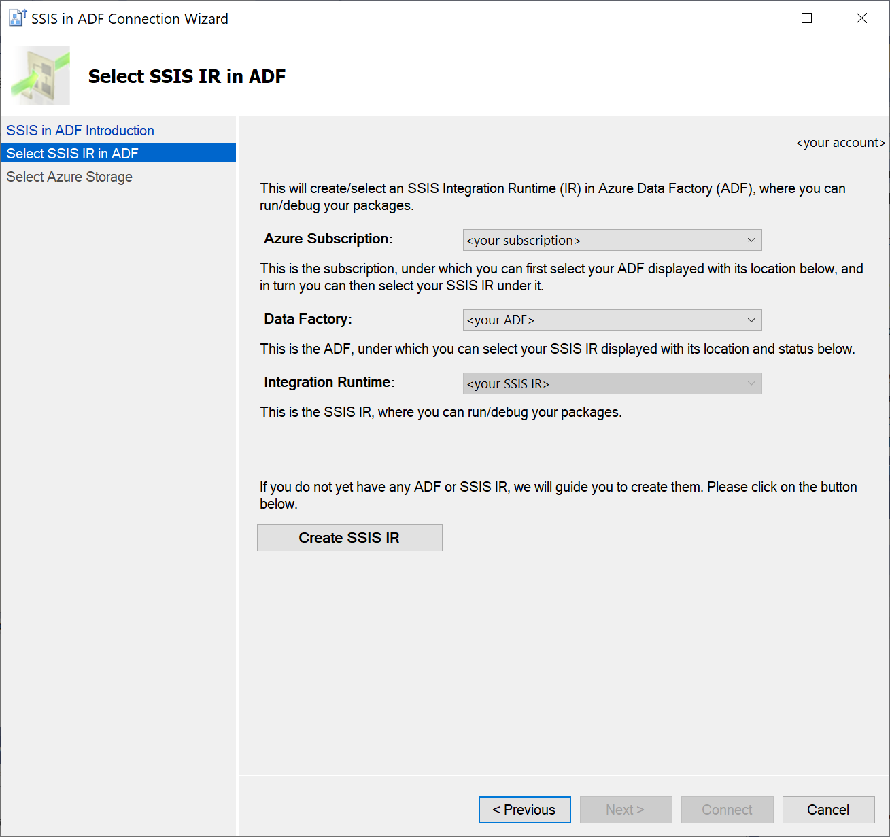

3. On the **Select Azure Storage** page, select your existing Azure Storage account to upload packages into Azure Files. You can also create a new one if you don't have any.
   - To select your existing Azure Storage account, select the relevant Azure subscription first.
   - If you select the same Azure subscription as your Azure-SSIS IR that doesn't have any Azure Storage account, select the **Create Azure Storage** button. We'll automatically create a new one on your behalf in the same location as your Azure-SSIS IR, named by combining a prefix of your Azure-SSIS IR name and its creation date. Once created, you can return to this page to select your new Azure Storage account.
   - If you select a different Azure subscription that doesn't have any Azure Storage account, select the **Create Azure Storage** button to create a new one on Azure portal. Once created, you can return to this page to select your new Azure Storage account.

   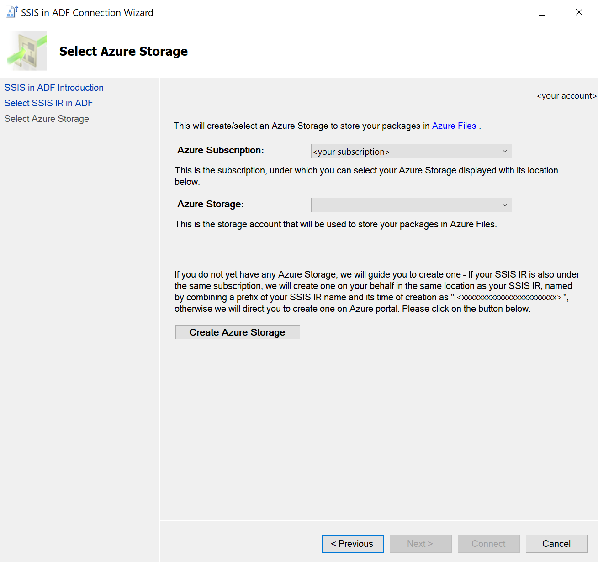

4. Select the **Connect** button to complete connecting your project to Azure-SSIS IR. We'll display your selected Azure-SSIS IR and Azure Storage account under the **Linked Azure Resources** node in Solution Explorer window of SSDT. We'll also regularly refresh and display the status of your Azure-SSIS IR there. You can manage your Azure-SSIS IR by right-clicking on its node to pop up a menu and then selecting the **Start\Stop\Manage** item that takes you to ADF portal to do so.

## Assess SSIS project\packages for executions in Azure

### Assessing single or multiple packages

Before executing your packages in Azure, you can assess them to surface any potential cloud compatibility issues. These include migration blockers and additional information that you should be aware of. 
-  You have the options to assess single packages one-by-one or all packages at the same time under your project.

   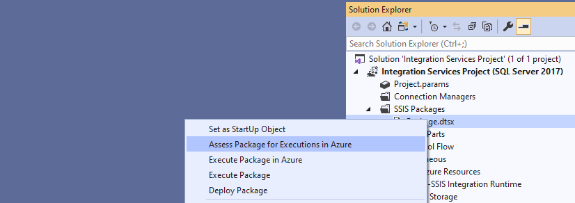

   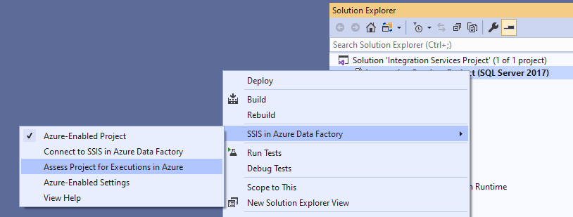

-  On the **Assessment Report** window of SSDT, you can find all potential cloud compatibility issues that are surfaced, each with its own detailed description and recommendation. You can also export the assessment report into a CSV file that can be shared with anyone who should mitigate these issues. 

   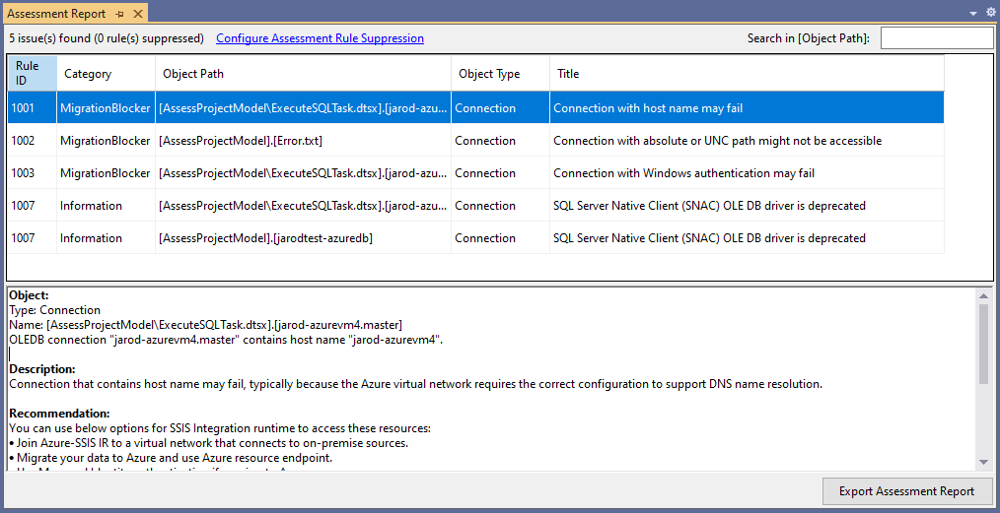

### Suppressing assessment rules

Once you're sure that some potential cloud compatibility issues aren't applicable or have been properly mitigated in your packages, you can suppress the relevant assessment rules that surface them. This will reduce the noise in your subsequent assessment reports.
-  Select the **Configure Assessment Rule Suppression** link in **Assessment Report** window of SSDT to pop up the **Assessment Rule Suppression Settings** window, where you can select the assessment rules to suppress.

   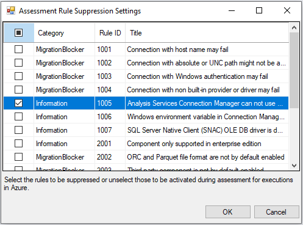

-  Alternatively, right-click on your project node in the Solution Explorer window of SSDT to pop up a menu. Select the **Azure-Enabled Settings** item in **SSIS in Azure Data Factory** submenu to pop up a window containing your project property pages. Select the **Suppressed Assessment Rule IDs** property in **Azure-Enabled Settings** section. Finally, select its ellipsis (**...**) button to pop up the **Assessment Rule Suppression Settings** window, where you can select the assessment rules to suppress.

   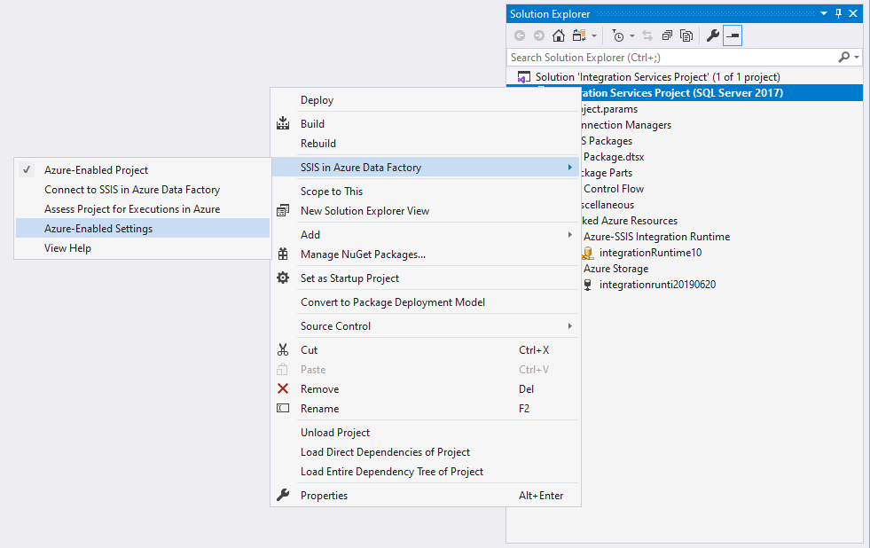

   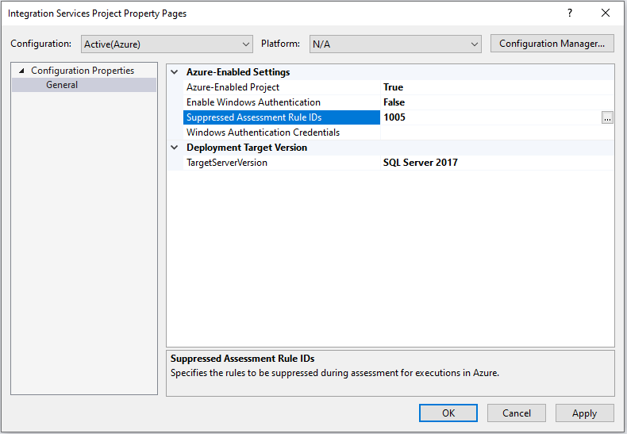

## Execute SSIS packages in Azure

###  Configuring Azure-enabled settings

Before executing your packages in Azure, you can configure your Azure-enabled settings for them. For example, you can enable Windows authentication on your Azure-SSIS IR to access on-premises/cloud data stores by following these steps:

1. Right-click on your project node in the Solution Explorer window of SSDT to pop up a menu. Next, select the **Azure-Enabled Settings** item in **SSIS in Azure Data Factory** submenu to pop up a window containing your project property pages.

   

2. Select the **Enable Windows Authentication** property in **Azure-Enabled Settings** section and then select **True** in its dropdown menu. Next, select the **Windows Authentication Credentials** property and then select its ellipsis (**...**) button to pop up the **Windows Authentication Credentials** window.

   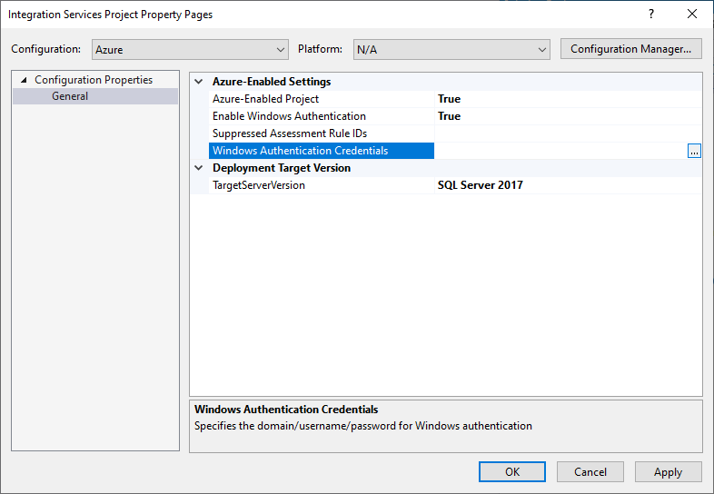

3. Enter your Windows authentication credentials. For example, to access Azure Files, you can enter `Azure`, `YourStorageAccountName`, and `YourStorageAccountKey` for **Domain**, **Username**, and **Password**, respectively.

   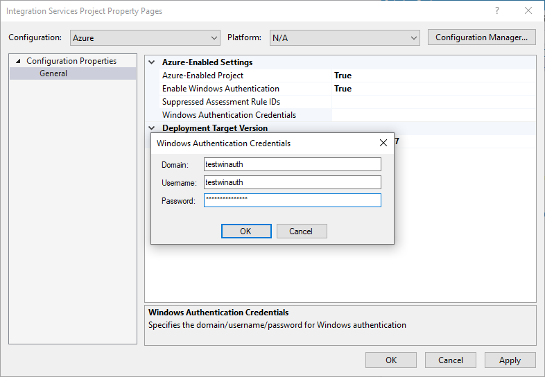

### Starting package executions

After connecting your Azure-enabled projects to SSIS in ADF, assessing their cloud compatibility, and mitigating potential issues, you can execute/test your packages on Azure-SSIS IR.
-  Select the **Start** button in SSDT toolbar to drop down a menu. Next, select the **Execute in Azure** item.

   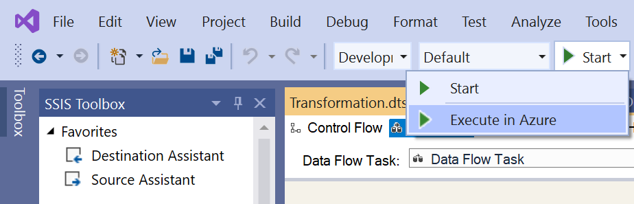

-  Alternatively, right-click on your package node in the Solution Explorer window of SSDT to pop up a menu. Next, select the **Execute Package in Azure** item.

   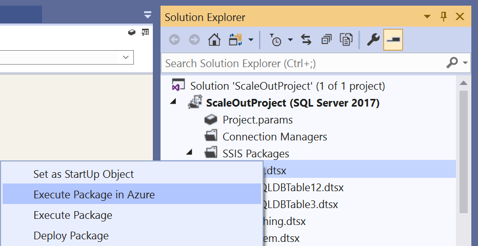

> [!NOTE]
> Executing your packages in Azure requires you to have a running Azure-SSIS IR, so if your Azure-SSIS IR is stopped, a dialog window will pop up to start it. Excluding any custom setup time, this process should be completed within 5 minutes, but could take approximately 20 - 30 minutes for Azure-SSIS IR joining a virtual network. After executing your packages in Azure, you can stop your Azure-SSIS IR to manage its running cost by right-clicking on its node in the Solution Explorer window of SSDT to pop up a menu and then selecting the **Start\Stop\Manage** item that takes you to ADF portal to do so.

### Using Execute Package Task

If your packages contain Execute Package Tasks that refer to child packages stored on local file systems, follow these additional steps:

1. Upload the child packages into Azure Files under the same Azure Storage account connected to your projects and get their new Universal Naming Convention (UNC) path, e.g. `\\YourStorageAccountName.file.core.windows.net\ssdtexecution\YourChildPackage1.dtsx`

2. Replace the file path of those child packages in the File Connection Manager of Execute Package Tasks with their new UNC path
   - If your local machine running SSDT can't access the new UNC path, you can enter it on the Properties panel of File Connection Manager
   - Alternatively, you can use a variable for the file path to assign the right value at run-time

If your packages contain Execute Package Tasks that refer to child packages in the same project, no additional step is necessary.

### Switching package protection level

Executing SSIS packages in Azure doesn't support **EncryptSensitiveWithUserKey**/**EncryptAllWithUserKey** protection levels. Consequently, if your packages are configured to use those, we'll temporarily convert them into using **EncryptSensitiveWithPassword**/**EncryptAllWithPassword** protection levels, respectively. We'll also randomly generate encryption passwords when we upload your packages into Azure Files for executions on your Azure-SSIS IR.

> [!NOTE]
> If your packages contain Execute Package Tasks that refer to child packages configured to use **EncryptSensitiveWithUserKey**/**EncryptAllWithUserKey** protection levels, you need to manually reconfigure those child packages to use **EncryptSensitiveWithPassword**/**EncryptAllWithPassword** protection levels, respectively, before executing your packages.

If your packages are already configured to use **EncryptSensitiveWithPassword**/**EncryptAllWithPassword** protection levels, we'll keep them unchanged. We'll still randomly generate encryption passwords when we upload your packages into Azure Files for executions on your Azure-SSIS IR.

###  Switching package execution environments

If you parameterize your project/packages in Project Deployment Model, you can create multiple VS configurations to switch package execution environments. In this way, you can assign environment-specific values to your project/package parameters at run-time. We recommend that you have at least two different VS configurations for package executions in the local and cloud environments, so you can Azure-enable your projects against the cloud configuration. Here's a step-by-step example of switching package execution environments between your local machine and Azure:

1. Let's say your package contains a File System Task that sets the attributes of a file. When you run it on your local machine, it sets the attributes of a file stored on your local file system. When you run it on your Azure-SSIS IR, you want it to set the attributes of a file stored in Azure Files. First, create a package parameter of string type and name it **FilePath** to hold the value of target file path.

   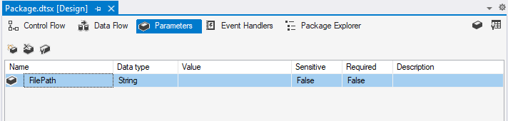

2. Next, on the **General** page of **File System Task Editor** window, parameterize the **SourceVariable** property in **Source Connection** section with the **FilePath** package parameter. 

   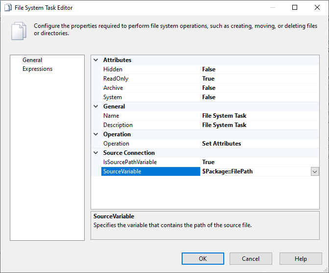

3. By default, you have an existing VS configuration for package executions in the local environment named **Development**. Create a new VS configuration for package executions in the cloud environment named **Azure**, see [Creating a new VS configuration](https://docs.microsoft.com/visualstudio/ide/how-to-create-and-edit-configurations?view=vs-2019), if you haven't done so already.

4. When viewing the parameters of your package, select the **Add Parameters to Configurations** button to open the **Manage Parameter Values** window for your package. Next, assign different values of target file path to the **FilePath** package parameter under the **Development** and **Azure** configurations.

   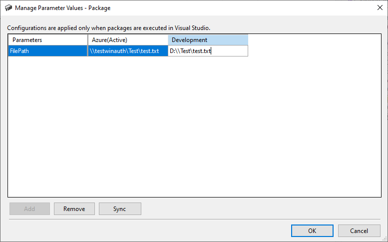

5. Azure-enable your project against the cloud configuration, see [Azure-enabling existing SSIS projects](#azureenableproject), if you haven't done so already. Next, configure Azure-enabled settings to enable Windows authentication for your Azure-SSIS IR to access Azure Files, see [Configuring Azure-enabled settings](#azureenabledsettings), if you haven't done so already.

6. Execute your package in Azure. You can switch your package execution environment back to your local machine by selecting the **Development** configuration.

   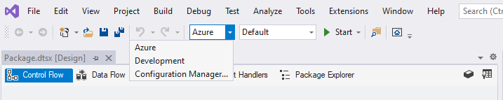

### Using package configuration file

If you use package configuration files in Package Deployment Model, you can assign environment-specific values to your package properties at run-time. We'll automatically upload those files with your packages into Azure Files for executions on your Azure-SSIS IR.

### Checking package execution logs

After starting your package execution, we'll format and display its logs in the **Progress** window of SSDT. For a long-running package, we'll periodically update its logs by the minutes. You can immediately cancel your package execution by selecting the **Stop** button in SSDT toolbar. You can also temporarily find the raw data of its logs in the following UNC path: `\\<YourStorageAccountName>.file.core.windows.net\ssdtexecution\<YourProjectName-FirstConnectTime>\<YourPackageName-tmp-ExecutionTime>\logs`, but we'll clean it up after one day.

## Current limitations

-  The Azure-enabled SSDT supports only commercial/global cloud regions and doesn't support governmental/national cloud regions for now.

## Next steps

Once you're satisfied with running your packages in Azure from SSDT, you can deploy and run them as Execute SSIS Package activities in ADF pipelines, see [Running SSIS packages as Execute SSIS Package activities in ADF pipelines](https://docs.microsoft.com/azure/data-factory/how-to-invoke-ssis-package-ssis-activity).
