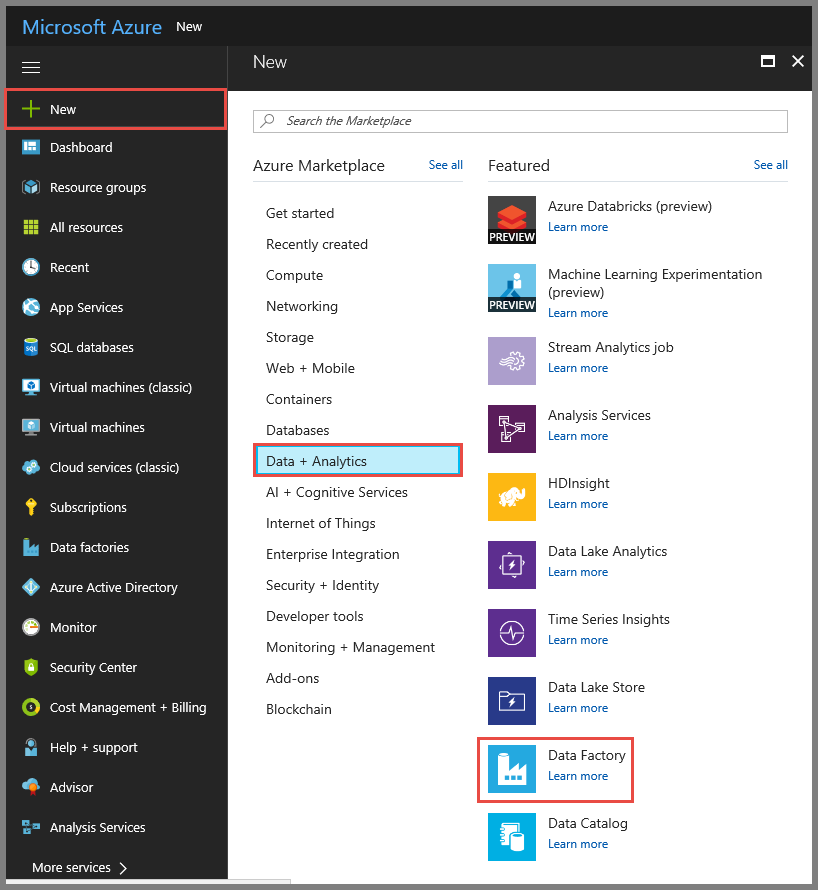
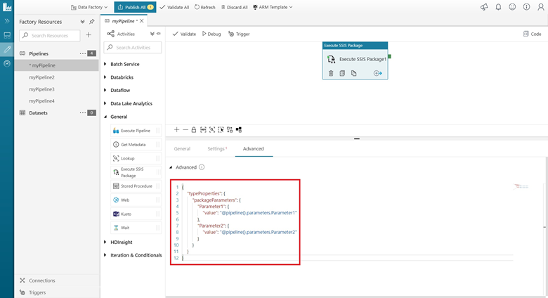
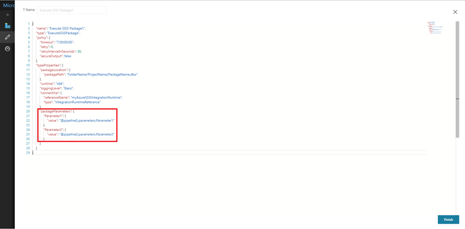

# Run an SSIS package with the Execute SSIS Package Activity in Azure Data Factory
This article describes how to run an SSIS package in an Azure Data Factory pipeline by using an Execute SSIS Package activity. 

## Prerequisites

**Azure SQL Database**. The walkthrough in this article uses an Azure SQL database that hosts the SSIS catalog. You can also use an Azure SQL Database Managed Instance.

## Create an Azure-SSIS integration runtime
Create an Azure-SSIS integration runtime if you don't have one by following the step-by-step instruction in the [Tutorial: Deploy SSIS packages](tutorial-create-azure-ssis-runtime-portal.md).

## Run a package in the Azure portal
In this section, you use Data Factory UI to create a Data Factory pipeline with an Execute SSIS Package activity that runs an SSIS package.

### Create a data factory
First step is to create a data factory by using the Azure portal. 

1. Launch **Microsoft Edge** or **Google Chrome** web browser. Currently, Data Factory UI is supported only in Microsoft Edge and Google Chrome web browsers.
2. Navigate to the [Azure portal](https://portal.azure.com). 
3. Click **New** on the left menu, click **Data + Analytics**, and click **Data Factory**. 
   
   
2. In the **New data factory** page, enter **ADFTutorialDataFactory** for the **name**. 
      
     
 
   The name of the Azure data factory must be **globally unique**. If you see the following error for the name field, change the name of the data factory (for example, yournameADFTutorialDataFactory). See [Data Factory - Naming Rules](naming-rules.md) article for naming rules for Data Factory artifacts.
  
     
3. Select your Azure **subscription** in which you want to create the data factory. 
4. For the **Resource Group**, do one of the following steps:
     
      - Select **Use existing**, and select an existing resource group from the drop-down list. 
      - Select **Create new**, and enter the name of a resource group.   
         
    To learn about resource groups, see [Using resource groups to manage your Azure resources](../azure-resource-manager/resource-group-overview.md).  
4. Select **V2** for the **version**.
5. Select the **location** for the data factory. Only locations that are supported by Data Factory are shown in the drop-down list. The data stores (Azure Storage, Azure SQL Database, etc.) and computes (HDInsight, etc.) used by data factory can be in other locations.
6. Select **Pin to dashboard**.     
7. Click **Create**.
8. On the dashboard, you see the following tile with status: **Deploying data factory**. 

    
9. After the creation is complete, you see the **Data Factory** page as shown in the image.
   
    
10. Click **Author & Monitor** tile to launch the Azure Data Factory user interface (UI) application in a separate tab. 

### Create a pipeline with an Execute SSIS Package activity
In this step, you use the Data Factory UI to create a pipeline. You add an Execute SSIS Package activity to the pipeline and configure it to run the SSIS package. 

1. In the get started page, click **Create pipeline**: 

    
2. In the **Activities** toolbox, expand **General**, and drag and drop the **Execute SSIS Package** activity to the pipeline designer surface. 

    

3. On the **General** tab of properties for the Execute SSIS Package activity, provide a name and description for the activity. Set optional timeout and retry values.

    

4. On the **Settings** tab of properties for the Execute SSIS Package activity, select the Azure-SSIS Integration Runtime associated with the `SSISDB` database where the package is deployed. Provide the package path in the `SSISDB` database in the format `<folder name>/<project name>/<package name>.dtsx`. Optionally specify 32-bit execution and a predefined or custom logging level, and provide an environment path in the format `<folder name>/<environment name>`.

    

5. To validate the pipeline configuration, click **Validate** on the toolbar. To close the **Pipeline Validation Report**, click **>>**.

6. Publish the pipeline to Data Factory by clicking **Publish All** button. 

### Optionally, parameterize the activity

Optionally, assign values, expressions, or functions, which can refer to Data Factory system variables, to your project or package parameters in JSON format by using the **View Source Code** button on the bottom of the Execute SSIS Package activity box, or the **Code** button on the top right-hand corner of the pipeline area. For example, you can assign Data Factory pipeline parameters to your SSIS project or package parameters as shown in the following screenshots:





### Run the pipeline
In this section, you trigger a pipeline run and then monitor it. 

1. To trigger a pipeline run, click **Trigger** on the toolbar, and click **Trigger now**. 

    

2. In the **Pipeline Run** window, select **Finish**. 

### Monitor the pipeline

1. Switch to the **Monitor** tab on the left. You see the pipeline run and its status along with other information (such as Run Start time). To refresh the view, click **Refresh**.

    

2. Click **View Activity Runs** link in the **Actions** column. You see only one activity run as the pipeline has only one activity (the Execute SSIS Package activity).

    

3. You can run the following **query** against the SSISDB database in your Azure SQL server to verify that the package executed. 

    ```sql
    select * from catalog.executions
    ```

    

4. You can also get the SSISDB execution ID from the output of the pipeline activity run, and use the ID to check more comprehensive execution logs and error messages in SSMS.

    

### Schedule the pipeline with a trigger

You can also create a scheduled trigger for your pipeline so that the pipeline runs on a schedule (hourly, daily, etc.). For an example, see [Create a data factory - Data Factory UI](quickstart-create-data-factory-portal.md#trigger-the-pipeline-on-a-schedule).

## Run a package with PowerShell
In this section, you use Azure PowerShell to create a Data Factory pipeline with an Execute SSIS Package activity that runs an SSIS package. 

Install the latest Azure PowerShell modules by following instructions in [How to install and configure Azure PowerShell](/powershell/azure/install-azurerm-ps). 

### Create a data factory
You can either use the same data factory that has the Azure-SSIS IR or create a separate data factory. The following procedure provides steps to create a data factory. You create a pipeline with an Execute SSIS Package activity in this data factory. The Execute SSIS Package activity runs your SSIS package. 

1. Define a variable for the resource group name that you use in PowerShell commands later. Copy the following command text to PowerShell, specify a name for the [Azure resource group](../azure-resource-manager/resource-group-overview.md) in double quotes, and then run the command. For example: `"adfrg"`. 
   
     ```powershell
    $resourceGroupName = "ADFTutorialResourceGroup";
    ```

    If the resource group already exists, you may not want to overwrite it. Assign a different value to the `$ResourceGroupName` variable and run the command again
2. To create the Azure resource group, run the following command: 

    ```powershell
    $ResGrp = New-AzureRmResourceGroup $resourceGroupName -location 'eastus'
    ``` 
    If the resource group already exists, you may not want to overwrite it. Assign a different value to the `$ResourceGroupName` variable and run the command again. 
3. Define a variable for the data factory name. 

    > [!IMPORTANT]
    >  Update the data factory name to be globally unique. 

    ```powershell
    $DataFactoryName = "ADFTutorialFactory";
    ```

5. To create the data factory, run the following **Set-AzureRmDataFactoryV2** cmdlet, using the Location and ResourceGroupName property from the $ResGrp variable: 
    
    ```powershell       
    $DataFactory = Set-AzureRmDataFactoryV2 -ResourceGroupName $ResGrp.ResourceGroupName `
                                            -Location $ResGrp.Location `
                                            -Name $dataFactoryName 
    ```

Note the following points:

* The name of the Azure data factory must be globally unique. If you receive the following error, change the name and try again.

    ```
    The specified Data Factory name 'ADFv2QuickStartDataFactory' is already in use. Data Factory names must be globally unique.
    ```
* To create Data Factory instances, the user account you use to log in to Azure must be a member of **contributor** or **owner** roles, or an **administrator** of the Azure subscription.
* For a list of Azure regions in which Data Factory is currently available, select the regions that interest you on the following page, and then expand **Analytics** to locate **Data Factory**: [Products available by region](https://azure.microsoft.com/global-infrastructure/services/). The data stores (Azure Storage, Azure SQL Database, etc.) and computes (HDInsight, etc.) used by data factory can be in other regions.

### Create a pipeline with an Execute SSIS Package activity 
In this step, you create a pipeline with an Execute SSIS Package activity. The activity runs your SSIS package. 

1. Create a JSON file named **RunSSISPackagePipeline.json** in the **C:\ADF\RunSSISPackage** folder with content similar to the following example:

    > [!IMPORTANT]
	> Replace object names, descriptions, and paths, property and parameter values, passwords, and other variable values before saving the file. 

    ```json
    {
	    "name": "RunSSISPackagePipeline",
    	"properties": {
	    	"activities": [{
		    	"name": "mySSISActivity",
			    "description": "My SSIS package/activity description",
			    "type": "ExecuteSSISPackage",
			    "typeProperties": {
				    "connectVia": {
					    "referenceName": "myAzureSSISIR",
					    "type": "IntegrationRuntimeReference"
    				},
	    			"runtime": "x64",
		    		"loggingLevel": "Basic",
			    	"packageLocation": {
				    	"packagePath": "FolderName/ProjectName/PackageName.dtsx"            
    				},
	    			"environmentPath":   "FolderName/EnvironmentName",
		    		"projectParameters": {
			    		"project_param_1": {
				    		"value": "123"
    					}
	    			},
		    		"packageParameters": {
			    		"package_param_1": {
				    		"value": "345"
					    }
    				},
	    			"projectConnectionManagers": {
		    			"MyAdonetCM": {
			    			"userName": {
				    			"value": "sa"
					    	},
						    "passWord": {
							    "value": {
								    "type": "SecureString",
    								"value": "abc"
	    						}
		    				}
			    		}
				    },
    				"packageConnectionManagers": {
	    				"MyOledbCM": {
		    				"userName": {
			    				"value": "sa"
				    		},
					    	"passWord": {
						    	"value": {
							    	"type": "SecureString",
								    "value": "def"
    							}
	    					}
		    			}
			    	},
				    "propertyOverrides": {
					    "\\PackageName.dtsx\\MaxConcurrentExecutables ": {
    						"value": 8,
	    					"isSensitive": false
		    			}
			    	}
                },
    			"policy": {
	    			"timeout": "0.01:00:00",
		    		"retry": 0,
			    	"retryIntervalInSeconds": 30
    			}
	    	}]
	    }
    }
    ```

2.  In Azure PowerShell, switch to the `C:\ADF\RunSSISPackage` folder.

3. To create the pipeline **RunSSISPackagePipeline**, run the **Set-AzureRmDataFactoryV2Pipeline** cmdlet.

    ```powershell
    $DFPipeLine = Set-AzureRmDataFactoryV2Pipeline -DataFactoryName $DataFactory.DataFactoryName `
                                                   -ResourceGroupName $ResGrp.ResourceGroupName `
                                                   -Name "RunSSISPackagePipeline"
                                                   -DefinitionFile ".\RunSSISPackagePipeline.json"
    ```

    Here is the sample output:

    ```
    PipelineName      : Adfv2QuickStartPipeline
    ResourceGroupName : <resourceGroupName>
    DataFactoryName   : <dataFactoryName>
    Activities        : {CopyFromBlobToBlob}
    Parameters        : {[inputPath, Microsoft.Azure.Management.DataFactory.Models.ParameterSpecification], [outputPath, Microsoft.Azure.Management.DataFactory.Models.ParameterSpecification]}
    ```

### Run the pipeline
Use the **Invoke-AzureRmDataFactoryV2Pipeline** cmdlet to run the pipeline. The cmdlet returns the pipeline run ID for future monitoring.

```powershell
$RunId = Invoke-AzureRmDataFactoryV2Pipeline -DataFactoryName $DataFactory.DataFactoryName `
                                             -ResourceGroupName $ResGrp.ResourceGroupName `
                                             -PipelineName $DFPipeLine.Name
```

### Monitor the pipeline

Run the following PowerShell script to continuously check the pipeline run status until it finishes copying the data. Copy/paste the following script in the PowerShell window, and press ENTER. 

```powershell
while ($True) {
    $Run = Get-AzureRmDataFactoryV2PipelineRun -ResourceGroupName $ResGrp.ResourceGroupName `
                                               -DataFactoryName $DataFactory.DataFactoryName `
                                               -PipelineRunId $RunId

    if ($Run) {
        if ($run.Status -ne 'InProgress') {
            Write-Output ("Pipeline run finished. The status is: " +  $Run.Status)
            $Run
            break
        }
        Write-Output  "Pipeline is running...status: InProgress"
    }

    Start-Sleep -Seconds 10
}   
```

You can also monitor the pipeline using the Azure portal. For step-by-step instructions, see [Monitor the pipeline](quickstart-create-data-factory-resource-manager-template.md#monitor-the-pipeline).

### Schedule the pipeline with a trigger
In the previous step, you ran the pipeline on-demand. You can also create a schedule trigger to run the pipeline on a schedule (hourly, daily, etc.).

1. Create a JSON file named **MyTrigger.json** in **C:\ADF\RunSSISPackage** folder with the following content: 

    ```json
    {
        "properties": {
            "name": "MyTrigger",
            "type": "ScheduleTrigger",
            "typeProperties": {
                "recurrence": {
                    "frequency": "Hour",
                    "interval": 1,
                    "startTime": "2017-12-07T00:00:00-08:00",
                    "endTime": "2017-12-08T00:00:00-08:00"
                }
            },
            "pipelines": [{
                    "pipelineReference": {
                        "type": "PipelineReference",
                        "referenceName": "RunSSISPackagePipeline"
                    },
                    "parameters": {}
                }
            ]
        }
    }    
    ```
2. In **Azure PowerShell**, switch to the **C:\ADF\RunSSISPackage** folder.
3. Run the **Set-AzureRmDataFactoryV2Trigger** cmdlet, which creates the trigger. 

    ```powershell
    Set-AzureRmDataFactoryV2Trigger -ResourceGroupName $ResGrp.ResourceGroupName `
                                    -DataFactoryName $DataFactory.DataFactoryName `
                                    -Name "MyTrigger" -DefinitionFile ".\MyTrigger.json"
    ```
4. By default, the trigger is in stopped state. Start the trigger by running the **Start-AzureRmDataFactoryV2Trigger** cmdlet. 

    ```powershell
    Start-AzureRmDataFactoryV2Trigger -ResourceGroupName $ResGrp.ResourceGroupName `
                                      -DataFactoryName $DataFactory.DataFactoryName `
                                      -Name "MyTrigger" 
    ```
5. Confirm that the trigger is started by running the **Get-AzureRmDataFactoryV2Trigger** cmdlet. 

    ```powershell
    Get-AzureRmDataFactoryV2Trigger -ResourceGroupName $ResourceGroupName `
                                    -DataFactoryName $DataFactoryName `
                                    -Name "MyTrigger"     
    ```    
6. Run the following command after the next hour. For example, if the current time is 3:25 PM UTC, run the command at 4 PM UTC. 
    
    ```powershell
    Get-AzureRmDataFactoryV2TriggerRun -ResourceGroupName $ResourceGroupName `
                                       -DataFactoryName $DataFactoryName `
                                       -TriggerName "MyTrigger" `
                                       -TriggerRunStartedAfter "2017-12-06" `
                                       -TriggerRunStartedBefore "2017-12-09"
    ```

    You can run the following query against the SSISDB database in your Azure SQL server to verify that the package executed. 

    ```sql
    select * from catalog.executions
    ```

## Next steps
See the following blog post:
-   [Modernize and extend your ETL/ELT workflows with SSIS activities in ADF pipelines](https://blogs.msdn.microsoft.com/ssis/2018/05/23/modernize-and-extend-your-etlelt-workflows-with-ssis-activities-in-adf-pipelines/)
