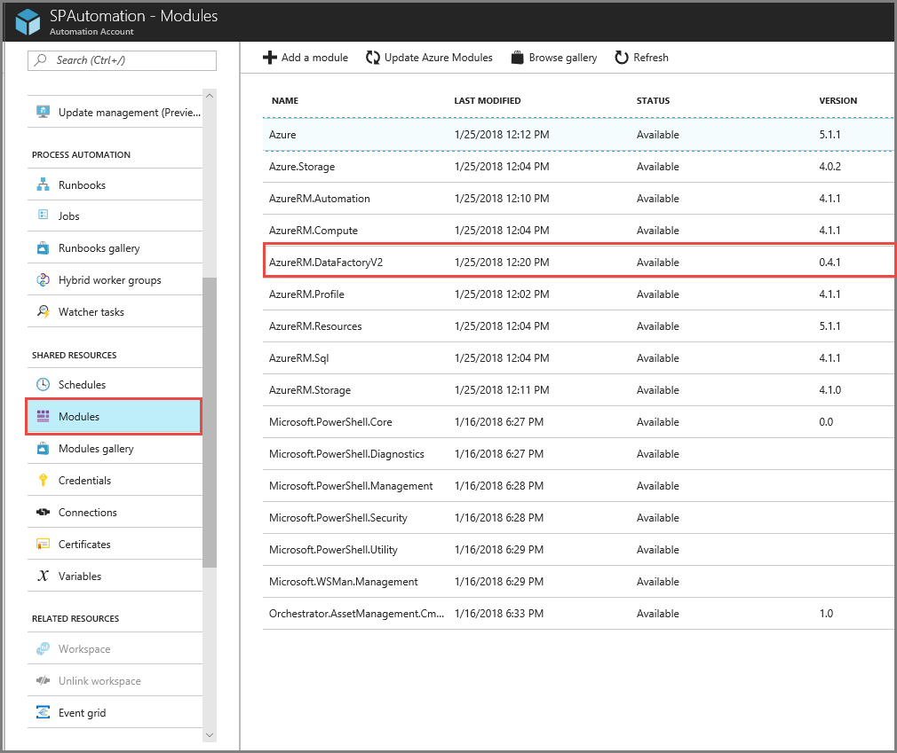
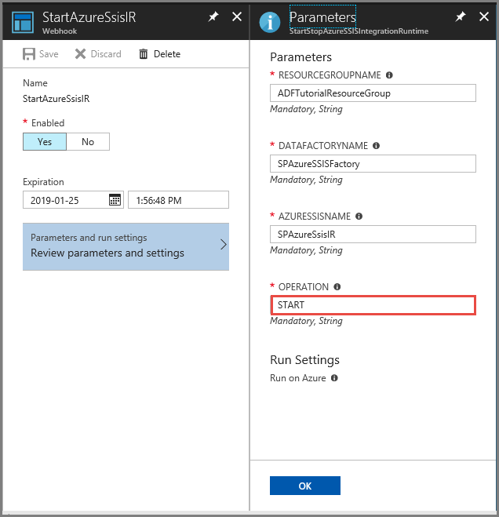

# How to schedule starting and stopping of an Azure SSIS integration runtime 
If you run SSIS packages in Azure only between certain times of a day or a certain days of a week etc., you may also want to run the Azure SSIS integration runtime only for that period of time. This action saves money as the Azure SSIS IR is charged as long as it's in the **Started** state. Using the Data Factory UI or Azure PowerShell, you can manually start or stop an Azure SSIS integration runtime as described in [Manage an Azure SSIS integration runtime](manage-azure-ssis-integration-runtime.md). This article describes how to schedule starting and stopping of an Azure SSIS integration runtime (IR) by using Azure Automation and Azure Data Factory. Here are the highlevel steps described in this article:

1. Create an Azure Automation runbook. In this step, you create a PowerShell runbook with the script that starts or stops an Azure SSIS IR based on the arguments passed to its parameters (resource group name, data factory name, Azure SSIS IR name, start/stop command). Then, you test the runbook in both START and STOP scenarios and confirm that IR starts or stops. 
2. Create two schedules for the runbook. For the first schedule, configure the runbook with START as the operation. For the second schedule, configure the runbook with STOP as the operation. For both the schedules, you specify the cadence at which the runbook is run. For example, you may want to schedule the first one to run at 8 AM every day and the second one to run at 11 PM everyday. When the first runbook runs, it starts the Azure SSIS IR. When the second runbook runs, it stops the Azure SSIS IR. 
3. Create two webhooks for your Azure Automation runbook, one for the START operation and the other for the STOP operation. You create a Data Factory pipeline with two web activities that use URIs for these webhook. For example, you start IR in the first web activity, wait for 30 minutes for the Azure SSIS IR to start, run an SSIS package by using a stored procedure activity, and then stop the Azure SSIS IR. Then, you create a schedule trigger to schedule the pipeline to run at the cadence you specify. 

> [!NOTE]
> This article applies to version 2 of Data Factory, which is currently in preview. If you are using version 1 of the Data Factory service, which is generally available (GA), see [Invoke SSIS packages using stored procedure activity in version 1](v1/how-to-invoke-ssis-package-stored-procedure-activity.md).

 
## Provision Azure SSIS integration runtime
If you haven't provisioned an Azure SSIS integration runtime already, provision it by following instructions in the [tutorial](tutorial-deploy-ssis-packages-azure.md) or [Create Azure SSIS integration runtime](create-azure-integration-runtime.md). 

## Create an Azure Automation runbook

1. If you don't have an Azure Automation account, create one by following instructions in the [Create an Azure Automation account](../automation/automation-quickstart-create-account.md). As part of this step, you create an **Azure Run As** account (a service principal in your Azure Active Directory), and adds it to the **Contributor** role of your Azure subscription. Ensure that this is the same subscription that contains the data factory that has the Azure SSIS IR. Azure Automation uses this account to authenticate to Azure Resource Manager and operate on your resources. 
2. In the automation account page, switch to the **Modules** tab, and verify whether you have **AzureRM.DataFactoryV2** in the list of modules. If it's not there, select **Browse gallery** on the toolbar, browse for the **AzureRM.DataFactoryV2** module, and **import** it. It may ask you to import **AzureRM.Profile** module if it hasn't already been imported. 

    
3. Create and publish a **PowerShell runbook** by following instructions in the [Create a runbook](../automation/automation-quickstart-create-runbook.md) article. Copy/paste the following script to the runbook script window. Publish the runbook by selecting the **Publish** on the toolbar. 

    ```powershell
    Param
    (
          [Parameter (Mandatory= $true)]
          [String] $ResourceGroupName,
    
          [Parameter (Mandatory= $true)]
          [String] $DataFactoryName,
    
          [Parameter (Mandatory= $true)]
          [String] $AzureSSISName,
    
          [Parameter (Mandatory= $true)]
          [String] $Operation
    )
    
    $connectionName = "AzureRunAsConnection"
    try
    {
        # Get the connection "AzureRunAsConnection "
        $servicePrincipalConnection=Get-AutomationConnection -Name $connectionName         
    
        "Logging in to Azure..."
        Add-AzureRmAccount `
            -ServicePrincipal `
            -TenantId $servicePrincipalConnection.TenantId `
            -ApplicationId $servicePrincipalConnection.ApplicationId `
            -CertificateThumbprint $servicePrincipalConnection.CertificateThumbprint 
    }
    catch {
        if (!$servicePrincipalConnection)
        {
            $ErrorMessage = "Connection $connectionName not found."
            throw $ErrorMessage
        } else{
            Write-Error -Message $_.Exception
            throw $_.Exception
        }
    }
    
    if($Operation -eq "START" -or $operation -eq "start")
    {
        "##### Starting #####"
        Start-AzureRmDataFactoryV2IntegrationRuntime -ResourceGroupName $ResourceGroupName -DataFactoryName $DataFactoryName -Name $AzureSSISName -Force
    }
    elseif($Operation -eq "STOP" -or $operation -eq "stop")
    {
        "##### Stopping #####"
        Stop-AzureRmDataFactoryV2IntegrationRuntime -DataFactoryName $DataFactoryName -Name $AzureSSISName -ResourceGroupName $ResourceGroupName -Force
    }  
    "##### Completed #####"    
    ```

5. Test the runbook. 
    a. Start the runbook by selecting the **Start** button on the toolbar. In the **Start Runbook** window, specify the resource group name, data factory name, Azure SSIS IR name, and START for the OPERATION. In the output window of the job, wait until you see the message **##### Completed #####** after you see **##### Starting #####**. Starting an Azure SSIS IR takes approximately 20 minutes. 
    b. Start the runbook again by selecting the **Start** button on the toolbar. Specify the resource group name, data factory name, Azure SSIS IR name, and STOP for OPERATION. In the output window of the job, wait until you see message **##### Completed #####** after you see **##### Stopping #####**. Stopping an Azure SSIS IR does not take as long as starting the Azure SSIS IR.   

## Create schedules for the runbook to start/stop the IR
In the previous section, you created an Azure Automation runbook that can either start or stop an Azure SSIS IR. In this section you create two schedules for the runbook. When configuring the first schedule, you specify START for the OPERATION parameter. Similarly, when configuring the second schedule, you specify STOP for the OPERATION. For detailed steps for creating schedules, see [Create a schedule](../automation/automation-schedules.md#creating-a-schedule).

The following image shows an example of configuring the first schedule:


## Create and schedule a Data Factory pipeline that starts/stops the IR

1. Follow instructions in [Create a webhook](../automation/automation-webhooks.md#creating-a-webhook) to create two webhooks for the runbook. For the first one, specify START as the OPERATION, and for the second one, specify STOP as the OPERATION. Note down the URLs for both the webhooks. You use these URLs when configuring Web activities in the Data Factory pipeline. The following image shown an example of creating a webhook that starts the Azure SSIS IR:

    
2. Create a data factory with a pipeline as shown in the following image: In the following example, the first **Web** activity uses the URL for the webhook that starts the Azure SSIS IR. The **Wait** activity waits for 30 minutes (1800 seconds) for the Azure SSIS IR to start. The **Stored Procedure** activity runs a SQL script that runs the SSIS package. The second **Web** activity stops the Azure SSIS IR. For more information about invoking an SSIS package from a Data Factory pipeline by using the Stored Procedure activity, see [Invoke an SSIS package](how-to-invoke-ssis-package-stored-procedure-activity.md). 

    

    For detailed instructions on creating a data factory with a pipeline, see [Create a data factory](quickstart-create-data-factory-portal.md).

3. You can create a trigger to run this pipeline at a specified cadence. For details about associating a schedule trigger with a pipeline, see [Trigger the pipeline on a schedule](quickstart-create-data-factory-portal.md#trigger-the-pipeline-on-a-schedule).

## Next steps
See the following articles from SSIS documentation: 

- [Deploy, run, and monitor an SSIS package on Azure](/sql/integration-services/lift-shift/ssis-azure-deploy-run-monitor-tutorial)   
- [Connect to SSIS catalog on Azure](/sql/integration-services/lift-shift/ssis-azure-connect-to-catalog-database)
- [Schedule package execution on Azure](/sql/integration-services/lift-shift/ssis-azure-schedule-packages)
- [Connect to on-premises data sources with Windows authentication](/sql/integration-services/lift-shift/ssis-azure-connect-with-windows-auth)