# How to start and stop Azure-SSIS Integration Runtime on a schedule

[!INCLUDE[appliesto-adf-asa-md](includes/appliesto-adf-asa-md.md)]

This article describes how to schedule the starting and stopping of Azure-SSIS Integration Runtime (IR) by using Azure Data Factory (ADF). Azure-SSIS IR is ADF compute resource dedicated for executing SQL Server Integration Services (SSIS) packages. Running Azure-SSIS IR has a cost associated with it. Therefore, you typically want to run your IR only when you need to execute SSIS packages in Azure and stop your IR when you do not need it anymore. You can use ADF User Interface (UI)/app or Azure PowerShell to [manually start or stop your IR](manage-azure-ssis-integration-runtime.md)).

Alternatively, you can create Web activities in ADF pipelines to start/stop your IR on schedule, e.g. starting it in the morning before executing your daily ETL workloads and stopping it in the afternoon after they are done.  You can also chain an Execute SSIS Package activity between two Web activities that start and stop your IR, so your IR will start/stop on demand, just in time before/after your package execution. For more info about Execute SSIS Package activity, see [Run an SSIS package using Execute SSIS Package activity in ADF pipeline](how-to-invoke-ssis-package-ssis-activity.md) article.

[!INCLUDE [updated-for-az](../../includes/updated-for-az.md)]

## Prerequisites
If you have not provisioned your Azure-SSIS IR already, provision it by following instructions in the [tutorial](tutorial-create-azure-ssis-runtime-portal.md). 

## Create and schedule ADF pipelines that start and or stop Azure-SSIS IR
This section shows you how to use Web activities in ADF pipelines to start/stop your Azure-SSIS IR on schedule or start & stop it on demand. We will guide you to create three pipelines: 

1. The first pipeline contains a Web activity that starts your Azure-SSIS IR. 
2. The second pipeline contains a Web activity that stops your Azure-SSIS IR.
3. The third pipeline contains an Execute SSIS Package activity chained between two Web activities that start/stop your Azure-SSIS IR. 

After you create and test those pipelines, you can create a schedule trigger and associate it with any pipeline. The schedule trigger defines a schedule for running the associated pipeline. 

For example, you can create two triggers, the first one is scheduled to run daily at 6 AM and associated with the first pipeline, while the second one is scheduled to run daily at 6 PM and associated with the second pipeline.  In this way, you have a period between 6 AM to 6 PM every day when your IR is running, ready to execute your daily ETL workloads.  

If you create a third trigger that is scheduled to run daily at midnight and associated with the third pipeline, that pipeline will run at midnight every day, starting your IR just before package execution, subsequently executing your package, and immediately stopping your IR just after package execution, so your IR will not be running idly.

### Create your ADF

1. Sign in to [Azure portal](https://portal.azure.com/).    
2. Click **New** on the left menu, click **Data + Analytics**, and click **Data Factory**. 
   
   
   
3. In the **New data factory** page, enter **MyAzureSsisDataFactory** for **Name**. 
      
   
 
   The name of your ADF must be globally unique. If you receive the following error, change the name of your ADF (e.g. yournameMyAzureSsisDataFactory) and try creating it again. See [Data Factory - Naming Rules](naming-rules.md) article to learn about naming rules for ADF artifacts.
  
   `Data factory name MyAzureSsisDataFactory is not available`
      
4. Select your Azure **Subscription** under which you want to create your ADF. 
5. For **Resource Group**, do one of the following steps:
     
   - Select **Use existing**, and select an existing resource group from the drop-down list. 
   - Select **Create new**, and enter the name of your new resource group.   
         
   To learn about resource groups, see [Using resource groups to manage your Azure resources](../azure-resource-manager/management/overview.md) article.
   
6. For **Version**, select **V2** .
7. For **Location**, select one of the locations supported for ADF creation from the drop-down list.
8. Select **Pin to dashboard**.     
9. Click **Create**.
10. On Azure dashboard, you will see the following tile with status: **Deploying Data Factory**. 

    
   
11. After the creation is complete, you can see your ADF page as shown below.
   
    
   
12. Click **Author & Monitor** to launch ADF UI/app in a separate tab.

### Create your pipelines

1. In **Let's get started** page, select **Create pipeline**. 

   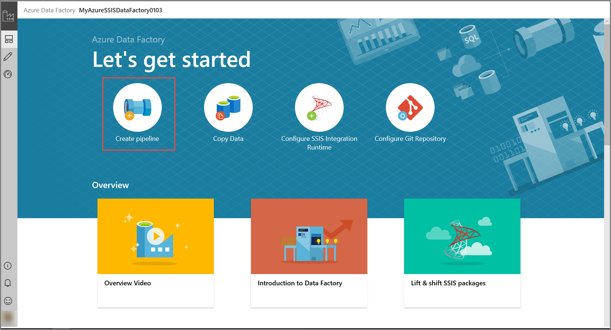
   
2. In **Activities** toolbox, expand **General** menu, and drag & drop a **Web** activity onto the pipeline designer surface. In **General** tab of the activity properties window, change the activity name to **startMyIR**. Switch to **Settings** tab, and do the following actions.

    1. For **URL**, enter the following URL for REST API that starts Azure-SSIS IR, replacing `{subscriptionId}`, `{resourceGroupName}`, `{factoryName}`, and `{integrationRuntimeName}` with the actual values for your IR: `https://management.azure.com/subscriptions/{subscriptionId}/resourceGroups/{resourceGroupName}/providers/Microsoft.DataFactory/factories/{factoryName}/integrationRuntimes/{integrationRuntimeName}/start?api-version=2018-06-01`
    Alternatively, you can also copy & paste the resource ID of your IR from its monitoring page on ADF UI/app to replace the following part of the above URL: `/subscriptions/{subscriptionId}/resourceGroups/{resourceGroupName}/providers/Microsoft.DataFactory/factories/{factoryName}/integrationRuntimes/{integrationRuntimeName}`
    
       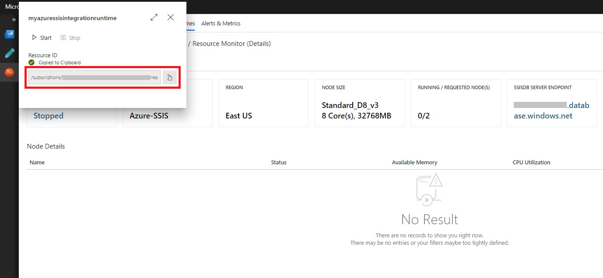
  
    2. For **Method**, select **POST**. 
    3. For **Body**, enter `{"message":"Start my IR"}`. 
    4. For **Authentication**, select **MSI** to use the managed identity for your ADF, see [Managed identity for Data Factory](https://docs.microsoft.com/azure/data-factory/data-factory-service-identity) article for more info.
    5. For **Resource**, enter `https://management.azure.com/`.
    
       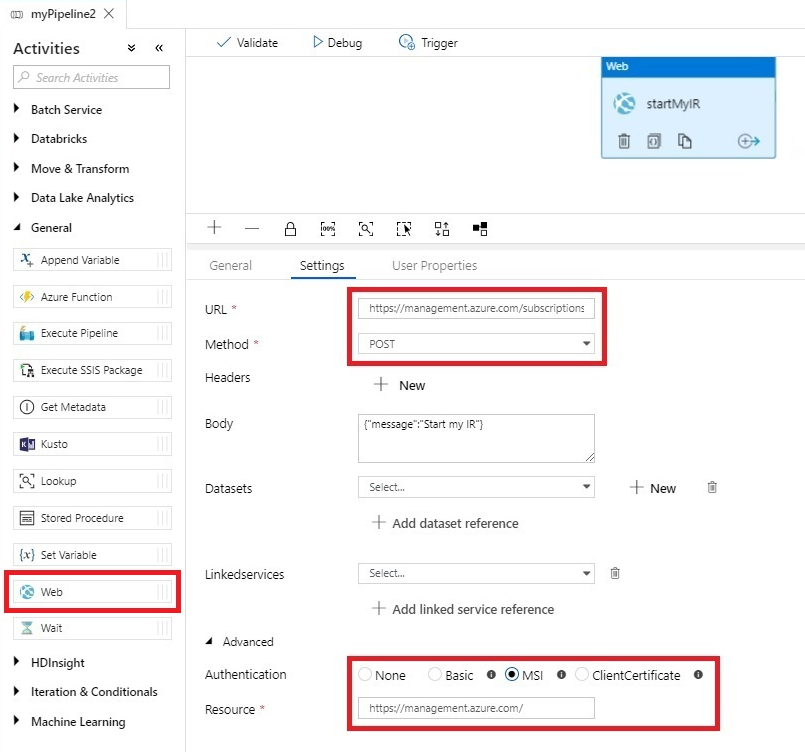
  
3. Clone the first pipeline to create a second one, changing the activity name to **stopMyIR** and replacing the following properties.

    1. For **URL**, enter the following URL for REST API that stops Azure-SSIS IR, replacing `{subscriptionId}`, `{resourceGroupName}`, `{factoryName}`, and `{integrationRuntimeName}` with the actual values for your IR: `https://management.azure.com/subscriptions/{subscriptionId}/resourceGroups/{resourceGroupName}/providers/Microsoft.DataFactory/factories/{factoryName}/integrationRuntimes/{integrationRuntimeName}/stop?api-version=2018-06-01`
    
    2. For **Body**, enter `{"message":"Stop my IR"}`. 

4. Create a third pipeline, drag & drop an **Execute SSIS Package** activity from **Activities** toolbox onto the pipeline designer surface, and configure it following the instructions in [Invoke an SSIS package using Execute SSIS Package activity in ADF](how-to-invoke-ssis-package-ssis-activity.md) article.  Alternatively, you can use a **Stored Procedure** activity instead and configure it following the instructions in [Invoke an SSIS package using Stored Procedure activity in ADF](how-to-invoke-ssis-package-stored-procedure-activity.md) article.  Next, chain the Execute SSIS Package/Stored Procedure activity between two Web activities that start/stop your IR, similar to those Web activities in the first/second pipelines.

   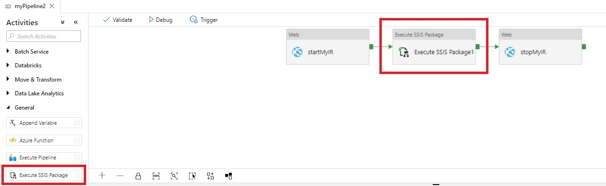

5. Assign the managed identity for your ADF a **Contributor** role to itself, so Web activities in its pipelines can call REST API to start/stop Azure-SSIS IRs provisioned in it.  On your ADF page in Azure portal, click **Access control (IAM)**, click **+ Add role assignment**, and then on **Add role assignment** blade, do the following actions.

    1. For **Role**, select **Contributor**. 
    2. For **Assign access to**, select **Azure AD user, group, or service principal**. 
    3. For **Select**, search for your ADF name and select it. 
    4. Click **Save**.
    
   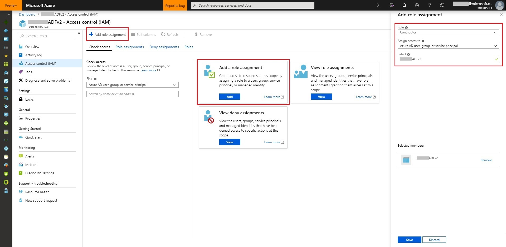

6. Validate your ADF and all pipeline settings by clicking **Validate all/Validate** on the factory/pipeline toolbar. Close **Factory/Pipeline Validation Output** by clicking **>>** button.  

   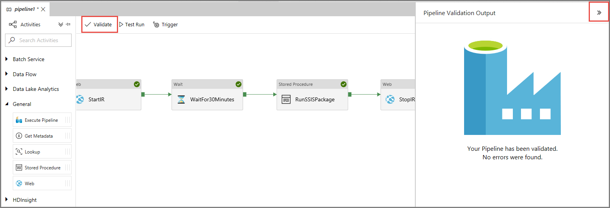

### Test run your pipelines

1. Select **Test Run** on the toolbar for each pipeline and see **Output** window in the bottom pane. 

   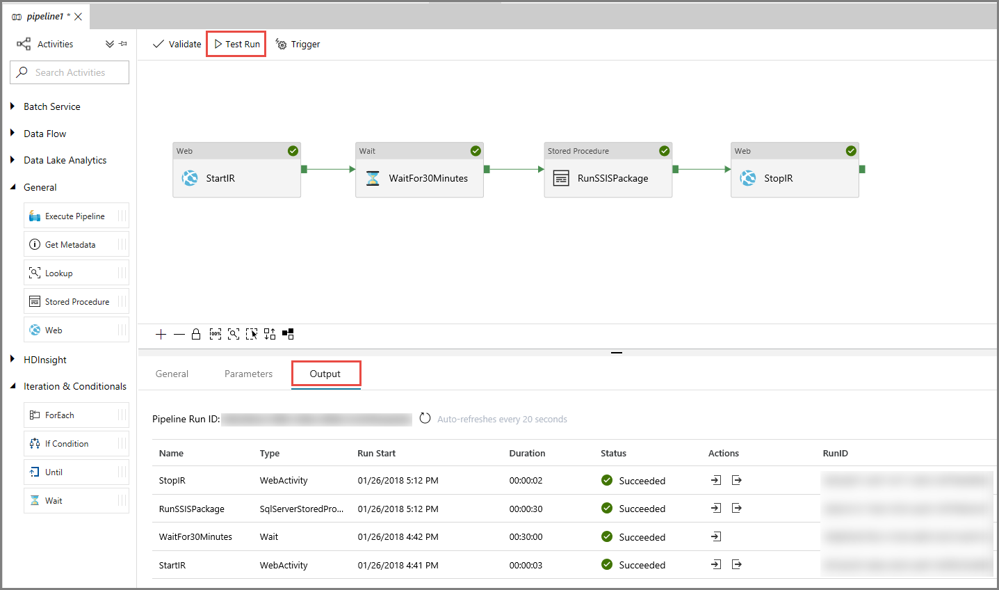
    
2. To test the third pipeline, launch SQL Server Management Studio (SSMS). In **Connect to Server** window, do the following actions. 

    1. For **Server name**, enter **&lt;your server name&gt;.database.windows.net**.
    2. Select **Options >>**.
    3. For **Connect to database**, select **SSISDB**.
    4. Select **Connect**. 
    5. Expand **Integration Services Catalogs** -> **SSISDB** -> Your folder -> **Projects** -> Your SSIS project -> **Packages**. 
    6. Right-click the specified SSIS package to run and select **Reports** -> **Standard Reports** -> **All Executions**. 
    7. Verify that it ran. 

   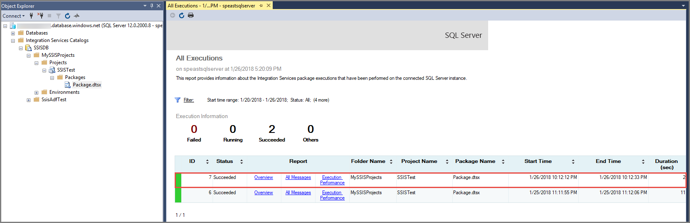

### Schedule your pipelines

Now that your pipelines work as you expected, you can create triggers to run them at specified cadences. For details about associating triggers with pipelines, see [Trigger the pipeline on a schedule](quickstart-create-data-factory-portal.md#trigger-the-pipeline-on-a-schedule) article.

1. On the pipeline toolbar, select **Trigger** and select **New/Edit**. 

   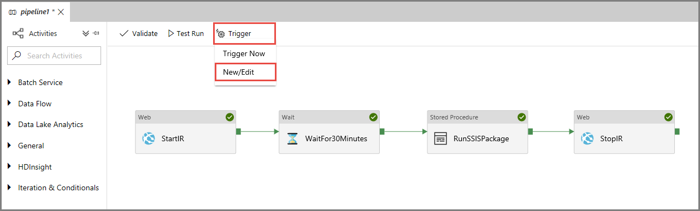

2. In **Add Triggers** pane, select **+ New**.

   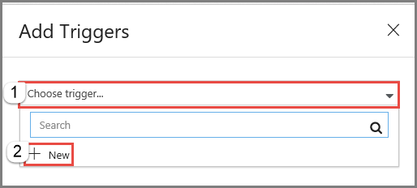

3. In **New Trigger** pane, do the following actions: 

    1. For **Name**, enter a name for the trigger. In the following example, **Run daily** is the trigger name. 
    2. For **Type**, select **Schedule**. 
    3. For **Start Date (UTC)**, enter a start date and time in UTC. 
    4. For **Recurrence**, enter a cadence for the trigger. In the following example, it is **Daily** once. 
    5. For **End**, select **No End** or enter an end date and time after selecting **On Date**. 
    6. Select **Activated** to activate the trigger immediately after you publish the whole ADF settings. 
    7. Select **Next**.

   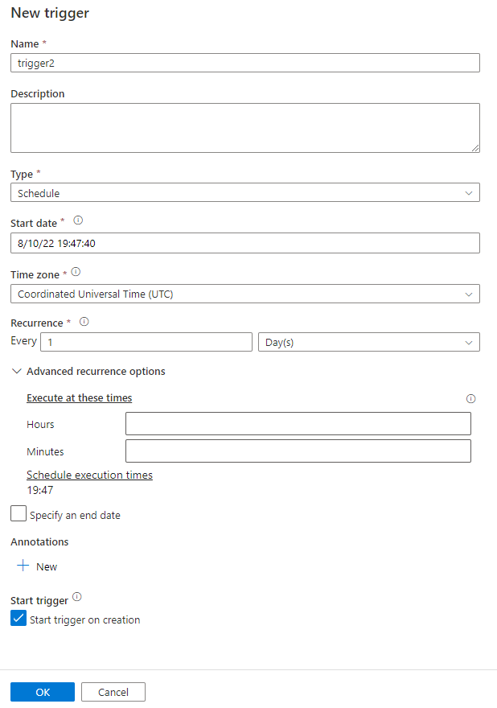
	
4. In **Trigger Run Parameters** page, review any warning, and select **Finish**. 
5. Publish the whole ADF settings by selecting **Publish All** in the factory toolbar. 

   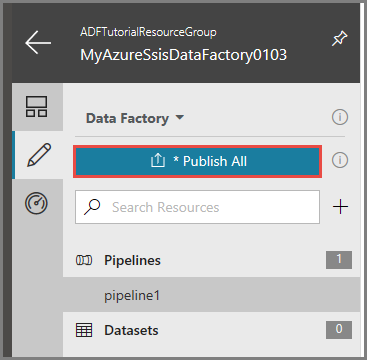

### Monitor your pipelines and triggers in Azure portal

1. To monitor trigger runs and pipeline runs, use **Monitor** tab on the left of ADF UI/app. For detailed steps, see [Monitor the pipeline](quickstart-create-data-factory-portal.md#monitor-the-pipeline) article.

   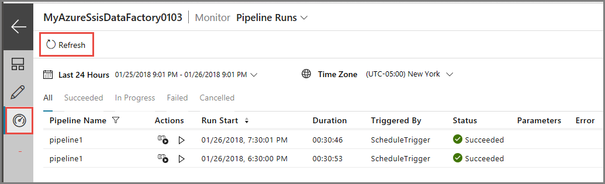

2. To view the activity runs associated with a pipeline run, select the first link (**View Activity Runs**) in **Actions** column. For the third pipeline, you will see three activity runs, one for each chained activity in the pipeline (Web activity to start your IR, Stored Procedure activity to execute your package, and Web activity to stop your IR). To view the pipeline runs again, select **Pipelines** link at the top.

   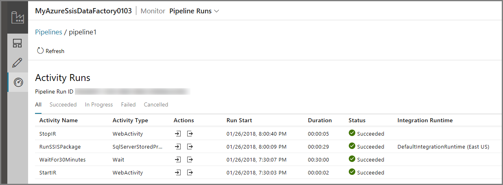

3. To view the trigger runs, select **Trigger Runs** from the drop-down list under **Pipeline Runs** at the top. 

   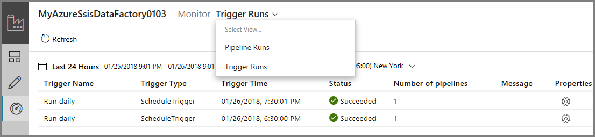

### Monitor your pipelines and triggers with PowerShell

Use scripts like the following examples to monitor your pipelines and triggers.

1. Get the status of a pipeline run.

   ```powershell
   Get-AzDataFactoryV2PipelineRun -ResourceGroupName $ResourceGroupName -DataFactoryName $DataFactoryName -PipelineRunId $myPipelineRun
   ```

2. Get info about a trigger.

   ```powershell
   Get-AzDataFactoryV2Trigger -ResourceGroupName $ResourceGroupName -DataFactoryName $DataFactoryName -Name  "myTrigger"
   ```

3. Get the status of a trigger run.

   ```powershell
   Get-AzDataFactoryV2TriggerRun -ResourceGroupName $ResourceGroupName -DataFactoryName $DataFactoryName -TriggerName "myTrigger" -TriggerRunStartedAfter "2018-07-15" -TriggerRunStartedBefore "2018-07-16"
   ```

## Create and schedule Azure Automation runbook that starts/stops Azure-SSIS IR

In this section, you will learn to create Azure Automation runbook that executes PowerShell script, starting/stopping your Azure-SSIS IR on a schedule.  This is useful when you want to execute additional scripts before/after starting/stopping your IR for pre/post-processing.

### Create your Azure Automation account

If you do not have an Azure Automation account already, create one by following the instructions in this step. For detailed steps, see [Create an Azure Automation account](../automation/automation-quickstart-create-account.md) article. As part of this step, you create an **Azure Run As** account (a service principal in your Azure Active Directory) and assign it a **Contributor** role in your Azure subscription. Ensure that it is the same subscription that contains your ADF with Azure SSIS IR. Azure Automation will use this account to authenticate to Azure Resource Manager and operate on your resources. 

1. Launch **Microsoft Edge** or **Google Chrome** web browser. Currently, ADF UI/app is only supported in Microsoft Edge and Google Chrome web browsers.
2. Sign in to [Azure portal](https://portal.azure.com/).    
3. Select **New** on the left menu, select **Monitoring + Management**, and select **Automation**. 

   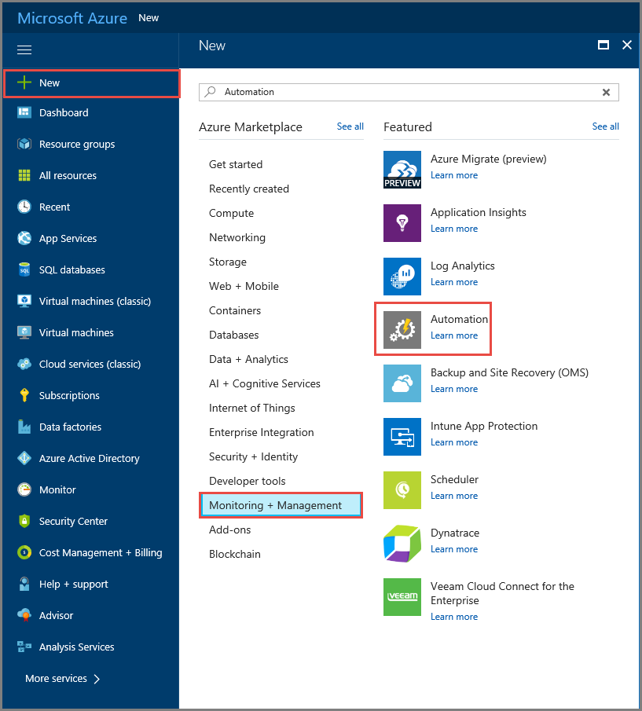
    
2. In **Add Automation Account** pane, do the following actions.

    1. For **Name**, enter a name for your Azure Automation account. 
    2. For **Subscription**, select the subscription that has your ADF with Azure-SSIS IR. 
    3. For **Resource group**, select **Create new** to create a new resource group or **Use existing** to select an existing one. 
    4. For **Location**, select a location for your Azure Automation account. 
    5. Confirm **Create Azure Run As account** as **Yes**. A service principal will be created in your Azure Active Directory and assigned a **Contributor** role in your Azure subscription.
    6. Select **Pin to dashboard** to display it permanently in Azure dashboard. 
    7. Select **Create**. 

   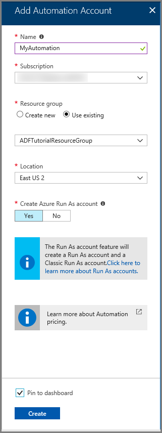
   
3. You will see the deployment status of your Azure Automation account in Azure dashboard and notifications. 
    
   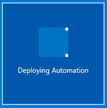 
    
4. You will see the homepage of your Azure Automation account after it is created successfully. 

   

### Import ADF modules

1. Select **Modules** in **SHARED RESOURCES** section on the left menu and verify whether you have **Az.DataFactory** + **Az.Profile** in the list of modules.

   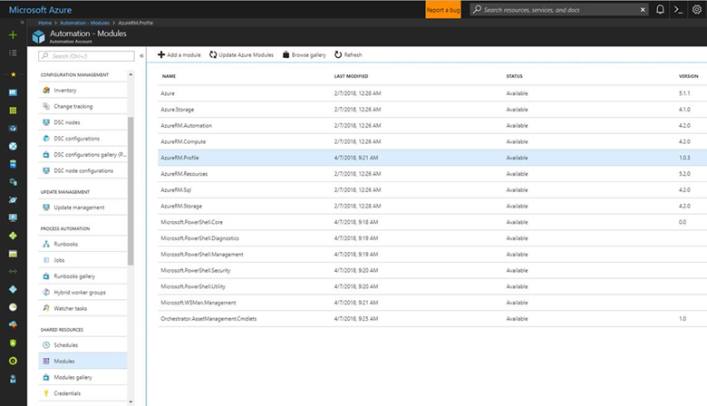

2.  If you do not have **Az.DataFactory**, go to the PowerShell Gallery for [Az.DataFactory module](https://www.powershellgallery.com/packages/Az.DataFactory/), select **Deploy to Azure Automation**, select your Azure Automation account, and then select **OK**. Go back to view **Modules** in **SHARED RESOURCES** section on the left menu and wait until you see **STATUS** of **Az.DataFactory** module changed to **Available**.

    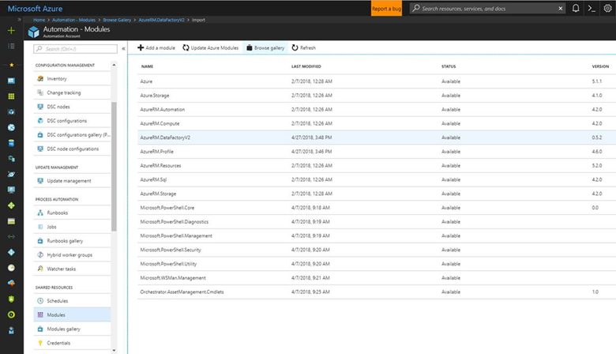

3.  If you do not have **Az.Profile**, go to the PowerShell Gallery for [Az.Profile module](https://www.powershellgallery.com/packages/Az.profile/), select **Deploy to Azure Automation**, select your Azure Automation account, and then select **OK**. Go back to view **Modules** in **SHARED RESOURCES** section on the left menu and wait until you see **STATUS** of the **Az.Profile** module changed to **Available**.

    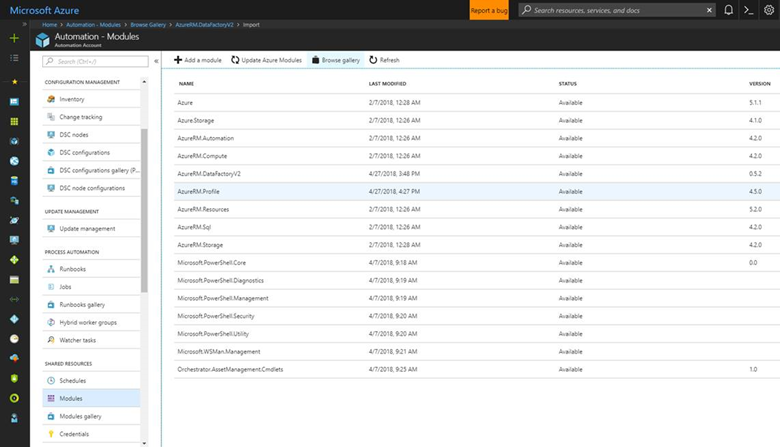

### Create your PowerShell runbook

The following section provides steps for creating a PowerShell runbook. The script associated with your runbook either starts/stops Azure-SSIS IR based on the command you specify for **OPERATION** parameter. This section does not provide the complete details for creating a runbook. For more information, see [Create a runbook](../automation/automation-quickstart-create-runbook.md) article.

1. Switch to **Runbooks** tab and select **+ Add a runbook** from the toolbar. 

   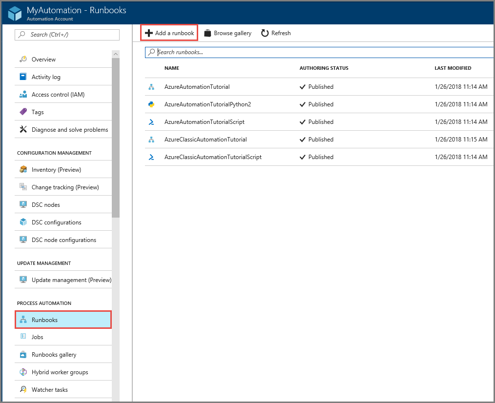
   
2. Select **Create a new runbook** and do the following actions: 

    1. For **Name**, enter **StartStopAzureSsisRuntime**.
    2. For **Runbook type**, select **PowerShell**.
    3. Select **Create**.
    
   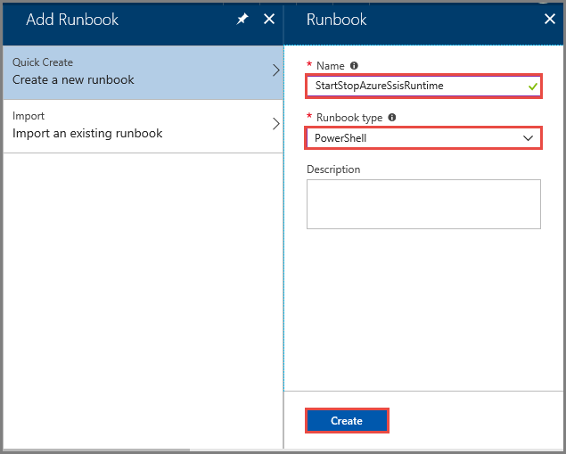
   
3. Copy & paste the following PowerShell script to your runbook script window. Save and then publish your runbook by using **Save** and **Publish** buttons on the toolbar. 

    ```powershell
    Param
    (
          [Parameter (Mandatory= $true)]
          [String] $ResourceGroupName,
    
          [Parameter (Mandatory= $true)]
          [String] $DataFactoryName,
    
          [Parameter (Mandatory= $true)]
          [String] $AzureSSISName,
    
          [Parameter (Mandatory= $true)]
          [String] $Operation
    )
    
    $connectionName = "AzureRunAsConnection"
    try
    {
        # Get the connection "AzureRunAsConnection "
        $servicePrincipalConnection=Get-AutomationConnection -Name $connectionName         
    
        "Logging in to Azure..."
        Connect-AzAccount `
            -ServicePrincipal `
            -TenantId $servicePrincipalConnection.TenantId `
            -ApplicationId $servicePrincipalConnection.ApplicationId `
            -CertificateThumbprint $servicePrincipalConnection.CertificateThumbprint 
    }
    catch {
        if (!$servicePrincipalConnection)
        {
            $ErrorMessage = "Connection $connectionName not found."
            throw $ErrorMessage
        } else{
            Write-Error -Message $_.Exception
            throw $_.Exception
        }
    }
    
    if($Operation -eq "START" -or $operation -eq "start")
    {
        "##### Starting #####"
        Start-AzDataFactoryV2IntegrationRuntime -ResourceGroupName $ResourceGroupName -DataFactoryName $DataFactoryName -Name $AzureSSISName -Force
    }
    elseif($Operation -eq "STOP" -or $operation -eq "stop")
    {
        "##### Stopping #####"
        Stop-AzDataFactoryV2IntegrationRuntime -DataFactoryName $DataFactoryName -Name $AzureSSISName -ResourceGroupName $ResourceGroupName -Force
    }  
    "##### Completed #####"    
    ```

   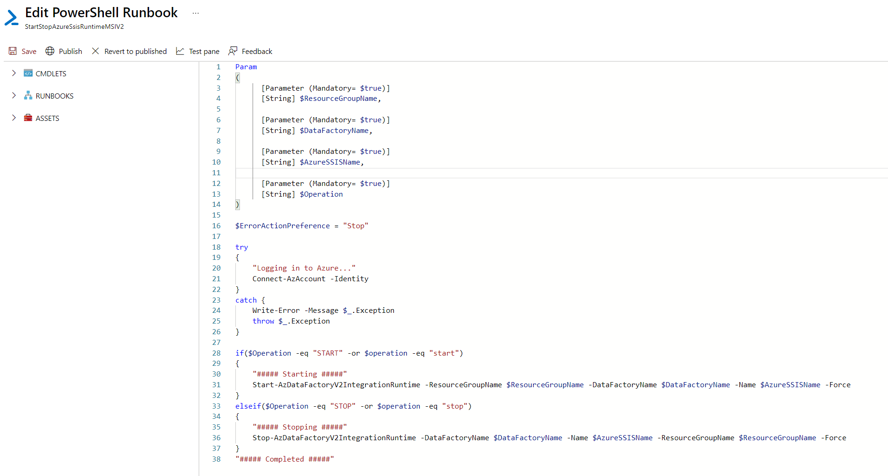
    
4. Test your runbook by selecting **Start** button on the toolbar. 

   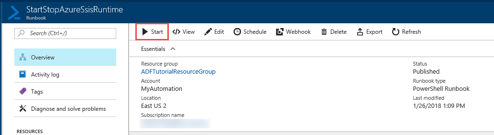
    
5. In **Start Runbook** pane, do the following actions: 

    1. For **RESOURCE GROUP NAME**, enter the name of resource group that has your ADF with Azure-SSIS IR. 
    2. For **DATA FACTORY NAME**, enter the name of your ADF with Azure-SSIS IR. 
    3. For **AZURESSISNAME**, enter the name of Azure-SSIS IR. 
    4. For **OPERATION**, enter **START**. 
    5. Select **OK**.  

   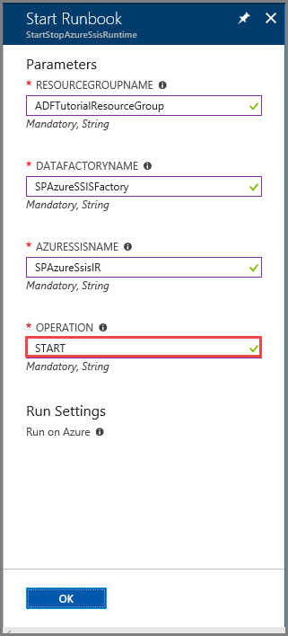
   
6. In the job window, select **Output** tile. In the output window, wait for the message **##### Completed #####** after you see **##### Starting #####**. Starting Azure-SSIS IR takes approximately 20 minutes. Close **Job** window and get back to **Runbook** window.

   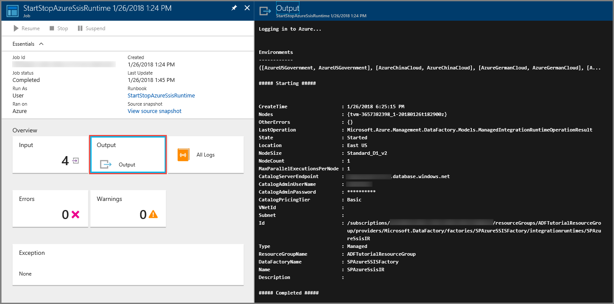
    
7. Repeat the previous two steps using **STOP** as the value for **OPERATION**. Start your runbook again by selecting **Start** button on the toolbar. Enter your resource group, ADF, and Azure-SSIS IR names. For **OPERATION**, enter **STOP**. In the output window, wait for the message **##### Completed #####** after you see **##### Stopping #####**. Stopping Azure-SSIS IR does not take as long as starting it. Close **Job** window and get back to **Runbook** window.

8. You can also trigger your runbook via a webhook that can be created by selecting the **Webhooks** menu item or on a schedule that can be created by selecting the **Schedules** menu item as specified below.  

## Create schedules for your runbook to start/stop Azure-SSIS IR

In the previous section, you have created your Azure Automation runbook that can either start or stop Azure-SSIS IR. In this section, you will create two schedules for your runbook. When configuring the first schedule, you specify **START** for **OPERATION**. Similarly, when configuring the second one, you specify **STOP** for **OPERATION**. For detailed steps to create schedules, see [Create a schedule](../automation/shared-resources/schedules.md#create-a-schedule) article.

1. In **Runbook** window, select **Schedules**, and select **+ Add a schedule** on the toolbar. 

   
   
2. In **Schedule Runbook** pane, do the following actions: 

    1. Select **Link a schedule to your runbook**. 
    2. Select **Create a new schedule**.
    3. In **New Schedule** pane, enter **Start IR daily** for **Name**. 
    4. For **Starts**, enter a time that is a few minutes past the current time. 
    5. For **Recurrence**, select **Recurring**. 
    6. For **Recur every**, enter **1** and select **Day**. 
    7. Select **Create**. 

   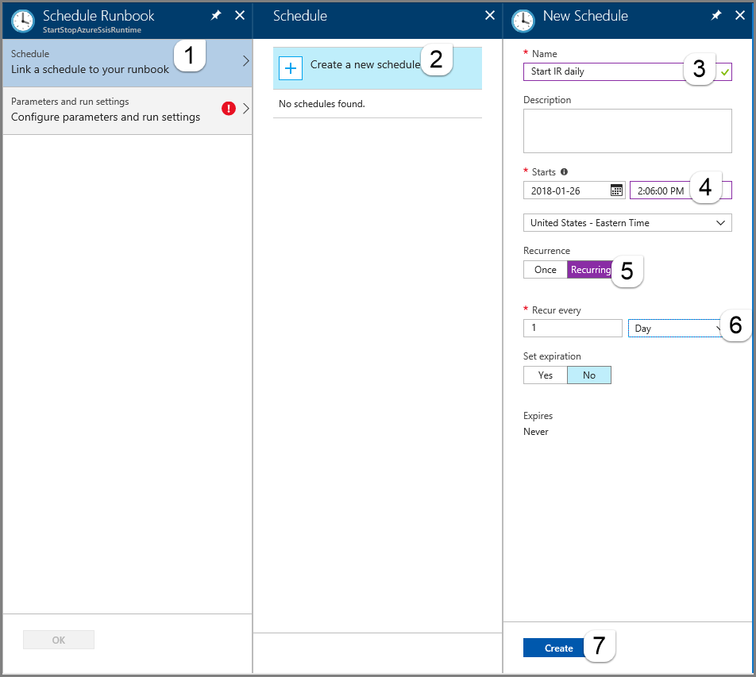
	
3. Switch to **Parameters and run settings** tab. Specify your resource group, ADF, and Azure-SSIS IR names. For **OPERATION**, enter **START** and select **OK**. Select **OK** again to see the schedule on **Schedules** page of your runbook. 

   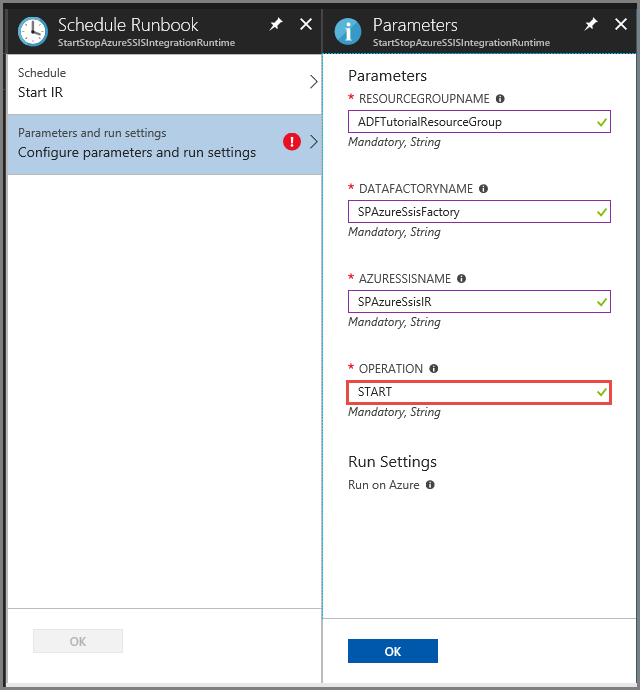
    
4. Repeat the previous two steps to create a schedule named **Stop IR daily**. Enter a time that is at least 30 minutes after the time you specified for **Start IR daily** schedule. For **OPERATION**, enter **STOP** and select **OK**. Select **OK** again to see the schedule on **Schedules** page of your runbook. 

5. In **Runbook** window, select **Jobs** on the left menu. You should see the jobs created by your schedules at the specified times and their statuses. You can see the job details, such as its output, similar to what you have seen after you tested your runbook. 

   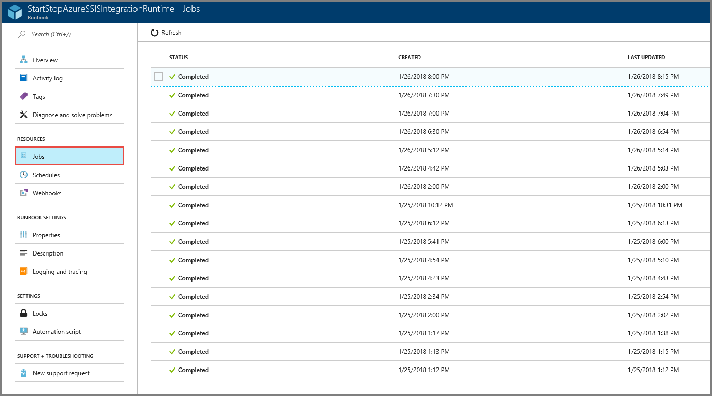
    
6. After you are done testing, disable your schedules by editing them. Select **Schedules** on the left menu, select **Start IR daily/Stop IR daily**, and select **No** for **Enabled**. 

## Next steps
See the following blog post:
-   [Modernize and extend your ETL/ELT workflows with SSIS activities in ADF pipelines](https://techcommunity.microsoft.com/t5/SQL-Server-Integration-Services/Modernize-and-Extend-Your-ETL-ELT-Workflows-with-SSIS-Activities/ba-p/388370)

See the following articles from SSIS documentation: 

- [Deploy, run, and monitor an SSIS package on Azure](/sql/integration-services/lift-shift/ssis-azure-deploy-run-monitor-tutorial)   
- [Connect to SSIS catalog on Azure](/sql/integration-services/lift-shift/ssis-azure-connect-to-catalog-database)
- [Schedule package execution on Azure](/sql/integration-services/lift-shift/ssis-azure-schedule-packages)
- [Connect to on-premises data sources with Windows authentication](/sql/integration-services/lift-shift/ssis-azure-connect-with-windows-auth)
