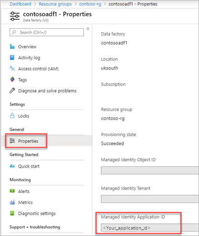

# Use Azure Key Vault secrets in pipeline activities

[!INCLUDE[appliesto-adf-asa-md](includes/appliesto-adf-asa-md.md)]

You can store credentials or secret values in an Azure Key Vault and use them during pipeline execution to pass to your activities.

## Prerequisites

This feature relies on the data factory managed identity.  Learn how it works from [Managed identity for Data Factory](./data-factory-service-identity.md) and make sure your data factory has one associated.

## Steps

1. Open the properties of your data factory and copy the Managed Identity Application ID value.

    

2. Open the key vault access policies and add the managed identity permissions to Get and List secrets.

    

    

    Click **Add**, then click **Save**.

3. Navigate to your Key Vault secret and copy the Secret Identifier.

    

    Make a note of your secret URI that you want to get during your data factory pipeline run.

4. In your Data Factory pipeline, add a new Web activity and configure it as follows.  

    |Property  |Value  |
    |---------|---------|
    |Secure Output     |True         |
    |URL     |[Your secret URI value]?api-version=7.0         |
    |Method     |GET         |
    |Authentication     |MSI         |
    |Resource        |https://vault.azure.net       |

    

    > [!IMPORTANT]
    > You must add **?api-version=7.0** to the end of your secret URI.  

    > [!CAUTION]
    > Set the Secure Output option to true to prevent the secret value from being logged in plain text.  Any further activities that consume this value should have their Secure Input option set to true.

5. To use the value in another activity, use the following code expression **@activity('Web1').output.value**.

    

## Next steps

To learn how to use Azure Key Vault to store credentials for data stores and computes, see [Store credentials in Azure Key Vault](./store-credentials-in-key-vault.md)