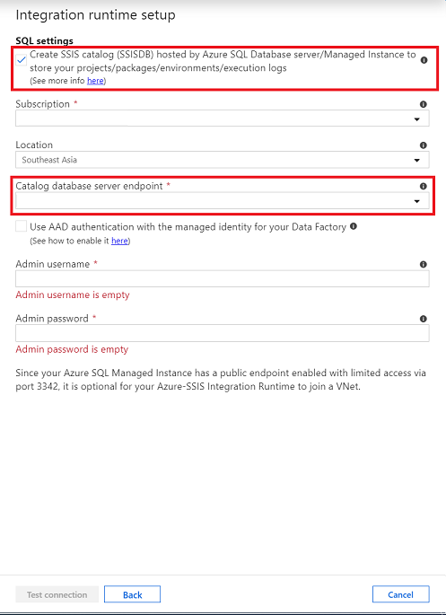
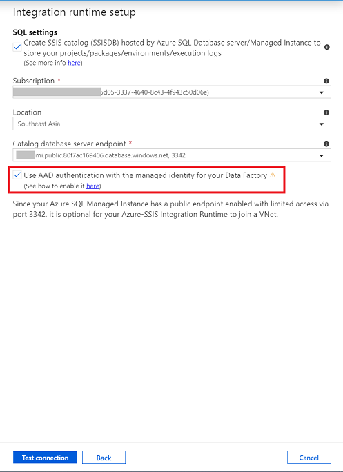
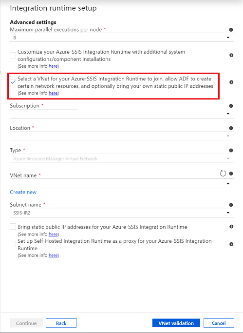

# Use Azure SQL Managed Instance with SQL Server Integration Services (SSIS) in Azure Data Factory

[!INCLUDE[appliesto-adf-asa-md](includes/appliesto-adf-xxx-md.md)]

You can now move your SQL Server Integration Services (SSIS) projects, packages, and workloads to the Azure cloud. Deploy, run, and manage SSIS projects and packages on Azure SQL Database or SQL Managed Instance with familiar tools such as SQL Server Management Studio (SSMS). This article highlights the following specific areas when using Azure SQL Managed Instance with Azure-SSIS integration runtime (IR):

- [Provision an Azure-SSIS IR with SSIS catalog (SSISDB) hosted by Azure SQL Managed Instance](#provision-azure-ssis-ir-with-ssisdb-hosted-by-azure-sql-managed-instance)
- [Execute SSIS packages by Azure SQL Managed Instance Agent job](how-to-invoke-ssis-package-managed-instance-agent.md)
- [Clean up SSISDB logs by Azure SQL Managed Instance Agent job](#clean-up-ssisdb-logs)
- [Azure-SSIS IR failover with Azure SQL Managed Instance](configure-bcdr-azure-ssis-integration-runtime.md#azure-ssis-ir-failover-with-a-sql-managed-instance)
- [Migrate on-premises SSIS workloads to SSIS in ADF with Azure SQL Managed Instance as database workload destination](scenario-ssis-migration-overview.md#azure-sql-managed-instance-as-database-workload-destination)

## Provision Azure-SSIS IR with SSISDB hosted by Azure SQL Managed Instance

### Prerequisites

1. [Enable Azure Active Directory (Azure AD) on Azure SQL Managed Instance](enable-aad-authentication-azure-ssis-ir.md#configure-azure-ad-authentication-for-azure-sql-managed-instance), when choosing Azure Active Directory authentication.

1. Choose how to connect SQL managed instance, over private endpoint or over public endpoint:

    - Over private endpoint (preferred)

        1. Choose the virtual network for Azure-SSIS IR to join:
            - Inside the same virtual network as SQL managed instance, with **different subnet**.
            - Inside a different virtual network than the SQL managed instance, via virtual network peering (which is limited to the same region due to Global VNet peering constraints) or a connection from virtual network to virtual network.

            For more info on SQL managed instance connectivity, see [Connect your application to Azure SQL Managed Instance](https://review.docs.microsoft.com/azure/sql-database/sql-database-managed-instance-connect-app).

        1. [Configure virtual network](#configure-virtual-network).

    - Over public endpoint

        Azure SQL Managed Instances can provide connectivity over [public endpoints](https://docs.microsoft.com/azure/sql-database/sql-database-managed-instance-public-endpoint-configure). Inbound and outbound requirements need to meet to allow traffic between SQL managed instance and Azure-SSIS IR:

        - when Azure-SSIS IR not inside a virtual network (preferred)

            **Inbound requirement of SQL managed instance**, to allow inbound traffic from Azure-SSIS IR.

            | Transport protocol | Source | Source port range | Destination | Destination port range |
            |---|---|---|---|---|
            |TCP|Azure Cloud service tag|*|VirtualNetwork|3342|

            For more information, see [Allow public endpoint traffic on the network security group](https://docs.microsoft.com/azure/sql-database/sql-database-managed-instance-public-endpoint-configure#allow-public-endpoint-traffic-on-the-network-security-group).

        - when Azure-SSIS IR inside a virtual network

            There is a special scenario when SQL managed instance is in a region that Azure-SSIS IR does not support, Azure-SSIS IR is inside a virtual network without VNet peering due to Global VNet peering limitation. In this scenario, **Azure-SSIS IR inside a virtual network** connects SQL managed instance **over public endpoint**. Use below Network Security Group(NSG) rules to allow traffic between SQL managed instance and Azure-SSIS IR:

            1. **Inbound requirement of SQL managed instance**, to allow inbound traffic from Azure-SSIS IR.

                | Transport protocol | Source | Source port range | Destination |Destination port range |
                |---|---|---|---|---|
                |TCP|Static IP address of Azure-SSIS IR   For details, see [Bring Your Own Public IP for Azure-SSIS IR](join-azure-ssis-integration-runtime-virtual-network.md#publicIP).|*|VirtualNetwork|3342|

             1. **Outbound requirement of Azure-SSIS IR**, to allow outbound traffic to SQL managed instance.

                | Transport protocol | Source | Source port range | Destination |Destination port range |
                |---|---|---|---|---|
                |TCP|VirtualNetwork|*|[SQL managed instance public endpoint IP address](https://docs.microsoft.com/azure/sql-database/sql-database-managed-instance-find-management-endpoint-ip-address)|3342|

### Configure virtual network

1. **User permission**. The user who creates the Azure-SSIS IR must have the [role assignment](https://docs.microsoft.com/azure/role-based-access-control/role-assignments-list-portal#list-role-assignments-for-a-user-at-a-scope) at least on Azure Data Factory resource with one of the options below:

    - Use the built-in Network Contributor role. This role comes with the _Microsoft.Network/\*_ permission, which has a much larger scope than necessary.
    - Create a custom role that includes only the necessary _Microsoft.Network/virtualNetworks/\*/join/action_ permission. If you also want to bring your own public IP addresses for Azure-SSIS IR while joining it to an Azure Resource Manager virtual network, also include _Microsoft.Network/publicIPAddresses/*/join/action_ permission in the role.

1. **Virtual network**.

    1. Make sure that the virtual network's resource group can create and delete certain Azure network resources.

        The Azure-SSIS IR needs to create certain network resources under the same resource group as the virtual network. These resources include:
        - An Azure load balancer, with the name *\<Guid>-azurebatch-cloudserviceloadbalancer*
        - A network security group, with the name *\<Guid>-azurebatch-cloudservicenetworksecuritygroup
        - An Azure public IP address, with the name -azurebatch-cloudservicepublicip

        Those resources will be created when your Azure-SSIS IR starts. They'll be deleted when your Azure-SSIS IR stops. To avoid blocking your Azure-SSIS IR from stopping, don't reuse these network resources in your other resources.

    1. Make sure that you have no [resource lock](https://docs.microsoft.com/azure/azure-resource-manager/management/lock-resources) on the resource group/subscription to which the virtual network belongs. If you configure a read-only/delete lock, starting and stopping your Azure-SSIS IR will fail, or it will stop responding.

    1. Make sure that you don't have an Azure policy that prevents the following resources from being created under the resource group/subscription to which the virtual network belongs:
        - Microsoft.Network/LoadBalancers
        - Microsoft.Network/NetworkSecurityGroups

    1. Allow traffic on Network Security Group (NSG) rule, to allow traffic between SQL managed instance and Azure-SSIS IR, and traffic needed by Azure-SSIS IR.
        1. **Inbound requirement of SQL managed instance**, to allow inbound traffic from Azure-SSIS IR.

            | Transport protocol | Source | Source port range | Destination | Destination port range | Comments |
            |---|---|---|---|---|---|
            |TCP|VirtualNetwork|*|VirtualNetwork|1433, 11000-11999|If your SQL Database server connection policy is set to **Proxy** instead of **Redirect**, only port 1433 is needed.|

        1. **Outbound requirement of Azure-SSIS IR**, to allow outbound traffic to SQL managed instance, and other traffic needed by Azure-SSIS IR.

        | Transport protocol | Source | Source port range | Destination | Destination port range | Comments |
        |---|---|---|---|---|---|
        | TCP | VirtualNetwork | * | VirtualNetwork | 1433, 11000-11999 |Allow outbound traffic to SQL managed instance. If connection policy is set to **Proxy** instead of **Redirect**, only port 1433 is needed. |
        | TCP | VirtualNetwork | * | AzureCloud | 443 | The nodes of your Azure-SSIS IR in the virtual network use this port to access Azure services, such as Azure Storage and Azure Event Hubs. |
        | TCP | VirtualNetwork | * | Internet | 80 | (Optional) The nodes of your Azure-SSIS IR in the virtual network use this port to download a certificate revocation list from the internet. If you block this traffic, you might experience performance downgrade when start IR and lose capability to check certificate revocation list for certificate usage. If you want to further narrow down destination to certain FQDNs, refer to [Use Azure ExpressRoute or User Defined Route(UDR)](https://docs.microsoft.com/azure/data-factory/join-azure-ssis-integration-runtime-virtual-network#route).|
        | TCP | VirtualNetwork | * | Storage | 445 | (Optional) This rule is only required when you want to execute SSIS package stored in Azure Files. |
        |||||||

        1. **Inbound requirement of Azure-SSIS IR**, to allow traffic needed by Azure-SSIS IR.

        | Transport protocol | Source | Source port range | Destination | Destination port range | Comments |
        |---|---|---|---|---|---|
        | TCP | BatchNodeManagement | * | VirtualNetwork | 29876, 29877 (if you join the IR to a Resource Manager virtual network)   10100, 20100, 30100 (if you join the IR to a classic virtual network)| The Data Factory service uses these ports to communicate with the nodes of your Azure-SSIS IR in the virtual network.    Whether or not you create a subnet-level NSG, Data Factory always configures an NSG at the level of the network interface cards (NICs) attached to the virtual machines that host the Azure-SSIS IR. Only inbound traffic from Data Factory IP addresses on the specified ports is allowed by that NIC-level NSG. Even if you open these ports to internet traffic at the subnet level, traffic from IP addresses that aren't Data Factory IP addresses is blocked at the NIC level. |
        | TCP | CorpNetSaw | * | VirtualNetwork | 3389 | (Optional) This rule is only required when Microsoft supporter asks customer to open for advanced troubleshooting, and can be closed right after troubleshooting. **CorpNetSaw** service tag permits only secure access workstations on the Microsoft corporate network to use remote desktop. And this service tag can't be selected from portal and is only available via Azure PowerShell or Azure CLI.    At NIC level NSG, port 3389 is open by default and we allow you to control port 3389 at subnet level NSG, meanwhile Azure-SSIS IR has disallowed port 3389 outbound by default at windows firewall rule on each IR node for protection. |
        |||||||

    1. See [virtual network configuration](join-azure-ssis-integration-runtime-virtual-network.md#virtual-network-configuration) for more info:
        - If you bring your own public IP addresses for the Azure-SSIS IR
        - If you use your own Domain Name System (DNS) server
        - If you use Azure ExpressRoute or a user-defined route (UDR)
        - If you use customized Azure-SSIS IR

### Provision Azure-SSIS Integration Runtime

1. Select SQL managed instance private endpoint or public endpoint.

    When [provisioning Azure-SSIS IR](create-azure-ssis-integration-runtime.md#provision-an-azure-ssis-integration-runtime) in Azure portal/ADF app, on SQL Settings page, use SQL managed instance **private endpoint** or **public endpoint** when creating SSIS catalog (SSISDB).

    Public endpoint host name comes in the format <mi_name>.public.<dns_zone>.database.windows.net and that the port used for the connection is 3342.  

    

1. Select Azure AD authentication when applies.

    

    For more info about how to enable Azure AD authentication, see [Enable Azure AD on Azure SQL Managed Instance](enable-aad-authentication-azure-ssis-ir.md#configure-azure-ad-authentication-for-azure-sql-managed-instance).

1. Join Azure-SSIS IR to the virtual network when applies.

    On advanced setting page, select the Virtual Network and subnet to join.
    
    When inside the same virtual network as SQL managed instance, choose a **different subnet** than SQL managed instance. 

    For more information about how to join Azure-SSIS IR into a virtual network, see [Join an Azure-SSIS integration runtime to a virtual network](join-azure-ssis-integration-runtime-virtual-network.md).

    

For more info about how to create an Azure-SSIS IR, see [Create an Azure-SSIS integration runtime in Azure Data Factory](create-azure-ssis-integration-runtime.md#provision-an-azure-ssis-integration-runtime).

## Clean up SSISDB logs

SSISDB logs retention policy are defined by below properties in [catalog.catalog_properties](https://docs.microsoft.com/sql/integration-services/system-views/catalog-catalog-properties-ssisdb-database?view=sql-server-ver15):

- OPERATION_CLEANUP_ENABLED

    When the value is TRUE, operation details and operation messages older than RETENTION_WINDOW (days) are deleted from the catalog. When the value is FALSE, all operation details and operation messages are stored in the catalog. Note: a SQL Server job performs the operation cleanup.

- RETENTION_WINDOW

    The number of days that operation details and operation messages are stored in the catalog. When the value is -1, the retention window is infinite. Note: If no cleanup is desired, set OPERATION_CLEANUP_ENABLED to FALSE.

To remove SSISDB logs that are outside the retention window set by the administrator, you can trigger the stored procedure `[internal].[cleanup_server_retention_window_exclusive]`. Optionally, you can schedule SQL managed instance agent job execution to trigger the stored procedure.

## Next steps

- [Execute SSIS packages by Azure SQL Managed Instance Agent job](how-to-invoke-ssis-package-managed-instance-agent.md)
- [Set up Business continuity and disaster recovery (BCDR)](configure-bcdr-azure-ssis-integration-runtime.md)
- [Migrate on-premises SSIS workloads to SSIS in ADF](scenario-ssis-migration-overview.md)
