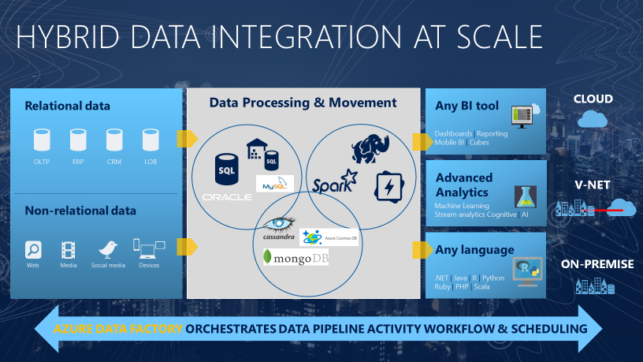

# Introduction to Azure Data Factory 
> [!div class="op_single_selector" title1="Select the version of Data Factory service you are using:"]
> * [Version 1](v1/data-factory-introduction.md)
> * [Current version](introduction.md)

In the world of big data, raw, unorganized data is often stored in relational, non-relational, and other storage systems. However, on its own, raw data doesn't have the proper context or meaning to provide meaningful insights to analysts, data scientists, or business decision makers. 

Big data requires service that can orchestrate and operationalize processes to refine these enormous stores of raw data into actionable business insights. Azure Data Factory is a managed cloud service that's built for these complex hybrid extract-transform-load (ETL), extract-load-transform (ELT), and data integration projects.

For example, imagine a gaming company that collects petabytes of game logs that are produced by games in the cloud. The company wants to analyze these logs to gain insights into customer preferences, demographics, and usage behavior. It also wants to identify up-sell and cross-sell opportunities, develop compelling new features, drive business growth, and provide a better experience to its customers.

To analyze these logs, the company needs to use reference data such as customer information, game information, and marketing campaign information that is in an on-premises data store. The company wants to utilize this data from the on-premises data store, combining it with additional log data that it has in a cloud data store. 

To extract insights, it hopes to process the joined data by using a Spark cluster in the cloud (Azure HDInsight), and publish the transformed data into a cloud data warehouse such as Azure SQL Data Warehouse to easily build a report on top of it. They want to automate this workflow, and monitor and manage it on a daily schedule. They also want to execute it when files land in a blob store container.

Azure Data Factory is the platform that solves such data scenarios. It is a *cloud-based data integration service that allows you to create data-driven workflows in the cloud for orchestrating and automating data movement and data transformation*. Using Azure Data Factory, you can create and schedule data-driven workflows (called pipelines) that can ingest data from disparate data stores. It can process and transform the data by using compute services such as Azure HDInsight Hadoop, Spark, Azure Data Lake Analytics, and Azure Machine Learning. 

Additionally, you can publish output data to data stores such as Azure SQL Data Warehouse for business intelligence (BI) applications to consume. Ultimately, through Azure Data Factory, raw data can be organized into meaningful data stores and data lakes for better business decisions.

## How does it work?
The pipelines (data-driven workflows) in Azure Data Factory typically perform the following four steps:

### Connect and collect

Enterprises have data of various types that are located in disparate sources on-premises, in the cloud, structured, unstructured, and semi-structured, all arriving at different intervals and speeds. 

The first step in building an information production system is to connect to all the required sources of data and processing, such as software-as-a-service (SaaS) services, databases, file shares, and FTP web services. The next step is to move the data as needed to a centralized location for subsequent processing.

Without Data Factory, enterprises must build custom data movement components or write custom services to integrate these data sources and processing. It's expensive and hard to integrate and maintain such systems. In addition, they often lack the enterprise-grade monitoring, alerting, and the controls that a fully managed service can offer.

With Data Factory, you can use the [Copy Activity](copy-activity-overview.md) in a data pipeline to move data from both on-premises and cloud source data stores to a centralization data store in the cloud for further analysis. For example, you can collect data in Azure Data Lake Store and transform the data later by using an Azure Data Lake Analytics compute service. You can also collect data in Azure Blob storage and transform it later by using an Azure HDInsight Hadoop cluster.

### Transform and enrich
After data is present in a centralized data store in the cloud, process or transform the collected data by using compute services such as HDInsight Hadoop, Spark, Data Lake Analytics, and Machine Learning. You want to reliably produce transformed data on a maintainable and controlled schedule to feed production environments with trusted data.

### Publish
After the raw data has been refined into a business-ready consumable form, load the data into Azure Data Warehouse, Azure SQL Database, Azure CosmosDB, or whichever analytics engine your business users can point to from their business intelligence tools.

### Monitor
After you have successfully built and deployed your data integration pipeline, providing business value from refined data, monitor the scheduled activities and pipelines for success and failure rates. Azure Data Factory has built-in support for pipeline monitoring via Azure Monitor, API, PowerShell, Azure Monitor logs, and health panels on the Azure portal.

## Top-level concepts
An Azure subscription might have one or more Azure Data Factory instances (or data factories). Azure Data Factory is composed of four key components. These components work together to provide the platform on which you can compose data-driven workflows with steps to move and transform data.

### Pipeline
A data factory might have one or more pipelines. A pipeline is a logical grouping of activities that performs a unit of work. Together, the activities in a pipeline perform a task. For example, a pipeline can contain a group of activities that ingests data from an Azure blob, and then runs a Hive query on an HDInsight cluster to partition the data. 

The benefit of this is that the pipeline allows you to manage the activities as a set instead of managing each one individually. The activities in a pipeline can be chained together to operate sequentially, or they can operate independently in parallel.

### Activity
Activities represent a processing step in a pipeline. For example, you might use a copy activity to copy data from one data store to another data store. Similarly, you might use a Hive activity, which runs a Hive query on an Azure HDInsight cluster, to transform or analyze your data. Data Factory supports three types of activities: data movement activities, data transformation activities, and control activities.

### Datasets
Datasets represent data structures within the data stores, which simply point to or reference the data you want to use in your activities as inputs or outputs. 

### Linked services
Linked services are much like connection strings, which define the connection information that's needed for Data Factory to connect to external resources. Think of it this way: a linked service defines the connection to the data source, and a dataset represents the structure of the data. For example, an Azure Storage-linked service specifies a connection string to connect to the Azure Storage account. Additionally, an Azure blob dataset specifies the blob container and the folder that contains the data.

Linked services are used for two purposes in Data Factory:

- To represent a **data store** that includes, but isn't limited to, an on-premises SQL Server database, Oracle database, file share, or Azure blob storage account. For a list of supported data stores, see the [copy activity](copy-activity-overview.md) article.

- To represent a **compute resource** that can host the execution of an activity. For example, the HDInsightHive activity runs on an HDInsight Hadoop cluster. For a list of transformation activities and supported compute environments, see the [transform data](transform-data.md) article.

### Triggers
Triggers represent the unit of processing that determines when a pipeline execution needs to be kicked off. There are different types of triggers for different types of events.

### Pipeline runs
A pipeline run is an instance of the pipeline execution. Pipeline runs are typically instantiated by passing the arguments to the parameters that are defined in pipelines. The arguments can be passed manually or within the trigger definition.

### Parameters
Parameters are key-value pairs of read-only configuration.  Parameters are defined in the pipeline. The arguments for the defined parameters are passed during execution from the run context that was created by a trigger or a pipeline that was executed manually. Activities within the pipeline consume the parameter values.

A dataset is a strongly typed parameter and a reusable/referenceable entity. An activity can reference datasets and can consume the properties that are defined in the dataset definition.

A linked service is also a strongly typed parameter that contains the connection information to either a data store or a compute environment. It is also a reusable/referenceable entity.

### Control flow
Control flow is an orchestration of pipeline activities that includes chaining activities in a sequence, branching, defining parameters at the pipeline level, and passing arguments while invoking the pipeline on-demand or from a trigger. It also includes custom-state passing and looping containers, that is, For-each iterators.

For more information about Data Factory concepts, see the following articles:

- [Dataset and linked services](concepts-datasets-linked-services.md)
- [Pipelines and activities](concepts-pipelines-activities.md)
- [Integration runtime](concepts-integration-runtime.md)

## Supported regions

For a list of Azure regions in which Data Factory is currently available, select the regions that interest you on the following page, and then expand **Analytics** to locate **Data Factory**: [Products available by region](https://azure.microsoft.com/global-infrastructure/services/). However, a data factory can access data stores and compute services in other Azure regions to move data between data stores or process data using compute services.

Azure Data Factory itself does not store any data. It lets you create data-driven workflows to orchestrate the movement of data between supported data stores and the processing of data using compute services in other regions or in an on-premises environment. It also allows you to monitor and manage workflows by using both programmatic and UI mechanisms.

Although Data Factory is available only in certain regions, the service that powers the data movement in Data Factory is available globally in several regions. If a data store is behind a firewall, then a Self-hosted Integration Runtime that's installed in your on-premises environment moves the data instead.

For an example, let's assume that your compute environments such as Azure HDInsight cluster and Azure Machine Learning are running out of the West Europe region. You can create and use an Azure Data Factory instance in East US or East US 2 and use it to schedule jobs on your compute environments in West Europe. It takes a few milliseconds for Data Factory to trigger the job on your compute environment, but the time for running the job on your computing environment does not change.

## Accessibility

The Data Factory user experience in the Azure portal is accessible.

## Compare with version 1
For a list of differences between version 1 and the current version of the Data Factory service, see [Compare with version 1](compare-versions.md). 

## Next steps
Get started with creating a Data Factory pipeline by using one of the following tools/SDKs: 

- [Data Factory UI in the Azure portal](quickstart-create-data-factory-portal.md)
- [Copy Data tool in the Azure portal](quickstart-create-data-factory-copy-data-tool.md)
- [PowerShell](quickstart-create-data-factory-powershell.md)
- [.NET](quickstart-create-data-factory-dot-net.md)
- [Python](quickstart-create-data-factory-python.md)
- [REST](quickstart-create-data-factory-rest-api.md)
- [Azure Resource Manager template](quickstart-create-data-factory-resource-manager-template.md)
 
