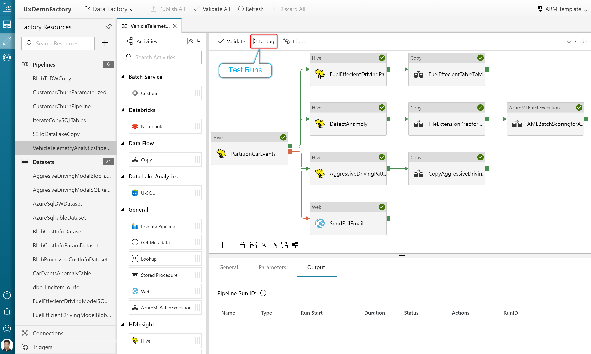
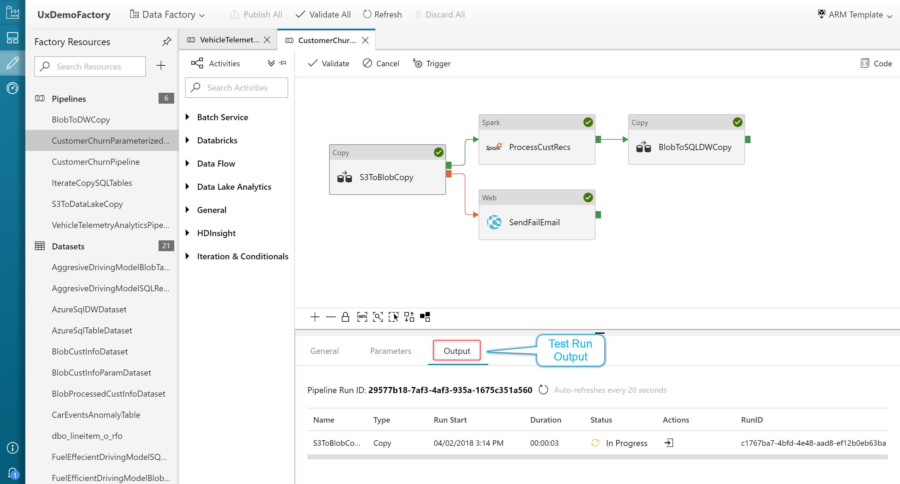
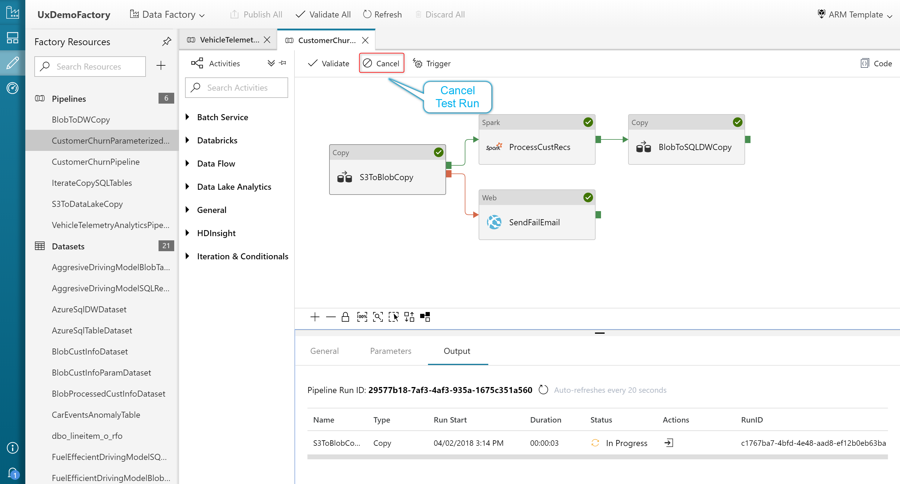
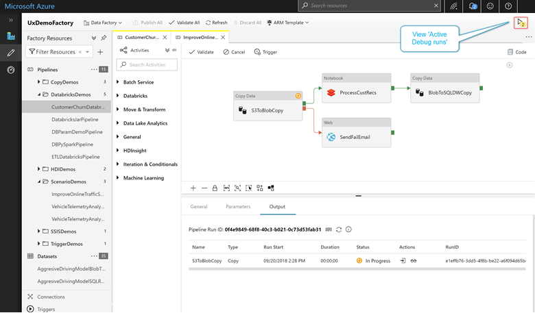
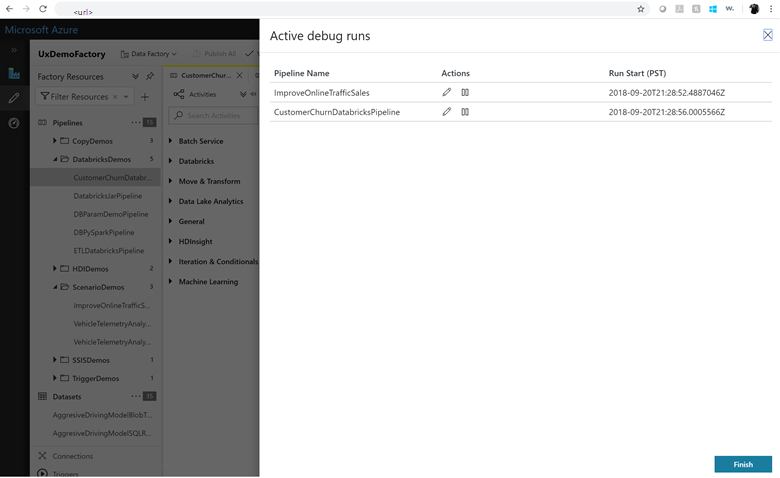
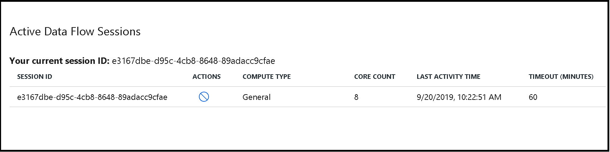
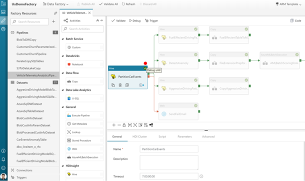
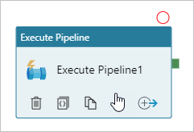
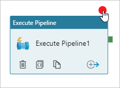

# Iterative development and debugging with Azure Data Factory
[!INCLUDE[appliesto-adf-asa-md](includes/appliesto-adf-asa-md.md)]

Azure Data Factory lets you iteratively develop and debug Data Factory pipelines.

For an eight-minute introduction and demonstration of this feature, watch the following video:

> [!VIDEO https://channel9.msdn.com/Shows/Azure-Friday/Iterative-development-and-debugging-with-Azure-Data-Factory/player]

## Iterative debugging features
Create pipelines and do test runs using the **Debug** capability in the pipeline canvas without writing a single line of code.

View the results of your test runs in the **Output** window of the pipeline canvas.

After a test run succeeds, add more activities to your pipeline and continue debugging in an iterative manner. You can also **Cancel** a test run while it is in progress.

When you do test runs, you don't have to publish your changes to the data factory before you select **Debug**. This feature is helpful in scenarios where you want to make sure that the changes work as expected before you update the data factory workflow.

> [!IMPORTANT]
> Selecting **Debug** actually runs the pipeline. So, for example, if the pipeline contains copy activity, the test run copies data from source to destination. As a result, we recommend that you use test folders in your copy activities and other activities when debugging. After you've debugged the pipeline, switch to the actual folders that you want to use in normal operations.

## Visualizing debug runs

You can visualize all the debug runs that are in progress for your data factory in one place. Select **View debug runs** in the upper right corner of the page. This feature is useful in scenarios where you have master pipelines kicking off debug runs for child pipelines, and you want a single view to see all the active debug runs.

If you have active Data Flow debug sessions, those sessions will appear on the bottom part of the active debug window. You can select an active data flow session and stop the respective cluster.

## Monitoring debug runs

The test runs initiated with the **Debug** capability are not available in the list on the **Monitor** tab. You can only see runs triggered with **Trigger Now**, **Schedule**, or **Tumbling Window** triggers in the **Monitor** tab. You can see the last test run initiated with the **Debug** capability in the **Output** window of the pipeline canvas.

## Setting breakpoints for debugging

Data Factory also lets you debug until you reach a particular activity on the pipeline canvas. Just put a breakpoint on the activity until which you want to test, and select **Debug**. Data Factory ensures that the test runs only until the breakpoint activity on the pipeline canvas. This *Debug Until* feature is useful when you don't want to test the entire pipeline, but only a subset of activities inside the pipeline.

To set a breakpoint, select an element on the pipeline canvas. A *Debug Until* option appears as an empty red circle at the upper right corner of the element.

After you select the *Debug Until* option, it changes to a filled red circle to indicate the breakpoint is enabled.

## Next steps
[Continuous integration and deployment in Azure Data Factory](continuous-integration-deployment.md)
