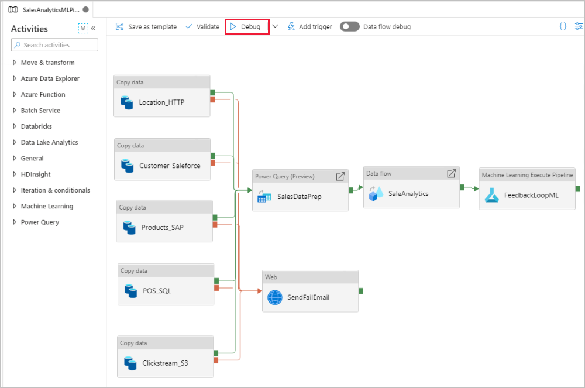
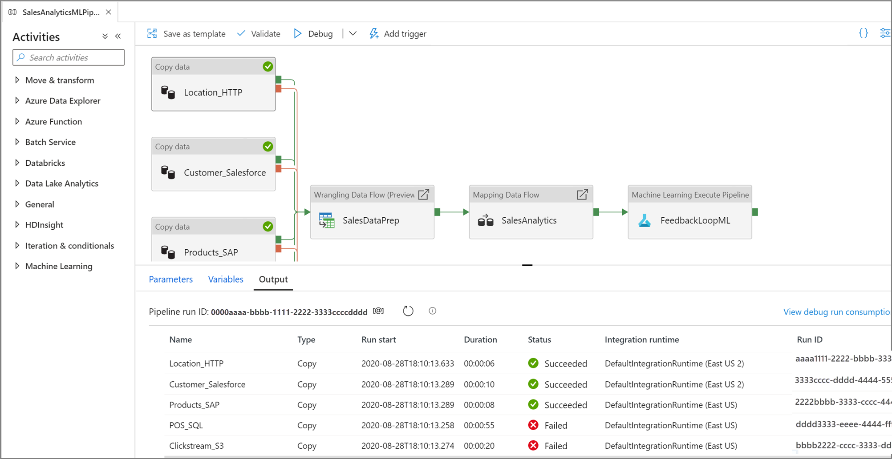
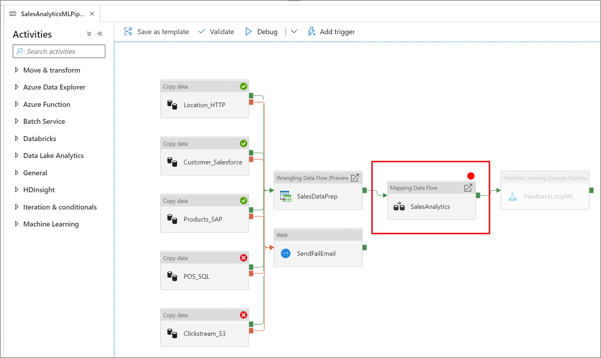
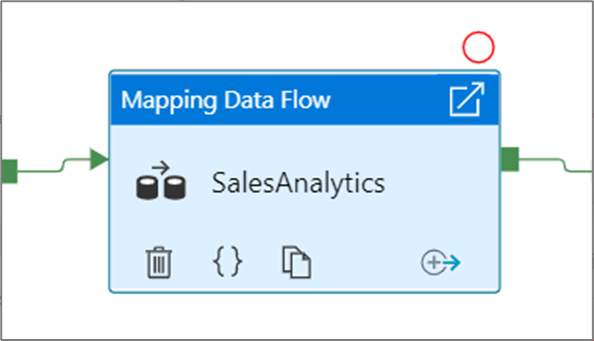
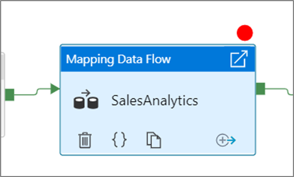
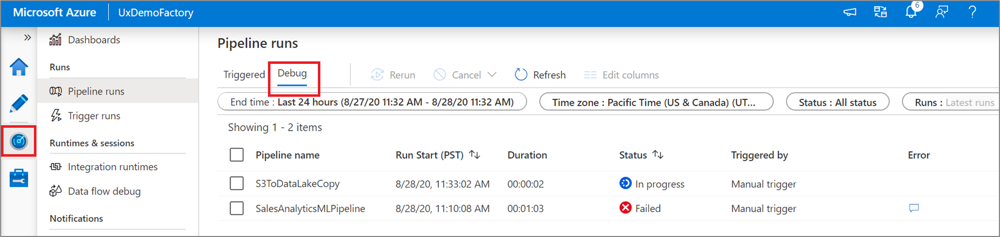
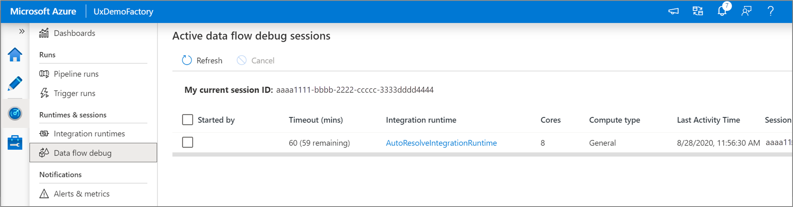
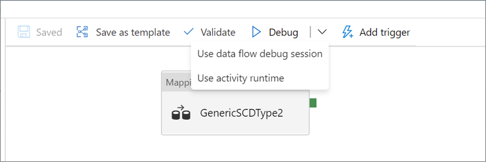

# Iterative development and debugging with Azure Data Factory
[!INCLUDE[appliesto-adf-asa-md](includes/appliesto-adf-asa-md.md)]

Azure Data Factory lets you iteratively develop and debug Data Factory pipelines as you are developing your data integration solutions. These features allow you to test your changes before creating a pull request or publishing them to the data factory service. 

For an eight-minute introduction and demonstration of this feature, watch the following video:

> [!VIDEO https://channel9.msdn.com/Shows/Azure-Friday/Iterative-development-and-debugging-with-Azure-Data-Factory/player]

## Debugging a pipeline

As you author using the pipeline canvas, you can test your activities using the **Debug** capability. When you do test runs, you don't have to publish your changes to the data factory before you select **Debug**. This feature is helpful in scenarios where you want to make sure that the changes work as expected before you update the data factory workflow.

As the pipeline is running, you can see the results of each activity in the **Output** tab of the pipeline canvas.

View the results of your test runs in the **Output** window of the pipeline canvas.

After a test run succeeds, add more activities to your pipeline and continue debugging in an iterative manner. You can also **Cancel** a test run while it is in progress.

> [!IMPORTANT]
> Selecting **Debug** actually runs the pipeline. For example, if the pipeline contains copy activity, the test run copies data from source to destination. As a result, we recommend that you use test folders in your copy activities and other activities when debugging. After you've debugged the pipeline, switch to the actual folders that you want to use in normal operations.

### Setting breakpoints

Azure Data Factory allows for you to debug a pipeline until you reach a particular activity on the pipeline canvas. Put a breakpoint on the activity until which you want to test, and select **Debug**. Data Factory ensures that the test runs only until the breakpoint activity on the pipeline canvas. This *Debug Until* feature is useful when you don't want to test the entire pipeline, but only a subset of activities inside the pipeline.

To set a breakpoint, select an element on the pipeline canvas. A *Debug Until* option appears as an empty red circle at the upper right corner of the element.

After you select the *Debug Until* option, it changes to a filled red circle to indicate the breakpoint is enabled.

## Monitoring debug runs

When you run a pipeline debug run, the results will appear in the **Output** window of the pipeline canvas. The output tab will only contain the most recent run that occurred during the current browser session. 

To view a historical view of debug runs or see a list of all active debug runs, you can go into the **Monitor** experience. 

> [!NOTE]
> The Azure Data Factory service only persists debug run history for 15 days. 

## Debugging mapping data flows

Mapping data flows allow you to build code-free data transformation logic that runs at scale. When building your logic, you can turn on a debug session to interactively work with your data using a live Spark cluster. To learn more, read about [mapping data flow debug mode](concepts-data-flow-debug-mode.md).

You can monitor active data flow debug sessions across a factory in the **Monitor** experience.

Data preview in the data flow designer and pipeline debugging of data flows are intended to work best with small samples of data. However, if you need to test your logic in a pipeline or data flow against large amounts of data, increase the size of the Azure Integration Runtime being used in the debug session with more cores and a minimum of general purpose compute.
 
### Debugging a pipeline with a data flow activity

When executing a debug pipeline run with a data flow, you have two options on which compute to use. You can either use an existing debug cluster or spin up a new just-in-time cluster for your data flows.

Using an existing debug session will greatly reduce the data flow start up time as the cluster is already running, but is not recommended for complex or parallel workloads as it may fail when multiple jobs are run at once.

Using the activity runtime will create a new cluster using the settings specified in each data flow activity's integration runtime. This allows each job to be isolated and should be used for complex workloads or performance testing. You can also control the TTL in the Azure IR so that the cluster resources used for debugging will still be available for that time period to serve additional job requests.

> [!NOTE]
> If you have a pipeline with data flows executing in parallel or data flows that need to be tested with large datasets, choose "Use Activity Runtime" so that Data Factory can use the Integration Runtime that you've selected in your data flow activity. This will allow the data flows to execute on multiple clusters and can accommodate your parallel data flow executions.

## Next steps

After testing your changes, promote them to higher environments using [continuous integration and deployment in Azure Data Factory](continuous-integration-deployment.md).
