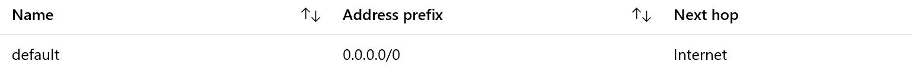
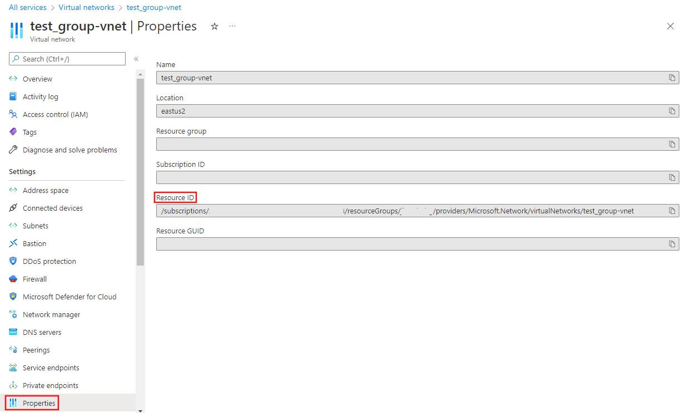
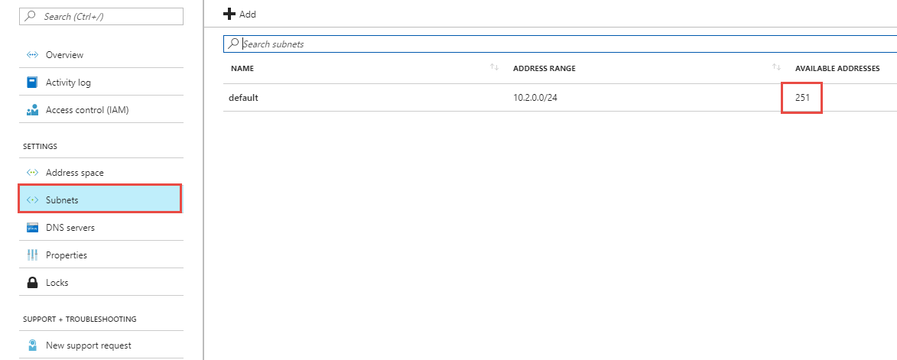
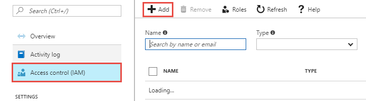
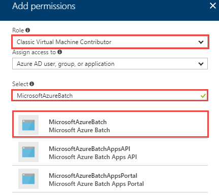
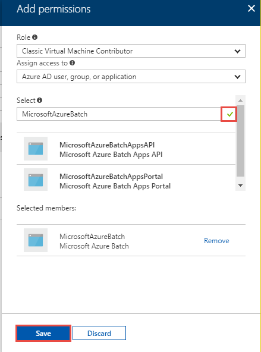
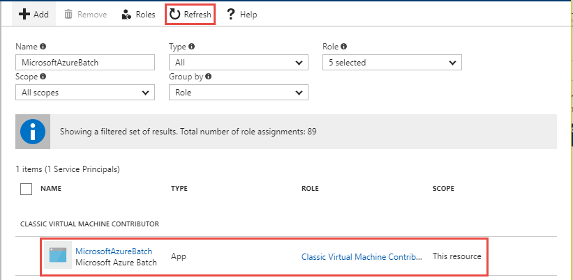
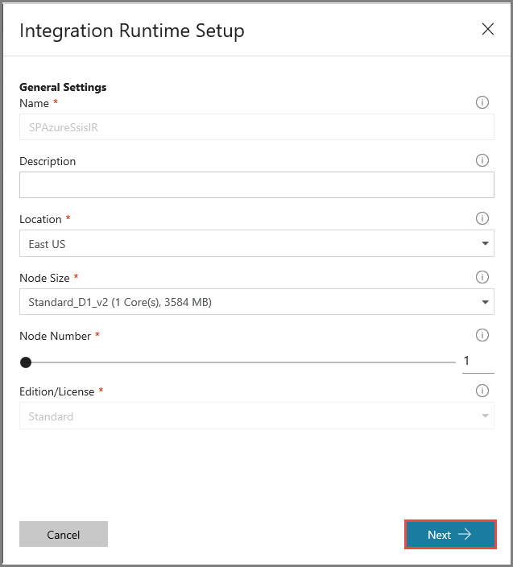
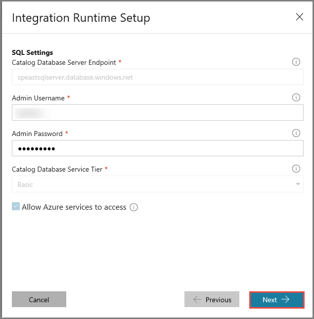
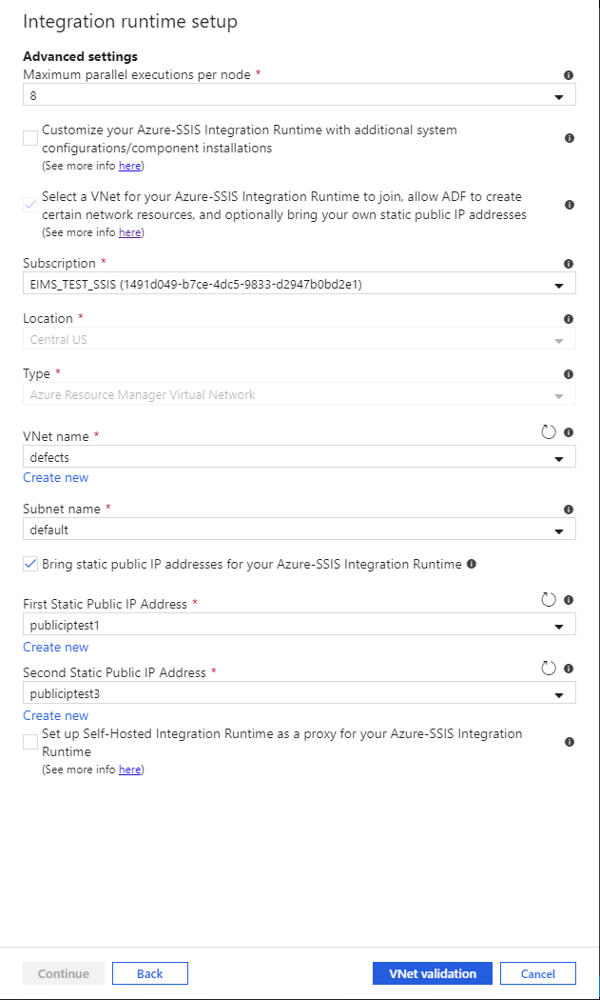

---
title: Join Azure-SSIS integration runtime to a virtual network | Microsoft Docs
description: Learn how to join the Azure-SSIS integration runtime to an Azure virtual network. 
services: data-factory
documentationcenter: ''
ms.service: data-factory
ms.workload: data-services
ms.tgt_pltfrm: na
ms.devlang: na
ms.topic: conceptual
ms.date: 10/10/2018
author: swinarko
ms.author: sawinark
ms.reviewer: douglasl
manager: craigg
---

# Join an Azure-SSIS integration runtime to a virtual network
Join your Azure-SSIS integration runtime (IR) to an Azure virtual network in the following scenarios: 

- You want to connect to on-premises data stores from SSIS packages running on an Azure-SSIS integration runtime. 

- You are hosting the SQL Server Integration Services (SSIS) catalog database in Azure SQL Database with virtual network service endpoints/Managed Instance. 

 Azure Data Factory lets you join your Azure-SSIS integration runtime to a virtual network created through the classic deployment model or the Azure Resource Manager deployment model. 

## Access to on-premises data stores
If SSIS packages access only public cloud data stores, you don't need to join the Azure-SSIS IR to a virtual network. If SSIS packages access on-premises data stores, you must join the Azure-SSIS IR to a virtual network that is connected to the on-premises network. 

Here are a few important points to note: 

- If there is no existing virtual network connected to your on-premises network, first create an [Azure Resource Manager virtual network](../virtual-network/quick-create-portal.md#create-a-virtual-network) or a [classic virtual network](../virtual-network/virtual-networks-create-vnet-classic-pportal.md) for your Azure-SSIS integration runtime to join. Then, configure a site-to-site [VPN gateway connection](../vpn-gateway/vpn-gateway-howto-site-to-site-classic-portal.md) or [ExpressRoute](../expressroute/expressroute-howto-linkvnet-classic.md) connection from that virtual network to your on-premises network. 

- If there is an existing Azure Resource Manager or classic virtual network connected to your on-premises network in the same location as your Azure-SSIS IR, you can join the IR to that virtual network. 

- If there is an existing classic virtual network connected to your on-premises network in a different location from your Azure-SSIS IR, you can first create a [classic virtual network](../virtual-network/virtual-networks-create-vnet-classic-pportal.md) for your Azure-SSIS IR to join. Then, configure a [classic-to-classic virtual network](../vpn-gateway/vpn-gateway-howto-vnet-vnet-portal-classic.md) connection. Or you can create an [Azure Resource Manager virtual network](../virtual-network/quick-create-portal.md#create-a-virtual-network) for your Azure-SSIS integration runtime to join. Then configure a [classic-to-Azure Resource Manager virtual network](../vpn-gateway/vpn-gateway-connect-different-deployment-models-portal.md) connection. 
 
- If there is an existing Azure Resource Manager virtual network connected to your on-premises network in a different location from your Azure-SSIS IR, you can first create an [Azure Resource Manager virtual network](../virtual-network/quick-create-portal.md##create-a-virtual-network) for your Azure-SSIS IR to join. Then, configure an Azure Resource Manager-to-Azure Resource Manager virtual network connection. Or, you can create a [classic virtual network](../virtual-network/virtual-networks-create-vnet-classic-pportal.md) for your Azure-SSIS IR to join. Then, configure a [classic-to-Azure Resource Manager virtual network](../vpn-gateway/vpn-gateway-connect-different-deployment-models-portal.md) connection. 

## Host the SSIS Catalog database in Azure SQL Database with virtual network service endpoints/Managed Instance
If the SSIS catalog is hosted in Azure SQL Database with virtual network service endpoints, or Managed Instance, you can join your Azure-SSIS IR to: 

- The same virtual network 
- A different virtual network that has a network-to-network connection with the one that is used for Azure SQL Database with virtual network service endpoints/Managed Instance 

If you join your Azure-SSIS IR to the same virtual network as the Managed Instance, make sure that the Azure-SSIS IR is in a different subnet than the  Managed Instance. If you join the Azure-SSIS IR to a different virtual network than the Managed Instance, we recommend either virtual network peering (which is limited to the same region) or a virtual network to virtual network connection. See [Connect your application to Azure SQL Database Managed Instance](../sql-database/sql-database-managed-instance-connect-app.md).

The virtual network can be deployed through the classic deployment model or the Azure Resource Manager deployment model.

The following sections provide more details. 

## Requirements for virtual network configuration
-   Make sure that `Microsoft.Batch` is a registered provider under the subscription of your virtual network subnet which hosts the Azure-SSIS IR. If you are using Classic virtual network, also join `MicrosoftAzureBatch` to the Classic Virtual Machine Contributor role for that virtual network. 

-   Make sure you have the required permissions. See [Required permissions](#perms).

-   Select the proper subnet to host the Azure-SSIS IR. See [Select the subnet](#subnet). 

-   If you are using your own Domain Name Services (DNS) server on the virtual network, see [Domain Name Services server](#dns_server). 

-   If you are using a Network Security Group (NSG) on the subnet, see [Network security group](#nsg) 

-   If you are using Azure Express Route or configuring User Defined Route (UDR), see [Use Azure ExpressRoute or User Defined Route](#route). 

-   Make sure the Resource Group of the virtual network can create and delete certain Azure Network resources. See [Requirements for Resource Group](#resource-group). 

### <a name="perms"></a> Required permissions

The user who creates the Azure-SSIS Integration Runtime must have the following permissions:

- If you're joining the SSIS IR to an Azure virtual network of the current version, you have two options:

  - Use the built-in role *Network Contributor*. This role requires the  *Microsoft.Network/\** permission, however, which has a much larger scope.

  - Create a custom role that includes the permission *Microsoft.Network/virtualNetworks/\*/join/action*. 

- If you're joining the SSIS IR to a classic Azure virtual network, we recommend that you use the built-in role *Classic Virtual Machine Contributor*. Otherwise you have to define a custom role that includes permission to join the virtual network.

### <a name="subnet"></a> Select the subnet
-   Do not select the GatewaySubnet for deploying an Azure-SSIS Integration Runtime, because it is dedicated for virtual network gateways. 

-   Ensure that the subnet you select has sufficient available address space for Azure-SSIS IR to use. Leave at least 2 * IR node number in available IP addresses. Azure reserves some IP addresses within each subnet, and these addresses can't be used. The first and last IP addresses of the subnets are reserved for protocol conformance, along with three more addresses used for Azure services. For more information, see [Are there any restrictions on using IP addresses within these subnets?](../virtual-network/virtual-networks-faq.md#are-there-any-restrictions-on-using-ip-addresses-within-these-subnets). 

-   Don’t use a subnet which is exclusively occupied by other Azure services (for example, SQL Database Managed Instance, App Service, etc.). 

### <a name="dns_server"></a> Domain Name Services server 
If you need to use your own Domain Name Services (DNS) server in a virtual network joined by your Azure-SSIS integration runtime, make sure it can resolve public Azure host names (for example, an Azure Storage blob name, `<your storage account>.blob.core.windows.net`). 

The following steps are recommended: 

-   Configure Custom DNS to forward requests to Azure DNS. You can forward unresolved DNS records to the IP address of Azure's recursive resolvers (168.63.129.16) on your own DNS server. 

-   Set up the Custom DNS as primary and Azure DNS as secondary for the virtual network. Register the IP address of Azure's recursive resolvers (168.63.129.16) as a secondary DNS server in case your own DNS server is unavailable. 

For more info, see [Name resolution that uses your own DNS server](../virtual-network/virtual-networks-name-resolution-for-vms-and-role-instances.md#name-resolution-that-uses-your-own-dns-server). 

### <a name="nsg"></a> Network security group
If you need to implement a network security group (NSG) for the subnet used by your Azure-SSIS integration runtime, allow inbound/outbound traffic through the following ports: 

| Direction | Transport protocol | Source | Source Port range | Destination | Destination Port range | Comments |
|---|---|---|---|---|---|---|
| Inbound | TCP | Internet | * | VirtualNetwork | 29876, 29877 (if you join the IR to an Azure Resource Manager virtual network) <br/><br/>10100, 20100, 30100 (if you join the IR to a classic virtual network)| The Data Factory service uses these ports to communicate with the nodes of your Azure-SSIS integration runtime in the virtual network. <br/><br/> Whether you create a subnet-level NSG or not, Data Factory always configures an NSG at the level of the network interface cards (NICs) attached to the virtual machines that host the Azure-SSIS IR. Only inbound traffic from Data Factory IP addresses on the specified ports is allowed by that NIC-level NSG. Even if you open these ports to Internet traffic at the subnet level, traffic from IP addresses that are not Data Factory IP addresses is blocked at the NIC level. |
| Outbound | TCP | VirtualNetwork | * | Internet | 443 | The nodes of your Azure-SSIS integration runtime in the virtual network use this port to access Azure services, such as Azure Storage and Azure Event Hubs. |
| Outbound | TCP | VirtualNetwork | * | Internet or Sql | 1433, 11000-11999, 14000-14999 | The nodes of your Azure-SSIS integration runtime in the virtual network use these ports to access SSISDB hosted by your Azure SQL Database server - This purpose is not applicable to SSISDB hosted by Managed Instance. |
||||||||

### <a name="route"></a> Use Azure ExpressRoute or User Defined Route
You can connect an [Azure ExpressRoute](https://azure.microsoft.com/services/expressroute/) circuit to your virtual network infrastructure to extend your on-premises network to Azure. 

A common configuration is to use forced tunneling (advertise a BGP route, 0.0.0.0/0 to the virtual network) which forces outbound Internet traffic from the virtual network flow to on-premises network appliance for inspection and logging. This traffic flow breaks connectivity between the Azure-SSIS IR in the virtual network with dependent Azure Data Factory services. The solution is to define one (or more) [user-defined routes (UDRs)](../virtual-network/virtual-networks-udr-overview.md) on the subnet that contains the Azure-SSIS IR. A UDR defines subnet-specific routes that are honored instead of the BGP route. 

Or you can define user-defined routes (UDRs) to force outbound Internet traffic from the subnet which hosts the Azure-SSIS IR to another subnet, which hosts a Virtual Network Appliance as a firewall or a DMZ host for inspection and logging. 

In both cases, apply a 0.0.0.0/0 route with the next hop type as **Internet** on the subnet which hosts the Azure-SSIS IR, so that communication between the Data Factory service and the Azure-SSIS IS IR can succeed. 



If you're concerned about losing the ability to inspect outbound Internet traffic from that subnet, you can also add an NSG rule on the subnet to restrict outbound destinations to [Azure data center IP addresses](https://www.microsoft.com/download/details.aspx?id=41653). 

See [this PowerShell script](https://gallery.technet.microsoft.com/scriptcenter/Adds-Azure-Datacenter-IP-dbeebe0c) for an example. You have to run the script weekly to keep the Azure data center IP address list up-to-date. 

### <a name="resource-group"></a> Requirements for Resource Group
-   The Azure-SSIS IR needs to create certain network resources under the same resource group as the virtual network. These resources include the following:
    -   An Azure load balancer, with the name *<Guid>-azurebatch-cloudserviceloadbalancer*.
    -   An Azure public IP address, with the name *<Guid>-azurebatch-cloudservicepublicip*.
    -   A network work security group, with the name *<Guid>-azurebatch-cloudservicenetworksecuritygroup*. 

-   Make sure that you don't have any resource lock on the Resource Group or Subscription to which the virtual network belongs. If you configure either a read-only lock or a delete lock, starting and stopping the IR may fail or hang. 

-   Make sure that you don't have an Azure policy which prevents the following resources from being created under the Resource Group or Subscription to which the virtual network belongs: 
    -   Microsoft.Network/LoadBalancers 
    -   Microsoft.Network/NetworkSecurityGroups 
    -   Microsoft.Network/PublicIPAddresses 

## Azure portal (Data Factory UI)
This section shows you how to join an existing Azure-SSIS runtime to a virtual network (classic or Azure Resource Manager) by using the Azure portal and Data Factory UI. First, you need to configure the virtual network appropriately before joining your Azure-SSIS IR to it. Go through one of the next two sections based on the type of your virtual network (classic or Azure Resource Manager). Then, continue with the third section to join your Azure-SSIS IR to the virtual network. 

### Use the portal to configure an Azure Resource Manager virtual network
You need to configure a virtual network before you can join an Azure-SSIS IR to it. 

1. Start Microsoft Edge or Google Chrome. Currently, the Data Factory UI is supported only in those web browsers. 

1. Sign in to the [Azure portal](https://portal.azure.com). 

1. Select **More services**. Filter for and select **Virtual networks**. 

1. Filter for and select your virtual network in the list. 

1. On the **Virtual network** page, select **Properties**. 

1. Select the copy button for **RESOURCE ID** to copy the resource ID for the virtual network to the clipboard. Save the ID from the clipboard in OneNote or a file. 

1. Select **Subnets** on the left menu. Ensure that the number of **available addresses** is greater than the nodes in your Azure-SSIS integration runtime. 

1. Verify that the Azure Batch provider is registered in the Azure subscription that has the virtual network. Or, register the Azure Batch provider. If you already have an Azure Batch account in your subscription, then your subscription is registered for Azure Batch. (If you create the Azure-SSIS IR in the Data Factory portal, the Azure Batch provider is automatically registered for you.) 

   a. In Azure portal, select **Subscriptions** on the left menu. 

   b. Select your subscription. 

   c. Select **Resource providers** on the left, and confirm that **Microsoft.Batch** is a registered provider. 

   

   If you don't see **Microsoft.Batch** in the list, to register it, [create an empty Azure Batch account](../batch/batch-account-create-portal.md) in your subscription. You can delete it later. 

### Use the portal to configure a classic virtual network
You need to configure a virtual network before you can join an Azure-SSIS IR to it. 

1. Start Microsoft Edge or Google Chrome. Currently, the Data Factory UI is supported only in these web browsers. 

1. Sign in to the [Azure portal](https://portal.azure.com). 

1. Select **More services**. Filter for and select **Virtual networks (classic)**. 

1. Filter for and select your virtual network in the list. 

1. On the **Virtual network (classic)** page, select **Properties**. 

   

1. Select the copy button for **RESOURCE ID** to copy the resource ID for the classic network to the clipboard. Save the ID from the clipboard in OneNote or a file. 

1. Select **Subnets** on the left menu. Ensure that the number of **available addresses** is greater than the nodes in your Azure-SSIS integration runtime. 

   

1. Join **MicrosoftAzureBatch** to the **Classic Virtual Machine Contributor** role for the virtual network. 

	a. Select **Access control (IAM)** on the left menu, and select **Add** on the toolbar. 

	

	b. On the **Add permissions** page, select **Classic Virtual Machine Contributor** for **Role**. Paste **ddbf3205-c6bd-46ae-8127-60eb93363864** in the **Select** box, and then select **Microsoft Azure Batch** from the list of search results. 

	

	c. Select **Save** to save the settings and to close the page. 

	

	d. Confirm that you see **Microsoft Azure Batch** in the list of contributors. 

	

1. Verify that the Azure Batch provider is registered in the Azure subscription that has the virtual network. Or, register the Azure Batch provider. If you already have an Azure Batch account in your subscription, then your subscription is registered for Azure Batch. (If you create the Azure-SSIS IR in the Data Factory portal, the Azure Batch provider is automatically registered for you.) 

   a. In Azure portal, select **Subscriptions** on the left menu. 

   b. Select your subscription. 

   c. Select **Resource providers** on the left, and confirm that **Microsoft.Batch** is a registered provider. 

   

   If you don't see **Microsoft.Batch** in the list, to register it, [create an empty Azure Batch account](../batch/batch-account-create-portal.md) in your subscription. You can delete it later. 

### Join the Azure-SSIS IR to a virtual network
1. Start Microsoft Edge or Google Chrome. Currently, the Data Factory UI is supported only in those web browsers. 

1. In the [Azure portal](https://portal.azure.com), select **Data factories** on the left menu. If you don't see **Data factories** on the menu, select **More services**, and the select **Data factories** in the **INTELLIGENCE + ANALYTICS** section. 

   

1. Select your data factory with the Azure-SSIS integration runtime in the list. You see the home page for your data factory. Select the **Author & Deploy** tile. You see the Data Factory UI on a separate tab. 

   

1. In the Data Factory UI, switch to the **Edit** tab, select **Connections**, and switch to the **Integration Runtimes** tab. 

   

1. If your Azure-SSIS IR is running, in the integration runtime list, select the **Stop** button in the **Actions** column for your Azure-SSIS IR. You cannot edit an IR until you stop it. 

   

1. In the integration runtime list, select the **Edit** button in the **Actions** column for your Azure-SSIS IR. 

   

1. On the **General Settings** page of the **Integration Runtime Setup** window, select **Next**. 

   

1. On the **SQL Settings** page, enter the administrator password, and select **Next**. 

   

1. On the **Advanced Settings** page, do the following actions: 

   a. Select the check box for **Select a VNet for your Azure-SSIS Integration Runtime to join and allow Azure services to configure VNet permissions/settings**. 

   b. For **Type**, select whether the virtual network is a classic virtual network or an Azure Resource Manager virtual network. 

   c. For **VNet Name**, select your virtual network. 

   d. For **Subnet Name**, select your subnet in the virtual network. 

   e. Click **VNet Validation** and if successful, click **Update**. 

   

1. Now, you can start the IR by using the **Start** button in the **Actions** column for your Azure-SSIS IR. It takes approximately 20 to 30 minutes to start an Azure-SSIS IR. 

## Azure PowerShell

### Configure a virtual network
You need to configure a virtual network before you can join your Azure-SSIS IR to it. To automatically configure virtual network permissions/settings for your Azure-SSIS integration runtime to join the virtual network, add the following script:

```powershell
# Make sure to run this script against the subscription to which the virtual network belongs.
if(![string]::IsNullOrEmpty($VnetId) -and ![string]::IsNullOrEmpty($SubnetName))
{
    # Register to the Azure Batch resource provider
    $BatchApplicationId = "ddbf3205-c6bd-46ae-8127-60eb93363864"
    $BatchObjectId = (Get-AzureRmADServicePrincipal -ServicePrincipalName $BatchApplicationId).Id
    Register-AzureRmResourceProvider -ProviderNamespace Microsoft.Batch
    while(!(Get-AzureRmResourceProvider -ProviderNamespace "Microsoft.Batch").RegistrationState.Contains("Registered"))
    {
    Start-Sleep -s 10
    }
    if($VnetId -match "/providers/Microsoft.ClassicNetwork/")
    {
        # Assign the VM contributor role to Microsoft.Batch
        New-AzureRmRoleAssignment -ObjectId $BatchObjectId -RoleDefinitionName "Classic Virtual Machine Contributor" -Scope $VnetId
    }
}
```

### Create an Azure-SSIS IR and join it to a virtual network
You can create an Azure-SSIS IR and join it to a virtual network at the same time. For the complete script and instructions, see [Create an Azure-SSIS integration runtime](create-azure-ssis-integration-runtime.md#azure-powershell).

### Join an existing Azure-SSIS IR to a virtual network
The script in the [Create an Azure-SSIS integration runtime](create-azure-ssis-integration-runtime.md) article shows you how to create an Azure-SSIS IR and join it to a virtual network in the same script. If you have an existing Azure-SSIS IR, perform the following steps to join it to the virtual network: 
1. Stop the Azure-SSIS IR. 
1. Configure the Azure-SSIS IR to join the virtual network. 
1. Start the Azure-SSIS IR. 

### Define the variables
```powershell
$ResourceGroupName = "<your Azure resource group name>"
$DataFactoryName = "<your Data Factory name>" 
$AzureSSISName = "<your Azure-SSIS IR name>"
# Specify the information about your classic or Azure Resource Manager virtual network.
$VnetId = "<your Azure virtual network resource ID>"
$SubnetName = "<the name of subnet in your virtual network>"
```

### Stop the Azure-SSIS IR
Stop the Azure-SSIS integration runtime before you can join it to a virtual network. This command releases all of its nodes and stops billing:

```powershell
Stop-AzureRmDataFactoryV2IntegrationRuntime -ResourceGroupName $ResourceGroupName `
                                            -DataFactoryName $DataFactoryName `
                                            -Name $AzureSSISName `
                                            -Force 
```

### Configure virtual network settings for the Azure-SSIS IR to join
```powershell
# Make sure to run this script against the subscription to which the virtual network belongs.
if(![string]::IsNullOrEmpty($VnetId) -and ![string]::IsNullOrEmpty($SubnetName))
{
    # Register to the Azure Batch resource provider
    $BatchApplicationId = "ddbf3205-c6bd-46ae-8127-60eb93363864"
    $BatchObjectId = (Get-AzureRmADServicePrincipal -ServicePrincipalName $BatchApplicationId).Id
    Register-AzureRmResourceProvider -ProviderNamespace Microsoft.Batch
    while(!(Get-AzureRmResourceProvider -ProviderNamespace "Microsoft.Batch").RegistrationState.Contains("Registered"))
    {
        Start-Sleep -s 10
    }
    if($VnetId -match "/providers/Microsoft.ClassicNetwork/")
    {
        # Assign VM contributor role to Microsoft.Batch
        New-AzureRmRoleAssignment -ObjectId $BatchObjectId -RoleDefinitionName "Classic Virtual Machine Contributor" -Scope $VnetId
    }
}
```

### Configure the Azure-SSIS IR
To configure the Azure-SSIS integration runtime to join the virtual network, run the `Set-AzureRmDataFactoryV2IntegrationRuntime` command: 

```powershell
Set-AzureRmDataFactoryV2IntegrationRuntime -ResourceGroupName $ResourceGroupName `
                                           -DataFactoryName $DataFactoryName `
                                           -Name $AzureSSISName `
                                           -Type Managed `
                                           -VnetId $VnetId `
                                           -Subnet $SubnetName
```

### Start the Azure-SSIS IR
To start the Azure-SSIS integration runtime, run the following command: 

```powershell
Start-AzureRmDataFactoryV2IntegrationRuntime -ResourceGroupName $ResourceGroupName `
                                             -DataFactoryName $DataFactoryName `
                                             -Name $AzureSSISName `
                                             -Force

```

This command takes 20 to 30 minutes to finish.

## Next steps
For more information about the Azure-SSIS runtime, see the following topics: 
- [Azure-SSIS integration runtime](concepts-integration-runtime.md#azure-ssis-integration-runtime). This article provides conceptual information about integration runtimes in general, including the Azure-SSIS IR. 
- [Tutorial: deploy SSIS packages to Azure](tutorial-create-azure-ssis-runtime-portal.md). This article provides step-by-step instructions to create an Azure-SSIS IR. It uses Azure SQL Database to host the SSIS catalog. 
- [Create an Azure-SSIS integration runtime](create-azure-ssis-integration-runtime.md). This article expands on the tutorial and provides instructions on using Azure SQL Database with virtual network service endpoints/Managed Instance to host the SSIS catalog and joining the IR to a virtual network. 
- [Monitor an Azure-SSIS IR](monitor-integration-runtime.md#azure-ssis-integration-runtime). This article shows you how to retrieve information about an Azure-SSIS IR and descriptions of statuses in the returned information. 
- [Manage an Azure-SSIS IR](manage-azure-ssis-integration-runtime.md). This article shows you how to stop, start, or remove an Azure-SSIS IR. It also shows you how to scale out your Azure-SSIS IR by adding nodes. 
