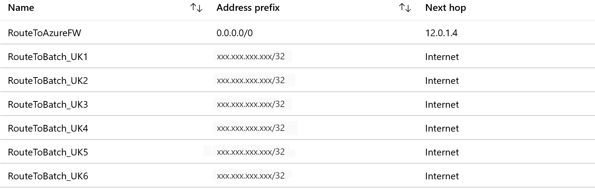

# Join an Azure-SSIS integration runtime to a virtual network
When using SQL Server Integration Services (SSIS) in Azure Data Factory, you should join your Azure-SSIS integration runtime (IR) to an Azure virtual network in the following scenarios: 

- You want to connect to on-premises data stores from SSIS packages that run on your Azure-SSIS IR without configuring or managing a self-hosted IR as a proxy. 

- You want to connect to Azure service resources supported with virtual network service endpoints from SSIS packages that run on your Azure-SSIS IR.

- You're hosting an SSIS catalog database (SSISDB) in Azure SQL Database with virtual network service endpoints or managed instance in a virtual network. 

Data Factory lets you join your Azure-SSIS IR to a virtual network created through the classic deployment model or the Azure Resource Manager deployment model. 

> [!IMPORTANT]
> The classic virtual network is being deprecated, so use the Azure Resource Manager virtual network instead.  If you already use the classic virtual network, switch to the Azure Resource Manager virtual network as soon as possible.

## Access to on-premises data stores
If your SSIS packages access on-premises data stores, you can join your Azure-SSIS IR to a virtual network that is connected to the on-premises network. Or you can configure or manage a self-hosted IR as a proxy for your Azure-SSIS IR. For more information, see [Configure a self-hosted IR as a proxy for an Azure-SSIS IR](https://docs.microsoft.com/azure/data-factory/self-hosted-integration-runtime-proxy-ssis). 

When joining your Azure-SSIS IR to a virtual network, remember these important points: 

- If no virtual network is connected to your on-premises network, first create an [Azure Resource Manager virtual network](../virtual-network/quick-create-portal.md#create-a-virtual-network) for your Azure-SSIS IR to join. Then configure a site-to-site [VPN gateway connection](../vpn-gateway/vpn-gateway-howto-site-to-site-classic-portal.md) or [ExpressRoute](../expressroute/expressroute-howto-linkvnet-classic.md) connection from that virtual network to your on-premises network. 

- If an Azure Resource Manager virtual network is already connected to your on-premises network in the same location as your Azure-SSIS IR, you can join the IR to that virtual network. 

- If a classic virtual network is already connected to your on-premises network in a different location from your Azure-SSIS IR, you can create an [Azure Resource Manager virtual network](../virtual-network/quick-create-portal.md#create-a-virtual-network) for your Azure-SSIS IR to join. Then configure a [classic-to-Azure Resource Manager virtual network](../vpn-gateway/vpn-gateway-connect-different-deployment-models-portal.md) connection. 
 
- If an Azure Resource Manager virtual network is already connected to your on-premises network in a different location from your Azure-SSIS IR, you can first create an [Azure Resource Manager virtual network](../virtual-network/quick-create-portal.md##create-a-virtual-network) for your Azure-SSIS IR to join. Then configure an Azure Resource Manager-to-Azure Resource Manager virtual network connection. 

## Access to Azure services
If your SSIS packages access Azure service resources supported with [virtual network service endpoints](../virtual-network/virtual-network-service-endpoints-overview.md) and you want to secure those resources to Azure-SSIS IR, you can join your Azure-SSIS IR to the virtual network subnet configured with virtual network service endpoints. Meanwhile, add a virtual network rule to the Azure service resources to allow access from same subnet.

## Hosting the SSIS catalog in SQL Database
If you host your SSIS catalog in Azure SQL Database with virtual network service endpoints, make sure that you join your Azure-SSIS IR to the same virtual network and subnet.

To join your Azure-SSIS IR to the same virtual network as the managed instance, make sure that the Azure-SSIS IR is in a different subnet than the managed instance. To join your Azure-SSIS IR to a different virtual network than the managed instance, we recommend either virtual network peering (which is limited to the same region) or a connection from virtual network to virtual network. For more information, see [Connect your application to Azure SQL Database managed instance](../sql-database/sql-database-managed-instance-connect-app.md).

In all cases, the virtual network can be deployed only through the Azure Resource Manager deployment model.

The following sections provide more details. 

## Virtual network configuration

Set up your virtual network to meet these requirements: 

-   Make sure that `Microsoft.Batch` is a registered provider under the subscription of your virtual network subnet that hosts the Azure-SSIS IR. If you use a classic virtual network, also join `MicrosoftAzureBatch` to the Classic Virtual Machine Contributor role for that virtual network. 

-   Make sure you have the required permissions. For more information, see [Set up permissions](#perms).

-   Select the proper subnet to host the Azure-SSIS IR. For more information, see [Select the subnet](#subnet). 

-   If you use your own Domain Name System (DNS) server on the virtual network, see [Set up the DNS server](#dns_server). 

-   If you use a network security group (NSG) on the subnet, see [Set up an NSG](#nsg). 

-   If you use Azure ExpressRoute or a user-defined route (UDR), see [Use Azure ExpressRoute or a UDR](#route). 

-   Make sure the virtual network's resource group can create and delete certain Azure network resources. For more information, see [Set up the resource group](#resource-group). 

-   If you customize your Azure-SSIS IR as described in [Custom setup for Azure-SSIS IR](https://docs.microsoft.com/azure/data-factory/how-to-configure-azure-ssis-ir-custom-setup), your Azure-SSIS IR nodes will get private IP addresses from a predefined range of 172.16.0.0 to 172.31.255.255. So make sure that the private IP address ranges of your virtual or on-premises networks don't collide with this range.

This diagram shows the required connections for your Azure-SSIS IR:


### <a name="perms"></a> Set up permissions

The user who creates the Azure-SSIS IR must have the following permissions:

- If you're joining your SSIS IR to an Azure Resource Manager virtual network, you have two options:

  - Use the built-in Network Contributor role. This role comes with the _Microsoft.Network/\*_ permission, which has a much larger scope than necessary.

  - Create a custom role that includes only the necessary _Microsoft.Network/virtualNetworks/\*/join/action_ permission. 

- If you're joining your SSIS IR to a classic virtual network, we recommend that you use the built-in Classic Virtual Machine Contributor role. Otherwise you have to define a custom role that includes the permission to join the virtual network.

### <a name="subnet"></a> Select the subnet

As you choose a subnet: 

-   Don't select the GatewaySubnet to deploy an Azure-SSIS IR. It's dedicated for virtual network gateways. 

-   Ensure that the subnet you select has enough available address space for the Azure-SSIS IR to use. Leave available IP addresses for at least two times the IR node number. Azure reserves some IP addresses within each subnet. These addresses can't be used. The first and last IP addresses of the subnets are reserved for protocol conformance, and three more addresses are used for Azure services. For more information, see [Are there any restrictions on using IP addresses within these subnets?](../virtual-network/virtual-networks-faq.md#are-there-any-restrictions-on-using-ip-addresses-within-these-subnets) 

-   Don’t use a subnet that is exclusively occupied by other Azure services (for example, SQL Database managed instance, App Service, and so on). 

### <a name="dns_server"></a> Set up the DNS server 
If you need to use your own DNS server in a virtual network joined by your Azure-SSIS IR, make sure it can resolve global Azure host names (for example, an Azure Storage blob named `<your storage account>.blob.core.windows.net`). 

The following steps are recommended: 

-   Configure the custom DNS to forward requests to Azure DNS. You can forward unresolved DNS records to the IP address of the Azure recursive resolvers (168.63.129.16) on your own DNS server. 

-   Set up the custom DNS as the primary DNS server for the virtual network. Set up Azure DNS as the secondary DNS server. Register the IP address of the Azure recursive resolvers (168.63.129.16) as a secondary DNS server in case your own DNS server is unavailable. 

For more information, see [Name resolution that uses your own DNS server](../virtual-network/virtual-networks-name-resolution-for-vms-and-role-instances.md#name-resolution-that-uses-your-own-dns-server). 

### <a name="nsg"></a> Set up an NSG
If you need to implement an NSG for the subnet used by your Azure-SSIS IR, allow inbound and outbound traffic through the following ports: 

| Direction | Transport protocol | Source | Source port range | Destination | Destination port range | Comments |
|---|---|---|---|---|---|---|
| Inbound | TCP | BatchNodeManagement | * | VirtualNetwork | 29876, 29877 (if you join the IR to a Resource Manager virtual network) <br/><br/>10100, 20100, 30100 (if you join the IR to a classic virtual network)| The Data Factory service uses these ports to communicate with the nodes of your Azure-SSIS IR in the virtual network. <br/><br/> Whether or not you create a subnet-level NSG, Data Factory always configures an NSG at the level of the network interface cards (NICs) attached to the virtual machines that host the Azure-SSIS IR. Only inbound traffic from Data Factory IP addresses on the specified ports is allowed by that NIC-level NSG. Even if you open these ports to internet traffic at the subnet level, traffic from IP addresses that aren't Data Factory IP addresses is blocked at the NIC level. |
| Outbound | TCP | VirtualNetwork | * | AzureCloud | 443 | The nodes of your Azure-SSIS IR in the virtual network use this port to access Azure services, such as Azure Storage and Azure Event Hubs. |
| Outbound | TCP | VirtualNetwork | * | Internet | 80 | The nodes of your Azure-SSIS IR in the virtual network use this port to download a certificate revocation list from the internet. |
| Outbound | TCP | VirtualNetwork | * | Sql | 1433, 11000-11999 | The nodes of your Azure-SSIS IR in the virtual network use these ports to access an SSISDB hosted by your SQL Database server. If your SQL Database server connection policy is set to **Proxy** instead of **Redirect**, only port 1433 is needed. This outbound security rule isn't applicable to an SSISDB hosted by your managed instance in the virtual network. |
||||||||

### <a name="route"></a> Use Azure ExpressRoute or a UDR
When you connect an [Azure ExpressRoute](https://azure.microsoft.com/services/expressroute/) circuit to your virtual network infrastructure to extend your on-premises network to Azure, a common configuration uses forced tunneling (advertising a BGP route, 0.0.0.0/0, to the virtual network). This tunneling forces outbound internet traffic from the virtual network flow to an on-premises network appliance for inspection and logging. 
 
Or you might define [UDRs](../virtual-network/virtual-networks-udr-overview.md) to force outbound internet traffic from the subnet that hosts the Azure-SSIS IR to another subnet that hosts a network virtual appliance (NVA) as a firewall or Azure Firewall for inspection and logging. 

In both cases, the traffic route will break required inbound connectivity from dependent Azure Data Factory services (specifically, Azure Batch management services) to the Azure-SSIS IR in the virtual network. To avoid this, define one or more UDRs on the subnet that contains the Azure-SSIS IR. 

You can apply a 0.0.0.0/0 route with the next hop type as **Internet** on the subnet that hosts the Azure-SSIS IR in an Azure ExpressRoute scenario. Or you can modify the existing 0.0.0.0/0 route from the next hop type as **Virtual appliance** to **Internet** in an NVA scenario.


If you're concerned about losing the ability to inspect outbound internet traffic from that subnet, you can define specific UDRs to route traffic only between Azure Batch management services and the Azure-SSIS IR with a next hop type as **Internet**.

For example, if your Azure-SSIS IR is located at `UK South`, you would get an IP range list of service tag `BatchNodeManagement.UKSouth` from the [service tags IP range download link](https://www.microsoft.com/en-us/download/details.aspx?id=56519) or through the [Service Tag Discovery API](https://aka.ms/discoveryapi). Then apply the following UDRs of related IP range routes with the next hop type as **Internet**.



> [!NOTE]
> This approach incurs an additional maintenance cost. Regularly check the IP range and add new IP ranges into your UDR to avoid breaking the Azure-SSIS IR. We recommend checking the IP range monthly because when the new IP appears in the service tag, the IP  will take another month go into effect. 

### <a name="resource-group"></a> Set up the resource group
The Azure-SSIS IR needs to create certain network resources under the same resource group as the virtual network. These resources include:
   -   An Azure load balancer, with the name *\<Guid>-azurebatch-cloudserviceloadbalancer*.
   -   An Azure public IP address, with the name *\<Guid>-azurebatch-cloudservicepublicip*.
   -   A network work security group, with the name *\<Guid>-azurebatch-cloudservicenetworksecuritygroup*. 

Those resources will be created when the IR starts. They'll be deleted when the IR stops. To avoid blocking the IR stop, don't reuse these network resources in your other resources. 

Make sure that you have no resource lock on the resource group or subscription to which the virtual network belongs. If you configure a read-only lock or a delete lock, starting and stopping the IR might fail, or the IR might stop responding. 

Make sure that you don't have an Azure policy that prevents the following resources from being created under the resource group or subscription to which the virtual network belongs: 
   -   Microsoft.Network/LoadBalancers 
   -   Microsoft.Network/NetworkSecurityGroups 
   -   Microsoft.Network/PublicIPAddresses 

### <a name="faq"></a> FAQ

- How can I protect the public IP address exposed on the Azure-SSIS IR for inbound connection? Is it possible to remove the public IP address?
 
    Right now, a public IP address will be automatically created when the Azure-SSIS IR joins the virtual network. We do have a NIC-level NSG to allow only Azure Batch management services to inbound-connect to the Azure-SSIS IR. You can also specify a subnet-level NSG for inbound protection.

    If you don't want the public IP address to be exposed, consider [configuring the self-hosted IR as a proxy for the Azure-SSIS IR](https://docs.microsoft.com/azure/data-factory/self-hosted-integration-runtime-proxy-ssis) instead of the virtual network, if this applies to your scenario.
 
- Can I add the static IP address of the Azure-SSIS IR to the firewall's allow list for the data source?
 
    - If your data source is on-premises, after you connect the virtual network to your on-premises network and join your Azure-SSIS IR into the virtual network subnet, you can add the IP range of that subnet to the allow list.
    - If your data source is an Azure service supported with a virtual network service endpoint, you can configure a virtual network service point on your virtual network and join your Azure-SSIS IR into that virtual network subnet. Then you can allow access by using the virtual network rule of the Azure services instead of the IP range.
    - If your data source is a different kind of cloud data source, you can use UDR to route outbound traffic from the Azure-SSIS IR to the NVA or to Azure Firewall by using a static public IP address. You can add the public IP address of the NVA or Azure Firewall to the allow list.
    - If the previous answers don't meet your needs, consider providing data source access by [configuring a self-hosted IR as a proxy for the Azure-SSIS IR](https://docs.microsoft.com/azure/data-factory/self-hosted-integration-runtime-proxy-ssis). Then you can add the IP address of the machine that hosts the self-hosted IR to the allow list instead of joining the Azure-SSIS IR into the virtual network.

## Azure portal (Data Factory UI)
This section shows you how to join an existing Azure-SSIS IR to a virtual network (classic or Azure Resource Manager) by using the Azure portal and Data Factory UI. 

Before joining your Azure-SSIS IR to the virtual network, you need to properly configure the virtual network. Follow the steps in the section that applies to your type of virtual network (classic or Azure Resource Manager). Then follow the steps in the third section to join your Azure-SSIS IR to the virtual network. 

### Configure an Azure Resource Manager virtual network

Use the portal to configure an Azure Resource Manager virtual network before you try to join an Azure-SSIS IR to it.

1. Start Microsoft Edge or Google Chrome. Currently, only these web browsers support the Data Factory UI. 

1. Sign in to the [Azure portal](https://portal.azure.com). 

1. Select **More services**. Filter for and select **Virtual networks**. 

1. Filter for and select your virtual network in the list. 

1. On the **Virtual network** page, select **Properties**. 

1. Select the copy button for **RESOURCE ID** to copy the resource ID for the virtual network to the clipboard. Save the ID from the clipboard in OneNote or a file. 

1. On the left menu, select **Subnets**. Ensure that the number of available addresses is greater than the nodes in your Azure-SSIS IR. 

1. Verify that the Azure Batch provider is registered in the Azure subscription that has the virtual network. Or register the Azure Batch provider. If you already have an Azure Batch account in your subscription, your subscription is registered for Azure Batch. (If you create the Azure-SSIS IR in the Data Factory portal, the Azure Batch provider is automatically registered for you.) 

   a. In the Azure portal, on the left menu, select **Subscriptions**. 

   b. Select your subscription. 

   c. On the left, select **Resource providers**, and confirm that **Microsoft.Batch** is a registered provider. 

   

   If you don't see **Microsoft.Batch** in the list, to register it, [create an empty Azure Batch account](../batch/batch-account-create-portal.md) in your subscription. You can delete it later. 

### Configure a classic virtual network
Use the portal to configure a classic virtual network before you try to join an Azure-SSIS IR to it. 

1. Start Microsoft Edge or Google Chrome. Currently, only these web browsers support the Data Factory UI. 

1. Sign in to the [Azure portal](https://portal.azure.com). 

1. Select **More services**. Filter for and select **Virtual networks (classic)**. 

1. Filter for and select your virtual network in the list. 

1. On the **Virtual network (classic)** page, select **Properties**. 

   

1. Select the copy button for **RESOURCE ID** to copy the resource ID for the classic network to the clipboard. Save the ID from the clipboard in OneNote or a file. 

1. On the left menu, select **Subnets**. Ensure that the number of available addresses is greater than the nodes in your Azure-SSIS IR. 

   

1. Join **MicrosoftAzureBatch** to the **Classic Virtual Machine Contributor** role for the virtual network. 

	a. On the left menu, select **Access control (IAM)**, and select the **Role assignments** tab. 

	

    b. Select **Add role assignment**.

	c. On the **Add role assignment** page, for **Role**, select **Classic Virtual Machine Contributor**. In the **Select** box, paste **ddbf3205-c6bd-46ae-8127-60eb93363864**, and then select **Microsoft Azure Batch** from the list of search results. 

	

	d. Select **Save** to save the settings and close the page. 

	

	e. Confirm that you see **Microsoft Azure Batch** in the list of contributors. 

	

1. Verify that the Azure Batch provider is registered in the Azure subscription that has the virtual network. Or register the Azure Batch provider. If you already have an Azure Batch account in your subscription, your subscription is registered for Azure Batch. (If you create the Azure-SSIS IR in the Data Factory portal, the Azure Batch provider is automatically registered for you.) 

   a. In the Azure portal, on the left menu, select **Subscriptions**. 

   b. Select your subscription. 

   c. On the left, select **Resource providers**, and confirm that **Microsoft.Batch** is a registered provider. 

   

   If you don't see **Microsoft.Batch** in the list, to register it, [create an empty Azure Batch account](../batch/batch-account-create-portal.md) in your subscription. You can delete it later. 

### Join the Azure-SSIS IR to a virtual network

After you've configured your Azure Resource Manager virtual network or classic virtual network, you can join the Azure-SSIS IR to the virtual network:

1. Start Microsoft Edge or Google Chrome. Currently, only these web browsers support the Data Factory UI. 

1. In the [Azure portal](https://portal.azure.com), on the left menu, select **Data factories**. If you don't see **Data factories** on the menu, select **More services**, and then in the **INTELLIGENCE + ANALYTICS** section, select **Data factories**. 

   

1. Select your data factory with the Azure-SSIS IR in the list. You see the home page for your data factory. Select the **Author & Deploy** tile. You see the Data Factory UI on a separate tab. 

   

1. In the Data Factory UI, switch to the **Edit** tab, select **Connections**, and switch to the **Integration Runtimes** tab. 

   

1. If your Azure-SSIS IR is running, in the **Integration Runtimes** list, in the **Actions** column, select the **Stop** button for your Azure-SSIS IR. You can't edit an IR until you stop it. 

   

1. In the **Integration Runtimes** list, in the **Actions** column, select the **Edit** button for your Azure-SSIS IR. 

   

1. On the **Integration Runtime Setup** panel, advance through the **General Settings** and **SQL Settings** pages by selecting the **Next** button. 

1. On the **Advanced Settings** page: 

   a. Select the check box next to **Select a VNet**. 

   b. For **Subscription**, select your Azure subscription. Under the subscription, you can select an existing virtual network. 
  
   c. For **VNet Name**, select your virtual network. 

   d. For **Subnet Name**, select your subnet in the virtual network. 

   e. If you also want to configure or manage a self-hosted IR as a proxy for your Azure-SSIS IR, select the **Set-up Self-Hosted** check box. For more information, see [Configure a self-hosted IR as a proxy for an Azure-SSIS IR](https://docs.microsoft.com/azure/data-factory/self-hosted-integration-runtime-proxy-ssis).

   f. Select the **VNet Validation** button. If the validation is successful, select the **Next** button. 

   

1. On the **Summary** page, review all settings for your Azure-SSIS IR. Then select the **Update** button.

1. Start your Azure-SSIS IR by selecting the **Start** button in the **Actions** column for your Azure-SSIS IR. It takes about 20 to 30 minutes to start the Azure-SSIS IR that joins a virtual network. 

## Azure PowerShell

[!INCLUDE [updated-for-az](../../includes/updated-for-az.md)]

### Configure a virtual network
Before you can join your Azure-SSIS IR to a virtual network, you need to configure the virtual network. To automatically configure virtual network permissions and settings for your Azure-SSIS IR to join the virtual network, add the following script:

```powershell
# Make sure to run this script against the subscription to which the virtual network belongs.
if(![string]::IsNullOrEmpty($VnetId) -and ![string]::IsNullOrEmpty($SubnetName))
{
    # Register to the Azure Batch resource provider
    $BatchApplicationId = "ddbf3205-c6bd-46ae-8127-60eb93363864"
    $BatchObjectId = (Get-AzADServicePrincipal -ServicePrincipalName $BatchApplicationId).Id
    Register-AzResourceProvider -ProviderNamespace Microsoft.Batch
    while(!(Get-AzResourceProvider -ProviderNamespace "Microsoft.Batch").RegistrationState.Contains("Registered"))
    {
    Start-Sleep -s 10
    }
    if($VnetId -match "/providers/Microsoft.ClassicNetwork/")
    {
        # Assign the VM contributor role to Microsoft.Batch
        New-AzRoleAssignment -ObjectId $BatchObjectId -RoleDefinitionName "Classic Virtual Machine Contributor" -Scope $VnetId
    }
}
```

### Create an Azure-SSIS IR and join it to a virtual network
You can create an Azure-SSIS IR and join it to a virtual network at the same time. For the complete script and instructions, see [Create an Azure-SSIS IR](create-azure-ssis-integration-runtime.md#azure-powershell).

### Join an existing Azure-SSIS IR to a virtual network
The [Create an Azure-SSIS IR](create-azure-ssis-integration-runtime.md) article shows you how to create an Azure-SSIS IR and join it to a virtual network in the same script. If you already have an Azure-SSIS IR, follow these steps to join it to the virtual network: 
1. Stop the Azure-SSIS IR. 
1. Configure the Azure-SSIS IR to join the virtual network. 
1. Start the Azure-SSIS IR. 

### Define the variables
```powershell
$ResourceGroupName = "<your Azure resource group name>"
$DataFactoryName = "<your Data Factory name>" 
$AzureSSISName = "<your Azure-SSIS IR name>"
# Specify the information about your classic or Azure Resource Manager virtual network.
$VnetId = "<your Azure virtual network resource ID>"
$SubnetName = "<the name of subnet in your virtual network>"
```

### Stop the Azure-SSIS IR
You have to stop the Azure-SSIS IR before you can join it to a virtual network. This command releases all of its nodes and stops billing:

```powershell
Stop-AzDataFactoryV2IntegrationRuntime -ResourceGroupName $ResourceGroupName `
                                            -DataFactoryName $DataFactoryName `
                                            -Name $AzureSSISName `
                                            -Force 
```

### Configure virtual network settings for the Azure-SSIS IR to join

To configure settings for the virtual network that the Azure-SSIS will join, use this script: 

```powershell
# Make sure to run this script against the subscription to which the virtual network belongs.
if(![string]::IsNullOrEmpty($VnetId) -and ![string]::IsNullOrEmpty($SubnetName))
{
    # Register to the Azure Batch resource provider
    $BatchApplicationId = "ddbf3205-c6bd-46ae-8127-60eb93363864"
    $BatchObjectId = (Get-AzADServicePrincipal -ServicePrincipalName $BatchApplicationId).Id
    Register-AzResourceProvider -ProviderNamespace Microsoft.Batch
    while(!(Get-AzResourceProvider -ProviderNamespace "Microsoft.Batch").RegistrationState.Contains("Registered"))
    {
        Start-Sleep -s 10
    }
    if($VnetId -match "/providers/Microsoft.ClassicNetwork/")
    {
        # Assign VM contributor role to Microsoft.Batch
        New-AzRoleAssignment -ObjectId $BatchObjectId -RoleDefinitionName "Classic Virtual Machine Contributor" -Scope $VnetId
    }
}
```

### Configure the Azure-SSIS IR
To configure the Azure-SSIS IR to join the virtual network, run the `Set-AzDataFactoryV2IntegrationRuntime` command: 

```powershell
Set-AzDataFactoryV2IntegrationRuntime -ResourceGroupName $ResourceGroupName `
                                           -DataFactoryName $DataFactoryName `
                                           -Name $AzureSSISName `
                                           -Type Managed `
                                           -VnetId $VnetId `
                                           -Subnet $SubnetName
```

### Start the Azure-SSIS IR
To start the Azure-SSIS IR, run the following command: 

```powershell
Start-AzDataFactoryV2IntegrationRuntime -ResourceGroupName $ResourceGroupName `
                                             -DataFactoryName $DataFactoryName `
                                             -Name $AzureSSISName `
                                             -Force

```

This command takes 20 to 30 minutes to finish.

## Next steps
For more information about Azure-SSIS IR, see the following articles: 
- [Azure-SSIS IR](concepts-integration-runtime.md#azure-ssis-integration-runtime). This article provides general conceptual information about IRs, including Azure-SSIS IR. 
- [Tutorial: Deploy SSIS packages to Azure](tutorial-create-azure-ssis-runtime-portal.md). This tutorial provides step-by-step instructions to create your Azure-SSIS IR. It uses Azure SQL Database to host the SSIS catalog. 
- [Create an Azure-SSIS IR](create-azure-ssis-integration-runtime.md). This article expands on the tutorial. It provides instructions about using Azure SQL Database with virtual network service endpoints or managed instance in a virtual network to host the SSIS catalog. It shows how to join your Azure-SSIS IR to a virtual network. 
- [Monitor an Azure-SSIS IR](monitor-integration-runtime.md#azure-ssis-integration-runtime). This article shows you how to get information about your Azure-SSIS IR. It provides status descriptions for the returned information. 
- [Manage an Azure-SSIS IR](manage-azure-ssis-integration-runtime.md). This article shows you how to stop, start, or delete your Azure-SSIS IR. It also shows you how to scale out your Azure-SSIS IR by adding nodes.
