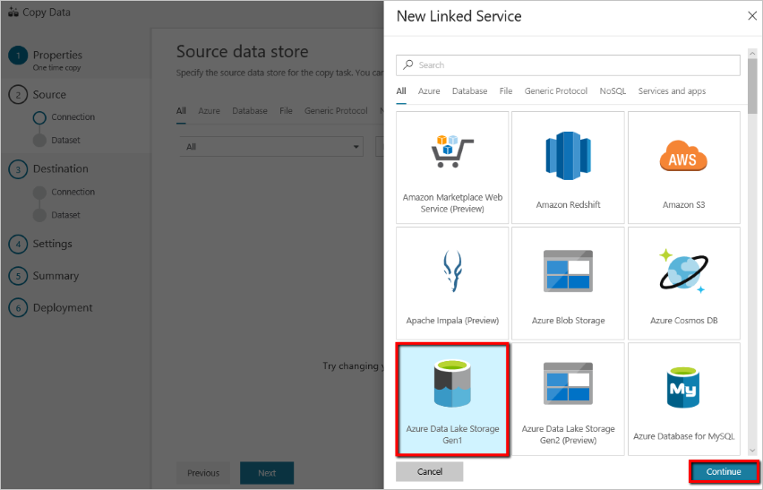
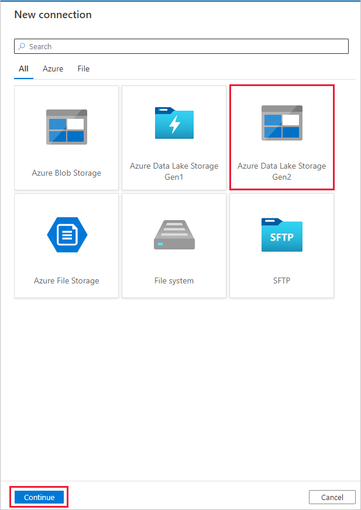
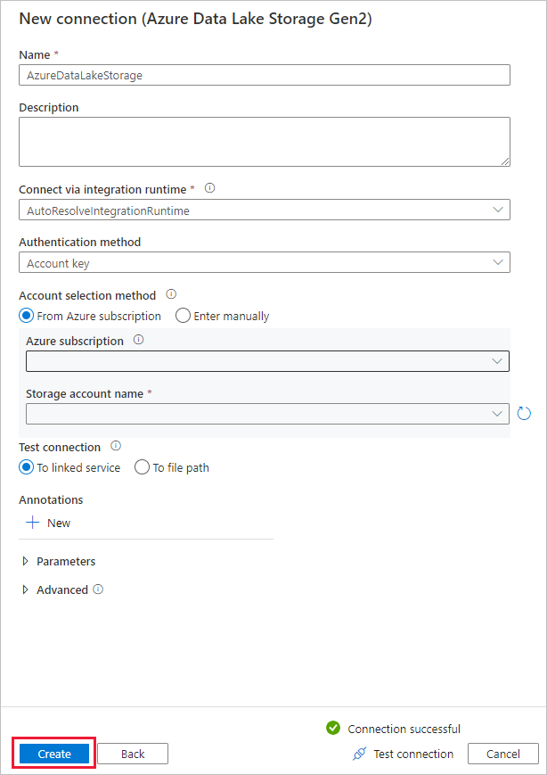
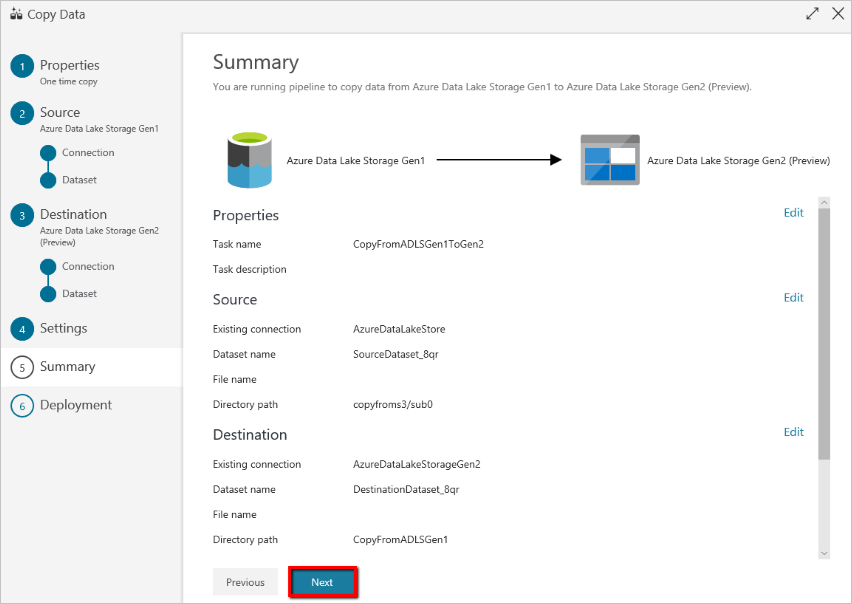
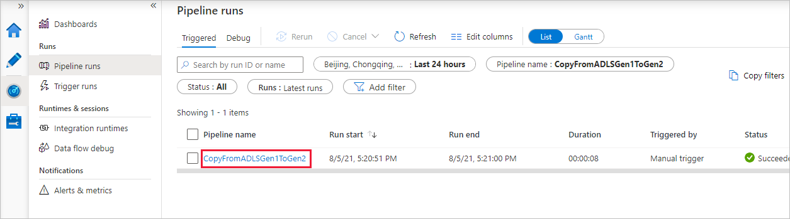
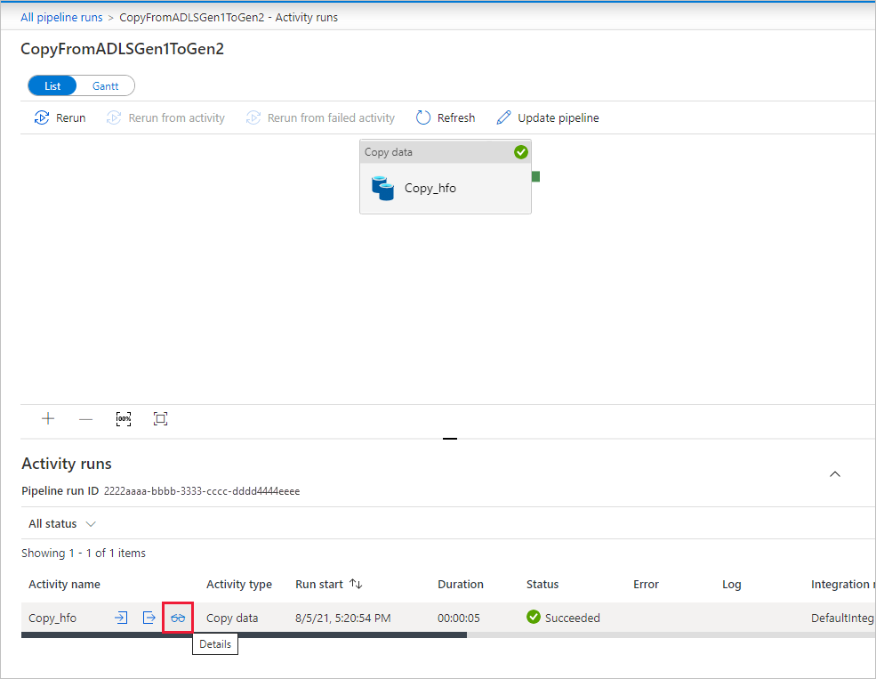

# Copy data from Azure Data Lake Storage Gen1 to Gen2 with Azure Data Factory

[!INCLUDE[appliesto-adf-asa-md](includes/appliesto-adf-asa-md.md)]

Azure Data Lake Storage Gen2 is a set of capabilities dedicated to big data analytics that's built into [Azure Blob storage](../storage/blobs/storage-blobs-introduction.md). You can use it to interface with your data by using both file system and object storage paradigms.

If you currently use Azure Data Lake Storage Gen1, you can evaluate Azure Data Lake Storage Gen2 by copying data from Data Lake Storage Gen1 to Gen2 by using Azure Data Factory.

Azure Data Factory is a fully managed cloud-based data integration service. You can use the service to populate the lake with data from a rich set of on-premises and cloud-based data stores and save time when you build your analytics solutions. For a list of supported connectors, see the table of [Supported data stores](copy-activity-overview.md#supported-data-stores-and-formats).

Azure Data Factory offers a scale-out, managed data movement solution. Because of the scale-out architecture of Data Factory, it can ingest data at a high throughput. For more information, see [Copy activity performance](copy-activity-performance.md).

This article shows you how to use the Data Factory copy data tool to copy data from Azure Data Lake Storage Gen1 into Azure Data Lake Storage Gen2. You can follow similar steps to copy data from other types of data stores.

## Prerequisites

* An Azure subscription. If you don't have an Azure subscription, create a [free account](https://azure.microsoft.com/free/) before you begin.
* Azure Data Lake Storage Gen1 account with data in it.
* Azure Storage account with Data Lake Storage Gen2 enabled. If you don't have a Storage account, [create an account](https://ms.portal.azure.com/#create/Microsoft.StorageAccount-ARM).

## Create a data factory

1. On the left menu, select **Create a resource** > **Data + Analytics** > **Data Factory**.
   
   

2. On the **New data factory** page, provide values for the fields that are shown in the following image: 
      
   
 
    * **Name**: Enter a globally unique name for your Azure data factory. If you receive the error "Data factory name \"LoadADLSDemo\" is not available," enter a different name for the data factory. For example, use the name _**yourname**_**ADFTutorialDataFactory**. Create the data factory again. For the naming rules for Data Factory artifacts, see [Data Factory naming rules](naming-rules.md).
    * **Subscription**: Select your Azure subscription in which to create the data factory. 
    * **Resource Group**: Select an existing resource group from the drop-down list. You also can select the **Create new** option and enter the name of a resource group. To learn about resource groups, see [Use resource groups to manage your Azure resources](../azure-resource-manager/management/overview.md). 
    * **Version**: Select **V2**.
    * **Location**: Select the location for the data factory. Only supported locations are displayed in the drop-down list. The data stores that are used by the data factory can be in other locations and regions. 

3. Select **Create**.
4. After creation is finished, go to your data factory. You see the **Data Factory** home page as shown in the following image: 
   
   :::image type="content" source="./media/doc-common-process/data-factory-home-page.png" alt-text="Home page for the Azure Data Factory, with the Open Azure Data Factory Studio tile.":::

5. Select **Open** on the **Open Azure Data Factory Studio** tile to launch the Data Integration application in a separate tab.

## Load data into Azure Data Lake Storage Gen2

1. On the home page, select the **Ingest** tile to launch the copy data tool. 

   

2. On the **Properties** page, choose **Built-in copy task** under **Task type**, and choose **Run once now** under **Task cadence or task schedule**, then select **Next**.

3. On the **Source data store** page, select **+ New connection**.
    
4. Select **Azure Data Lake Storage Gen1** from the connector gallery, and select **Continue**.
    
    
    
5. On the **New connection (Azure Data Lake Storage Gen1)** page, follow these steps:
   1. Select your Data Lake Storage Gen1 for the account name, and specify or validate the **Tenant**.
   1. Select **Test connection** to validate the settings. Then select **Create**.
  
   > [!IMPORTANT]
   > In this walk-through, you use a managed identity for Azure resources to authenticate your Azure Data Lake Storage Gen1. To grant the managed identity the proper permissions in Azure Data Lake Storage Gen1, follow [these instructions](connector-azure-data-lake-store.md#managed-identity).
   
   
      
6. On the **Source data store** page, complete the following steps. 
    1. Select the newly created connection in the **Connection** section.
    1. Under **File or folder**, browse to the folder and file that you want to copy over. Select the folder or file, and select **OK**.
    1. Specify the copy behavior by selecting the **Recursively** and **Binary copy** options. Select **Next**.
    
    :::image type="content" source="./media/load-azure-data-lake-storage-gen2-from-gen1/source-data-store-page.png" alt-text="Screenshot showing the source data store page.":::
    
7. On the **Destination data store** page, select **+ New connection** > **Azure Data Lake Storage Gen2** > **Continue**.

    

8. On the **New connection (Azure Data Lake Storage Gen2)** page, follow these steps:
   1. Select your Data Lake Storage Gen2 capable account from the **Storage account name** drop-down list.
   1. Select **Create** to create the connection. 

   

9. On the **Destination data store** page, complete the following steps. 
    1. Select the newly created connection in the **Connection** block. 
    1. Under **Folder path**, enter **copyfromadlsgen1** as the output folder name, and select **Next**. Data Factory creates the corresponding Azure Data Lake Storage Gen2 file system and subfolders during copy if they don't exist.

    :::image type="content" source="./media/load-azure-data-lake-storage-gen2-from-gen1/destination-data-store-page.png" alt-text="Screenshot showing the destination data store page.":::

10. On the **Settings** page, specify **CopyFromADLSGen1ToGen2** for the **Task name** field, then select **Next** to use the default settings.

11. On the **Summary** page, review the settings, and select **Next**.

    

12. On the **Deployment page**, select **Monitor** to monitor the pipeline.

    

13. Notice that the **Monitor** tab on the left is automatically selected. The **Pipeline name** column includes links to view activity run details and to rerun the pipeline.

    

14. To view activity runs that are associated with the pipeline run, select the link in the **Pipeline name** column. There's only one activity (copy activity) in the pipeline, so you see only one entry. To switch back to the pipeline runs view, select the **All pipeline runs** link in the breadcrumb menu at the top. Select **Refresh** to refresh the list. 

    

15. To monitor the execution details for each copy activity, select the **Details** link (eyeglasses image) under the **Activity name** column in the activity monitoring view. You can monitor details like the volume of data copied from the source to the sink, data throughput, execution steps with corresponding duration, and used configurations.

    :::image type="content" source="./media/load-azure-data-lake-storage-gen2-from-gen1/monitor-activity-run-details.png" alt-text="Screenshot showing the activity run details.":::

16. Verify that the data is copied into your Azure Data Lake Storage Gen2 account.

## Best practices

To assess upgrading from Azure Data Lake Storage Gen1 to Azure Data Lake Storage Gen2 in general, see [Upgrade your big data analytics solutions from Azure Data Lake Storage Gen1 to Azure Data Lake Storage Gen2](../storage/blobs/data-lake-storage-migrate-gen1-to-gen2.md). The following sections introduce best practices for using Data Factory for a data upgrade from Data Lake Storage Gen1 to Data Lake Storage Gen2.

### Historical data copy

#### Performance tuning by proof-of-concept

Use a proof of concept to verify the end-to-end solution and test the copy throughput in your environment. Major proof-of-concept steps: 

1. Create one Data Factory pipeline with a single copy activity to copy several TBs of data from Data Lake Storage Gen1 to Data Lake Storage Gen2 to get a copy performance baseline. Start with [data integration units (DIUs)](copy-activity-performance-features.md#data-integration-units) as 128. The [Parallel copy](copy-activity-performance-features.md#parallel-copy) is suggested to be set as **empty (default)**.
2. Based on the copy throughput you get in step 1, calculate the estimated time that's required for the entire data migration. If the copy throughput is not good for you, identify and resolve the performance bottlenecks by following the [performance tuning steps](copy-activity-performance.md#performance-tuning-steps).
3. If you have maximized the performance of a single copy activity, but have not yet achieved the throughput upper limits of your environment, you can run multiple copy activities in parallel. Each copy activity can be configured to copy one partition at a time, so that multiple copy activities can copy data from single Data Lake Storage Gen1 account cocurrently. The way to partition the files is to use **name range- listAfter/listBefore** in [copy activity property](connector-azure-data-lake-store.md#copy-activity-properties).

If your total data size in Data Lake Storage Gen1 is less than 30 TB and the number of files is less than 1 million, you can copy all data in a single copy activity run. If you have a larger amount of data to copy, or you want the flexibility to manage data migration in batches and make each of them complete within a specific time frame, partition the data. Partitioning also reduces the risk of any unexpected issue. 

#### Network bandwidth and storage I/O 

If you see significant number of throttling errors from [copy activity monitoring](copy-activity-monitoring.md#monitor-visually), it indicates you have reached the capacity limit of your storage account. ADF will retry automatically to overcome each throttling error to make sure there will not be any data lost, but too many retries impact your copy throughput as well. In such case, you are encouraged to reduce the number of copy activities running cocurrently to avoid significant amounts of throttling errors. If you have been using single copy activity to copy data, then you are encouraged to reduce the number of [data integration units (DIUs)](copy-activity-performance-features.md#data-integration-units).

### Incremental copy 

You can use several approaches to load only the new or updated files from Data Lake Storage Gen1:

- Load new or updated files by time partitioned folder or file name. An example is /2019/05/13/*.
- Load new or updated files by LastModifiedDate. If you are copying large amounts of files, do partitions first in order to avoid low copy throughput result from single copy activity scanning your entire Data Lake Storage Gen1 account to identify new files. 
- Identify new or updated files by any third-party tool or solution. Then pass the file or folder name to the Data Factory pipeline via parameter or a table or file. 

The proper frequency to do incremental load depends on the total number of files in Azure Data Lake Storage Gen1 and the volume of new or updated files to be loaded every time. 

### Preserve ACLs

If you want to replicate the ACLs along with data files when you upgrade from Data Lake Storage Gen1 to Data Lake Storage Gen2, see [Preserve ACLs from Data Lake Storage Gen1](connector-azure-data-lake-storage.md#preserve-acls). 

### Permissions 

In Data Factory, the [Data Lake Storage Gen1 connector](connector-azure-data-lake-store.md) supports service principal and managed identity for Azure resource authentications. The [Data Lake Storage Gen2 connector](connector-azure-data-lake-storage.md) supports account key, service principal, and managed identity for Azure resource authentications. To make Data Factory able to navigate and copy all the files or access control lists (ACLs) you need, grant high enough permissions for the account you provide to access, read, or write all files and set ACLs if you choose to. Grant it a super-user or owner role during the migration period. 

## Next steps

> [!div class="nextstepaction"]
> [Copy activity overview](copy-activity-overview.md)
> [Azure Data Lake Storage Gen1 connector](connector-azure-data-lake-store.md)
> [Azure Data Lake Storage Gen2 connector](connector-azure-data-lake-storage.md)