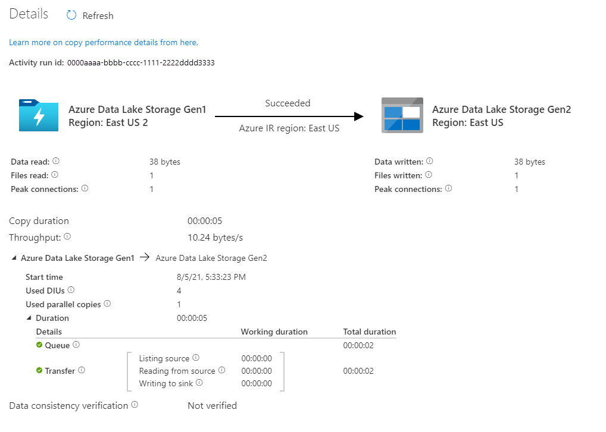

# Copy data from Azure Data Lake Storage Gen1 to Gen2 (Preview) with Azure Data Factory

[Azure Data Lake Storage Gen2 (Preview)](../storage/data-lake-storage/introduction.md) adds a protocol with hierarchical file system namespace and security features to Azure Blob Storage making it easy to connect analytics frameworks to a durable storage layer. In Data Lake Storage Gen2 (Preview), all the qualities of object storage remain while adding the advantages of a file system interface.

If you are currently using Azure Data Lake Storage Gen1, you can evaluate the Gen2 new capability by copying data from Data Lake Storage Gen1 to Gen2 using Azure Data Factory.

Azure Data Factory is a fully managed cloud-based data integration service. You can use the service to populate the lake with data from a rich set of on-premises and cloud-based data stores and save time when building your analytics solutions. For a detailed list of supported connectors, see the table of [Supported data stores](copy-activity-overview.md#supported-data-stores-and-formats).

Azure Data Factory offers a scale-out, managed data movement solution. Due to the scale-out architecture of ADF, it can ingest data at a high throughput. For details, see [Copy activity performance](copy-activity-performance.md).

This article shows you how to use the Data Factory Copy Data tool to copy data from _Azure Data Lake Storage Gen1_ into _Azure Data Lake Storage Gen2_. You can follow similar steps to copy data from other types of data stores.

## Prerequisites

* Azure subscription: If you don't have an Azure subscription, create a [free account](https://azure.microsoft.com/free/) before you begin.
* Azure Data Lake Storage Gen1 account with data in it.
* Azure Storage account with Data Lake Storage Gen2 enabled: If you don't have a Storage account, click [here](https://ms.portal.azure.com/#create/Microsoft.StorageAccount-ARM) to create one.

## Create a data factory

1. On the left menu, select **New** > **Data + Analytics** > **Data Factory**:
   
   
2. In the **New data factory** page, provide values for the fields that are shown in the following image: 
      
   
 
    * **Name**: Enter a globally unique name for your Azure data factory. If you receive the error "Data factory name \"LoadADLSDemo\" is not available," enter a different name for the data factory. For example, you could use the name _**yourname**_**ADFTutorialDataFactory**. Try creating the data factory again. For the naming rules for Data Factory artifacts, see [Data Factory naming rules](naming-rules.md).
    * **Subscription**: Select your Azure subscription in which to create the data factory. 
    * **Resource Group**: Select an existing resource group from the drop-down list, or select the **Create new** option and enter the name of a resource group. To learn about resource groups, see [Using resource groups to manage your Azure resources](../azure-resource-manager/resource-group-overview.md).  
    * **Version**: Select **V2**.
    * **Location**: Select the location for the data factory. Only supported locations are displayed in the drop-down list. The data stores that are used by data factory can be in other locations and regions. 

3. Select **Create**.
4. After creation is complete, go to your data factory. You see the **Data Factory** home page as shown in the following image: 
   
   

   Select the **Author & Monitor** tile to launch the Data Integration Application in a separate tab.

## Load data into Azure Data Lake Storage Gen2

1. In the **Get started** page, select the **Copy Data** tile to launch the Copy Data tool: 

   
2. In the **Properties** page, specify **CopyFromADLSGen1ToGen2** for the **Task name** field, and select **Next**:

    
3. In the **Source data store** page, click **+ Create new connection**:

    
	
	Select **Azure Data Lake Storage Gen1** from the connector gallery, and select **Continue**
	
	
	
4. In the **Specify Azure Data Lake Storage Gen1 connection** page, do the following steps:
   1. Select your Data Lake Storage Gen1 for the account name.
   2. Specify or validate the **Tenant**, and select Finish.
   3. Select **Next**.
   
   > [!IMPORTANT]
   > In this walkthrough, you use a managed identity for Azure resources to authenticate your Data Lake Storage Gen1e. Be sure to grant the MSI the proper permissions in Azure Data Lake Storage Gen1 by following [these instructions](connector-azure-data-lake-store.md#managed-identity).
   
   
   
   4. You will see a new connection gets created. Select **Next**.
   
5. In the **Choose the input file or folder** page, browse to the folder and file that you want to copy over. Select the folder/file, select **Choose**:

    

6. Specify the copy behavior by checking the **Copy files recursively** and **Binary copy** options. Select **Next**:

    
	
7. In the **Destination data store** page, click **+ Create new connection**, and then select **Azure Data Lake Storage Gen2 (Preview)**, and select **Continue**:

    

8. In the **Specify Azure Data Lake Storage Gen2 connection** page, do the following steps:

   1. Select your Data Lake Storage Gen2 capable account from the "Storage account name" drop down list.
   2. Select **Next**.
   
   

9. In the **Choose the output file or folder** page, enter **copyfromadlsgen1** as the output folder name, and select **Next**: 

    

10. In the **Settings** page, select **Next** to use the default settings.

11. In the **Summary** page, review the settings, and select **Next**:

    
12. In the **Deployment page**, select **Monitor** to monitor the pipeline:

    
13. Notice that the **Monitor** tab on the left is automatically selected. The **Actions** column includes links to view activity run details and to rerun the pipeline:

    

14. To view activity runs that are associated with the pipeline run, select the **View Activity Runs** link in the **Actions** column. There's only one activity (copy activity) in the pipeline, so you see only one entry. To switch back to the pipeline runs view, select the **Pipelines** link at the top. Select **Refresh** to refresh the list. 

    

15. To monitor the execution details for each copy activity, select the **Details** link (eyeglasses image) under **Actions** in the activity monitoring view. You can monitor details like the volume of data copied from the source to the sink, data throughput, execution steps with corresponding duration, and used configurations:

    

16. Verify that the data is copied into your Data Lake Storage Gen2 account.

## Best practices

When copy large volume of data from file-based data store, you are suggested to:

- Partition the files into 10TB to 30TB fileset each.
- Do not trigger too many concurrent copy runs to avoid throttling from source or sink data stores. You can start with one copy run and monitor the throughput, then gradually add more as needed.

## Next steps

* [Copy activity overview](copy-activity-overview.md)
* [Azure Data Lake Storage Gen2 connector](connector-azure-data-lake-storage.md)