# Load data into Azure Data Lake Storage Gen2 with Azure Data Factory

Azure Data Lake Storage Gen2 is a set of capabilities dedicated to big data analytics, built into [Azure Blob storage](../storage/blobs/storage-blobs-introduction.md). It allows you to interface with your data using both file system and object storage paradigms.

Azure Data Factory (ADF) is a fully managed cloud-based data integration service. You can use the service to populate the lake with data from a rich set of on-premises and cloud-based data stores and save time when building your analytics solutions. For a detailed list of supported connectors, see the table of [Supported data stores](copy-activity-overview.md#supported-data-stores-and-formats).

Azure Data Factory offers a scale-out, managed data movement solution. Due to the scale-out architecture of ADF, it can ingest data at a high throughput. For details, see [Copy activity performance](copy-activity-performance.md).

This article shows you how to use the Data Factory Copy Data tool to load data from _Amazon Web Services S3 service_ into _Azure Data Lake Storage Gen2_. You can follow similar steps to copy data from other types of data stores.

>[!TIP]
>For copying data from Azure Data Lake Storage Gen1 into Gen2, refer to [this specific walkthrough](load-azure-data-lake-storage-gen2-from-gen1.md).

## Prerequisites

* Azure subscription: If you don't have an Azure subscription, create a [free account](https://azure.microsoft.com/free/) before you begin.
* Azure Storage account with Data Lake Storage Gen2 enabled: If you don't have a Storage account, [create an account](https://ms.portal.azure.com/#create/Microsoft.StorageAccount-ARM).
* AWS account with an S3 bucket that contains data: This article shows how to copy data from Amazon S3. You can use other data stores by following similar steps.

## Create a data factory

1. On the left menu, select **Create a resource** > **Data + Analytics** > **Data Factory**:
   
   

2. In the **New data factory** page, provide values for the fields that are shown in the following image: 
      
   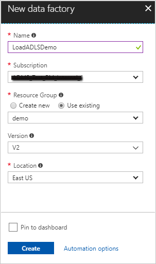
 
    * **Name**: Enter a globally unique name for your Azure data factory. If you receive the error "Data factory name \"LoadADLSDemo\" is not available," enter a different name for the data factory. For example, you could use the name _**yourname**_**ADFTutorialDataFactory**. Try creating the data factory again. For the naming rules for Data Factory artifacts, see [Data Factory naming rules](naming-rules.md).
    * **Subscription**: Select your Azure subscription in which to create the data factory. 
    * **Resource Group**: Select an existing resource group from the drop-down list, or select the **Create new** option and enter the name of a resource group. To learn about resource groups, see [Using resource groups to manage your Azure resources](../azure-resource-manager/resource-group-overview.md).  
    * **Version**: Select **V2**.
    * **Location**: Select the location for the data factory. Only supported locations are displayed in the drop-down list. The data stores that are used by data factory can be in other locations and regions. 

3. Select **Create**.
4. After creation is complete, go to your data factory. You see the **Data Factory** home page as shown in the following image: 
   
   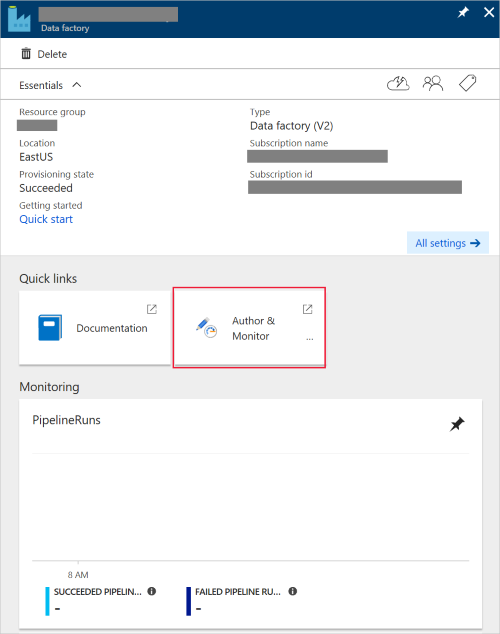

   Select the **Author & Monitor** tile to launch the Data Integration Application in a separate tab.

## Load data into Azure Data Lake Storage Gen2

1. In the **Get started** page, select the **Copy Data** tile to launch the Copy Data tool: 

   
2. In the **Properties** page, specify **CopyFromAmazonS3ToADLS** for the **Task name** field, and select **Next**:

    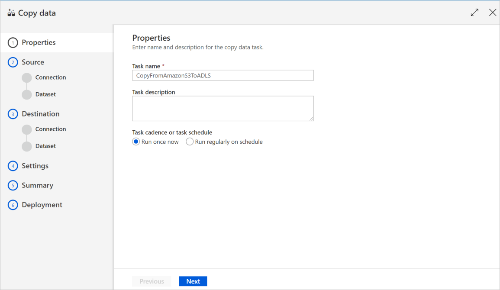
3. In the **Source data store** page, click **+ Create new connection**:

    
	
	Select **Amazon S3** from the connector gallery, and select **Continue**
	
	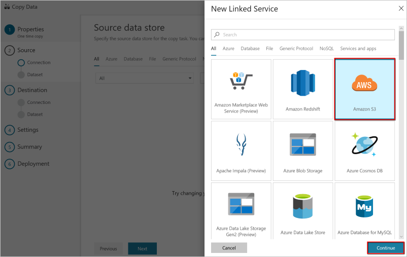
	
4. In the **Specify Amazon S3 connection** page, do the following steps:

   1. Specify the **Access Key ID** value.
   2. Specify the **Secret Access Key** value.
   3. Click **Test connection** to validate the settings, then select **Finish**.
   4. You will see a new connection gets created. Select **Next**.
   
      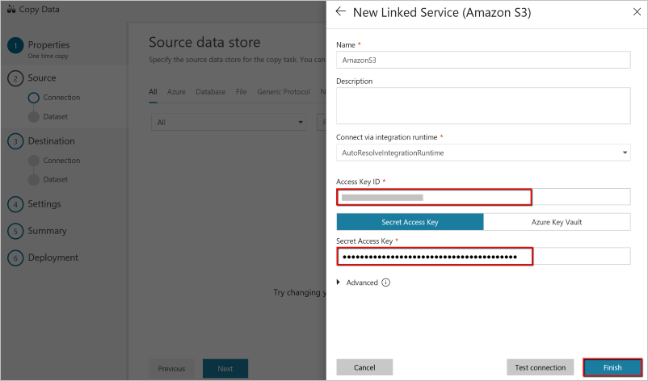
      
5. In the **Choose the input file or folder** page, browse to the folder and file that you want to copy over. Select the folder/file, select **Choose**:

    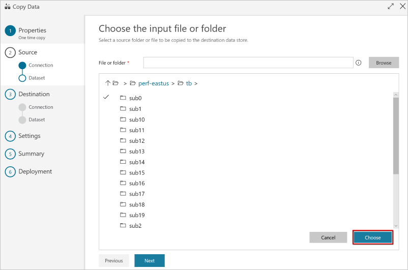

6. Specify the copy behavior by checking the **Copy files recursively** and **Binary copy** options. Select **Next**:

    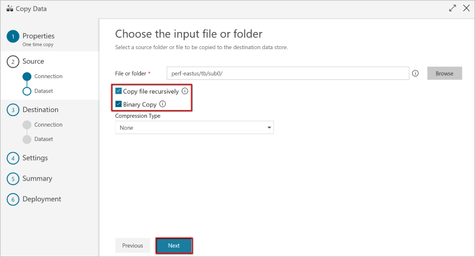
	
7. In the **Destination data store** page, click **+ Create new connection**, and then select **Azure Data Lake Storage Gen2**, and select **Continue**:

    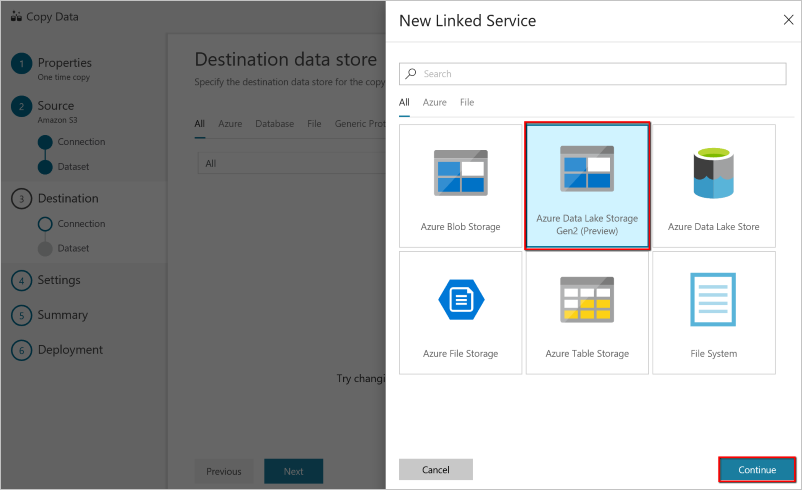

8. In the **Specify Azure Data Lake Storage connection** page, do the following steps:

   1. Select your Data Lake Storage Gen2 capable account from the "Storage account name" drop down list.
   2. Select **Finish** to create the connection. Then select **Next**.
   
   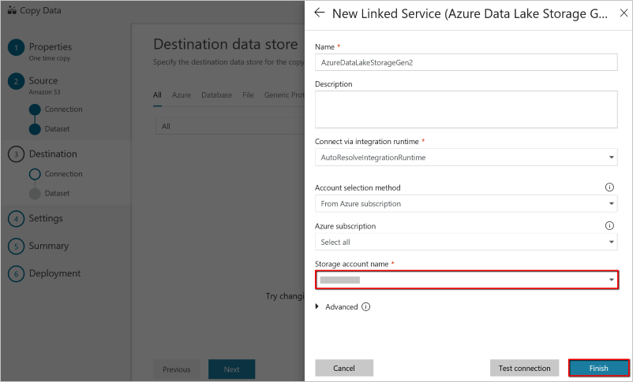

9. In the **Choose the output file or folder** page, enter **copyfroms3** as the output folder name, and select **Next**. ADF will create the corresponding ADLS Gen2 file system and sub-folders during copy if it doesn't exist.

    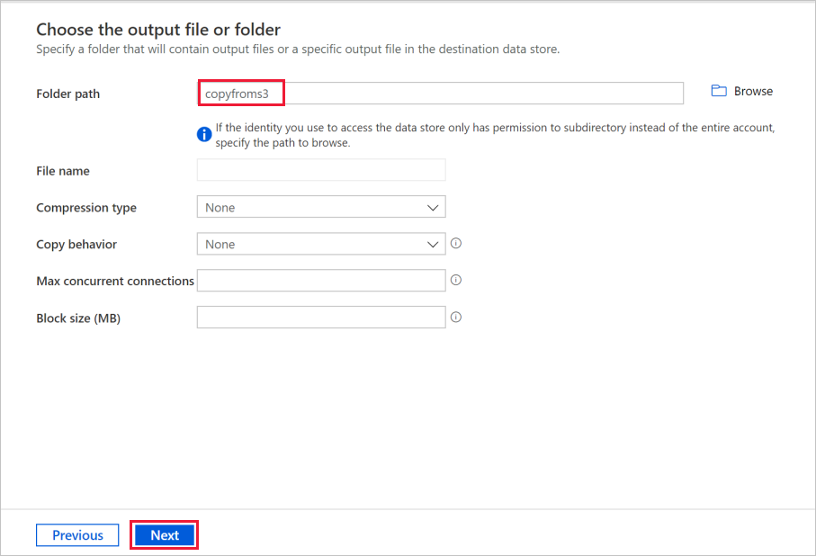

10. In the **Settings** page, select **Next** to use the default settings:

    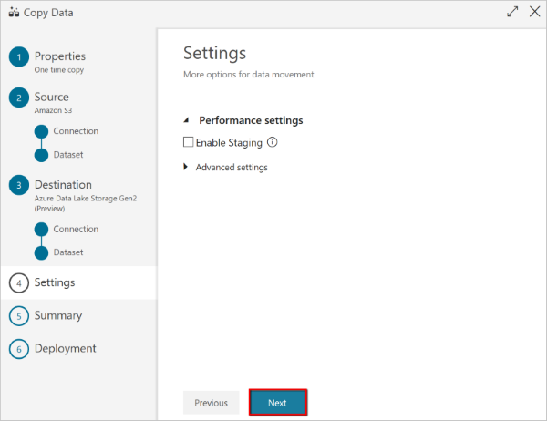
11. In the **Summary** page, review the settings, and select **Next**:

    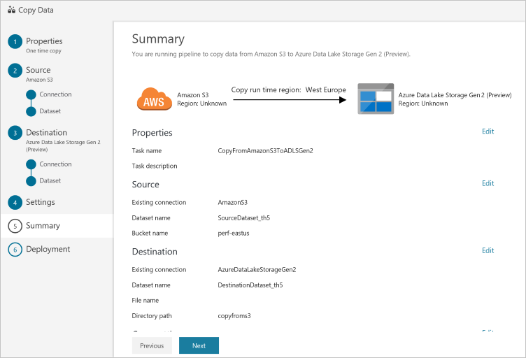
12. In the **Deployment page**, select **Monitor** to monitor the pipeline:

    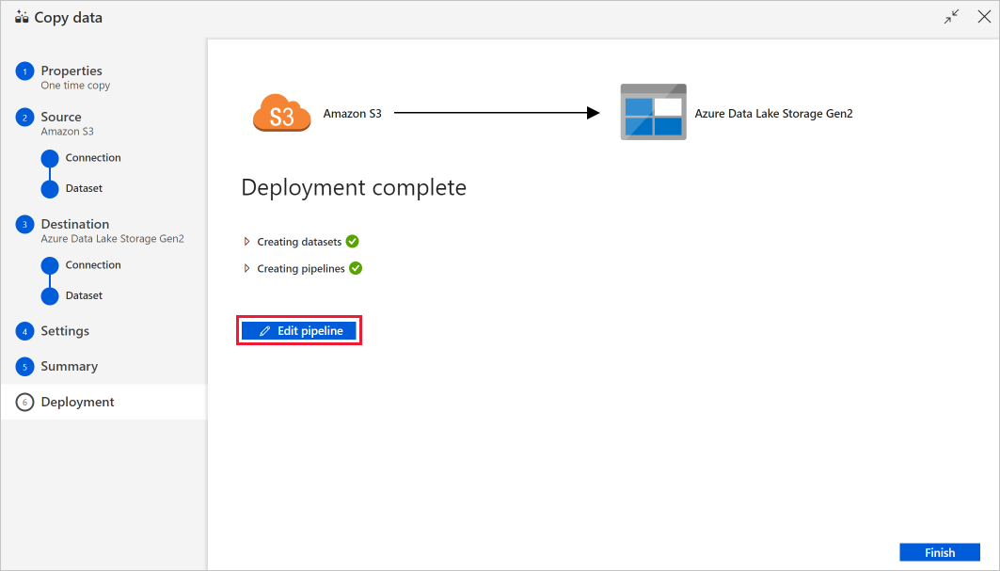
13. Notice that the **Monitor** tab on the left is automatically selected. The **Actions** column includes links to view activity run details and to rerun the pipeline:

    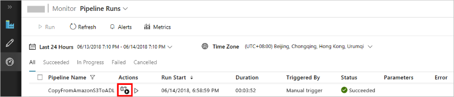

14. To view activity runs that are associated with the pipeline run, select the **View Activity Runs** link in the **Actions** column. There's only one activity (copy activity) in the pipeline, so you see only one entry. To switch back to the pipeline runs view, select the **Pipelines** link at the top. Select **Refresh** to refresh the list. 

    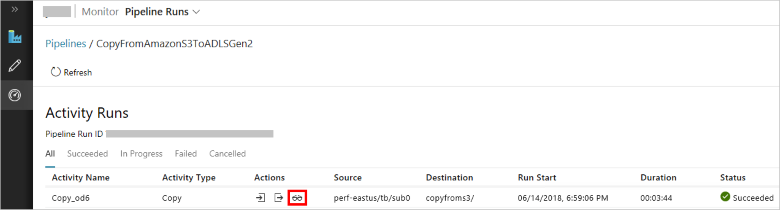

15. To monitor the execution details for each copy activity, select the **Details** link (eyeglasses image) under **Actions** in the activity monitoring view. You can monitor details like the volume of data copied from the source to the sink, data throughput, execution steps with corresponding duration, and used configurations:

    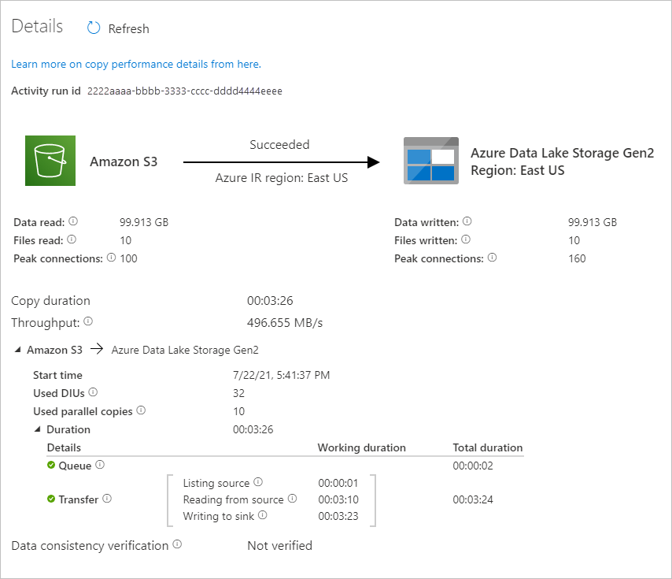

16. Verify that the data is copied into your Data Lake Storage Gen2 account.

## Next steps

* [Copy activity overview](copy-activity-overview.md)
* [Azure Data Lake Storage Gen2 connector](connector-azure-data-lake-storage.md)
