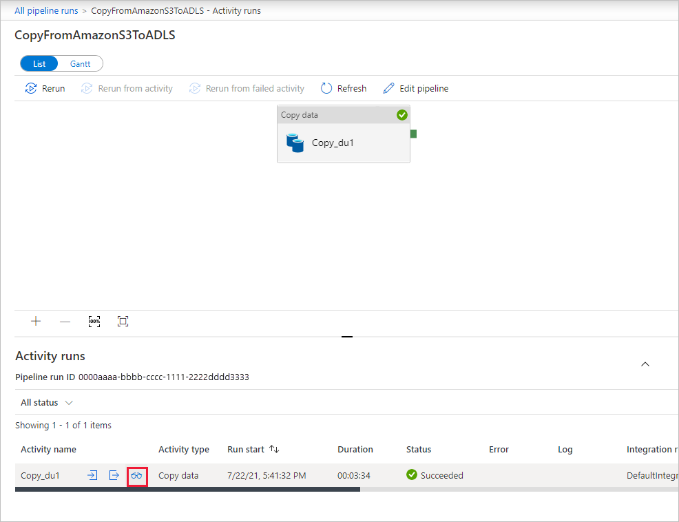

# Load data into Azure Data Lake Storage Gen2 with Azure Data Factory

[!INCLUDE[appliesto-adf-xxx-md](includes/appliesto-adf-xxx-md.md)]

Azure Data Lake Storage Gen2 is a set of capabilities dedicated to big data analytics, built into [Azure Blob storage](../storage/blobs/storage-blobs-introduction.md). It allows you to interface with your data using both file system and object storage paradigms.

Azure Data Factory (ADF) is a fully managed cloud-based data integration service. You can use the service to populate the lake with data from a rich set of on-premises and cloud-based data stores and save time when building your analytics solutions. For a detailed list of supported connectors, see the table of [Supported data stores](copy-activity-overview.md#supported-data-stores-and-formats).

Azure Data Factory offers a scale-out, managed data movement solution. Due to the scale-out architecture of ADF, it can ingest data at a high throughput. For details, see [Copy activity performance](copy-activity-performance.md).

This article shows you how to use the Data Factory Copy Data tool to load data from _Amazon Web Services S3 service_ into _Azure Data Lake Storage Gen2_. You can follow similar steps to copy data from other types of data stores.

>[!TIP]
>For copying data from Azure Data Lake Storage Gen1 into Gen2, refer to [this specific walkthrough](load-azure-data-lake-storage-gen2-from-gen1.md).

## Prerequisites

* Azure subscription: If you don't have an Azure subscription, create a [free account](https://azure.microsoft.com/free/) before you begin.
* Azure Storage account with Data Lake Storage Gen2 enabled: If you don't have a Storage account, [create an account](https://ms.portal.azure.com/#create/Microsoft.StorageAccount-ARM).
* AWS account with an S3 bucket that contains data: This article shows how to copy data from Amazon S3. You can use other data stores by following similar steps.

## Create a data factory

1. On the left menu, select **Create a resource** > **Data + Analytics** > **Data Factory**:
   
   

2. In the **New data factory** page, provide values for following fields:
 
    * **Name**: Enter a globally unique name for your Azure data factory. If you receive the error "Data factory name *YourDataFactoryName* is not available", enter a different name for the data factory. For example, you could use the name _**yourname**_**ADFTutorialDataFactory**. Try creating the data factory again. For the naming rules for Data Factory artifacts, see [Data Factory naming rules](naming-rules.md).
    * **Subscription**: Select your Azure subscription in which to create the data factory. 
    * **Resource Group**: Select an existing resource group from the drop-down list, or select the **Create new** option and enter the name of a resource group. To learn about resource groups, see [Using resource groups to manage your Azure resources](../azure-resource-manager/management/overview.md).  
    * **Version**: Select **V2**.
    * **Location**: Select the location for the data factory. Only supported locations are displayed in the drop-down list. The data stores that are used by data factory can be in other locations and regions. 

3. Select **Create**.

4. After creation is complete, go to your data factory. You see the **Data Factory** home page as shown in the following image: 
   
   

   Select the **Author & Monitor** tile to launch the Data Integration Application in a separate tab.

## Load data into Azure Data Lake Storage Gen2

1. In the **Get started** page, select the **Copy Data** tile to launch the Copy Data tool.

2. In the **Properties** page, specify **CopyFromAmazonS3ToADLS** for the **Task name** field, and select **Next**.

    
3. In the **Source data store** page, click **+ Create new connection**. Select **Amazon S3** from the connector gallery, and select **Continue**.
	
	
	
4. In the **New linked service (Amazon S3)** page, do the following steps:

   1. Specify the **Access Key ID** value.
   2. Specify the **Secret Access Key** value.
   3. Click **Test connection** to validate the settings, then select **Create**.

      
   4. You will see a new AmazonS3 connection gets created. Select **Next**. 

5. In the **Choose the input file or folder** page, browse to the folder and file that you want to copy over. Select the folder/file, and then select **Choose**.

    

6. Specify the copy behavior by checking the **Recursively** and **Binary copy** options. Select **Next**.

    
	
7. In the **Destination data store** page, click **+ Create new connection**, and then select **Azure Data Lake Storage Gen2**, and select **Continue**.

    

8. In the **New linked service (Azure Data Lake Storage Gen2)** page, do the following steps:

   1. Select your Data Lake Storage Gen2 capable account from the "Storage account name" drop-down list.
   2. Select **Create** to create the connection. Then select **Next**.   

        

9. In the **Choose the output file or folder** page, enter **copyfroms3** as the output folder name, and select **Next**. ADF will create the corresponding ADLS Gen2 file system and subfolders during copy if it doesn't exist.

    

10. In the **Settings** page, select **Next** to use the default settings.

    

11. In the **Summary** page, review the settings, and select **Next**.

    

12. On the **Deployment page**, select **Monitor** to monitor the pipeline (task). 
 
13. When the pipeline run completes successfully, you see a pipeline run that is triggered by a manual trigger. You can use links under the **PIPELINE NAME** column to view activity details and to rerun the pipeline.

    

14. To see activity runs associated with the pipeline run, select the **CopyFromAmazonS3ToADLS** link under the PIPELINE NAME column. For details about the copy operation, select the **Details** link (eyeglasses icon) under the ACTIVITY NAME column. You can monitor details like the volume of data copied from the source to the sink, data throughput, execution steps with corresponding duration, and used configuration.
 
    
    
    

15. To refresh the view, select Refresh. Select **All pipeline runs** at the top to go back to the Pipeline Runs view.

16. Verify that the data is copied into your Data Lake Storage Gen2 account.

## Next steps

* [Copy activity overview](copy-activity-overview.md)
* [Azure Data Lake Storage Gen2 connector](connector-azure-data-lake-storage.md)
