# Load data into Azure SQL Data Warehouse by using Azure Data Factory

[Azure SQL Data Warehouse](../sql-data-warehouse/sql-data-warehouse-overview-what-is.md) is a cloud-based, scale-out database that's capable of processing massive volumes of data, both relational and non-relational. SQL Data Warehouse is built on the massively parallel processing (MPP) architecture that's optimized for enterprise data warehouse workloads. It offers cloud elasticity with the flexibility to scale storage and compute independently.

Getting started with Azure SQL Data Warehouse is now easier than ever when you use Azure Data Factory. Azure Data Factory is a fully managed cloud-based data integration service. You can use the service to populate a SQL Data Warehouse with data from your existing system and save time when building your analytics solutions.

Azure Data Factory offers the following benefits for loading data into Azure SQL Data Warehouse:

* **Easy to set up**: An intuitive 5-step wizard with no scripting required.
* **Rich data store support**: Built-in support for a rich set of on-premises and cloud-based data stores. For a detailed list, see the table of [Supported data stores](copy-activity-overview.md#supported-data-stores-and-formats).
* **Secure and compliant**: Data is transferred over HTTPS or ExpressRoute. The global service presence ensures that your data never leaves the geographical boundary.
* **Unparalleled performance by using PolyBase**: Polybase is the most efficient way to move data into Azure SQL Data Warehouse. Use the staging blob feature to achieve high load speeds from all types of data stores, including Azure Blob storage and Data Lake Store. (Polybase supports Azure Blob storage and Azure Data Lake Store by default.) For details, see [Copy activity performance](copy-activity-performance.md).

This article shows you how to use the Data Factory Copy Data tool to _load data from Azure SQL Database into Azure SQL Data Warehouse_. You can follow similar steps to copy data from other types of data stores.

> [!NOTE]
> For more information, see [Copy data to or from Azure SQL Data Warehouse by using Azure Data Factory](connector-azure-sql-data-warehouse.md).
## Prerequisites

* Azure subscription: If you don't have an Azure subscription, create a [free account](https://azure.microsoft.com/free/) before you begin.
* Azure SQL Data Warehouse: The data warehouse holds the data that's copied over from the SQL database. If you don't have an Azure SQL Data Warehouse, see the instructions in [Create a SQL Data Warehouse](../sql-data-warehouse/sql-data-warehouse-get-started-tutorial.md).
* Azure SQL Database: This tutorial copies data from an Azure SQL database with Adventure Works LT sample data. You can create a SQL database by following the instructions in [Create an Azure SQL database](../sql-database/sql-database-get-started-portal.md). 
* Azure storage account: Azure Storage is used as the _staging_ blob in the bulk copy operation. If you don't have an Azure storage account, see the instructions in [Create a storage account](../storage/common/storage-quickstart-create-account.md).

## Create a data factory

1. On the left menu, select **New** > **Data + Analytics** > **Data Factory**: 
   
   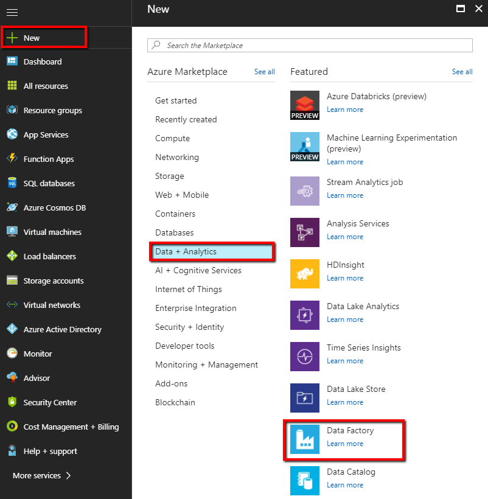
1. In the **New data factory** page, provide values for the fields that are shown in the following image:
      
   
 
    * **Name**: Enter a globally unique name for your Azure data factory. If you receive the error "Data factory name \"LoadSQLDWDemo\" is not available," enter a different name for the data factory. For example, you could use the name _**yourname**_**ADFTutorialDataFactory**. Try creating the data factory again. For the naming rules for Data Factory artifacts, see [Data Factory naming rules](naming-rules.md).
    * **Subscription**: Select your Azure subscription in which to create the data factory. 
    * **Resource Group**: Select an existing resource group from the drop-down list, or select the **Create new** option and enter the name of a resource group. To learn about resource groups, see [Using resource groups to manage your Azure resources](../azure-resource-manager/resource-group-overview.md).  
    * **Version**: Select **V2**.
    * **Location**: Select the location for the data factory. Only supported locations are displayed in the drop-down list. The data stores that are used by data factory can be in other locations and regions. These data stores include Azure Data Lake Store, Azure Storage, Azure SQL Database, and so on.

1. Select **Create**.
1. After creation is complete, go to your data factory. You see the **Data Factory** home page as shown in the following image:
   
   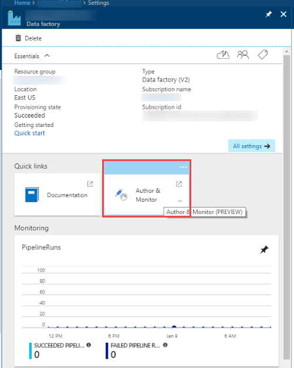

   Select the **Author & Monitor** tile to launch the Data Integration Application in a separate tab.

## Load data into Azure SQL Data Warehouse

1. In the **Get started** page, select the **Copy Data** tile to launch the Copy Data tool:

   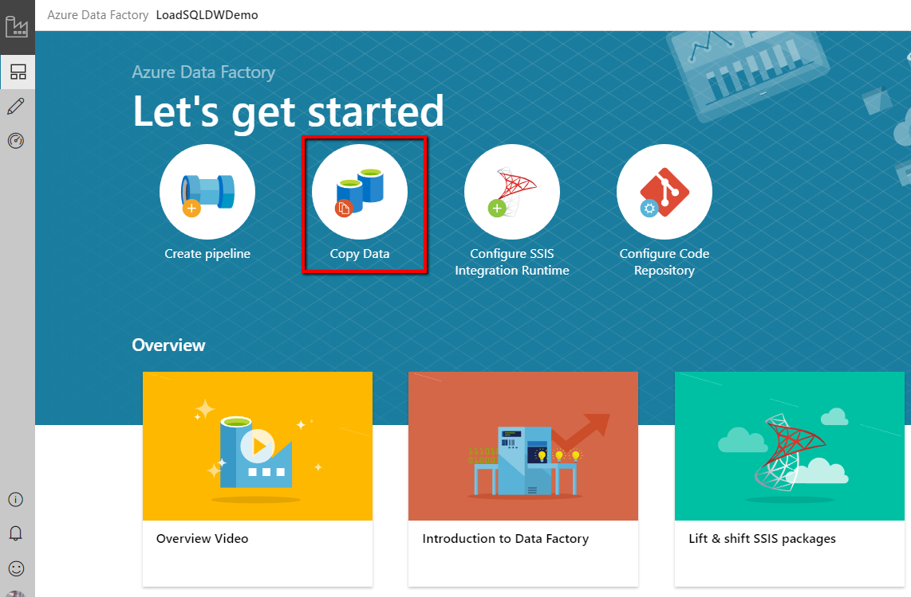
1. In the **Properties** page, specify **CopyFromSQLToSQLDW** for the **Task name** field, and select **Next**:

    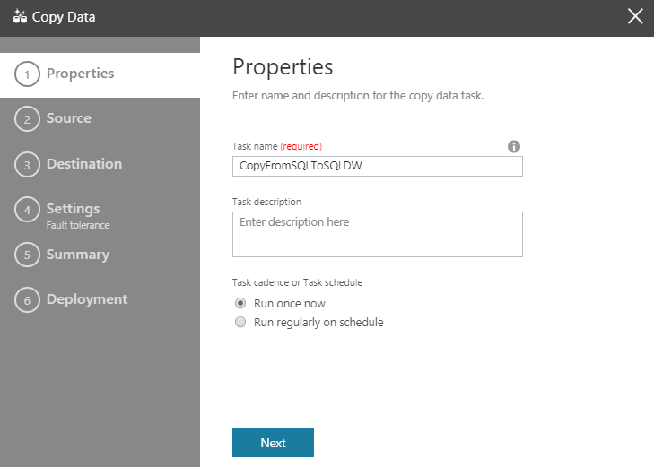

1. In the **Source data store** page, complete the following steps:

    a. click **+ Create new connection**:

    

    b. Select **Azure SQL Database** from the gallery, and select **Continue**. You can type "SQL" in the search box to filter the connectors.

    

    c. In the **New Linked Service** page, select your server name and DB name from the dropdown list, and specify the username and passworkd. Click **Test connection** to validate the settings, then select **Finish**.
   
    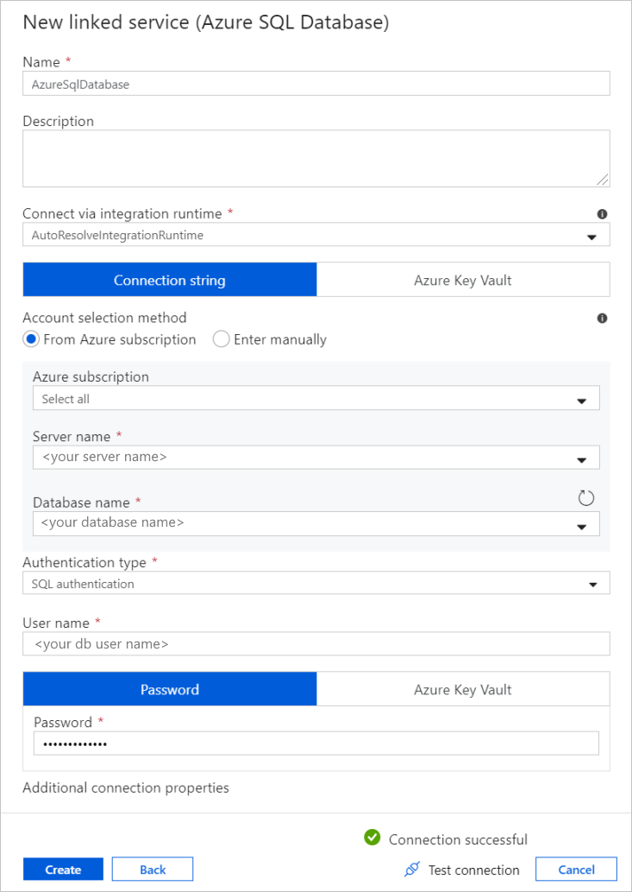

    d. Select the newly created linked service as source, then click **Next**.

    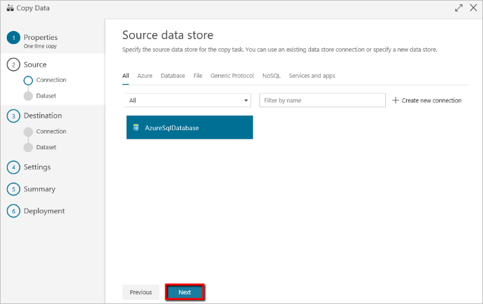

1. In the **Select tables from which to copy the data or use a custom query** page, enter **SalesLT** to filter the tables. Choose the **(Select all)** box to use all of the tables for the copy, and then select **Next**: 

    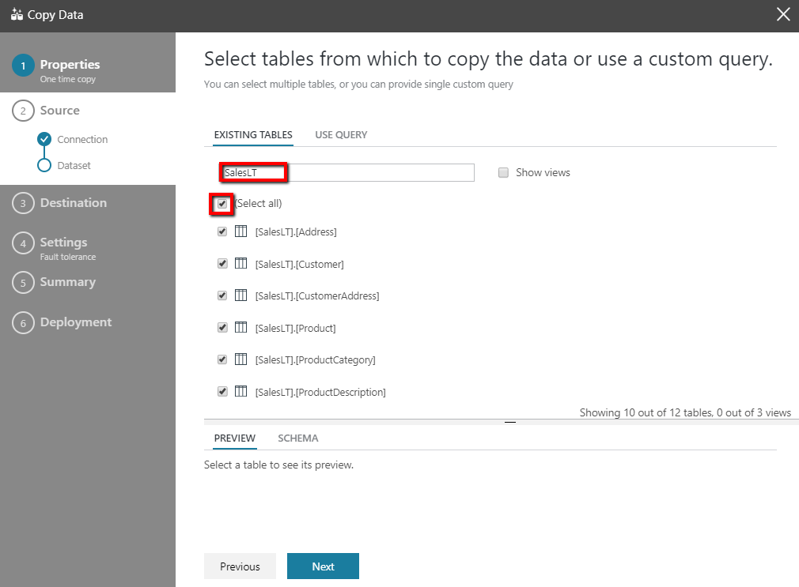

1. In the **Destination data store** page, complete the following steps:

    a. Click **+ Create new connection** to add a connection

    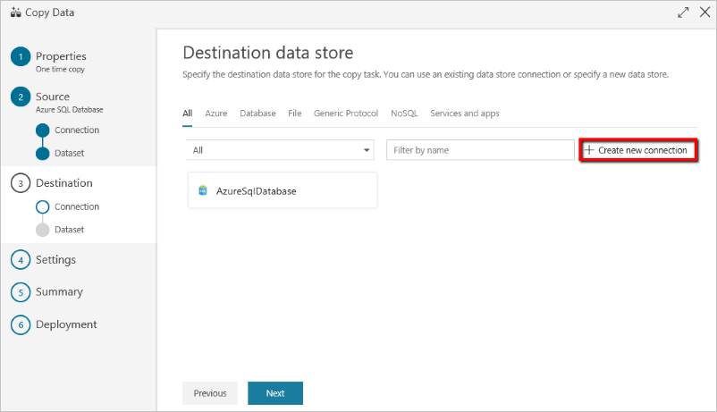

    b. Select **Azure SQL Data Warehouse** from the gallery, and select **Next**.

    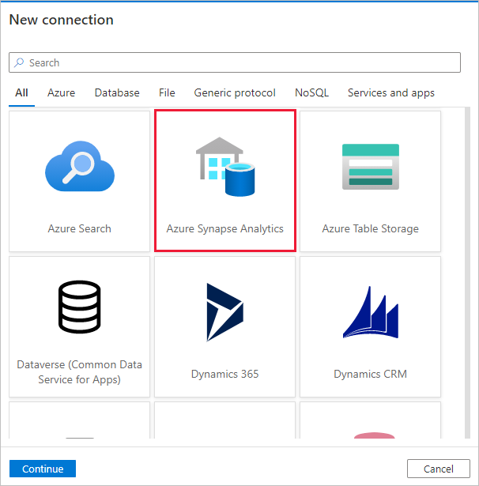

    c. In the **New Linked Service** page, select your server name and DB name from the dropdown list, and specify the username and passworkd. Click **Test connection** to validate the settings, then select **Finish**.
   
    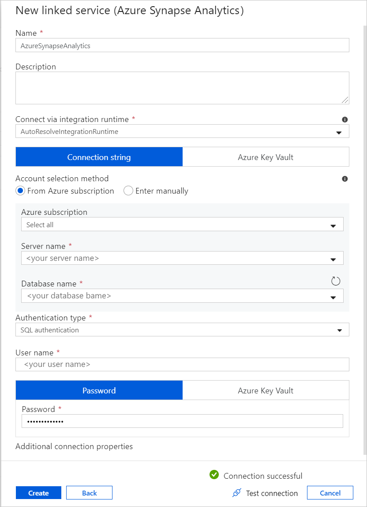

    d. Select the newly created linked service as sink, then click **Next**.

    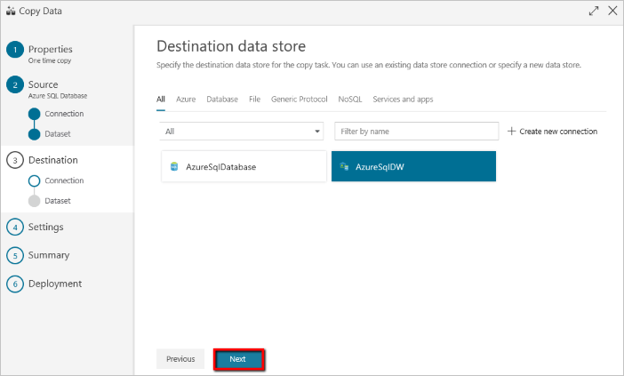

1. In the **Table mapping** page, review the content, and select **Next**. An intelligent table mapping displays. The source tables are mapped to the destination tables based on the table names. If a source table doesn't exist in the destination, Azure Data Factory creates a destination table with the same name by default. You can also map a source table to an existing destination table. 

   > [!NOTE]
   > Automatic table creation for the SQL Data Warehouse sink applies when SQL Server or Azure SQL Database is the source. If you copy data from another source data store, you need to pre-create the schema in the sink Azure SQL Data Warehouse before executing the data copy.

   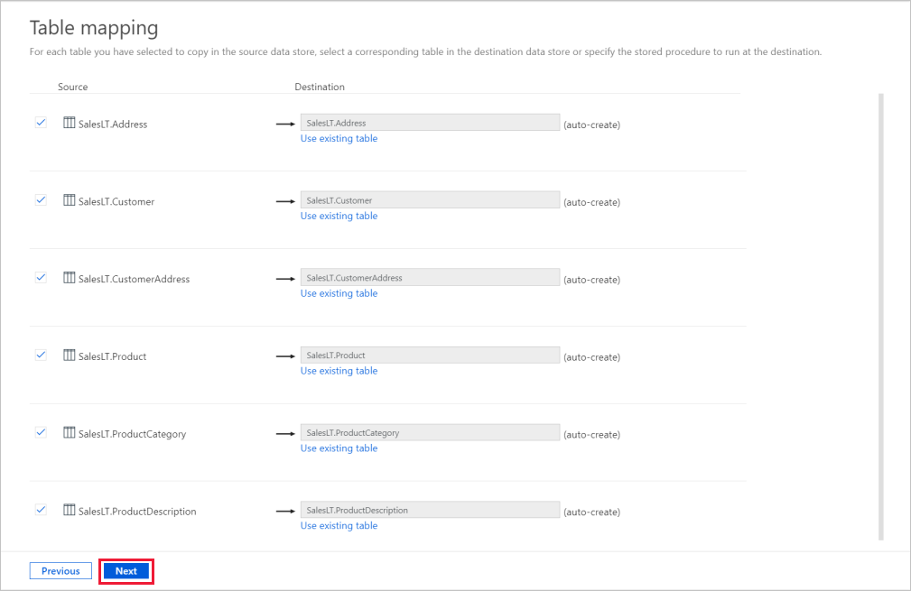

1. In the **Schema mapping** page, review the content, and select **Next**. The intelligent table mapping is based on the column name. If you let Data Factory automatically create the tables, data type conversion can occur when there are incompatibilities between the source and destination stores. If there's an unsupported data type conversion between the source and destination column, you see an error message next to the corresponding table.

    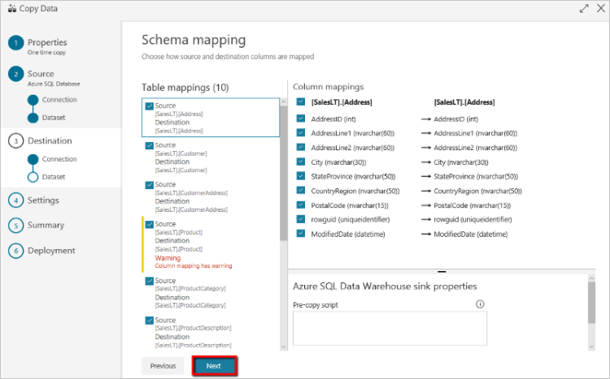

1. In the **Settings** page, complete the following steps:

    a. In **Staging settings** section, click **+ New** to new a staging storage. The storage is used for staging the data before it loads into SQL Data Warehouse by using PolyBase. After the copy is complete, the interim data in Azure Storage is automatically cleaned up. 

    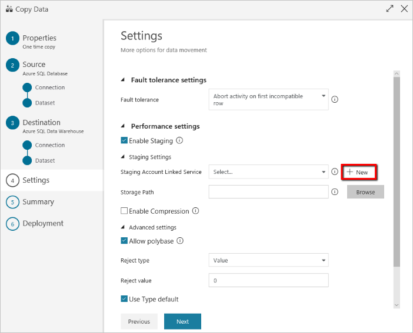

    b. In the **New Linked Service** page, select your storage account, and select **Finish**.
   
    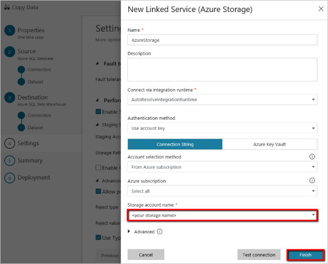

    c. In the **Advanced settings** section, deselect the **Use type default** option, then select **Next**.

    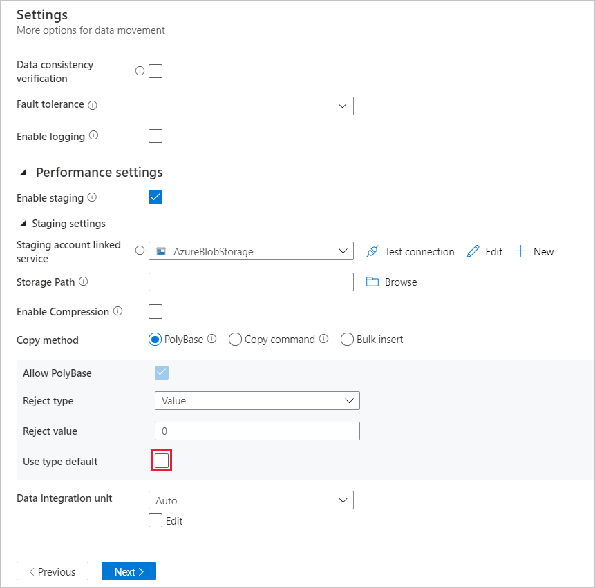

1. In the **Summary** page, review the settings, and select **Next**:

    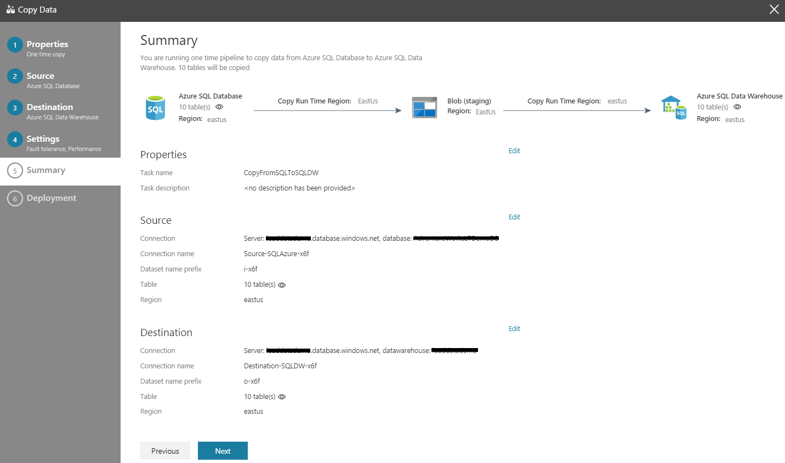
1. In the **Deployment page**, select **Monitor** to monitor the pipeline (task):

    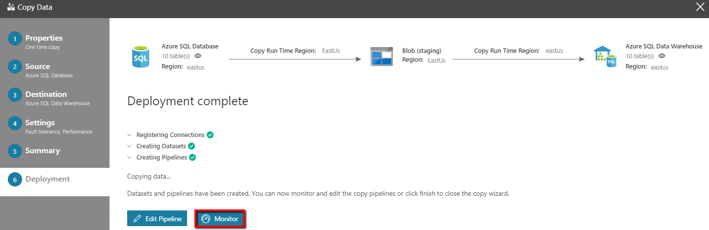
1. Notice that the **Monitor** tab on the left is automatically selected. The **Actions** column includes links to view activity run details and to rerun the pipeline: 

    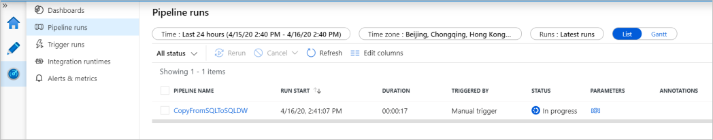
1. To view activity runs that are associated with the pipeline run, select the **View Activity Runs** link in the **Actions** column. To switch back to the pipeline runs view, select the **Pipelines** link at the top. Select **Refresh** to refresh the list. 

    

1. To monitor the execution details for each copy activity, select the **Details** link under **Actions** in the activity monitoring view. You can monitor details like the volume of data copied from the source to the sink, data throughput, execution steps with corresponding duration, and used configurations:

    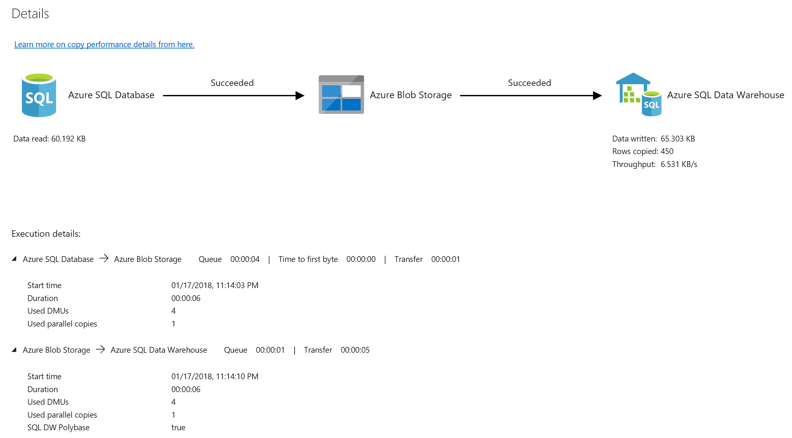

## Next steps

Advance to the following article to learn about Azure SQL Data Warehouse support: 

> [!div class="nextstepaction"]
>[Azure SQL Data Warehouse connector](connector-azure-sql-data-warehouse.md)
