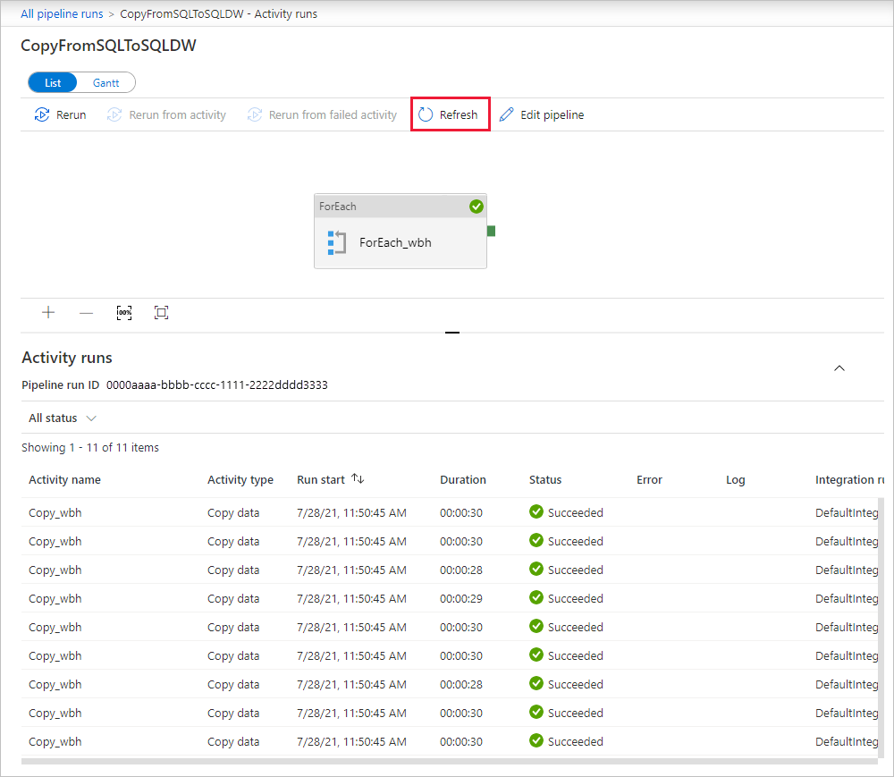

# Load data into Azure Synapse Analytics by using Azure Data Factory

[!INCLUDE[appliesto-adf-asa-md](includes/appliesto-adf-asa-md.md)]

[Azure Synapse Analytics](../synapse-analytics/sql-data-warehouse/sql-data-warehouse-overview-what-is.md) is a cloud-based, scale-out database that's capable of processing massive volumes of data, both relational and non-relational. Azure Synapse Analytics is built on the massively parallel processing (MPP) architecture that's optimized for enterprise data warehouse workloads. It offers cloud elasticity with the flexibility to scale storage and compute independently.

Getting started with Azure Synapse Analytics is now easier than ever when you use Azure Data Factory. Azure Data Factory is a fully managed cloud-based data integration service. You can use the service to populate an Azure Synapse Analytics with data from your existing system and save time when building your analytics solutions.

Azure Data Factory offers the following benefits for loading data into Azure Synapse Analytics:

* **Easy to set up**: An intuitive 5-step wizard with no scripting required.
* **Rich data store support**: Built-in support for a rich set of on-premises and cloud-based data stores. For a detailed list, see the table of [Supported data stores](copy-activity-overview.md#supported-data-stores-and-formats).
* **Secure and compliant**: Data is transferred over HTTPS or ExpressRoute. The global service presence ensures that your data never leaves the geographical boundary.
* **Unparalleled performance by using PolyBase**: Polybase is the most efficient way to move data into Azure Synapse Analytics. Use the staging blob feature to achieve high load speeds from all types of data stores, including Azure Blob storage and Data Lake Store. (Polybase supports Azure Blob storage and Azure Data Lake Store by default.) For details, see [Copy activity performance](copy-activity-performance.md).

This article shows you how to use the Data Factory Copy Data tool to _load data from Azure SQL Database into Azure Synapse Analytics_. You can follow similar steps to copy data from other types of data stores.

> [!NOTE]
> For more information, see [Copy data to or from Azure Synapse Analytics by using Azure Data Factory](connector-azure-sql-data-warehouse.md).

## Prerequisites

* Azure subscription: If you don't have an Azure subscription, create a [free account](https://azure.microsoft.com/free/) before you begin.
* Azure Synapse Analytics: The data warehouse holds the data that's copied over from the SQL database. If you don't have an Azure Synapse Analytics, see the instructions in [Create an Azure Synapse Analytics](../synapse-analytics/sql-data-warehouse/load-data-from-azure-blob-storage-using-copy.md).
* Azure SQL Database: This tutorial copies data from the Adventure Works LT sample dataset in Azure SQL Database. You can create this sample database in SQL Database by following the instructions in [Create a sample database in Azure SQL Database](../azure-sql/database/single-database-create-quickstart.md).
* Azure storage account: Azure Storage is used as the _staging_ blob in the bulk copy operation. If you don't have an Azure storage account, see the instructions in [Create a storage account](../storage/common/storage-account-create.md).

## Create a data factory

1. On the left menu, select **Create a resource** > **Data + Analytics** > **Data Factory**:

2. On the **New data factory** page, provide values for following items:

    * **Name**: Enter *LoadSQLDWDemo* for name. The name for your data factory must be *globally unique. If you receive the error "Data factory name 'LoadSQLDWDemo' is not available", enter a different name for the data factory. For example, you could use the name _**yourname**_**ADFTutorialDataFactory**. Try creating the data factory again. For the naming rules for Data Factory artifacts, see [Data Factory naming rules](naming-rules.md).
    * **Subscription**: Select your Azure subscription in which to create the data factory. 
    * **Resource Group**: Select an existing resource group from the drop-down list, or select the **Create new** option and enter the name of a resource group. To learn about resource groups, see [Using resource groups to manage your Azure resources](../azure-resource-manager/management/overview.md).  
    * **Version**: Select **V2**.
    * **Location**: Select the location for the data factory. Only supported locations are displayed in the drop-down list. The data stores that are used by data factory can be in other locations and regions. These data stores include Azure Data Lake Store, Azure Storage, Azure SQL Database, and so on.

3. Select **Create**.
4. After creation is complete, go to your data factory. You see the **Data Factory** home page as shown in the following image:

    :::image type="content" source="./media/doc-common-process/data-factory-home-page.png" alt-text="Home page for the Azure Data Factory, with the Open Azure Data Factory Studio tile.":::

   Select **Open** on the **Open Azure Data Factory Studio** tile to launch the Data Integration Application in a separate tab.

## Load data into Azure Synapse Analytics

1. In the home page of Azure Data Factory, select the **Ingest** tile to launch the Copy Data tool.

2. In the **Properties** page,  choose **Built-in copy task** under **Task type**, then select **Next**.

    

3. In the **Source data store** page, complete the following steps:
    >[!TIP]
    >In this tutorial, you use *SQL authentication* as the authentication type for your source data store, but you can choose other supported authentication methods:*Service Principal* and *Managed Identity* if needed. Refer to corresponding sections in [this article](./connector-azure-sql-database.md#linked-service-properties) for details.
    >To store secrets for data stores securely, it's also recommended to use an Azure Key Vault. Refer to [this article](./store-credentials-in-key-vault.md) for detailed illustrations.

    1. Select **+ New connection**.

    1. Select **Azure SQL Database** from the gallery, and select **Continue**. You can type "SQL" in the search box to filter the connectors.

        
    
    1. In the **New connection (Azure SQL Database)** page, select your server name and DB name from the dropdown list, and specify the username and password. Select **Test connection** to validate the settings, then select **Create**.

        
    
    1. In the **Source data store** page, select the newly created connection as source in the **Connection** section.

    1. In the **Source tables** section, enter **SalesLT** to filter the tables. Choose the **(Select all)** box to use all of the tables for the copy, and then select **Next**.

    

4. In the **Apply filter** page, specify your settings or select **Next**. You can preview data and view the schema of the input data by selecting **Preview data** button on this page. 

    :::image type="content" source="./media/load-azure-sql-data-warehouse/apply-filter.png" alt-text=" Screenshot showing the 'Apply filter' page.":::

5. In the **Destination data store** page, complete the following steps:
    >[!TIP]
    >In this tutorial, you use *SQL authentication* as the authentication type for your destination data store, but you can choose other supported authentication methods:*Service Principal* and *Managed Identity* if needed. Refer to corresponding sections in [this article](./connector-azure-sql-data-warehouse.md#linked-service-properties) for details.
    >To store secrets for data stores securely, it's also recommended to use an Azure Key Vault. Refer to [this article](./store-credentials-in-key-vault.md) for detailed illustrations.

    1. Select **+ New connection** to add a connection.

    1. Select **Azure Synapse Analytics** from the gallery, and select **Continue**.

        

    1. In the **New connection (Azure Synapse Analytics)** page, select your server name and DB name from the dropdown list, and specify the username and password. Select **Test connection** to validate the settings, then select **Create**.

        

    1. In the **Destination data store** page, select the newly created connection as sink in the **Connection** section.

    1. In the section of table mapping, review the content, and select **Next**. An intelligent table mapping displays. The source tables are mapped to the destination tables based on the table names. If a source table doesn't exist in the destination, Azure Data Factory creates a destination table with the same name by default. You can also map a source table to an existing destination table.

   

6. In the **Column mapping** page, review the content, and select **Next**. The intelligent table mapping is based on the column name. If you let Data Factory automatically create the tables, data type conversion can occur when there are incompatibilities between the source and destination stores. If there's an unsupported data type conversion between the source and destination column, you see an error message next to the corresponding table.

    

7. In the **Settings** page, complete the following steps:

    1. Specify **CopyFromSQLToSQLDW** for the **Task name** field.
    1. In **Staging settings** section, select **+ New** to new a staging storage. The storage is used for staging the data before it loads into Azure Synapse Analytics by using PolyBase. After the copy is complete, the interim data in Azure Blob Storage is automatically cleaned up.

    1. In the **New linked service** page, select your storage account, and select **Create** to deploy the linked service.

    1. Deselect the **Use type default** option, and then select **Next**.

    

8. In the **Summary** page, review the settings, and select **Next**.

9. On the **Deployment page**, select **Monitor** to monitor the pipeline (task). 

    :::image type="content" source="./media/load-azure-sql-data-warehouse/deployment-complete-page.png" alt-text=" Screenshot showing the deployment page.":::
 
10. Notice that the **Monitor** tab on the left is automatically selected. When the pipeline run completes successfully, select the **CopyFromSQLToSQLDW** link under the **Pipeline name** column to view activity run details or to rerun the pipeline.

    

11. To switch back to the pipeline runs view, select the **All pipeline runs** link at the top. Select **Refresh** to refresh the list.

    

12. To monitor the execution details for each copy activity, select the **Details** link (eyeglasses icon) under **Activity name** in the activity runs view. You can monitor details like the volume of data copied from the source to the sink, data throughput, execution steps with corresponding duration, and used configurations.

    

    

## Next steps

Advance to the following article to learn about Azure Synapse Analytics support:

> [!div class="nextstepaction"]
>[Azure Synapse Analytics connector](connector-azure-sql-data-warehouse.md)