# Load data from Office 365 by using Azure Data Factory

[!INCLUDE[appliesto-adf-xxx-md](includes/appliesto-adf-xxx-md.md)]

This article shows you how to use the Data Factory _load data from Office 365 into Azure Blob storage_. You can follow similar steps to copy data to Azure Data Lake Gen1 or Gen2. Refer to [Office 365 connector article](connector-office-365.md) on copying data from Office 365 in general.

## Create a data factory

1. On the left menu, select **Create a resource** > **Analytics** > **Data Factory**: 
   
   

2. In the **New data factory** page, provide values for the fields that are shown in the following image:
      
   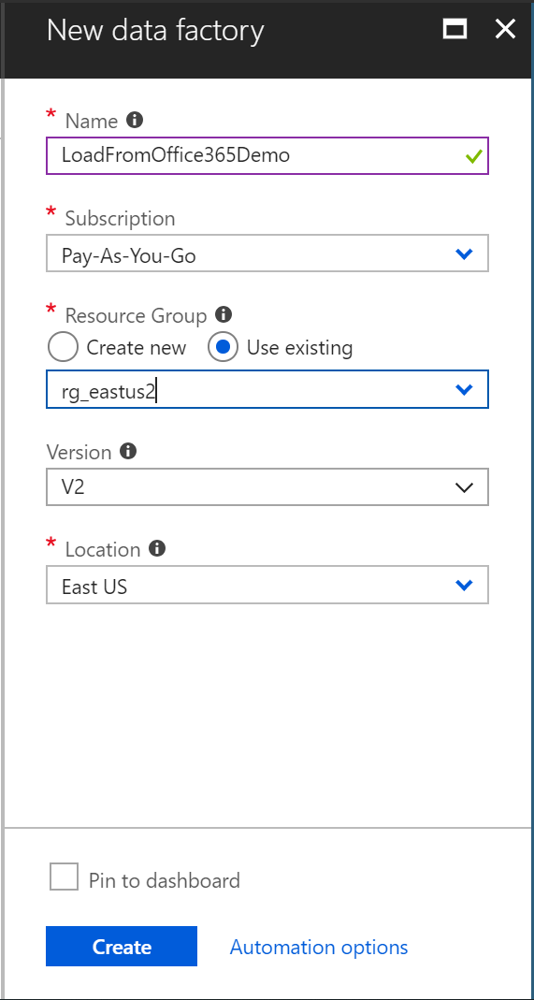
 
    * **Name**: Enter a globally unique name for your Azure data factory. If you receive the error "Data factory name *LoadFromOffice365Demo* is not available", enter a different name for the data factory. For example, you could use the name _**yourname**_**LoadFromOffice365Demo**. Try creating the data factory again. For the naming rules for Data Factory artifacts, see [Data Factory naming rules](naming-rules.md).
    * **Subscription**: Select your Azure subscription in which to create the data factory. 
    * **Resource Group**: Select an existing resource group from the drop-down list, or select the **Create new** option and enter the name of a resource group. To learn about resource groups, see [Using resource groups to manage your Azure resources](../azure-resource-manager/management/overview.md).  
    * **Version**: Select **V2**.
    * **Location**: Select the location for the data factory. Only supported locations are displayed in the drop-down list. The data stores that are used by data factory can be in other locations and regions. These data stores include Azure Data Lake Store, Azure Storage, Azure SQL Database, and so on.

3. Select **Create**.
4. After creation is complete, go to your data factory. You see the **Data Factory** home page as shown in the following image:
   
   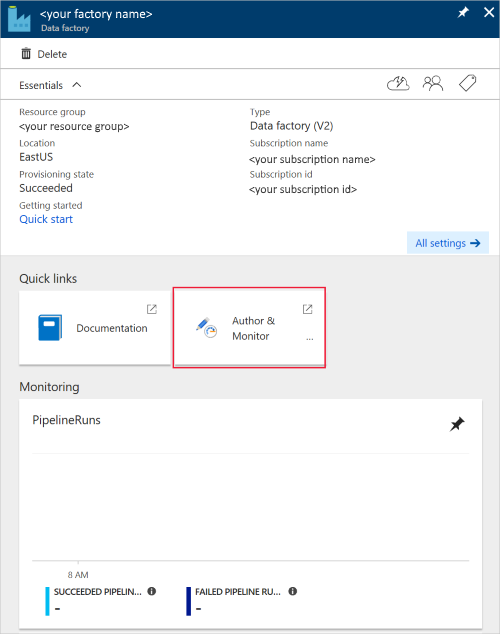

5. Select the **Author & Monitor** tile to launch the Data Integration Application in a separate tab.

## Create a pipeline

1. On the "Let's get started" page, select **Create pipeline**.
 
    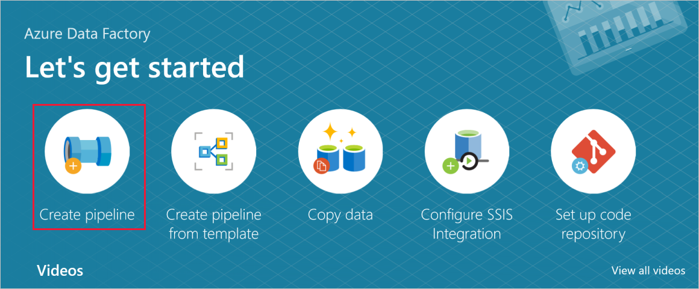

2. In the **General tab** for the pipeline, enter "CopyPipeline" for **Name** of the pipeline.

3. In the Activities tool box > Move & Transform category > drag and drop the **Copy activity** from the tool box to the pipeline designer surface. Specify "CopyFromOffice365ToBlob" as activity name.

### Configure source

1. Go to the pipeline > **Source tab**, click **+ New** to create a source dataset. 

2. In the New Dataset window, select **Office 365**, and then select **Continue**.
 
3. You are now in the copy activity configuration tab. Click on the **Edit** button next to the Office 365 dataset to continue the data configuration.

    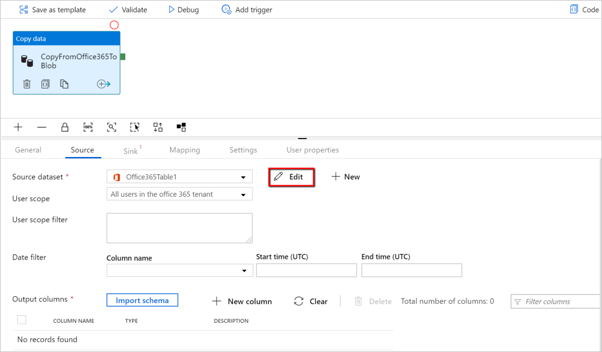
 
4. You see a new tab opened for Office 365 dataset. In the **General tab** at the bottom of the Properties window, enter "SourceOffice365Dataset" for Name.
 
5. Go to the **Connection tab** of the Properties window. Next to the Linked service text box, click **+ New**.

6. In the New Linked Service window, enter "Office365LinkedService" as name, enter the service principal ID and service principal key, then test connection and select **Create** to deploy the linked service.

    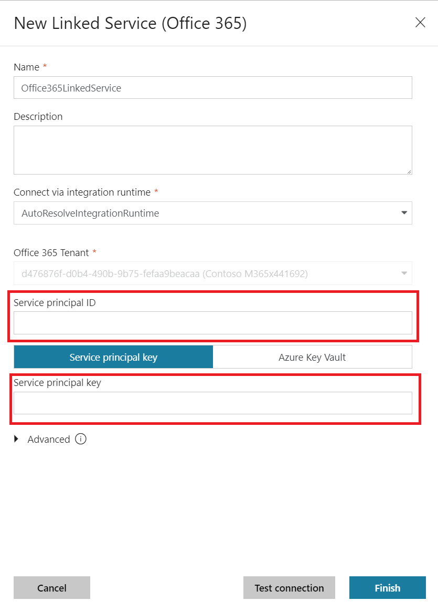
 
7. After the linked service is created, you are back in the dataset settings. Next to **Table**, choose the down-arrow to expand the list of available Office 365 datasets, and choose "BasicDataSet_v0.Message_v0" from the drop-down list:

    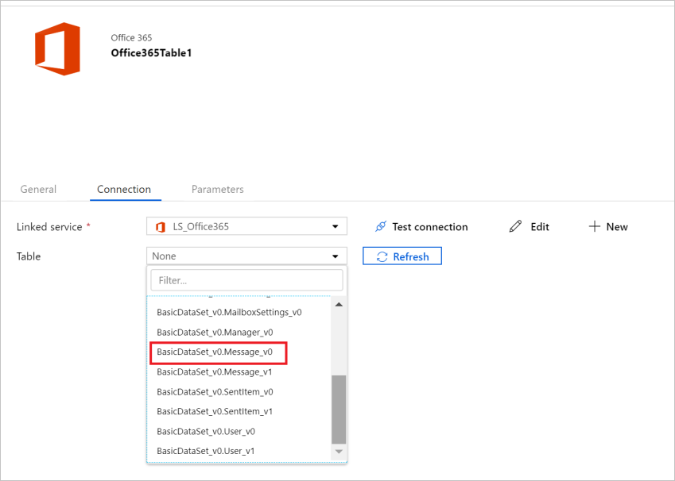

8. Now go back to the **pipeline** > **Source tab** to continue configuring additional properties for Office 365 data extraction.  User scope and user scope filter are optional predicates that you can define to restrict the data you want to extract out of Office 365. See [Office 365 dataset properties](https://docs.microsoft.com/azure/data-factory/connector-office-365#dataset-properties) section for how you configure these settings.

9. You are required to choose one of the date filters and provide the start time and end time values.

10. Click on the **Import Schema** tab to import the schema for Message dataset.

    

### Configure sink

1. Go to the pipeline > **Sink tab**, and select **+ New** to create a sink dataset.
 
2. In the New Dataset window, notice that only the supported destinations are selected when copying from Office 365. Select **Azure Blob Storage**, select Binary format, and then select **Continue**.  In this tutorial, you copy Office 365 data into an Azure Blob Storage.

3. Click on **Edit** button next to the Azure Blob Storage dataset to continue the data configuration.

4. On the **General tab** of the Properties window, in Name, enter "OutputBlobDataset".

5. Go to the **Connection tab** of the Properties window. Next to the Linked service text box, select **+ New**.

6. In the New Linked Service window, enter "AzureStorageLinkedService" as name, select "Service Principal" from the dropdown list of authentication methods, fill in the Service Endpoint, Tenant, Service principal ID, and Service principal key, then select Save to deploy the linked service.  Refer [here](connector-azure-blob-storage.md#service-principal-authentication) for how to set up service principal authentication for Azure Blob Storage.

    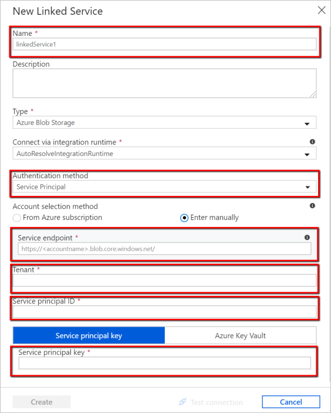

## Validate the pipeline

To validate the pipeline, select **Validate** from the tool bar.

You can also see the JSON code associated with the pipeline by clicking Code on the upper-right.

## Publish the pipeline

In the top toolbar, select **Publish All**. This action publishes entities (datasets, and pipelines) you created to Data Factory.

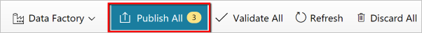 

## Trigger the pipeline manually

Select **Add Trigger** on the toolbar, and then select **Trigger Now**. On the Pipeline Run page, select **Finish**. 

## Monitor the pipeline

Go to the **Monitor** tab on the left. You see a pipeline run that is triggered by a manual trigger. You can use links in the **Actions** column to view activity details and to rerun the pipeline.

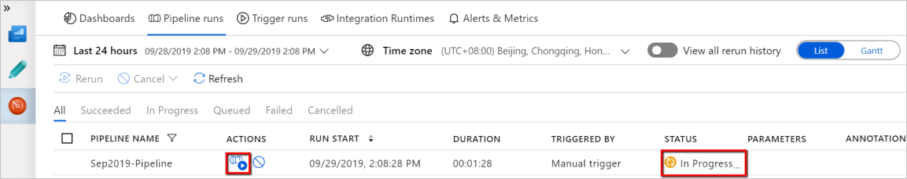 

To see activity runs associated with the pipeline run, select the **View Activity Runs** link in the Actions column. In this example, there is only one activity, so you see only one entry in the list. For details about the copy operation, select the **Details** link (eyeglasses icon) in the Actions column.

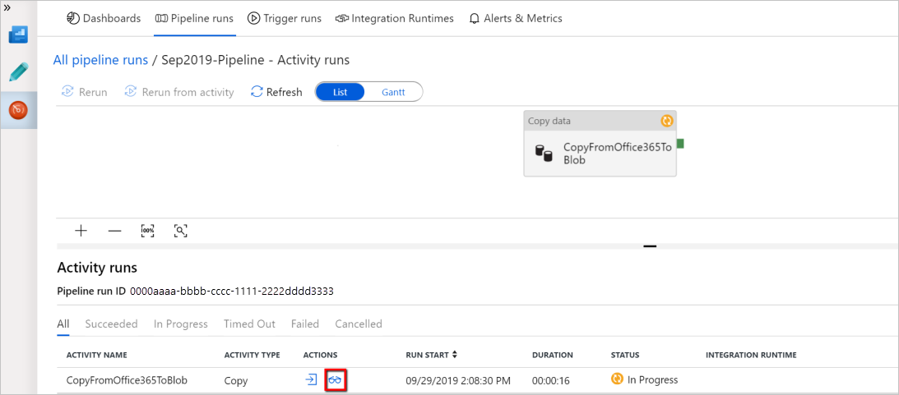 

If this is the first time you are requesting data for this context (a combination of which data table is being access, which destination account is the data being loaded into, and which user identity is making the data access request), you will see the copy activity status as **In Progress**, and only when you click into "Details" link under Actions will you see the status as **RequesetingConsent**.  A member of the data access approver group needs to approve the request in the Privileged Access Management before the data extraction can proceed.

_Status as requesting consent:_
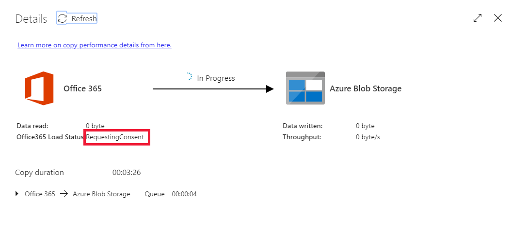 

_Status as extracting data:_

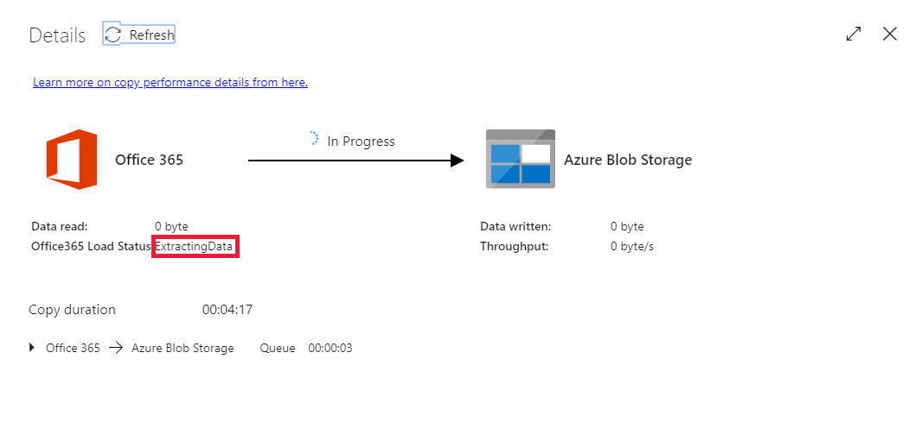 

Once the consent is provided, data extraction will continue and, after some time, the pipeline run will show as succeeded.

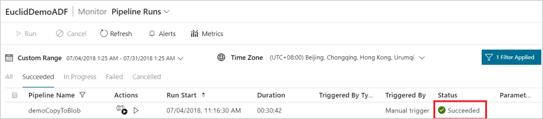 

Now go to the destination Azure Blob Storage and verify that Office 365 data has been extracted in Binary format.

## Next steps

Advance to the following article to learn about Azure SQL Data Warehouse support: 

> [!div class="nextstepaction"]
>[Office 365 connector](connector-office-365.md)