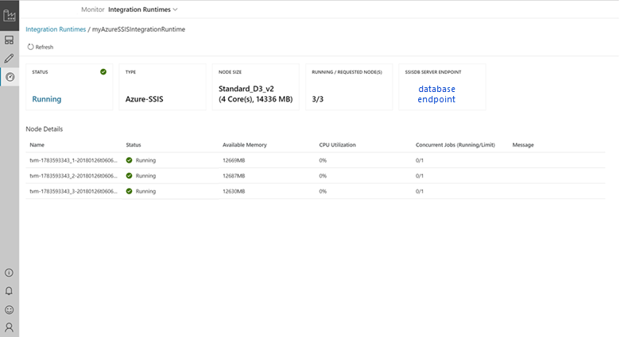

# Monitor an integration runtime in Azure Data Factory  
**Integration runtime** is the compute infrastructure used by Azure Data Factory to provide various data integration capabilities across different network environments. There are three types of integration runtimes offered by Data Factory:

- Azure integration runtime
- Self-hosted integration runtime
- Azure-SSIS integration runtime

[!INCLUDE [updated-for-az](../../includes/updated-for-az.md)]

To get the status of an instance of integration runtime (IR), run the following PowerShell command: 

```powershell
Get-AzDataFactoryV2IntegrationRuntime -DataFactoryName MyDataFactory -ResourceGroupName MyResourceGroup -Name MyAzureIR -Status
``` 

The cmdlet returns different information for different types of integration runtime. This article explains the properties and statuses for each type of integration runtime.  

## Azure integration runtime
The compute resource for an Azure integration runtime is fully managed elastically in Azure. The following table provides descriptions for properties returned by the **Get-AzDataFactoryV2IntegrationRuntime** command:

### Properties
The following table provides descriptions of properties returned by the cmdlet for an Azure integration runtime:

| Property | Description |
-------- | ------------- | 
| Name | Name of the Azure integration runtime. |  
| State | Status of the Azure integration runtime. | 
| Location | Location of the Azure integration runtime. For details about location of an Azure integration runtime, see [Introduction to integration runtime](concepts-integration-runtime.md). |
| DataFactoryName | Name of the data factory that the Azure integration runtime belongs to. | 
| ResourceGroupName | Name of the resource group that the data factory belongs to.  |
| Description | Description of the integration runtime.  |

### Status
The following table provides possible statuses of an Azure integration runtime:

| Status | Comments/Scenarios | 
| ------ | ------------------ |
| Online | The Azure integration runtime is online and ready to be used. | 
| Offline | The Azure integration runtime is offline due to an internal error. |

## Self-hosted integration runtime
This section provides descriptions for properties returned by the Get-AzDataFactoryV2IntegrationRuntime cmdlet. 

> [!NOTE] 
> The returned properties and status contain information about overall self-hosted integration runtime and each node in the runtime.  

### Properties

The following table provides descriptions of monitoring Properties for **each node**:

| Property | Description | 
| -------- | ----------- | 
| Name | Name of the self-hosted integration runtime and nodes associated with it. Node is an on-premises Windows machine that has the self-hosted integration runtime installed on it. |  
| Status | The status of the overall self-hosted integration runtime and each node. Example: Online/Offline/Limited/etc. For information about these statuses, see the next section. | 
| Version | The version of self-hosted integration runtime and each node. The version of the self-hosted integration runtime is determined based on version of majority of nodes in the group. If there are nodes with different versions in the self-hosted integration runtime setup, only the nodes with the same version number as the logical self-hosted integration runtime function properly. Others are in the limited mode and need to be manually updated (only in case auto-update fails). | 
| Available memory | Available memory on a self-hosted integration runtime node. This value is a near real-time snapshot. | 
| CPU utilization | CPU utilization of a self-hosted integration runtime node. This value is a near real-time snapshot. |
| Networking (In/Out) | Network utilization of a self-hosted integration runtime node. This value is a near real-time snapshot. | 
| Concurrent Jobs (Running/ Limit) | **Running**. Number of jobs or tasks running on each node. This value is a near real-time snapshot. <br/><br/>**Limit**. Limit signifies the maximum concurrent jobs for each node. This value is defined based on the machine size. You can increase the limit to scale up concurrent job execution in advanced scenarios, when activities are timing out even when CPU, memory, or network is under-utilized. This capability is also available with a single-node self-hosted integration runtime. |
| Role | There are two types of roles in a multi-node self-hosted integration runtime – dispatcher and worker. All nodes are workers, which means they can all be used to execute jobs. There is only one dispatcher node, which is used to pull tasks/jobs from cloud services and dispatch them to different worker nodes. The dispatcher node is also a worker node. |

Some settings of the properties make more sense when there are two or more nodes in the self-hosted integration runtime (that is, in a scale out scenario).

#### Concurrent jobs limit

The default value of the concurrent jobs limit is set based on the machine size. The factors used to calculate this value depend on the amount of RAM and the number of CPU cores of the machine. So the more cores and the more memory, the higher the default limit of concurrent jobs.

You scale out by increasing the number of nodes. When you increase the number of nodes, the concurrent jobs limit is the sum of the concurrent job limit values of all the available nodes.  For example, if one node lets you run a maximum of twelve concurrent jobs, then adding three more similar nodes lets you run a maximum of  48 concurrent jobs (that is, 4 x 12). We recommend that you increase the concurrent jobs limit only when you see low resource usage with the default values on each node.

You can override the calculated default value in the Azure portal. Select Author > Connections > Integration Runtimes > Edit > Nodes > Modify concurrent job value per node. You can also use the PowerShell [update-Azdatafactoryv2integrationruntimenode](https://docs.microsoft.com/powershell/module/az.datafactory/update-Azdatafactoryv2integrationruntimenode#examples) command.
  
### Status (per node)
The following table provides possible statuses of a self-hosted integration runtime node:

| Status | Description |
| ------ | ------------------ | 
| Online | Node is connected to the Data Factory service. |
| Offline | Node is offline. |
| Upgrading | The node is being auto-updated. |
| Limited | Due to a connectivity issue. May be due to HTTP port 8050 issue, service bus connectivity issue, or a credential sync issue. |
| Inactive | Node is in a configuration different from the configuration of other majority nodes. |

A node can be inactive when it cannot connect to other nodes.

### Status (overall self-hosted integration runtime)
The following table provides possible statuses of a self-hosted integration runtime. This status depends on statuses of all nodes that belong to the runtime. 

| Status | Description |
| ------ | ----------- | 
| Need Registration | No node is registered to this self-hosted integration runtime yet. |
| Online | All nodes are online. |
| Offline | No node is online. |
| Limited | Not all nodes in this self-hosted integration runtime are in a healthy state. This status is a warning that some nodes might be down. This status could be due to a credential sync issue on dispatcher/worker node. |

Use the **Get-AzDataFactoryV2IntegrationRuntimeMetric** cmdlet to fetch the JSON payload containing the detailed self-hosted integration runtime properties, and their snapshot values during the time of execution of the cmdlet.

```powershell
Get-AzDataFactoryV2IntegrationRuntimeMetric -name $integrationRuntimeName -ResourceGroupName $resourceGroupName -DataFactoryName $dataFactoryName  | | ConvertTo-Json 
```

Sample output (assumes that there are two nodes associated with this self-hosted integration runtime):

```json
{
	"IntegrationRuntimeName":  "<Name of your integration runtime>",
    "ResourceGroupName":  "<Resource Group Name>",
    "DataFactoryName":  "<Data Factory Name>",
    "Nodes":  [
		{
			"NodeName":  "<Node Name>",
			"AvailableMemoryInMB":  <Value>,
			"CpuUtilization":  <Value>,
			"ConcurrentJobsLimit":  <Value>,
			"ConcurrentJobsRunning":  <Value>,
			"MaxConcurrentJobs":  <Value>,
			"SentBytes":  <Value>,
			"ReceivedBytes":  <Value>
		},
		{
			"NodeName":  "<Node Name>",
			"AvailableMemoryInMB":  <Value>,
			"CpuUtilization":  <Value>,
			"ConcurrentJobsLimit":  <Value>,
			"ConcurrentJobsRunning":  <Value>,
			"MaxConcurrentJobs":  <Value>,
			"SentBytes":  <Value>,
			"ReceivedBytes":  <Value>
		}

	]
} 
```


## Azure-SSIS integration runtime
Azure-SSIS integration runtime is a fully managed cluster of Azure virtual machines (or nodes) dedicated to run your SSIS packages. It does not run any other activities of Azure Data Factory. Once provisioned, you can query its properties and monitor its overall/node-specific statuses.

### Properties

| Property/Status | Description |
| --------------- | ----------- |
| CreateTime | The UTC time when your Azure-SSIS integration runtime was created. |
| Nodes | The allocated/available nodes of your Azure-SSIS integration runtime with node-specific statuses (starting/available/recycling/unavailable) and actionable errors. |
| OtherErrors | The non-node-specific actionable errors on your Azure-SSIS integration runtime. |
| LastOperation | The result of last start/stop operation on your Azure-SSIS integration runtime with actionable error(s) if it failed. |
| State | The overall status (initial/starting/started/stopping/stopped) of your Azure-SSIS integration runtime. |
| Location | The location of your Azure-SSIS integration runtime. |
| NodeSize | The size of each node of your Azure-SSIS integration runtime. |
| NodeCount | The number of nodes in your Azure-SSIS integration runtime. |
| MaxParallelExecutionsPerNode | The number of parallel executions per node in your Azure-SSIS integration runtime. |
| CatalogServerEndpoint | The endpoint of your existing Azure SQL Database/Managed Instance server to host SSISDB. |
| CatalogAdminUserName | The admin username of your existing Azure SQL Database/Managed Instance server. Data Factory service uses this information to prepare and manage SSISDB on your behalf. |
| CatalogAdminPassword | The admin password of your existing Azure SQL Database/Managed Instance server. |
| CatalogPricingTier | The pricing tier for SSISDB hosted by your existing Azure SQL Database server.  Not applicable to Azure SQL Database Managed Instance hosting SSISDB. |
| VNetId | The virtual network resource ID for your Azure-SSIS integration runtime to join. |
| Subnet | The subnet name for your Azure-SSIS integration runtime to join. |
| ID | The resource ID of your Azure-SSIS integration runtime. |
| Type | The type (Managed/Self-Hosted) of your Azure-SSIS integration runtime. |
| ResourceGroupName | The name of your Azure Resource Group, in which your data factory and Azure-SSIS integration runtime were created. |
| DataFactoryName | The name of your Azure data factory. |
| Name | The name of your Azure-SSIS integration runtime. |
| Description | The description of your Azure-SSIS integration runtime. |

  
### Status (per node)

| Status | Description |
| ------ | ----------- | 
| Starting | This node is being prepared. |
| Available | This node is ready for you to deploy/execute SSIS packages. |
| Recycling | This node is being repaired/restarting. |
| Unavailable | This node is not ready for you to deploy/execute SSIS packages and has actionable errors/issues that you could resolve. |

### Status (overall Azure-SSIS integration runtime)

| Overall status | Description | 
| -------------- | ----------- | 
| Initial | The nodes of your Azure-SSIS integration runtime have not been allocated/prepared. | 
| Starting | The nodes of your Azure-SSIS integration runtime are being allocated/prepared and billing has started. |
| Started | The nodes of your Azure-SSIS integration runtime have been allocated/prepared and they are ready for you to deploy/execute SSIS packages. |
| Stopping  | The nodes of your Azure-SSIS integration runtime are being released. |
| Stopped | The nodes of your Azure-SSIS integration runtime have been released and billing has stopped. |

### Monitor the Azure-SSIS integration runtime in the Azure portal

The following screenshots show how to select the Azure-SSIS IR to monitor, and provide an example of the information that's displayed.




### Monitor the Azure-SSIS integration runtime with PowerShell

Use a script like the following example to check the status of the Azure-SSIS IR.

```powershell
Get-AzDataFactoryV2IntegrationRuntime -DataFactoryName $DataFactoryName -Name $AzureSSISName -ResourceGroupName $ResourceGroupName -Status
```

### More info about the Azure-SSIS integration runtime

See the following articles to learn more about Azure-SSIS integration runtime:

- [Azure-SSIS Integration Runtime](concepts-integration-runtime.md#azure-ssis-integration-runtime). This article provides conceptual information about integration runtimes in general including the Azure-SSIS IR. 
- [Tutorial: deploy SSIS packages to Azure](tutorial-create-azure-ssis-runtime-portal.md). This article provides step-by-step instructions to create an Azure-SSIS IR and uses an Azure SQL database to host the SSIS catalog. 
- [How to: Create an Azure-SSIS integration runtime](create-azure-ssis-integration-runtime.md). This article expands on the tutorial and provides instructions on using Azure SQL Database Managed Instance and joining the IR to a virtual network. 
- [Manage an Azure-SSIS IR](manage-azure-ssis-integration-runtime.md). This article shows you how to stop, start, or remove an Azure-SSIS IR. It also shows you how to scale out your Azure-SSIS IR by adding more nodes to the IR. 
- [Join an Azure-SSIS IR to a virtual network](join-azure-ssis-integration-runtime-virtual-network.md). This article provides conceptual information about joining an Azure-SSIS IR to an Azure virtual network. It also provides steps to use Azure portal to configure the virtual network so that the Azure-SSIS IR can join the virtual network. 

## Next steps
See the following articles for monitoring pipelines in different ways: 

- [Quickstart: create a data factory](quickstart-create-data-factory-dot-net.md).
- [Use Azure Monitor to monitor Data Factory pipelines](monitor-using-azure-monitor.md)
