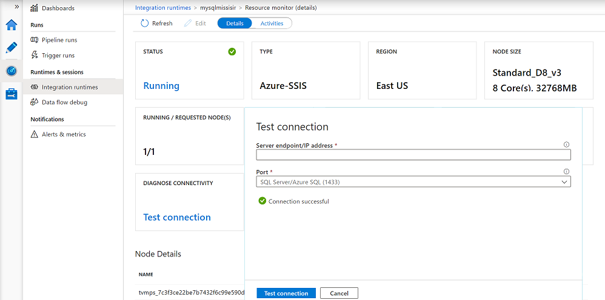

# Monitor an integration runtime in Azure Data Factory

[!INCLUDE[appliesto-adf-xxx-md](includes/appliesto-adf-xxx-md.md)]
  
**Integration runtime** is the compute infrastructure used by Azure Data Factory (ADF) to provide various data integration capabilities across different network environments. There are three types of integration runtimes offered by Data Factory:

- Azure integration runtime
- Self-hosted integration runtime
- Azure-SQL Server Integration Services (SSIS) integration runtime

[!INCLUDE [updated-for-az](../../includes/updated-for-az.md)]

To get the status of an instance of integration runtime (IR), run the following PowerShell command: 

```powershell
Get-AzDataFactoryV2IntegrationRuntime -DataFactoryName MyDataFactory -ResourceGroupName MyResourceGroup -Name MyAzureIR -Status
``` 

The cmdlet returns different information for different types of integration runtime. This article explains the properties and statuses for each type of integration runtime.  

## Azure integration runtime

The compute resource for an Azure integration runtime is fully managed elastically in Azure. The following table provides descriptions for properties returned by the **Get-AzDataFactoryV2IntegrationRuntime** command:

### Properties

The following table provides descriptions of properties returned by the cmdlet for an Azure integration runtime:

| Property | Description |
-------- | ------------- | 
| Name | Name of the Azure integration runtime. |  
| State | Status of the Azure integration runtime. | 
| Location | Location of the Azure integration runtime. For details about location of an Azure integration runtime, see [Introduction to integration runtime](concepts-integration-runtime.md). |
| DataFactoryName | Name of the data factory that the Azure integration runtime belongs to. | 
| ResourceGroupName | Name of the resource group that the data factory belongs to.  |
| Description | Description of the integration runtime.  |

### Status

The following table provides possible statuses of an Azure integration runtime:

| Status | Comments/Scenarios | 
| ------ | ------------------ |
| Online | The Azure integration runtime is online and ready to be used. | 
| Offline | The Azure integration runtime is offline due to an internal error. |

## Self-hosted integration runtime

This section provides descriptions for properties returned by the Get-AzDataFactoryV2IntegrationRuntime cmdlet. 

> [!NOTE] 
> The returned properties and status contain information about overall self-hosted integration runtime and each node in the runtime.  

### Properties

The following table provides descriptions of monitoring Properties for **each node**:

| Property | Description | 
| -------- | ----------- | 
| Name | Name of the self-hosted integration runtime and nodes associated with it. Node is an on-premises Windows machine that has the self-hosted integration runtime installed on it. |  
| Status | The status of the overall self-hosted integration runtime and each node. Example: Online/Offline/Limited/etc. For information about these statuses, see the next section. | 
| Version | The version of self-hosted integration runtime and each node. The version of the self-hosted integration runtime is determined based on version of majority of nodes in the group. If there are nodes with different versions in the self-hosted integration runtime setup, only the nodes with the same version number as the logical self-hosted integration runtime function properly. Others are in the limited mode and need to be manually updated (only in case auto-update fails). | 
| Available memory | Available memory on a self-hosted integration runtime node. This value is a near real-time snapshot. | 
| CPU utilization | CPU utilization of a self-hosted integration runtime node. This value is a near real-time snapshot. |
| Networking (In/Out) | Network utilization of a self-hosted integration runtime node. This value is a near real-time snapshot. | 
| Concurrent Jobs (Running/ Limit) | **Running**. Number of jobs or tasks running on each node. This value is a near real-time snapshot. <br/><br/>**Limit**. Limit signifies the maximum concurrent jobs for each node. This value is defined based on the machine size. You can increase the limit to scale up concurrent job execution in advanced scenarios, when activities are timing out even when CPU, memory, or network is under-utilized. This capability is also available with a single-node self-hosted integration runtime. |
| Role | There are two types of roles in a multi-node self-hosted integration runtime – dispatcher and worker. All nodes are workers, which means they can all be used to execute jobs. There is only one dispatcher node, which is used to pull tasks/jobs from cloud services and dispatch them to different worker nodes. The dispatcher node is also a worker node. |

Some settings of the properties make more sense when there are two or more nodes in the self-hosted integration runtime (that is, in a scale out scenario).

#### Concurrent jobs limit

The default value of the concurrent jobs limit is set based on the machine size. The factors used to calculate this value depend on the amount of RAM and the number of CPU cores of the machine. So the more cores and the more memory, the higher the default limit of concurrent jobs.

You scale out by increasing the number of nodes. When you increase the number of nodes, the concurrent jobs limit is the sum of the concurrent job limit values of all the available nodes.  For example, if one node lets you run a maximum of twelve concurrent jobs, then adding three more similar nodes lets you run a maximum of  48 concurrent jobs (that is, 4 x 12). We recommend that you increase the concurrent jobs limit only when you see low resource usage with the default values on each node.

You can override the calculated default value in the Azure portal. Select Author > Connections > Integration Runtimes > Edit > Nodes > Modify concurrent job value per node. You can also use the PowerShell [update-Azdatafactoryv2integrationruntimenode](/powershell/module/az.datafactory/update-Azdatafactoryv2integrationruntimenode#examples) command.
  
### Status (per node)

The following table provides possible statuses of a self-hosted integration runtime node:

| Status | Description |
| ------ | ------------------ | 
| Online | Node is connected to the Data Factory service. |
| Offline | Node is offline. |
| Upgrading | The node is being auto-updated. |
| Limited | Due to a connectivity issue. May be due to HTTP port 8060 issue, service bus connectivity issue, or a credential sync issue. |
| Inactive | Node is in a configuration different from the configuration of other majority nodes. |

A node can be inactive when it cannot connect to other nodes.

### Status (overall self-hosted integration runtime)

The following table provides possible statuses of a self-hosted integration runtime. This status depends on statuses of all nodes that belong to the runtime. 

| Status | Description |
| ------ | ----------- | 
| Need Registration | No node is registered to this self-hosted integration runtime yet. |
| Online | All nodes are online. |
| Offline | No node is online. |
| Limited | Not all nodes in this self-hosted integration runtime are in a healthy state. This status is a warning that some nodes might be down. This status could be due to a credential sync issue on dispatcher/worker node. |

Use the **Get-AzDataFactoryV2IntegrationRuntimeMetric** cmdlet to fetch the JSON payload containing the detailed self-hosted integration runtime properties, and their snapshot values during the time of execution of the cmdlet.

```powershell
Get-AzDataFactoryV2IntegrationRuntimeMetric -name $integrationRuntimeName -ResourceGroupName $resourceGroupName -DataFactoryName $dataFactoryName | ConvertTo-Json 
```

Sample output (assumes that there are two nodes associated with this self-hosted integration runtime):

```json
{
	"IntegrationRuntimeName":  "<Name of your integration runtime>",
    "ResourceGroupName":  "<Resource Group Name>",
    "DataFactoryName":  "<Data Factory Name>",
    "Nodes":  [
		{
			"NodeName":  "<Node Name>",
			"AvailableMemoryInMB":  <Value>,
			"CpuUtilization":  <Value>,
			"ConcurrentJobsLimit":  <Value>,
			"ConcurrentJobsRunning":  <Value>,
			"MaxConcurrentJobs":  <Value>,
			"SentBytes":  <Value>,
			"ReceivedBytes":  <Value>
		},
		{
			"NodeName":  "<Node Name>",
			"AvailableMemoryInMB":  <Value>,
			"CpuUtilization":  <Value>,
			"ConcurrentJobsLimit":  <Value>,
			"ConcurrentJobsRunning":  <Value>,
			"MaxConcurrentJobs":  <Value>,
			"SentBytes":  <Value>,
			"ReceivedBytes":  <Value>
		}

	]
} 
```

## Azure-SSIS integration runtime

Azure-SSIS IR is a fully managed cluster of Azure virtual machines (VMs or nodes) dedicated to run your SSIS packages. You can invoke SSIS package executions on Azure-SSIS IR using various methods, for example via Azure-enabled SQL Server Data Tools (SSDT), AzureDTExec command line utility, T-SQL on SQL Server Management Studio (SSMS)/SQL Server Agent, and Execute SSIS Package activities in ADF pipelines. Azure-SSIS IR doesn't run any other ADF activities. Once provisioned, you can monitor its overall/node-specific properties and statuses via Azure PowerShell, Azure portal, and Azure Monitor.

### Monitor the Azure-SSIS integration runtime with Azure PowerShell

Use the following Azure PowerShell cmdlet to monitor the overall/node-specific properties and statuses of Azure-SSIS IR.

```powershell
Get-AzDataFactoryV2IntegrationRuntime -DataFactoryName $DataFactoryName -Name $AzureSSISName -ResourceGroupName $ResourceGroupName -Status
```

#### Properties

The following table provides descriptions of properties returned by the above cmdlet for an Azure-SSIS IR.

| Property/Status              | Description                  |
| ---------------------------- | ---------------------------- |
| CreateTime                   | The UTC time when your Azure-SSIS IR was created. |
| Nodes                        | The allocated/available nodes of your Azure-SSIS IR with node-specific statuses (starting/available/recycling/unavailable) and actionable errors. |
| OtherErrors                  | The non-node-specific actionable errors on your Azure-SSIS IR. |
| LastOperation                | The result of last start/stop operation on your Azure-SSIS IR with actionable error(s) if it failed. |
| State                        | The overall status (initial/starting/started/stopping/stopped) of your Azure-SSIS IR. |
| Location                     | The location of your Azure-SSIS IR. |
| NodeSize                     | The size of each node in your Azure-SSIS IR. |
| NodeCount                    | The number of nodes in your Azure-SSIS IR. |
| MaxParallelExecutionsPerNode | The maximum number of parallel executions per node in your Azure-SSIS IR. |
| CatalogServerEndpoint        | The endpoint of your existing Azure SQL Database server or managed instance to host SSIS catalog (SSISDB). |
| CatalogAdminUserName         | The admin username for your existing Azure SQL Database server or managed instance. ADF uses this information to prepare and manage SSISDB on your behalf. |
| CatalogAdminPassword         | The admin password for your existing Azure SQL Database server or managed instance. |
| CatalogPricingTier           | The pricing tier for SSISDB hosted by Azure SQL Database server.  Not applicable to Azure SQL Managed Instance hosting SSISDB. |
| VNetId                       | The virtual network resource ID for your Azure-SSIS IR to join. |
| Subnet                       | The subnet name for your Azure-SSIS IR to join. |
| ID                           | The resource ID of your Azure-SSIS IR. |
| Type                         | The IR type (Managed/Self-Hosted) of your Azure-SSIS IR. |
| ResourceGroupName            | The name of your Azure Resource Group, in which your ADF and Azure-SSIS IR were created. |
| DataFactoryName              | The name of your ADF. |
| Name                         | The name of your Azure-SSIS IR. |
| Description                  | The description of your Azure-SSIS IR. |
  
#### Status (per Azure-SSIS IR node)

The following table provides possible statuses of an Azure-SSIS IR node:

| Node-specific status | Description |
| -------------------- | ----------- | 
| Starting             | This node is being prepared. |
| Available            | This node is ready for you to deploy/execute SSIS packages. |
| Recycling            | This node is being repaired/restarting. |
| Unavailable          | This node isn't ready for you to deploy/execute SSIS packages and has actionable errors/issues that you could resolve. |

#### Status (overall Azure-SSIS IR)

The following table provides possible overall statuses of an Azure-SSIS IR. The overall status in turn depends on the combined statuses of all nodes that belong to the Azure-SSIS IR. 

| Overall status | Description | 
| -------------- | ----------- | 
| Initial        | The nodes of your Azure-SSIS IR haven't been allocated/prepared. | 
| Starting       | The nodes of your Azure-SSIS IR are being allocated/prepared and billing has started. |
| Started        | The nodes of your Azure-SSIS IR have been allocated/prepared and they are ready for you to deploy/execute SSIS packages. |
| Stopping       | The nodes of your Azure-SSIS IR are being released. |
| Stopped        | The nodes of your Azure-SSIS IR have been released and billing has stopped. |

### Monitor the Azure-SSIS integration runtime in Azure portal

To monitor your Azure-SSIS IR in Azure portal, go to the **Integration runtimes** page of **Monitor** hub on ADF UI, where you can see all of your integration runtimes.


Next, select the name of your Azure-SSIS IR to open its monitoring page, where you can see its overall/node-specific properties and statuses. On this page, depending on how you configure the general, deployment, and advanced settings of your Azure-SSIS IR, you'll find various informational/functional tiles.

The **TYPE** and **REGION** informational tiles show the type and region of your Azure-SSIS IR, respectively.

The **NODE SIZE** informational tile shows the SKU (SSIS edition_VM tier_VM series), number of CPU cores, and size of RAM per node for your Azure-SSIS IR. 

The **RUNNING / REQUESTED NODE(S)** informational tile compares the number of nodes currently running to the total number of nodes previously requested for your Azure-SSIS IR.

The **DUAL STANDBY PAIR / ROLE** informational tile shows the name of your dual standby Azure-SSIS IR pair that works in sync with Azure SQL Database/Managed Instance failover group for business continuity and disaster recovery (BCDR) and the current primary/secondary role of your Azure-SSIS IR. When SSISDB failover occurs, your primary and secondary Azure-SSIS IRs will swap roles (see [Configuring your Azure-SSIS IR for BCDR](./configure-bcdr-azure-ssis-integration-runtime.md)).

The functional tiles are described in more details below.


#### STATUS tile

On the **STATUS** tile of your Azure-SSIS IR monitoring page, you can see its overall status, for example **Running** or **Stopped**. Selecting the **Running** status pops up a window with live **Stop** button to stop your Azure-SSIS IR. Selecting the **Stopped** status pops up a window with live **Start** button to start your Azure-SSIS IR. The pop-up window also has an **Execute SSIS package** button to auto-generate an ADF pipeline with Execute SSIS Package activity that runs on your Azure-SSIS IR (see [Running SSIS packages as Execute SSIS Package activities in ADF pipelines](./how-to-invoke-ssis-package-ssis-activity.md)) and a **Resource ID** text box, from which you can copy your Azure-SSIS IR resource ID (`/subscriptions/YourAzureSubscripton/resourcegroups/YourResourceGroup/providers/Microsoft.DataFactory/factories/YourADF/integrationruntimes/YourAzureSSISIR`). The suffix of your Azure-SSIS IR resource ID that contains your ADF and Azure-SSIS IR names forms a cluster ID that can be used to purchase additional premium/licensed SSIS components from independent software vendors (ISVs) and bind them to your Azure-SSIS IR (see [Installing premium/licensed components on your Azure-SSIS IR](./how-to-develop-azure-ssis-ir-licensed-components.md)).


#### SSISDB SERVER ENDPOINT tile

If you use Project Deployment Model where packages are stored in SSISDB hosted by your Azure SQL Database server or managed instance, you'll see the **SSISDB SERVER ENDPOINT** tile on your Azure-SSIS IR monitoring page (see [Configuring your Azure-SSIS IR deployment settings](./tutorial-deploy-ssis-packages-azure.md#deployment-settings-page)). On this tile, you can select a link designating your Azure SQL Database server or managed instance to pop up a window, where you can copy the server endpoint from a text box and use it when connecting from SSMS to deploy, configure, run, and manage your packages. On the pop-up window, you can also select the **See your Azure SQL Database or managed instance settings** link to reconfigure/resize your SSISDB in Azure portal.


#### PROXY / STAGING tile

If you download, install, and configure Self-Hosted IR (SHIR) as a proxy for your Azure-SSIS IR to access data on premises, you'll see the **PROXY / STAGING** tile on your Azure-SSIS IR monitoring page (see [Configuring SHIR as a proxy for your Azure-SSIS IR](./self-hosted-integration-runtime-proxy-ssis.md)). On this tile, you can select a link designating your SHIR to open its monitoring page. You can also select another link designating your Azure Blob Storage for staging to reconfigure its linked service.

#### VALIDATE VNET / SUBNET tile

If you join your Azure-SSIS IR to a VNet, you'll see the **VALIDATE VNET / SUBNET** tile on your Azure-SSIS IR monitoring page (see [Joining your Azure-SSIS IR to a VNet](./join-azure-ssis-integration-runtime-virtual-network.md)). On this tile, you can select a link designating your VNet and subnet to pop up a window, where you can copy your VNet resource ID (`/subscriptions/YourAzureSubscripton/resourceGroups/YourResourceGroup/providers/Microsoft.Network/virtualNetworks/YourARMVNet`) and subnet name from text boxes, as well as validate your VNet and subnet configurations to ensure that the required inbound/outbound network traffics and management of your Azure-SSIS IR aren't obstructed.


#### DIAGNOSE CONNECTIVITY tile

On the **DIAGNOSE CONNECTIVITY** tile of your Azure-SSIS IR monitoring page, you can select the **Test connection** link to pop up a window, where you can check the connections between your Azure-SSIS IR and relevant package/configuration/data stores, as well as management services, via their fully qualified domain name (FQDN)/IP address and designated port (see [Testing connections from your Azure-SSIS IR](./ssis-integration-runtime-diagnose-connectivity-faq.md)).



#### STATIC PUBLIC IP ADDRESSES tile

If you bring your own static public IP addresses for Azure-SSIS IR, you'll see the **STATIC PUBLIC IP ADDRESSES** tile on your Azure-SSIS IR monitoring page (see [Bringing your own static public IP addresses for Azure-SSIS IR](./join-azure-ssis-integration-runtime-virtual-network.md#publicIP)). On this tile, you can select links designating your first/second static public IP addresses for Azure-SSIS IR to pop up a window, where you can copy their resource ID (`/subscriptions/YourAzureSubscripton/resourceGroups/YourResourceGroup/providers/Microsoft.Network/publicIPAddresses/YourPublicIPAddress`) from a text box. On the pop-up window, you can also select the **See your first/second static public IP address settings** link to manage your first/second static public IP address in Azure portal.


#### PACKAGE STORES tile

If you use Package Deployment Model where packages are stored in file system/Azure Files/SQL Server database (MSDB) hosted by your Azure SQL Managed Instance and managed via Azure-SSIS IR package stores, you'll see the **PACKAGE STORES** tile on your Azure-SSIS IR monitoring page (see [Configuring your Azure-SSIS IR deployment settings](./tutorial-deploy-ssis-packages-azure.md#deployment-settings-page)). On this tile, you can select a link designating the number of package stores attached to your Azure-SSIS IR to pop up a window, where you can reconfigure the relevant linked services for your Azure-SSIS IR package stores on top of file system/Azure Files/MSDB hosted by your Azure SQL Managed Instance.


#### ERROR(S) tile

If there are issues with the starting/stopping/maintenance/upgrade of your Azure-SSIS IR, you'll see an additional **ERROR(S)** tile on your Azure-SSIS IR monitoring page. On this tile, you can select a link designating the number of errors generated by your Azure-SSIS IR to pop up a window, where you can see those errors in more details and copy them to find the recommended solutions in our troubleshooting guide (see [Troubleshooting your Azure-SSIS IR](./ssis-integration-runtime-management-troubleshoot.md)).


### Monitor the Azure-SSIS integration runtime with Azure Monitor

To monitor your Azure-SSIS IR with Azure Monitor, see [Monitoring SSIS operations with Azure Monitor](./monitor-using-azure-monitor.md#monitor-ssis-operations-with-azure-monitor).

### More info about the Azure-SSIS integration runtime

See the following articles to learn more about Azure-SSIS integration runtime:

- [Azure-SSIS Integration Runtime](concepts-integration-runtime.md#azure-ssis-integration-runtime). This article provides conceptual information about integration runtimes in general, including the Azure-SSIS IR. 
- [Tutorial: deploy SSIS packages to Azure](./tutorial-deploy-ssis-packages-azure.md). This article provides step-by-step instructions to create your Azure-SSIS IR and use Azure SQL Database to host the SSIS catalog (SSISDB). 
- [How to: Create an Azure-SSIS integration runtime](create-azure-ssis-integration-runtime.md). This article expands on the tutorial and provides instructions on using Azure SQL Managed Instance to host SSISDB. 
- [Manage an Azure-SSIS IR](manage-azure-ssis-integration-runtime.md). This article shows you how to start, stop, or delete your Azure-SSIS IR. It also shows you how to scale it out by adding more nodes. 
- [Join an Azure-SSIS IR to a virtual network](join-azure-ssis-integration-runtime-virtual-network.md). This article provides instructions on joining your Azure-SSIS IR to a virtual network.

## Next steps
See the following articles for monitoring pipelines in different ways: 

- [Quickstart: create a data factory](quickstart-create-data-factory-dot-net.md).
- [Use Azure Monitor to monitor Data Factory pipelines](monitor-using-azure-monitor.md)
