# Alert and Monitor data factories using Azure Monitor
Cloud applications are complex with many moving parts. Monitoring provides data to ensure that your application stays up and running in a healthy state. It also helps you to stave off potential problems or troubleshoot past ones. In addition, you can use monitoring data to gain deep insights about your application. This knowledge can help you to improve application performance or maintainability, or automate actions that would otherwise require manual intervention.

Azure Monitor provides base level infrastructure metrics and logs for most services in Microsoft Azure. For details, see [monitoring overview](https://docs.microsoft.com/azure/monitoring-and-diagnostics/monitoring-overview-azure-monitor). Azure Diagnostic logs are logs emitted by a resource that provide rich, frequent data about the operation of that resource. Data Factory outputs diagnostic logs in Azure Monitor.

## Persist Data Factory Data
Data Factory only stores pipeline run data for 45 days. If you want to persist pipeline run data for more than 45 days, using Azure Monitor, you cannot only route diagnostic logs for analysis, you can persist them into a storage account so you have factory information for the duration of your choosing.

## Diagnostic logs

* Save them to a **Storage Account** for auditing or manual inspection. You can specify the retention time (in days) using the diagnostic settings.
* Stream them to **Event Hubs** for ingestion by a third-party service or custom analytics solution such as Power BI.
* Analyze them with **Log Analytics**

You can use a storage account or event hub namespace that is not in the same subscription as the resource that is emitting logs. The user who configures the setting must have the appropriate role-based access control (RBAC) access to both subscriptions.

## Set up diagnostic logs

### Diagnostic Settings
Diagnostic Logs for non-compute resources are configured using diagnostic settings. Diagnostic settings for a resource control:

* Where diagnostic logs are sent (Storage Account, Event Hubs, or Azure Monitor logs).
* Which log categories are sent.
* How long each log category should be retained in a storage account.
* A retention of zero days means logs are kept forever. Otherwise, the value can be any number of days between 1 and 2147483647.
* If retention policies are set but storing logs in a storage account is disabled (for example, only Event Hubs or Azure Monitor logs options are selected), the retention policies have no effect.
* Retention policies are applied per-day, so at the end of a day (UTC), logs from the day that is now beyond the retention policy are deleted. For example, if you had a retention policy of one day, at the beginning of the day today the logs from the day before yesterday would be deleted.

### Enable diagnostic logs via REST APIs

Create or update a diagnostics setting in Azure Monitor REST API

**Request**
```
PUT
https://management.azure.com/{resource-id}/providers/microsoft.insights/diagnosticSettings/service?api-version={api-version}
```

**Headers**
* Replace `{api-version}` with `2016-09-01`.
* Replace `{resource-id}` with the resource ID of the resource for which you would like to edit diagnostic settings. For more information [Using Resource groups to manage your Azure resources](../azure-resource-manager/manage-resource-groups-portal.md).
* Set the `Content-Type` header to `application/json`.
* Set the authorization header to a JSON web token that you obtain from Azure Active Directory. For more information, see [Authenticating requests](../active-directory/develop/authentication-scenarios.md).

**Body**
```json
{
    "properties": {
        "storageAccountId": "/subscriptions/<subID>/resourceGroups/<resourceGroupName>/providers/Microsoft.Storage/storageAccounts/<storageAccountName>",
        "serviceBusRuleId": "/subscriptions/<subID>/resourceGroups/<resourceGroupName>/providers/Microsoft.EventHub/namespaces/<eventHubName>/authorizationrules/RootManageSharedAccessKey",
        "workspaceId": "/subscriptions/<subID>/resourceGroups/<resourceGroupName>/providers/Microsoft.OperationalInsights/workspaces/<LogAnalyticsName>",
        "metrics": [
        ],
        "logs": [
                {
                    "category": "PipelineRuns",
                    "enabled": true,
                    "retentionPolicy": {
                        "enabled": false,
                        "days": 0
                    }
                },
                {
                    "category": "TriggerRuns",
                    "enabled": true,
                    "retentionPolicy": {
                        "enabled": false,
                        "days": 0
                    }
                },
                {
                    "category": "ActivityRuns",
                    "enabled": true,
                    "retentionPolicy": {
                        "enabled": false,
                        "days": 0
                    }
                }
            ]
    },
    "location": ""
}
```

| Property | Type | Description |
| --- | --- | --- |
| storageAccountId |String | The resource ID of the storage account to which you would like to send Diagnostic Logs |
| serviceBusRuleId |String | The service bus rule ID of the service bus namespace in which you would like to have Event Hubs created for streaming Diagnostic Logs. The rule ID is of the format: "{service bus resource ID}/authorizationrules/{key name}".|
| workspaceId | Complex Type | Array of metric time grains and their retention policies. Currently, this property is empty. |
|metrics| Parameter values of the pipeline run to be passed to the invoked pipeline| A JSON object mapping parameter names to argument values |
| logs| Complex Type| Name of a Diagnostic Log category for a resource type. To obtain the list of Diagnostic Log categories for a resource, first perform a GET diagnostic settings operation. |
| category| String| Array of log categories and their retention policies |
| timeGrain | String | The granularity of metrics that are captured in ISO 8601 duration format. Must be PT1M (one minute)|
| enabled| Boolean | Specifies whether collection of that metric or log category is enabled for this resource|
| retentionPolicy| Complex Type| Describes the retention policy for a metric or log category. Used for storage account option only.|
| days| Int| Number of days to retain the metrics or logs. A value of 0 retains the logs indefinitely. Used for storage account option only. |

**Response**

200 OK


```json
{
    "id": "/subscriptions/<subID>/resourcegroups/adf/providers/microsoft.datafactory/factories/shloadobetest2/providers/microsoft.insights/diagnosticSettings/service",
    "type": null,
    "name": "service",
    "location": null,
    "kind": null,
    "tags": null,
    "properties": {
        "storageAccountId": "/subscriptions/<subID>/resourceGroups/<resourceGroupName>//providers/Microsoft.Storage/storageAccounts/<storageAccountName>",
        "serviceBusRuleId": "/subscriptions/<subID>/resourceGroups/<resourceGroupName>//providers/Microsoft.EventHub/namespaces/<eventHubName>/authorizationrules/RootManageSharedAccessKey",
        "workspaceId": "/subscriptions/<subID>/resourceGroups/<resourceGroupName>//providers/Microsoft.OperationalInsights/workspaces/<LogAnalyticsName>",
        "eventHubAuthorizationRuleId": null,
        "eventHubName": null,
        "metrics": [],
        "logs": [
            {
                "category": "PipelineRuns",
                "enabled": true,
                "retentionPolicy": {
                    "enabled": false,
                    "days": 0
                }
            },
            {
                "category": "TriggerRuns",
                "enabled": true,
                "retentionPolicy": {
                    "enabled": false,
                    "days": 0
                }
            },
            {
                "category": "ActivityRuns",
                "enabled": true,
                "retentionPolicy": {
                    "enabled": false,
                    "days": 0
                }
            }
        ]
    },
    "identity": null
}
```

Get information about diagnostics setting in Azure Monitor REST API

**Request**
```
GET
https://management.azure.com/{resource-id}/providers/microsoft.insights/diagnosticSettings/service?api-version={api-version}
```

**Headers**
* Replace `{api-version}` with `2016-09-01`.
* Replace `{resource-id}` with the resource ID of the resource for which you would like to edit diagnostic settings. For more information Using Resource groups to manage your Azure resources.
* Set the `Content-Type` header to `application/json`.
* Set the authorization header to a JSON Web Token that you obtain from Azure Active Directory. For more information, see Authenticating requests.

**Response**

200 OK

```json
{
    "id": "/subscriptions/<subID>/resourcegroups/adf/providers/microsoft.datafactory/factories/shloadobetest2/providers/microsoft.insights/diagnosticSettings/service",
    "type": null,
    "name": "service",
    "location": null,
    "kind": null,
    "tags": null,
    "properties": {
        "storageAccountId": "/subscriptions/<subID>/resourceGroups/shloprivate/providers/Microsoft.Storage/storageAccounts/azmonlogs",
        "serviceBusRuleId": "/subscriptions/<subID>/resourceGroups/shloprivate/providers/Microsoft.EventHub/namespaces/shloeventhub/authorizationrules/RootManageSharedAccessKey",
        "workspaceId": "/subscriptions/<subID>/resourceGroups/ADF/providers/Microsoft.OperationalInsights/workspaces/mihaipie",
        "eventHubAuthorizationRuleId": null,
        "eventHubName": null,
        "metrics": [],
        "logs": [
            {
                "category": "PipelineRuns",
                "enabled": true,
                "retentionPolicy": {
                    "enabled": false,
                    "days": 0
                }
            },
            {
                "category": "TriggerRuns",
                "enabled": true,
                "retentionPolicy": {
                    "enabled": false,
                    "days": 0
                }
            },
            {
                "category": "ActivityRuns",
                "enabled": true,
                "retentionPolicy": {
                    "enabled": false,
                    "days": 0
                }
            }
        ]
    },
    "identity": null
}
```
[More info here](https://docs.microsoft.com/rest/api/monitor/diagnosticsettings)

## Schema of Logs & Events

### Activity Run Logs Attributes

```json
{
   "Level": "",
   "correlationId":"",
   "time":"",
   "activityRunId":"",
   "pipelineRunId":"",
   "resourceId":"",
   "category":"ActivityRuns",
   "level":"Informational",
   "operationName":"",
   "pipelineName":"",
   "activityName":"",
   "start":"",
   "end":"",
   "properties":
       {
          "Input": "{
              "source": {
                "type": "BlobSource"
              },
              "sink": {
                "type": "BlobSink"
              }
           }",
          "Output": "{"dataRead":121,"dataWritten":121,"copyDuration":5,
               "throughput":0.0236328132,"errors":[]}",
          "Error": "{
              "errorCode": "null",
              "message": "null",
              "failureType": "null",
              "target": "CopyBlobtoBlob"
        }
    }
}
```

| Property | Type | Description | Example |
| --- | --- | --- | --- |
| Level |String | Level of the diagnostic logs. Level 4 always is the case for activity run logs. | `4`  |
| correlationId |String | Unique ID to track a particular request end-to-end | `319dc6b4-f348-405e-b8d7-aafc77b73e77` |
| time | String | Time of the event in timespan, UTC format `YYYY-MM-DDTHH:MM:SS.00000Z` | `2017-06-28T21:00:27.3534352Z` |
|activityRunId| String| ID of the activity run | `3a171e1f-b36e-4b80-8a54-5625394f4354` |
|pipelineRunId| String| ID of the pipeline run | `9f6069d6-e522-4608-9f99-21807bfc3c70` |
|resourceId| String | Associated resource ID for the data factory resource | `/SUBSCRIPTIONS/<subID>/RESOURCEGROUPS/<resourceGroupName>/PROVIDERS/MICROSOFT.DATAFACTORY/FACTORIES/<dataFactoryName>` |
|category| String | Category of Diagnostic Logs. Set this property to "ActivityRuns" | `ActivityRuns` |
|level| String | Level of the diagnostic logs. Set this property to "Informational" | `Informational` |
|operationName| String |Name of the activity with status. If the status is the start heartbeat, it is `MyActivity -`. If the status is the end heartbeat, it is `MyActivity - Succeeded` with final status | `MyActivity - Succeeded` |
|pipelineName| String | Name of the pipeline | `MyPipeline` |
|activityName| String | Name of the activity | `MyActivity` |
|start| String | Start of the activity run in timespan, UTC format | `2017-06-26T20:55:29.5007959Z`|
|end| String | Ends of the activity run in timespan, UTC format. If the activity has not ended yet (diagnostic log for an activity starting), a default value of `1601-01-01T00:00:00Z` is set.  | `2017-06-26T20:55:29.5007959Z` |

### Pipeline Run Logs Attributes

```json
{
   "Level": "",
   "correlationId":"",
   "time":"",
   "runId":"",
   "resourceId":"",
   "category":"PipelineRuns",
   "level":"Informational",
   "operationName":"",
   "pipelineName":"",
   "start":"",
   "end":"",
   "status":"",
   "properties":
    {
      "Parameters": {
        "<parameter1Name>": "<parameter1Value>"
      },
      "SystemParameters": {
        "ExecutionStart": "",
        "TriggerId": "",
        "SubscriptionId": ""
      }
    }
}
```

| Property | Type | Description | Example |
| --- | --- | --- | --- |
| Level |String | Level of the diagnostic logs. Level 4 is the case for activity run logs. | `4`  |
| correlationId |String | Unique ID to track a particular request end-to-end | `319dc6b4-f348-405e-b8d7-aafc77b73e77` |
| time | String | Time of the event in timespan, UTC format `YYYY-MM-DDTHH:MM:SS.00000Z` | `2017-06-28T21:00:27.3534352Z` |
|runId| String| ID of the pipeline run | `9f6069d6-e522-4608-9f99-21807bfc3c70` |
|resourceId| String | Associated resource ID for the data factory resource | `/SUBSCRIPTIONS/<subID>/RESOURCEGROUPS/<resourceGroupName>/PROVIDERS/MICROSOFT.DATAFACTORY/FACTORIES/<dataFactoryName>` |
|category| String | Category of Diagnostic Logs. Set this property to "PipelineRuns" | `PipelineRuns` |
|level| String | Level of the diagnostic logs. Set this property to  "Informational" | `Informational` |
|operationName| String |Name of the pipeline with status. "Pipeline - Succeeded" with final status when pipeline run is completed| `MyPipeline - Succeeded` |
|pipelineName| String | Name of the pipeline | `MyPipeline` |
|start| String | Start of the activity run in timespan, UTC format | `2017-06-26T20:55:29.5007959Z`|
|end| String | End of the activity runs in timespan, UTC format. If the activity has not ended yet (diagnostic log for an activity starting), a default value of `1601-01-01T00:00:00Z` is set.  | `2017-06-26T20:55:29.5007959Z` |
|status| String | Final status of the pipeline run (Succeeded or Failed) | `Succeeded`|

### Trigger Run Logs Attributes

```json
{
   "Level": "",
   "correlationId":"",
   "time":"",
   "triggerId":"",
   "resourceId":"",
   "category":"TriggerRuns",
   "level":"Informational",
   "operationName":"",
   "triggerName":"",
   "triggerType":"",
   "triggerEvent":"",
   "start":"",
   "status":"",
   "properties":
   {
      "Parameters": {
        "TriggerTime": "",
       "ScheduleTime": ""
      },
      "SystemParameters": {}
    }
}

```

| Property | Type | Description | Example |
| --- | --- | --- | --- |
| Level |String | Level of the diagnostic logs. Set to level 4 for activity run logs. | `4`  |
| correlationId |String | Unique ID to track a particular request end-to-end | `319dc6b4-f348-405e-b8d7-aafc77b73e77` |
| time | String | Time of the event in timespan, UTC format `YYYY-MM-DDTHH:MM:SS.00000Z` | `2017-06-28T21:00:27.3534352Z` |
|triggerId| String| ID of the trigger run | `08587023010602533858661257311` |
|resourceId| String | Associated resource ID for the data factory resource | `/SUBSCRIPTIONS/<subID>/RESOURCEGROUPS/<resourceGroupName>/PROVIDERS/MICROSOFT.DATAFACTORY/FACTORIES/<dataFactoryName>` |
|category| String | Category of Diagnostic Logs. Set this property to "PipelineRuns" | `PipelineRuns` |
|level| String | Level of the diagnostic logs. Set this property to "Informational" | `Informational` |
|operationName| String |Name of the trigger with final status whether it successfully fired. "MyTrigger - Succeeded" if the heartbeat was successful| `MyTrigger - Succeeded` |
|triggerName| String | Name of the trigger | `MyTrigger` |
|triggerType| String | Type of the trigger (Manual trigger or Schedule Trigger) | `ScheduleTrigger` |
|triggerEvent| String | Event of the trigger | `ScheduleTime - 2017-07-06T01:50:25Z` |
|start| String | Start of trigger fire in timespan, UTC format | `2017-06-26T20:55:29.5007959Z`|
|status| String | Final status of whether trigger successfully fired (Succeeded or Failed) | `Succeeded`|

## Metrics

Azure Monitor enables you to consume telemetry to gain visibility into the performance and health of your workloads on Azure. The most important type of Azure telemetry data is the metrics (also called performance counters) emitted by most Azure resources. Azure Monitor provides several ways to configure and consume these metrics for monitoring and troubleshooting.

ADFV2 emits the following metrics

| **Metric**           | **Metric Display Name**         | **Unit** | **Aggregation Type** | **Description**                                       |
|----------------------|---------------------------------|----------|----------------------|-------------------------------------------------------|
| PipelineSucceededRuns | Succeeded pipeline runs metrics | Count    | Total                | Total pipelines runs succeeded within a minute window |
| PipelineFailedRuns   | Failed pipeline runs metrics    | Count    | Total                | Total pipelines runs failed within a minute window    |
| ActivitySucceededRuns | Succeeded activity runs metrics | Count    | Total                | Total activity runs succeeded within a minute window  |
| ActivityFailedRuns   | Failed activity runs metrics    | Count    | Total                | Total activity runs failed within a minute window     |
| TriggerSucceededRuns | Succeeded trigger runs metrics  | Count    | Total                | Total trigger runs succeeded within a minute window   |
| TriggerFailedRuns    | Failed trigger runs metrics     | Count    | Total                | Total trigger runs failed within a minute window      |

To access the metrics, follow the instructions in the article - https://docs.microsoft.com/azure/monitoring-and-diagnostics/monitoring-overview-metrics

## Monitor Data Factory Metrics with Azure Monitor

You can use Azure Data Factory integration with Azure Monitor to route data to Azure Monitor. This integration is useful in the following scenarios:

1.  You want to write complex queries on a rich set of metrics that is published by Data Factory to Azure Monitor. You can also create custom alerts on these queries via Azure Monitor.

2.  You want to monitor across data factories. You can route data from multiple data factories to a single Azure Monitor workspace.

For a seven-minute introduction and demonstration of this feature, watch the following video:

> [!VIDEO https://channel9.msdn.com/Shows/Azure-Friday/Monitor-Data-Factory-pipelines-using-Operations-Management-Suite-OMS/player]

### Configure Diagnostic Settings and Workspace

Enable Diagnostic Settings for your data factory.

1.  Select **Azure Monitor** -> **Diagnostics settings** -> Select the data factory -> Turn on diagnostics.

    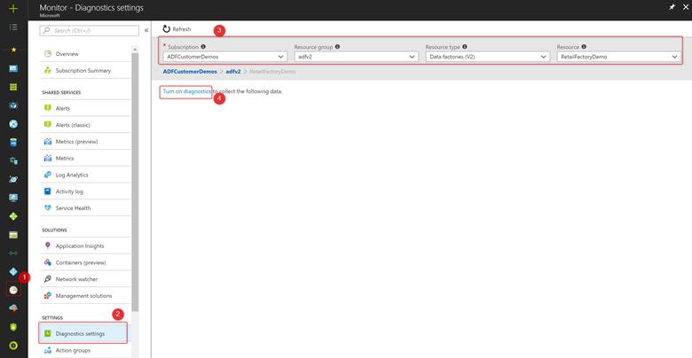

2.  Provide diagnostic settings including configuration of the workspace.

    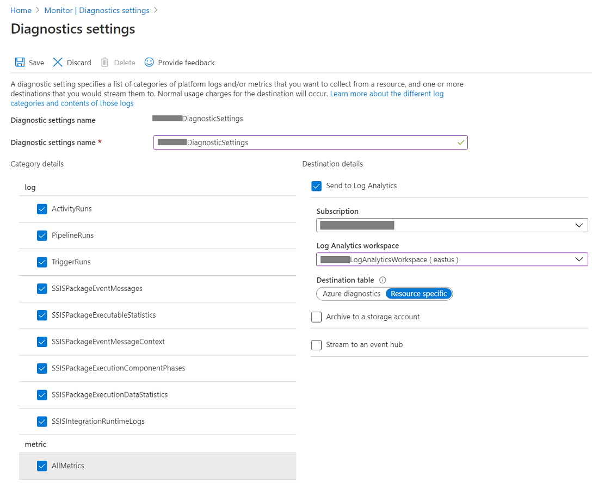

### Install Azure Data Factory Analytics from Azure Marketplace

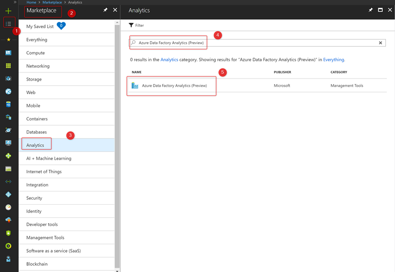

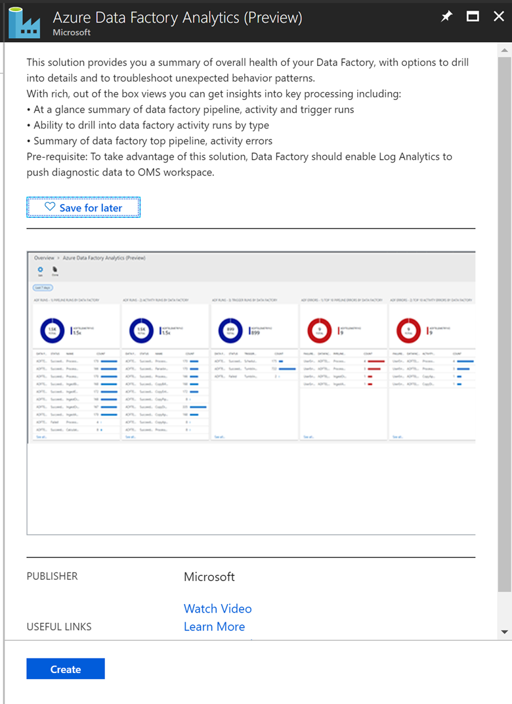

Click **Create** and select the Workspace and Workspace settings.

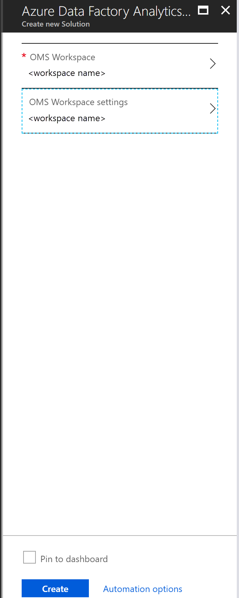

### Monitor Data Factory Metrics

Installing **Azure Data Factory Analytics** creates a default set of views that enables the following metrics:

- ADF Runs- 1) Pipeline Runs by Data Factory

- ADF Runs- 2) Activity Runs by Data Factory

- ADF Runs- 3) Trigger Runs by Data Factory

- ADF Errors- 1) Top 10 Pipeline Errors by Data Factory

- ADF Errors- 2) Top 10 Activity Runs by Data Factory

- ADF Errors- 3) Top 10 Trigger Errors by Data Factory

- ADF Statistics- 1) Activity Runs by Type

- ADF Statistics- 2) Trigger Runs by Type

- ADF Statistics- 3) Max Pipeline Runs Duration

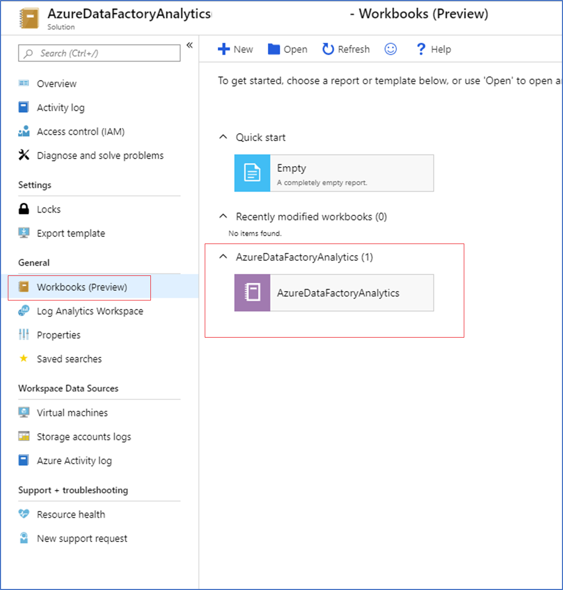

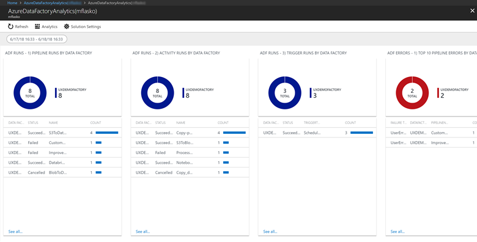

You can visualize the above metrics, look at the queries behind these metrics, edit the queries, create alerts, and so forth.

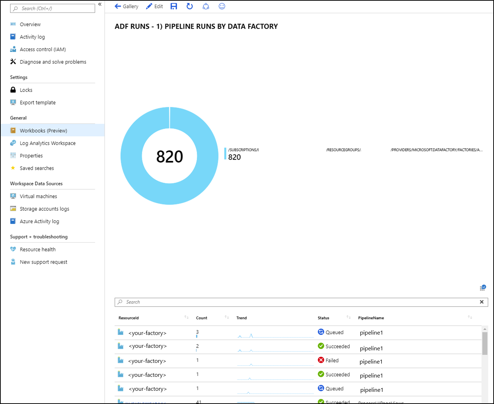

## Alerts

Log in to the Azure portal and click **Monitor -&gt; Alerts** to create alerts.

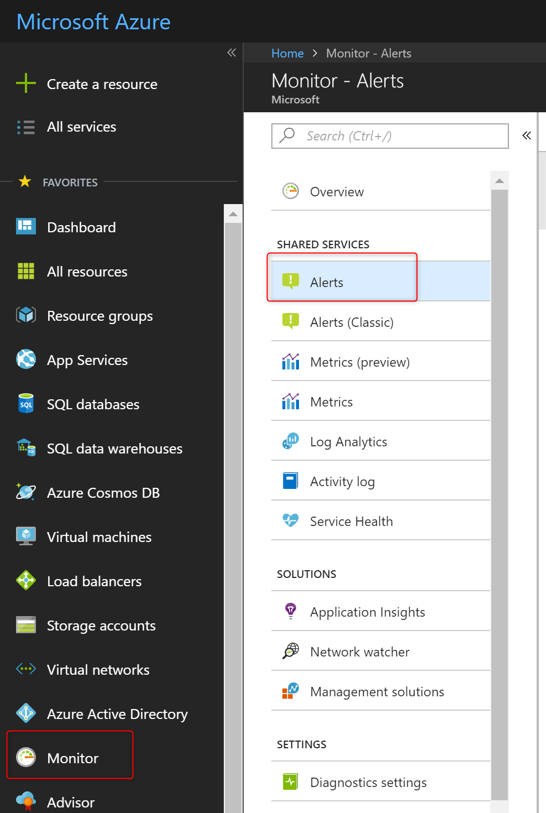

### Create Alerts

1.  Click **+ New Alert rule** to create a new alert.

    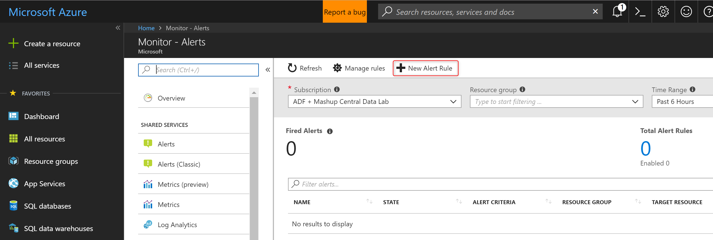

2.  Define the **Alert condition**.

    > [!NOTE]
    > Make sure to select **All** in the **Filter by resource type**.

    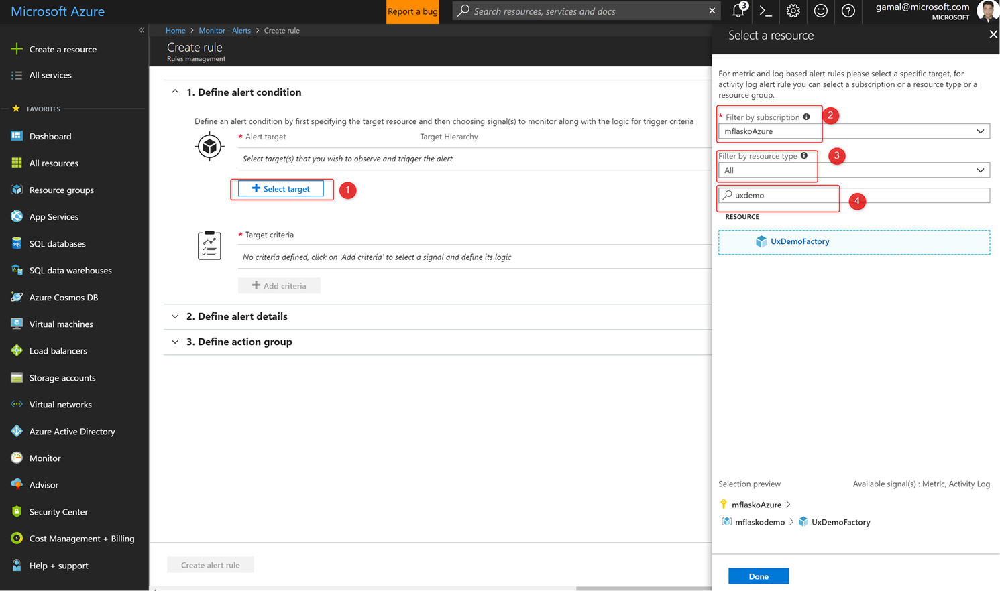

    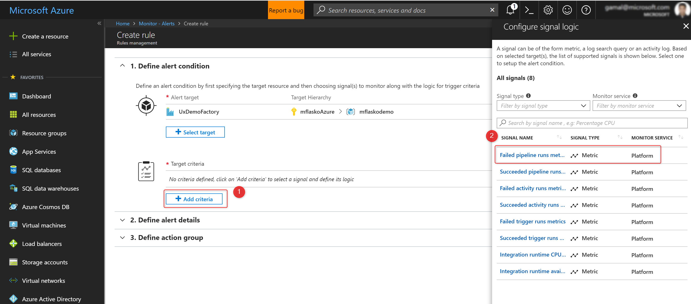

    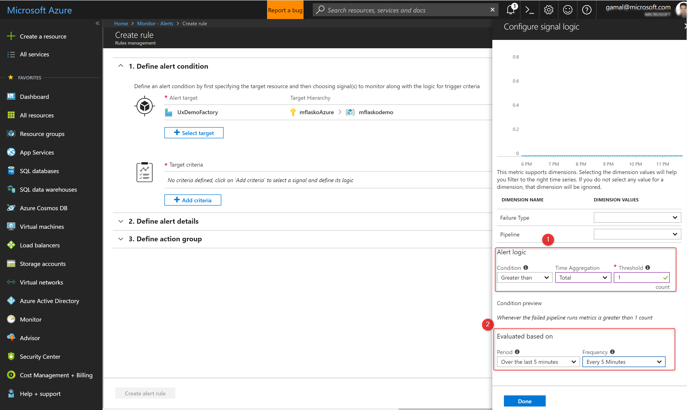

3.  Define the **Alert details**.

    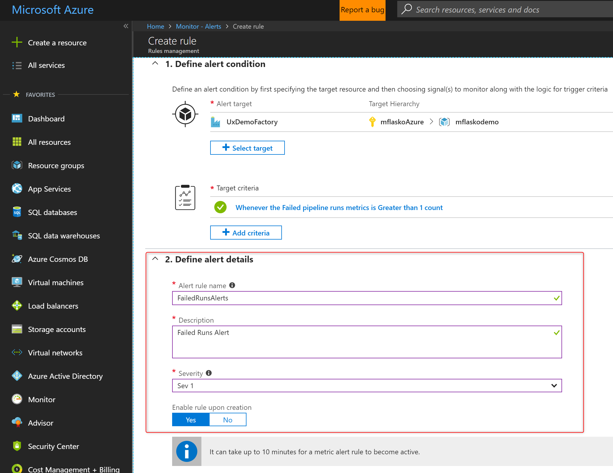

4.  Define the **Action group**.

    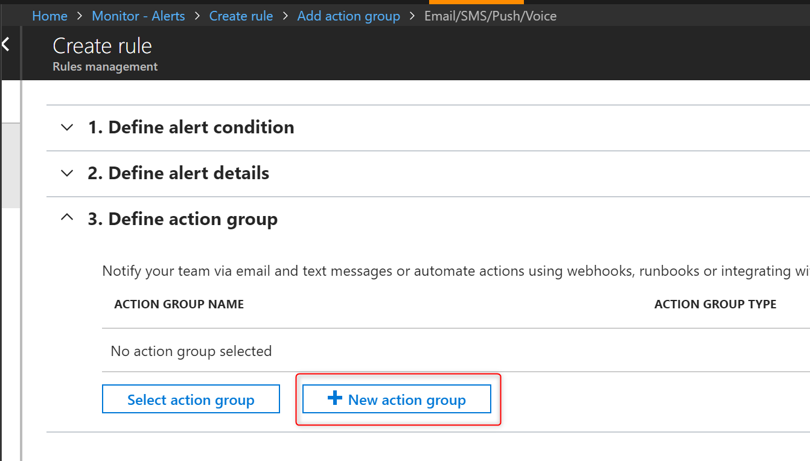

    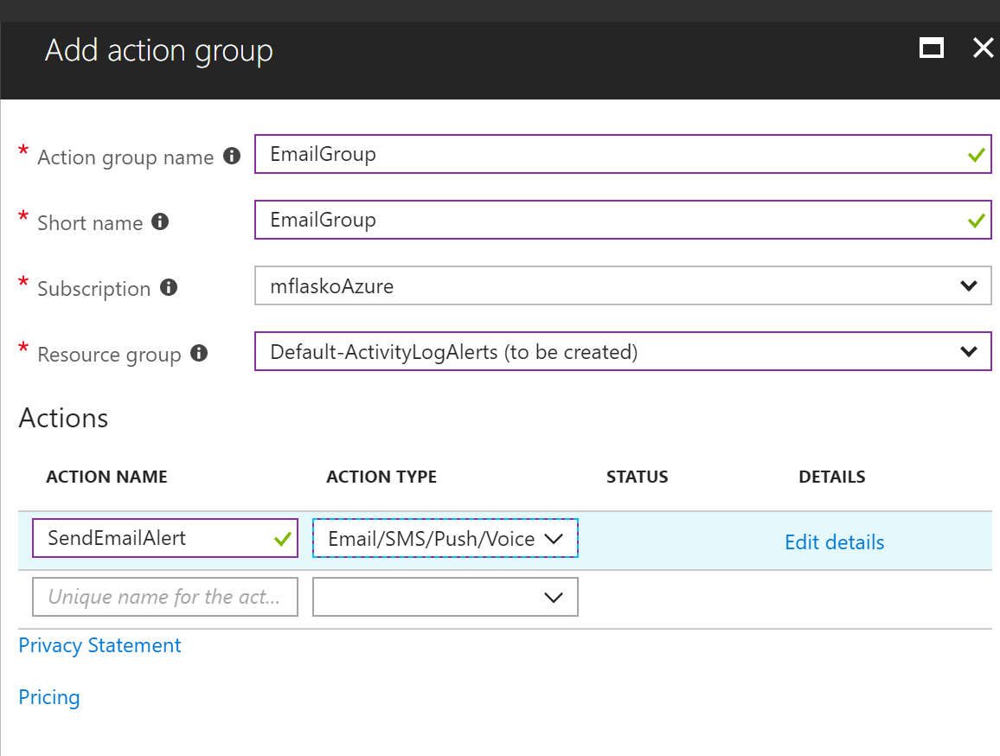

    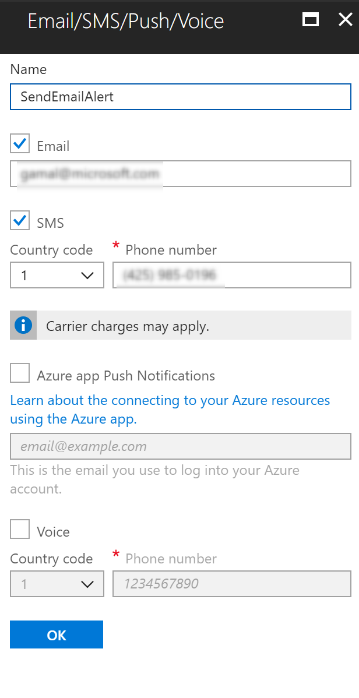

    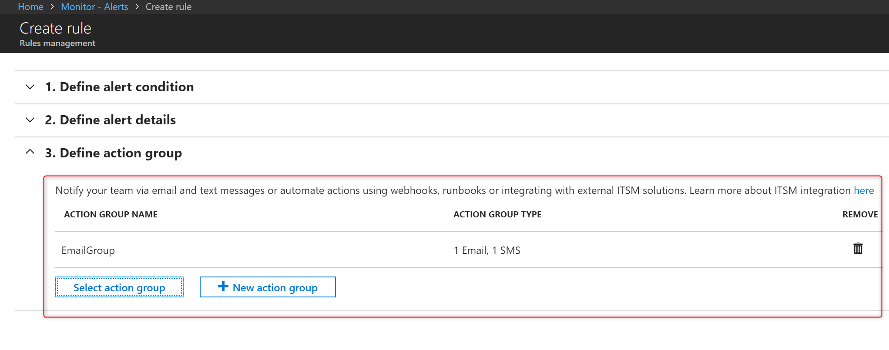

## Next steps

See [Monitor and manage pipelines programmatically](monitor-programmatically.md) article to learn about monitoring and managing pipelines with code.
