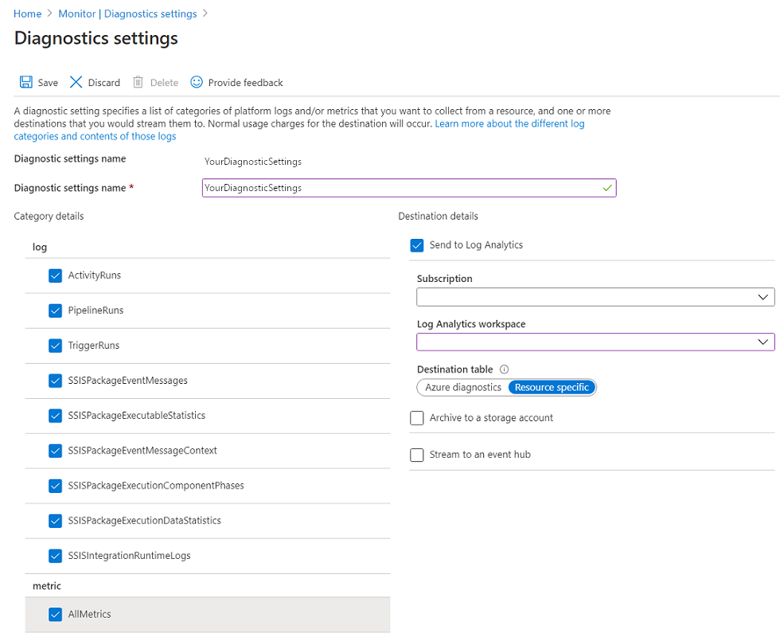

# Monitor and Alert Data Factory by using Azure Monitor

[!INCLUDE[appliesto-adf-xxx-md](includes/appliesto-adf-xxx-md.md)]

Cloud applications are complex and have many moving parts. Monitors provide data to help ensure that your applications stay up and running in a healthy state. Monitors also help you avoid potential problems and troubleshoot past ones. You can use monitoring data to gain deep insights about your applications. This knowledge helps you improve application performance and maintainability. It also helps you automate actions that otherwise require manual intervention.

Azure Monitor provides base-level infrastructure metrics and logs for most Azure services. Azure diagnostic logs are emitted by a resource and provide rich, frequent data about the operation of that resource. Azure Data Factory (ADF) can write diagnostic logs in Azure Monitor. For a seven-minute introduction and demonstration of this feature, watch the following video:

> [!VIDEO https://channel9.msdn.com/Shows/Azure-Friday/Monitor-Data-Factory-pipelines-using-Operations-Management-Suite-OMS/player]

For further details, see [Azure Monitor overview](https://docs.microsoft.com/azure/monitoring-and-diagnostics/monitoring-overview-azure-monitor).

## Keeping Azure Data Factory metrics and pipeline-run data

Data Factory stores pipeline-run data for only 45 days. Use Azure Monitor if you want to keep that data for a longer time. With Monitor, you can route diagnostic logs for analysis to multiple different targets.

* **Storage Account**: Save your diagnostic logs to a storage account for auditing or manual inspection. You can use the diagnostic settings to specify the retention time in days.
* **Event Hub**: Stream the logs to Azure Event Hubs. The logs become input to a partner service or to a custom analytics solution like Power BI.
* **Log Analytics**: Analyze the logs with Log Analytics. The Data Factory integration with Azure Monitor is useful in the following scenarios:
  * You want to write complex queries on a rich set of metrics that are published by Data Factory to Monitor. You can create custom alerts on these queries via Monitor.
  * You want to monitor across data factories. You can route data from multiple data factories to a single Monitor workspace.

You can also use a storage account or event-hub namespace that isn't in the subscription of the resource that emits logs. The user who configures the setting must have appropriate role-based access control (RBAC) access to both subscriptions.

## Configure diagnostic settings and workspace

Create or add diagnostic settings for your data factory.

1. In the portal, go to Monitor. Select **Settings** > **Diagnostic settings**.

1. Select the data factory for which you want to set a diagnostic setting.

1. If no settings exist on the selected data factory, you're prompted to create a setting. Select **Turn on diagnostics**.

   

   If there are existing settings on the data factory, you see a list of settings already configured on the data factory. Select **Add diagnostic setting**.

   

1. Give your setting a name, select **Send to Log Analytics**, and then select a workspace from **Log Analytics Workspace**.

    * In _Azure-Diagnostics_ mode, diagnostic logs flow into the _AzureDiagnostics_ table.

    * In _Resource-Specific_ mode, diagnostic logs from Azure Data Factory flow into the _ADFActivityRun_, _ADFPipelineRun_, _ADFTriggerRun_, _ADFSSISIntegrationRuntimeLogs_, _ADFSSISPackageEventMessageContext_, _ADFSSISPackageEventMessages_, _ADFSSISPackageExecutableStatistics_, _ADFSSISPackageExecutionComponentPhases_, and _ADFSSISPackageExecutionDataStatistics_ tables.

      You can select various logs relevant to your workloads to send to Log Analytics tables. For example, if you don't use SQL Server Integration Services (SSIS) at all, you need not select any SSIS logs. If you want to log SSIS Integration Runtime (IR) start/stop/maintenance operations, you can select SSIS IR logs. If you invoke SSIS package executions only via T-SQL, you can select only SSIS package logs. If you invoke SSIS package executions via Execute SSIS Package activities in ADF pipelines, you can select all logs.

    * If you select _AllMetrics_, the metrics for ADF entity count/size, activity/pipeline/trigger runs, Integration Runtime (IR) CPU utilization/memory/node count/queue, as well as for SSIS package executions and SSIS IR start/stop operations will be made available for you to monitor/raise alerts on.

   

    > [!NOTE]
    > Because an Azure log table can't have more than 500 columns, we **highly recommended** you select _Resource-Specific mode_. For more information, see [Log Analytics Known Limitations](../azure-monitor/platform/resource-logs-collect-workspace.md#column-limit-in-azurediagnostics).

1. Select **Save**.

After a few moments, the new setting appears in your list of settings for this data factory. Diagnostic logs are streamed to that workspace as soon as new event data is generated. Up to 15 minutes might elapse between when an event is emitted and when it appears in Log Analytics.

## Install Azure Data Factory Analytics solution from Azure Marketplace

This solution provides you a summary of overall health of your Data Factory, with options to drill into details and to troubleshoot unexpected behavior patterns. With rich, out of the box views you can get insights into key processing including:

* At a glance summary of data factory pipeline, activity and trigger runs
* Ability to drill into data factory activity runs by type
* Summary of data factory top pipeline, activity errors

1. Go to **Azure Marketplace**, choose **Analytics** filter, and search for **Azure Data Factory Analytics (Preview)**

   

1. Details about **Azure Data Factory Analytics (Preview)**

   

1. Select **Create** and then create or select the **Log Analytics Workspace**.

   

### Monitor Data Factory metrics

Installing Azure Data Factory Analytics creates a default set of views inside the workbooks section of the chosen Log Analytics workspace. This results in the following metrics become enabled:

* ADF Runs - 1) Pipeline Runs by Data Factory
* ADF Runs - 2) Activity Runs by Data Factor
* ADF Runs - 3) Trigger Runs by Data Factor
* ADF Errors - 1) Top 10 Pipeline Errors by Data Factory
* ADF Errors - 2) Top 10 Activity Runs by Data Factory
* ADF Errors - 3) Top 10 Trigger Errors by Data Factory
* ADF Statistics - 1) Activity Runs by Type
* ADF Statistics - 2) Trigger Runs by Type
* ADF Statistics - 3) Max Pipeline Runs Duration


You can visualize the preceding metrics, look at the queries behind these metrics, edit the queries, create alerts, and take other actions.


> [!NOTE]
> Azure Data Factory Analytics (Preview) sends diagnostic logs to _Resource-specific_ destination tables. You can write queries against the following tables: _ADFPipelineRun_, _ADFTriggerRun_, and _ADFActivityRun_.

## Data Factory Metrics

With Monitor, you can gain visibility into the performance and health of your Azure workloads. The most important type of Monitor data is the metric, which is also called the performance counter. Metrics are emitted by most Azure resources. Monitor provides several ways to configure and consume these metrics for monitoring and troubleshooting.

Here are some of the metrics emitted by Azure Data Factory version 2:

| **Metric**                           | **Metric display name**                  | **Unit** | **Aggregation type** | **Description**                |
|--------------------------------------|------------------------------------------|----------|----------------------|--------------------------------|
| ActivityCanceledRuns                 | Canceled activity runs metrics           | Count    | Total                | The total number of activity runs that were canceled within a minute window. |
| ActivityFailedRuns                   | Failed activity runs metrics             | Count    | Total                | The total number of activity runs that failed within a minute window. |
| ActivitySucceededRuns                | Succeeded activity runs metrics          | Count    | Total                | The total number of activity runs that succeeded within a minute window. |
| PipelineCanceledRuns                 | Canceled pipeline runs metrics           | Count    | Total                | The total number of pipeline runs that were canceled within a minute window. |
| PipelineFailedRuns                   | Failed pipeline runs metrics             | Count    | Total                | The total number of pipeline runs that failed within a minute window. |
| PipelineSucceededRuns                | Succeeded pipeline runs metrics          | Count    | Total                | The total number of pipeline runs that succeeded within a minute window. |
| TriggerCanceledRuns                  | Canceled trigger runs metrics            | Count    | Total                | The total number of trigger runs that were canceled within a minute window. |
| TriggerFailedRuns                    | Failed trigger runs metrics              | Count    | Total                | The total number of trigger runs that failed within a minute window. |
| TriggerSucceededRuns                 | Succeeded trigger runs metrics           | Count    | Total                | The total number of trigger runs that succeeded within a minute window. |
| SSISIntegrationRuntimeStartCanceled  | Canceled SSIS IR start metrics           | Count    | Total                | The total number of SSIS IR starts that were canceled within a minute window. |
| SSISIntegrationRuntimeStartFailed    | Failed SSIS IR start metrics             | Count    | Total                | The total number of SSIS IR starts that failed within a minute window. |
| SSISIntegrationRuntimeStartSucceeded | Succeeded SSIS IR start metrics          | Count    | Total                | The total number of SSIS IR starts that succeeded within a minute window. |
| SSISIntegrationRuntimeStopStuck      | Stuck SSIS IR stop metrics               | Count    | Total                | The total number of SSIS IR stops that were stuck within a minute window. |
| SSISIntegrationRuntimeStopSucceeded  | Succeeded SSIS IR stop metrics           | Count    | Total                | The total number of SSIS IR stops that succeeded within a minute window. |
| SSISPackageExecutionCanceled         | Canceled SSIS package execution metrics  | Count    | Total                | The total number of SSIS package executions that were canceled within a minute window. |
| SSISPackageExecutionFailed           | Failed SSIS package execution metrics    | Count    | Total                | The total number of SSIS package executions that failed within a minute window. |
| SSISPackageExecutionSucceeded        | Succeeded SSIS package execution metrics | Count    | Total                | The total number of SSIS package executions that succeeded within a minute window. |

To access the metrics, complete the instructions in [Azure Monitor data platform](https://docs.microsoft.com/azure/monitoring-and-diagnostics/monitoring-overview-metrics).

> [!NOTE]
> Only completed, triggered activity and pipeline runs events are emitted. In progress and sandbox/debug runs are **not** emitted. On the other hand, all events from SSIS package executions are emitted, including those that are completed, in progress, and invoked via T-SQL on SSMS/SQL Server Agent/other designated tools or as triggered/sandbox/debug runs of Execute SSIS Package activities in ADF pipelines.

## Data Factory Alerts

Sign in to the Azure portal and select **Monitor** > **Alerts** to create alerts.


### Create Alerts

1. Select **+ New Alert rule** to create a new alert.

    

1. Define the alert condition.

    > [!NOTE]
    > Make sure to select **All** in the **Filter by resource type** drop-down list.

    

    

    

1. Define the alert details.

    

1. Define the action group.

    

    

    

    

## Set up diagnostic logs via the Azure Monitor REST API

### Diagnostic settings

Use diagnostic settings to configure diagnostic logs for noncompute resources. The settings for a resource control have the following features:

* They specify where diagnostic logs are sent. Examples include an Azure storage account, an Azure event hub, or Monitor logs.
* They specify which log categories are sent.
* They specify how long each log category should be kept in a storage account.
* A retention of zero days means logs are kept forever. Otherwise, the value can be any number of days from 1 through 2,147,483,647.
* If retention policies are set but storing logs in a storage account is disabled, the retention policies have no effect. For example, this condition can happen when only Event Hubs or Monitor logs options are selected.
* Retention policies are applied per day. The boundary between days occurs at midnight Coordinated Universal Time (UTC). At the end of a day, logs from days that are beyond the retention policy are deleted. For example, if you have a retention policy of one day, at the beginning of today the logs from before yesterday are deleted.

### Enable diagnostic logs via the Azure Monitor REST API

#### Create or update a diagnostics setting in the Monitor REST API

##### Request

```
PUT
https://management.azure.com/{resource-id}/providers/microsoft.insights/diagnosticSettings/service?api-version={api-version}
```

##### Headers

* Replace `{api-version}` with `2016-09-01`.
* Replace `{resource-id}` with the ID of the resource for which you want to edit diagnostic settings. For more information, see [Using Resource groups to manage your Azure resources](../azure-resource-manager/management/manage-resource-groups-portal.md).
* Set the `Content-Type` header to `application/json`.
* Set the authorization header to the JSON web token that you got from Azure Active Directory (Azure AD). For more information, see [Authenticating requests](../active-directory/develop/authentication-scenarios.md).

##### Body

```json
{
    "properties": {
        "storageAccountId": "/subscriptions/<subID>/resourceGroups/<resourceGroupName>/providers/Microsoft.Storage/storageAccounts/<storageAccountName>",
        "serviceBusRuleId": "/subscriptions/<subID>/resourceGroups/<resourceGroupName>/providers/Microsoft.EventHub/namespaces/<eventHubName>/authorizationrules/RootManageSharedAccessKey",
        "workspaceId": "/subscriptions/<subID>/resourceGroups/<resourceGroupName>/providers/Microsoft.OperationalInsights/workspaces/<LogAnalyticsName>",
        "metrics": [
        ],
        "logs": [
                {
                    "category": "PipelineRuns",
                    "enabled": true,
                    "retentionPolicy": {
                        "enabled": false,
                        "days": 0
                    }
                },
                {
                    "category": "TriggerRuns",
                    "enabled": true,
                    "retentionPolicy": {
                        "enabled": false,
                        "days": 0
                    }
                },
                {
                    "category": "ActivityRuns",
                    "enabled": true,
                    "retentionPolicy": {
                        "enabled": false,
                        "days": 0
                    }
                }
            ]
    },
    "location": ""
}
```

| Property | Type | Description |
| --- | --- | --- |
| **storageAccountId** |String | The resource ID of the storage account to which you want to send diagnostic logs. |
| **serviceBusRuleId** |String | The service-bus rule ID of the service-bus namespace in which you want to have Event Hubs created for streaming diagnostic logs. The rule ID has the format `{service bus resource ID}/authorizationrules/{key name}`.|
| **workspaceId** | Complex Type | An array of metric time grains and their retention policies. This property's value is empty. |
|**metrics**| Parameter values of the pipeline run to be passed to the invoked pipeline| A JSON object that maps parameter names to argument values. |
| **logs**| Complex Type| The name of a diagnostic-log category for a resource type. To get the list of diagnostic-log categories for a resource, perform a GET diagnostic-settings operation. |
| **category**| String| An array of log categories and their retention policies. |
| **timeGrain** | String | The granularity of metrics, which are captured in ISO 8601 duration format. The property value must be `PT1M`, which specifies one minute. |
| **enabled**| Boolean | Specifies whether collection of the metric or log category is enabled for this resource. |
| **retentionPolicy**| Complex Type| Describes the retention policy for a metric or log category. This property is used for storage accounts only. |
|**days**| Int| The number of days to keep the metrics or logs. If the property value is 0, the logs are kept forever. This property is used for storage accounts only. |

##### Response

200 OK.

```json
{
    "id": "/subscriptions/<subID>/resourcegroups/adf/providers/microsoft.datafactory/factories/shloadobetest2/providers/microsoft.insights/diagnosticSettings/service",
    "type": null,
    "name": "service",
    "location": null,
    "kind": null,
    "tags": null,
    "properties": {
        "storageAccountId": "/subscriptions/<subID>/resourceGroups/<resourceGroupName>//providers/Microsoft.Storage/storageAccounts/<storageAccountName>",
        "serviceBusRuleId": "/subscriptions/<subID>/resourceGroups/<resourceGroupName>//providers/Microsoft.EventHub/namespaces/<eventHubName>/authorizationrules/RootManageSharedAccessKey",
        "workspaceId": "/subscriptions/<subID>/resourceGroups/<resourceGroupName>//providers/Microsoft.OperationalInsights/workspaces/<LogAnalyticsName>",
        "eventHubAuthorizationRuleId": null,
        "eventHubName": null,
        "metrics": [],
        "logs": [
            {
                "category": "PipelineRuns",
                "enabled": true,
                "retentionPolicy": {
                    "enabled": false,
                    "days": 0
                }
            },
            {
                "category": "TriggerRuns",
                "enabled": true,
                "retentionPolicy": {
                    "enabled": false,
                    "days": 0
                }
            },
            {
                "category": "ActivityRuns",
                "enabled": true,
                "retentionPolicy": {
                    "enabled": false,
                    "days": 0
                }
            }
        ]
    },
    "identity": null
}
```

#### Get information about diagnostics settings in the Monitor REST API

##### Request

```
GET
https://management.azure.com/{resource-id}/providers/microsoft.insights/diagnosticSettings/service?api-version={api-version}
```

##### Headers

* Replace `{api-version}` with `2016-09-01`.
* Replace `{resource-id}` with the ID of the resource for which you want to edit diagnostic settings. For more information, see [Using Resource groups to manage your Azure resources](../azure-resource-manager/management/manage-resource-groups-portal.md).
* Set the `Content-Type` header to `application/json`.
* Set the authorization header to a JSON web token that you got from Azure AD. For more information, see [Authenticating requests](../active-directory/develop/authentication-scenarios.md).

##### Response

200 OK.

```json
{
    "id": "/subscriptions/<subID>/resourcegroups/adf/providers/microsoft.datafactory/factories/shloadobetest2/providers/microsoft.insights/diagnosticSettings/service",
    "type": null,
    "name": "service",
    "location": null,
    "kind": null,
    "tags": null,
    "properties": {
        "storageAccountId": "/subscriptions/<subID>/resourceGroups/shloprivate/providers/Microsoft.Storage/storageAccounts/azmonlogs",
        "serviceBusRuleId": "/subscriptions/<subID>/resourceGroups/shloprivate/providers/Microsoft.EventHub/namespaces/shloeventhub/authorizationrules/RootManageSharedAccessKey",
        "workspaceId": "/subscriptions/<subID>/resourceGroups/ADF/providers/Microsoft.OperationalInsights/workspaces/mihaipie",
        "eventHubAuthorizationRuleId": null,
        "eventHubName": null,
        "metrics": [],
        "logs": [
            {
                "category": "PipelineRuns",
                "enabled": true,
                "retentionPolicy": {
                    "enabled": false,
                    "days": 0
                }
            },
            {
                "category": "TriggerRuns",
                "enabled": true,
                "retentionPolicy": {
                    "enabled": false,
                    "days": 0
                }
            },
            {
                "category": "ActivityRuns",
                "enabled": true,
                "retentionPolicy": {
                    "enabled": false,
                    "days": 0
                }
            }
        ]
    },
    "identity": null
}
```
For more information, see [Diagnostic Settings](https://docs.microsoft.com/rest/api/monitor/diagnosticsettings).

## Schema of logs and events

### Monitor schema

#### Activity-run log attributes

```json
{
   "Level": "",
   "correlationId":"",
   "time":"",
   "activityRunId":"",
   "pipelineRunId":"",
   "resourceId":"",
   "category":"ActivityRuns",
   "level":"Informational",
   "operationName":"",
   "pipelineName":"",
   "activityName":"",
   "start":"",
   "end":"",
   "properties":
       {
          "Input": "{
              "source": {
                "type": "BlobSource"
              },
              "sink": {
                "type": "BlobSink"
              }
           }",
          "Output": "{"dataRead":121,"dataWritten":121,"copyDuration":5,
               "throughput":0.0236328132,"errors":[]}",
          "Error": "{
              "errorCode": "null",
              "message": "null",
              "failureType": "null",
              "target": "CopyBlobtoBlob"
        }
    }
}
```

| Property | Type | Description | Example |
| --- | --- | --- | --- |
| **Level** |String | The level of the diagnostic logs. For activity-run logs, set the property value to 4. | `4` |
| **correlationId** |String | The unique ID for tracking a particular request. | `319dc6b4-f348-405e-b8d7-aafc77b73e77` |
| **time** | String | The time of the event in the timespan UTC format `YYYY-MM-DDTHH:MM:SS.00000Z`. | `2017-06-28T21:00:27.3534352Z` |
|**activityRunId**| String| The ID of the activity run. | `3a171e1f-b36e-4b80-8a54-5625394f4354` |
|**pipelineRunId**| String| The ID of the pipeline run. | `9f6069d6-e522-4608-9f99-21807bfc3c70` |
|**resourceId**| String | The ID associated with the data-factory resource. | `/SUBSCRIPTIONS/<subID>/RESOURCEGROUPS/<resourceGroupName>/PROVIDERS/MICROSOFT.DATAFACTORY/FACTORIES/<dataFactoryName>` |
|**category**| String | The category of the diagnostic logs. Set the property value to `ActivityRuns`. | `ActivityRuns` |
|**level**| String | The level of the diagnostic logs. Set the property value to `Informational`. | `Informational` |
|**operationName**| String | The name of the activity with its status. If the activity is the start heartbeat, the property value is `MyActivity -`. If the activity is the end heartbeat, the property value is `MyActivity - Succeeded`. | `MyActivity - Succeeded` |
|**pipelineName**| String | The name of the pipeline. | `MyPipeline` |
|**activityName**| String | The name of the activity. | `MyActivity` |
|**start**| String | The start time of the activity runs in timespan UTC format. | `2017-06-26T20:55:29.5007959Z`|
|**end**| String | The end time of the activity runs in timespan UTC format. If the diagnostic log shows that an activity has started but not yet ended, the property value is `1601-01-01T00:00:00Z`. | `2017-06-26T20:55:29.5007959Z` |

#### Pipeline-run log attributes

```json
{
   "Level": "",
   "correlationId":"",
   "time":"",
   "runId":"",
   "resourceId":"",
   "category":"PipelineRuns",
   "level":"Informational",
   "operationName":"",
   "pipelineName":"",
   "start":"",
   "end":"",
   "status":"",
   "properties":
    {
      "Parameters": {
        "<parameter1Name>": "<parameter1Value>"
      },
      "SystemParameters": {
        "ExecutionStart": "",
        "TriggerId": "",
        "SubscriptionId": ""
      }
    }
}
```

| Property | Type | Description | Example |
| --- | --- | --- | --- |
| **Level** |String | The level of the diagnostic logs. For activity-run logs, set the property value to 4. | `4` |
| **correlationId** |String | The unique ID for tracking a particular request. | `319dc6b4-f348-405e-b8d7-aafc77b73e77` |
| **time** | String | The time of the event in the timespan UTC format `YYYY-MM-DDTHH:MM:SS.00000Z`. | `2017-06-28T21:00:27.3534352Z` |
|**runId**| String| The ID of the pipeline run. | `9f6069d6-e522-4608-9f99-21807bfc3c70` |
|**resourceId**| String | The ID associated with the data-factory resource. | `/SUBSCRIPTIONS/<subID>/RESOURCEGROUPS/<resourceGroupName>/PROVIDERS/MICROSOFT.DATAFACTORY/FACTORIES/<dataFactoryName>` |
|**category**| String | The category of the diagnostic logs. Set the property value to `PipelineRuns`. | `PipelineRuns` |
|**level**| String | The level of the diagnostic logs. Set the property value to `Informational`. | `Informational` |
|**operationName**| String | The name of the pipeline along with its status. After the pipeline run is finished, the property value is `Pipeline - Succeeded`. | `MyPipeline - Succeeded`. |
|**pipelineName**| String | The name of the pipeline. | `MyPipeline` |
|**start**| String | The start time of the activity runs in timespan UTC format. | `2017-06-26T20:55:29.5007959Z`. |
|**end**| String | The end time of the activity runs in timespan UTC format. If the diagnostic log shows an activity has started but not yet ended, the property value is `1601-01-01T00:00:00Z`.  | `2017-06-26T20:55:29.5007959Z` |
|**status**| String | The final status of the pipeline run. Possible property values are `Succeeded` and `Failed`. | `Succeeded`|

#### Trigger-run log attributes

```json
{
   "Level": "",
   "correlationId":"",
   "time":"",
   "triggerId":"",
   "resourceId":"",
   "category":"TriggerRuns",
   "level":"Informational",
   "operationName":"",
   "triggerName":"",
   "triggerType":"",
   "triggerEvent":"",
   "start":"",
   "status":"",
   "properties":
   {
      "Parameters": {
        "TriggerTime": "",
       "ScheduleTime": ""
      },
      "SystemParameters": {}
    }
}
```

| Property | Type | Description | Example |
| --- | --- | --- | --- |
| **Level** |String | The level of the diagnostic logs. For activity-run logs, set the property value to 4. | `4` |
| **correlationId** |String | The unique ID for tracking a particular request. | `319dc6b4-f348-405e-b8d7-aafc77b73e77` |
| **time** | String | The time of the event in the timespan UTC format `YYYY-MM-DDTHH:MM:SS.00000Z`. | `2017-06-28T21:00:27.3534352Z` |
|**triggerId**| String| The ID of the trigger run. | `08587023010602533858661257311` |
|**resourceId**| String | The ID associated with the data-factory resource. | `/SUBSCRIPTIONS/<subID>/RESOURCEGROUPS/<resourceGroupName>/PROVIDERS/MICROSOFT.DATAFACTORY/FACTORIES/<dataFactoryName>` |
|**category**| String | The category of the diagnostic logs. Set the property value to `PipelineRuns`. | `PipelineRuns` |
|**level**| String | The level of the diagnostic logs. Set the property value to `Informational`. | `Informational` |
|**operationName**| String | The name of the trigger with its final status, which indicates whether the trigger successfully fired. If the heartbeat was successful, the property value is `MyTrigger - Succeeded`. | `MyTrigger - Succeeded` |
|**triggerName**| String | The name of the trigger. | `MyTrigger` |
|**triggerType**| String | The type of the trigger. Possible property values are `Manual Trigger` and `Schedule Trigger`. | `ScheduleTrigger` |
|**triggerEvent**| String | The event of the trigger. | `ScheduleTime - 2017-07-06T01:50:25Z` |
|**start**| String | The start time of the trigger firing in timespan UTC format. | `2017-06-26T20:55:29.5007959Z`|
|**status**| String | The final status showing whether the trigger successfully fired. Possible property values are `Succeeded` and `Failed`. | `Succeeded`|

#### SSIS integration runtime log attributes

These are the log attributes/properties of SSIS Integration Runtime (IR) start/stop/maintenance operations.

```json
{
   "time": "",
   "operationName": "",
   "category": "",
   "correlationId": "",
   "dataFactoryName": "",
   "integrationRuntimeName": "",
   "level": "",
   "resultType": "",
   "properties": {
      "message": ""
   },
   "resourceId": ""
}
```

| Property                   | Type   | Description                                                   | Example                        |
| -------------------------- | ------ | ------------------------------------------------------------- | ------------------------------ |
| **time**                   | String | The time of event in UTC format: `YYYY-MM-DDTHH:MM:SS.00000Z` | `2017-06-28T21:00:27.3534352Z` |
| **operationName**          | String | The name of your SSIS IR operation                            | `Start/Stop/Maintenance` |
| **category**               | String | The category of diagnostic logs                               | `SSISIntegrationRuntimeLogs` |
| **correlationId**          | String | The unique ID for tracking a particular operation             | `f13b159b-515f-4885-9dfa-a664e949f785Deprovision0059035558` |
| **dataFactoryName**        | String | The name of your ADF                                          | `MyADFv2` |
| **integrationRuntimeName** | String | The name of your SSIS IR                                      | `MySSISIR` |
| **level**                  | String | The level of diagnostic logs                                  | `Informational` |
| **resultType**             | String | The result of your SSIS IR operation                          | `Started/InProgress/Succeeded/Failed` |
| **message**                | String | The output message of your SSIS IR operation                  | `The stopping of your SSIS integration runtime has succeeded.` |
| **resourceId**             | String | The unique ID of your ADF resource                            | `/SUBSCRIPTIONS/<subscriptionID>/RESOURCEGROUPS/<resourceGroupName>/PROVIDERS/MICROSOFT.DATAFACTORY/FACTORIES/<dataFactoryName>` |

#### SSIS event message context log attributes

These are the log attributes/properties of conditions related to event messages generated by SSIS package executions on your SSIS IR. They convey similar information as [SSIS catalog (SSISDB) event message context table/view](https://docs.microsoft.com/sql/integration-services/system-views/catalog-event-message-context?view=sql-server-ver15) that shows run-time values of many SSIS package properties. They're generated when you select `Basic/Verbose` logging level and useful for debugging/compliance checking.

```json
{
   "time": "",
   "operationName": "",
   "category": "",
   "correlationId": "",
   "dataFactoryName": "",
   "integrationRuntimeName": "",
   "level": "",
   "properties": {
      "operationId": "",
      "contextDepth": "",
      "packagePath": "",
      "contextType": "",
      "contextSourceName": "",
      "contextSourceId": "",
      "propertyName": "",
      "propertyValue": ""
   },
   "resourceId": ""
}
```

| Property                   | Type   | Description                                                          | Example                        |
| -------------------------- | ------ | -------------------------------------------------------------------- | ------------------------------ |
| **time**                   | String | The time of event in UTC format: `YYYY-MM-DDTHH:MM:SS.00000Z`        | `2017-06-28T21:00:27.3534352Z` |
| **operationName**          | String | This is set to `YourSSISIRName-SSISPackageEventMessageContext`       | `mysqlmissisir-SSISPackageEventMessageContext` |
| **category**               | String | The category of diagnostic logs                                      | `SSISPackageEventMessageContext` |
| **correlationId**          | String | The unique ID for tracking a particular operation                    | `e55700df-4caf-4e7c-bfb8-78ac7d2f28a0` |
| **dataFactoryName**        | String | The name of your ADF                                                 | `MyADFv2` |
| **integrationRuntimeName** | String | The name of your SSIS IR                                             | `MySSISIR` |
| **level**                  | String | The level of diagnostic logs                                         | `Informational` |
| **operationId**            | String | The unique ID for tracking a particular operation in SSISDB          | `1` (1 signifies operations related to packages that aren't stored in SSISDB) |
| **contextDepth**           | String | The depth of your event message context                              | `0` (0 signifies the context before package execution starts, 1 signifies the context when an error occurs, and it increases as the context is further from the error) |
| **packagePath**            | String | The path of package object as your event message context source      | `\Package` |
| **contextType**            | String | The type of package object as your event message context source      | `60`(see [more context types](https://docs.microsoft.com/sql/integration-services/system-views/catalog-event-message-context?view=sql-server-ver15#remarks)) |
| **contextSourceName**      | String | The name of package object as your event message context source      | `MyPackage` |
| **contextSourceId**        | String | The unique ID of package object as your event message context source | `{E2CF27FB-EA48-41E9-AF6F-3FE938B4ADE1}` |
| **propertyName**           | String | The name of package property for your event message context source   | `DelayValidation` |
| **propertyValue**          | String | The value of package property for your event message context source  | `False` |
| **resourceId**             | String | The unique ID of your ADF resource                                   | `/SUBSCRIPTIONS/<subscriptionID>/RESOURCEGROUPS/<resourceGroupName>/PROVIDERS/MICROSOFT.DATAFACTORY/FACTORIES/<dataFactoryName>` |

#### SSIS event messages log attributes

These are the log attributes/properties of event messages generated by SSIS package executions on your SSIS IR. They convey similar information as [SSISDB event messages table/view](https://docs.microsoft.com/sql/integration-services/system-views/catalog-event-messages?view=sql-server-ver15) that shows the detailed text/metadata of event messages. They're generated at any logging level except `None`.

```json
{
   "time": "",
   "operationName": "",
   "category": "",
   "correlationId": "",
   "dataFactoryName": "",
   "integrationRuntimeName": "",
   "level": "",
   "properties": {
      "operationId": "",
      "messageTime": "",
      "messageType": "",
      "messageSourceType": "",
      "message": "",
      "packageName": "",
      "eventName": "",
      "messageSourceName": "",
      "messageSourceId": "",
      "subcomponentName": "",
      "packagePath": "",
      "executionPath": "",
      "threadId": ""
   }
}
```

| Property                   | Type   | Description                                                        | Example                        |
| -------------------------- | ------ | ------------------------------------------------------------------ | ------------------------------ |
| **time**                   | String | The time of event in UTC format: `YYYY-MM-DDTHH:MM:SS.00000Z`      | `2017-06-28T21:00:27.3534352Z` |
| **operationName**          | String | This is set to `YourSSISIRName-SSISPackageEventMessages`           | `mysqlmissisir-SSISPackageEventMessages` |
| **category**               | String | The category of diagnostic logs                                    | `SSISPackageEventMessages` |
| **correlationId**          | String | The unique ID for tracking a particular operation                  | `e55700df-4caf-4e7c-bfb8-78ac7d2f28a0` |
| **dataFactoryName**        | String | The name of your ADF                                               | `MyADFv2` |
| **integrationRuntimeName** | String | The name of your SSIS IR                                           | `MySSISIR` |
| **level**                  | String | The level of diagnostic logs                                       | `Informational` |
| **operationId**            | String | The unique ID for tracking a particular operation in SSISDB        | `1` (1 signifies operations related to packages that aren't stored in SSISDB) |
| **messageTime**            | String | The time when your event message is created in UTC format          | `2017-06-28T21:00:27.3534352Z` |
| **messageType**            | String | The type of your event message                                     | `70`(see [more message types](https://docs.microsoft.com/sql/integration-services/system-views/catalog-operation-messages-ssisdb-database?view=sql-server-ver15#remarks)) |
| **messageSourceType**      | String | The type of your event message source                              | `20`(see [more message source types](https://docs.microsoft.com/sql/integration-services/system-views/catalog-operation-messages-ssisdb-database?view=sql-server-ver15#remarks)) |
| **message**                | String | The text of your event message                                     | `MyPackage:Validation has started.` |
| **packageName**            | String | The name of your executed package file                             | `MyPackage.dtsx` |
| **eventName**              | String | The name of related run-time event                                 | `OnPreValidate` |
| **messageSourceName**      | String | The name of package component as your event message source         | `Data Flow Task` |
| **messageSourceId**        | String | The unique ID of package component as your event message source    | `{1a45a5a4-3df9-4f02-b818-ebf583829ad2}	` |
| **subcomponentName**       | String | The name of data flow component as your event message source       | `SSIS.Pipeline` |
| **packagePath**            | String | The path of package object as your event message source            | `\Package\Data Flow Task` |
| **executionPath**          | String | The full path from parent package to executed component            | `\Transformation\Data Flow Task` (This path also captures component iterations) |
| **threadId**               | String | The unique ID of thread executed when your event message is logged | `{1a45a5a4-3df9-4f02-b818-ebf583829ad2}	` |

#### SSIS executable statistics log attributes

These are the log attributes/properties of executable statistics generated by SSIS package executions on your SSIS IR, where executables are containers/tasks in package control flows. They convey similar information as [SSISDB executable statistics table/view](https://docs.microsoft.com/sql/integration-services/system-views/catalog-executable-statistics?view=sql-server-ver15) that shows a row for each running executable, including its iterations. They're generated at any logging level except `None` and useful for identifying task-level bottlenecks/failures.

```json
{
   "time": "",
   "operationName": "",
   "category": "",
   "correlationId": "",
   "dataFactoryName": "",
   "integrationRuntimeName": "",
   "level": "",
   "properties": {
      "executionId": "",
      "executionPath": "",
      "startTime": "",
      "endTime": "",
      "executionDuration": "",
      "executionResult": "",
      "executionValue": ""
   },
   "resourceId": ""
}
```

| Property                   | Type   | Description                                                      | Example                        |
| -------------------------- | ------ | ---------------------------------------------------------------- | ------------------------------ |
| **time**                   | String | The time of event in UTC format: `YYYY-MM-DDTHH:MM:SS.00000Z`    | `2017-06-28T21:00:27.3534352Z` |
| **operationName**          | String | This is set to `YourSSISIRName-SSISPackageExecutableStatistics`  | `mysqlmissisir-SSISPackageExecutableStatistics` |
| **category**               | String | The category of diagnostic logs                                  | `SSISPackageExecutableStatistics` |
| **correlationId**          | String | The unique ID for tracking a particular operation                | `e55700df-4caf-4e7c-bfb8-78ac7d2f28a0` |
| **dataFactoryName**        | String | The name of your ADF                                             | `MyADFv2` |
| **integrationRuntimeName** | String | The name of your SSIS IR                                         | `MySSISIR` |
| **level**                  | String | The level of diagnostic logs                                     | `Informational` |
| **executionId**            | String | The unique ID for tracking a particular execution in SSISDB      | `1` (1 signifies executions related to packages that aren't stored in SSISDB) |
| **executionPath**          | String | The full path from parent package to executed component          | `\Transformation\Data Flow Task` (This path also captures component iterations) |
| **startTime**              | String | The time when executable enters pre-execute phase in UTC format  | `2017-06-28T21:00:27.3534352Z` |
| **endTime**                | String | The time when executable enters post-execute phase in UTC format | `2017-06-28T21:00:27.3534352Z` |
| **executionDuration**      | String | The running time of executable in milliseconds                   | `1,125` |
| **executionResult**        | String | The result of running executable                                 | `0` (0 signifies success, 1 signifies failure, 2 signifies completion, and 3 signifies cancelation) |
| **executionValue**         | String | The user-defined value returned by running executable            | `1` |
| **resourceId**             | String | The unique ID of your ADF resource                               | `/SUBSCRIPTIONS/<subscriptionID>/RESOURCEGROUPS/<resourceGroupName>/PROVIDERS/MICROSOFT.DATAFACTORY/FACTORIES/<dataFactoryName>` |

#### SSIS execution component phases log attributes

These are the log attributes/properties of run-time statistics for data flow components generated by SSIS package executions on your SSIS IR. They convey similar information as [SSISDB execution component phases table/view](https://docs.microsoft.com/sql/integration-services/system-views/catalog-execution-component-phases?view=sql-server-ver15) that shows the time spent by data flow components in all execution phases. They're generated when you select `Performance/Verbose` logging level and useful for capturing data flow execution statistics.

```json
{
   "time": "",
   "operationName": "",
   "category": "",
   "correlationId": "",
   "dataFactoryName": "",
   "integrationRuntimeName": "",
   "level": "",
   "properties": {
      "executionId": "",
      "packageName": "",
      "taskName": "",
      "subcomponentName": "",
      "phase": "",
      "startTime": "",
      "endTime": "",
      "executionPath": ""
   },
   "resourceId": ""
}
```

| Property                   | Type   | Description                                                         | Example                        |
| -------------------------- | ------ | ------------------------------------------------------------------- | ------------------------------ |
| **time**                   | String | The time of event in UTC format: `YYYY-MM-DDTHH:MM:SS.00000Z`       | `2017-06-28T21:00:27.3534352Z` |
| **operationName**          | String | This is set to `YourSSISIRName-SSISPackageExecutionComponentPhases` | `mysqlmissisir-SSISPackageExecutionComponentPhases` |
| **category**               | String | The category of diagnostic logs                                     | `SSISPackageExecutionComponentPhases` |
| **correlationId**          | String | The unique ID for tracking a particular operation                   | `e55700df-4caf-4e7c-bfb8-78ac7d2f28a0` |
| **dataFactoryName**        | String | The name of your ADF                                                | `MyADFv2` |
| **integrationRuntimeName** | String | The name of your SSIS IR                                            | `MySSISIR` |
| **level**                  | String | The level of diagnostic logs                                        | `Informational` |
| **executionId**            | String | The unique ID for tracking a particular execution in SSISDB         | `1` (1 signifies executions related to packages that aren't stored in SSISDB) |
| **packageName**            | String | The name of your executed package file                              | `MyPackage.dtsx` |
| **taskName**               | String | The name of executed data flow task                                 | `Data Flow Task` |
| **subcomponentName**       | String | The name of data flow component                                     | `Derived Column` |
| **phase**                  | String | The name of execution phase                                         | `AcquireConnections` |
| **startTime**              | String | The time when execution phase starts in UTC format                  | `2017-06-28T21:00:27.3534352Z` |
| **endTime**                | String | The time when execution phase ends in UTC format                    | `2017-06-28T21:00:27.3534352Z` |
| **executionPath**          | String | The path of execution for data flow task                            | `\Transformation\Data Flow Task` |
| **resourceId**             | String | The unique ID of your ADF resource                                  | `/SUBSCRIPTIONS/<subscriptionID>/RESOURCEGROUPS/<resourceGroupName>/PROVIDERS/MICROSOFT.DATAFACTORY/FACTORIES/<dataFactoryName>` |

#### SSIS execution data statistics log attributes

These are the log attributes/properties of data movements through each leg of data flow pipelines, from upstream to downstream components, generated by SSIS package executions on your SSIS IR. They convey similar information as [SSISDB execution data statistics table/view](https://docs.microsoft.com/sql/integration-services/system-views/catalog-execution-data-statistics?view=sql-server-ver15) that shows row counts of data moved through data flow tasks. They're generated when you select `Verbose` logging level and useful for computing data flow throughput.

```json
{
   "time": "",
   "operationName": "",
   "category": "",
   "correlationId": "",
   "dataFactoryName": "",
   "integrationRuntimeName": "",
   "level": "",
   "properties": {
      "executionId": "",
      "packageName": "",
      "taskName": "",
      "dataflowPathIdString": "",
      "dataflowPathName": "",
      "sourceComponentName": "",
      "destinationComponentName": "",
      "rowsSent": "",
      "createdTime": "",
      "executionPath": ""
   },
   "resourceId": ""
}
```

| Property                     | Type   | Description                                                        | Example                        |
| ---------------------------- | ------ | ------------------------------------------------------------------ | ------------------------------ |
| **time**                     | String | The time of event in UTC format: `YYYY-MM-DDTHH:MM:SS.00000Z`      | `2017-06-28T21:00:27.3534352Z` |
| **operationName**            | String | This is set to `YourSSISIRName-SSISPackageExecutionDataStatistics` | `mysqlmissisir-SSISPackageExecutionDataStatistics` |
| **category**                 | String | The category of diagnostic logs                                    | `SSISPackageExecutionDataStatistics` |
| **correlationId**            | String | The unique ID for tracking a particular operation                  | `e55700df-4caf-4e7c-bfb8-78ac7d2f28a0` |
| **dataFactoryName**          | String | The name of your ADF                                               | `MyADFv2` |
| **integrationRuntimeName**   | String | The name of your SSIS IR                                           | `MySSISIR` |
| **level**                    | String | The level of diagnostic logs                                       | `Informational` |
| **executionId**              | String | The unique ID for tracking a particular execution in SSISDB        | `1` (1 signifies executions related to packages that aren't stored in SSISDB) |
| **packageName**              | String | The name of your executed package file                             | `MyPackage.dtsx` |
| **taskName**                 | String | The name of executed data flow task                                | `Data Flow Task` |
| **dataflowPathIdString**     | String | The unique ID for tracking data flow path                          | `Paths[SQLDB Table3.ADO NET Source Output]` |
| **dataflowPathName**         | String | The name of data flow path                                         | `ADO NET Source Output` |
| **sourceComponentName**      | String | The name of data flow component that sends data                    | `SQLDB Table3` |
| **destinationComponentName** | String | The name of data flow component that receives data                 | `Derived Column` |
| **rowsSent**                 | String | The number of rows sent by source component                        | `500` |
| **createdTime**              | String | The time when row values are obtained in UTC format                | `2017-06-28T21:00:27.3534352Z` |
| **executionPath**            | String | The path of execution for data flow task                           | `\Transformation\Data Flow Task` |
| **resourceId**               | String | The unique ID of your ADF resource                                 | `/SUBSCRIPTIONS/<subscriptionID>/RESOURCEGROUPS/<resourceGroupName>/PROVIDERS/MICROSOFT.DATAFACTORY/FACTORIES/<dataFactoryName>` |

### Log Analytics schema

Log Analytics inherits the schema from Monitor with the following exceptions:

* The first letter in each column name is capitalized. For example, the column name "correlationId" in Monitor is "CorrelationId" in Log Analytics.
* There's no "Level" column.
* The dynamic "properties" column is preserved as the following dynamic JSON blob type.

    | Azure Monitor column | Log Analytics column | Type |
    | --- | --- | --- |
    | $.properties.UserProperties | UserProperties | Dynamic |
    | $.properties.Annotations | Annotations | Dynamic |
    | $.properties.Input | Input | Dynamic |
    | $.properties.Output | Output | Dynamic |
    | $.properties.Error.errorCode | ErrorCode | int |
    | $.properties.Error.message | ErrorMessage | string |
    | $.properties.Error | Error | Dynamic |
    | $.properties.Predecessors | Predecessors | Dynamic |
    | $.properties.Parameters | Parameters | Dynamic |
    | $.properties.SystemParameters | SystemParameters | Dynamic |
    | $.properties.Tags | Tags | Dynamic |

## Monitor SSIS operations with Azure Monitor

To lift & shift your SQL Server Integration Services (SSIS) workloads, you can [provision SSIS Integration Runtime (IR) in Azure Data Factory (ADF)](https://docs.microsoft.com/azure/data-factory/tutorial-deploy-ssis-packages-azure) that supports:

- Running packages deployed into SSIS catalog (SSISDB) hosted by Azure SQL Database server/Managed Instance (Project Deployment Model)
- Running packages deployed into file system, Azure Files, or SQL Server database (MSDB) hosted by Azure SQL Managed Instance (Package Deployment Model)

Once provisioned, you can [check SSIS IR operational status using Azure PowerShell or on the **Monitor** hub of ADF portal](https://docs.microsoft.com/azure/data-factory/monitor-integration-runtime#azure-ssis-integration-runtime). With Project Deployment Model, SSIS package execution logs are stored in SSISDB internal tables/views, so they can be queried, analyzed, and visually presented using designated tools like SQL Server Management Studio (SSMS). With Package Deployment Model, SSIS package execution logs can be stored in file system/Azure Files as CSV files that still need to be parsed and processed using other designated tools before they can be queried, analyzed, and visually presented.

Now with [Azure Monitor](https://docs.microsoft.com/azure/azure-monitor/platform/data-platform) integration, all metrics and logs generated from SSIS IR operations and SSIS package executions can be queried, analyzed, and visually presented on Azure portal, while alerts can also be raised on them.

### Configure diagnostic settings and workspace for SSIS operations

To send all metrics and logs generated from SSIS IR operations and SSIS package executions to Azure Monitor, follow the step-by-step instructions provided to [configure diagnostics settings and workspace for your ADF](https://docs.microsoft.com/azure/data-factory/monitor-using-azure-monitor#configure-diagnostic-settings-and-workspace).

### SSIS operational metrics

SSIS operational [metrics](https://docs.microsoft.com/azure/azure-monitor/platform/data-platform-metrics) are performance counters/numerical values describing the status of SSIS IR start/stop operations and SSIS package executions at a particular point in time. They're part of [ADF metrics in Azure Monitor](https://docs.microsoft.com/azure/data-factory/monitor-using-azure-monitor#data-factory-metrics), including those for ADF entity count/size, activity/pipeline/trigger runs, and IR CPU utilization/memory/node count/queue.

When you configure diagnostic settings and workspace for your ADF on Azure Monitor, selecting the _AllMetrics_ check box will make SSIS operational metrics available for [interactive analysis using Azure Metrics Explorer](https://docs.microsoft.com/azure/azure-monitor/platform/metrics-getting-started), [presentation on Azure dashboard](https://docs.microsoft.com/azure/azure-monitor/learn/tutorial-app-dashboards), and [near-real time alerting](https://docs.microsoft.com/azure/azure-monitor/platform/alerts-metric).


### SSIS operational alerts

To raise alerts on SSIS operational metrics from ADF portal, [select the **Alerts & metrics** page of ADF **Monitor** hub and follow the step-by-step instructions provided](https://docs.microsoft.com/azure/data-factory/monitor-visually#alerts).


To raise alerts on SSIS operational metrics from Azure portal, [select the **Alerts** page of Azure **Monitor** hub and follow the step-by-step instructions provided](https://docs.microsoft.com/azure/data-factory/monitor-using-azure-monitor#data-factory-alerts).


### SSIS operational logs

SSIS operational [logs](https://docs.microsoft.com/azure/azure-monitor/platform/data-platform-logs) are events generated by SSIS IR operations and SSIS package executions that provide enough context/information on any issues identified and are useful for root cause analysis. 

When you configure diagnostic settings and workspace for your ADF on Azure Monitor, you can select the relevant SSIS operational logs and send them to Log Analytics that's based on Azure Data Explorer, where they'll be made available for [analysis using rich query language](https://docs.microsoft.com/azure/azure-monitor/log-query/log-query-overview), [presentation on Azure dashboard](https://docs.microsoft.com/azure/azure-monitor/learn/tutorial-app-dashboards), and [near-real time alerting](https://docs.microsoft.com/azure/azure-monitor/platform/alerts-log).


The schemas and content of SSIS package execution logs in Azure Monitor and Log Analytics are similar to those in SSISDB internal tables/views.

| Azure Monitor log categories          | Log Analytics tables                     | SSISDB internal tables/views              |
| ------------------------------------- | ---------------------------------------- | ----------------------------------------- |
| `SSISIntegrationRuntimeLogs`          | `ADFSSISIntegrationRuntimeLogs`          |                                           |
| `SSISPackageEventMessageContext`      | `ADFSSISPackageEventMessageContext`      | `[internal].[event_message_context]`      |
| `SSISPackageEventMessages`            | `ADFSSISPackageEventMessages`            | `[internal].[event_messages]`             |
| `SSISPackageExecutableStatistics`     | `ADFSSISPackageExecutableStatistics`     | `[internal].[executable_statistics]`      |
| `SSISPackageExecutionComponentPhases` | `ADFSSISPackageExecutionComponentPhases` | `[internal].[execution_component_phases]` |
| `SSISPackageExecutionDataStatistics`  | `ADFSSISPackageExecutionDataStatistics`  | `[internal].[execution_data_statistics]`  |

For more info on SSIS operational log attributes/properties, see [Azure Monitor and Log Analytics schemas for ADF](https://docs.microsoft.com/azure/data-factory/monitor-using-azure-monitor#schema-of-logs-and-events).

Your selected SSIS package execution logs are always sent to Log Analytics regardless of your invocation methods, for example on Azure-enabled SQL Server Data Tools (SSDT), via T-SQL on SSMS/SQL Server Agent/other designated tools, or as triggered/sandbox/debug runs of Execute SSIS Package activities in ADF pipelines.

When querying SSIS package execution logs on Logs Analytics, you can join them using OperationId/ExecutionId/CorrelationId properties. OperationId/ExecutionId are always set to 1 for all operations/executions related to packages **not** stored in SSISDB.


## Next steps
[Monitor and manage pipelines programmatically](monitor-programmatically.md)
