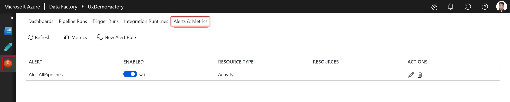
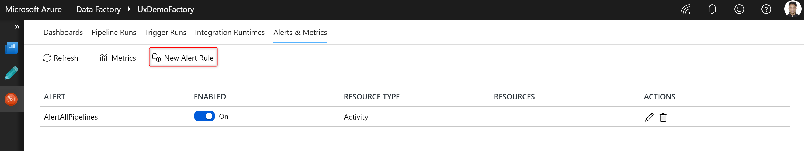
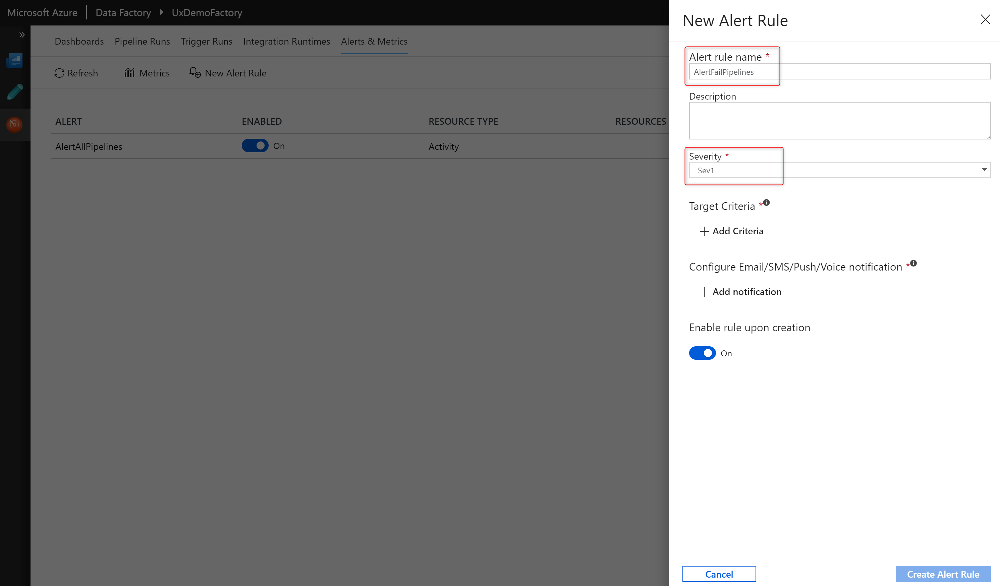
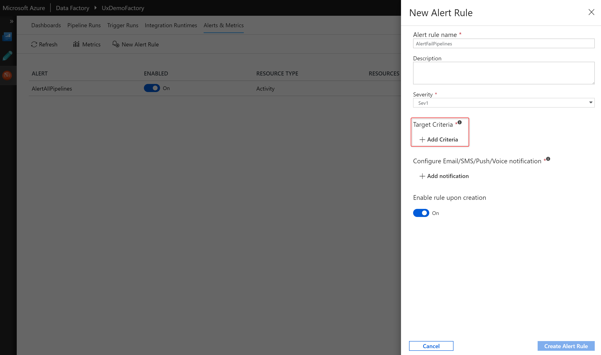
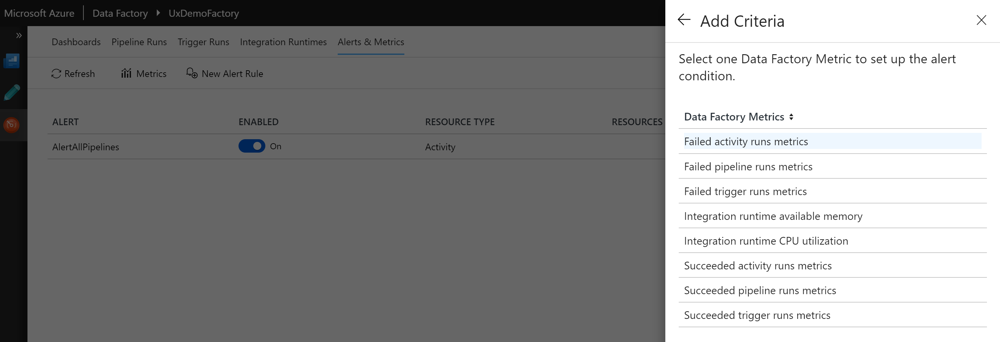
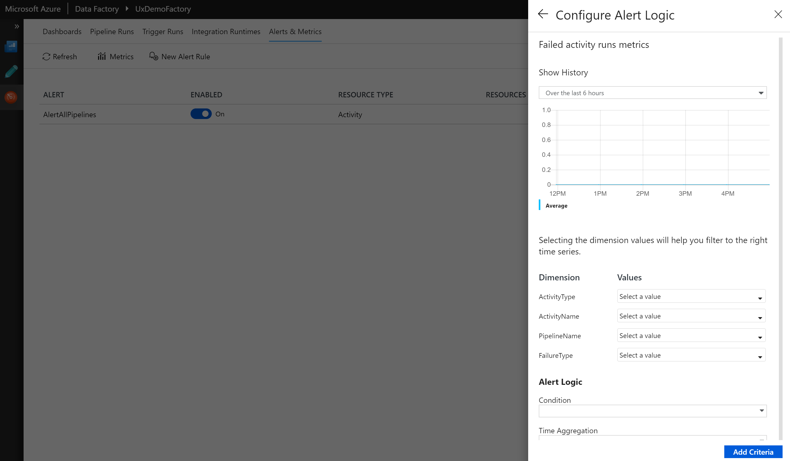
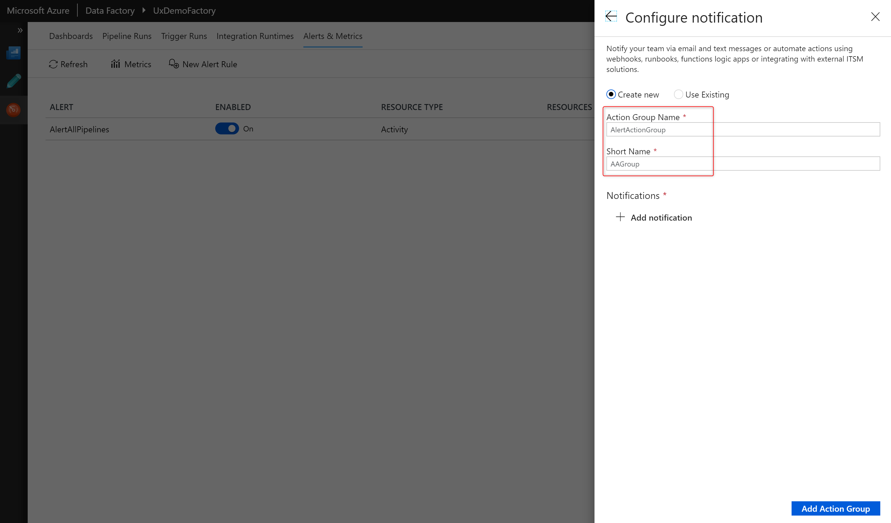
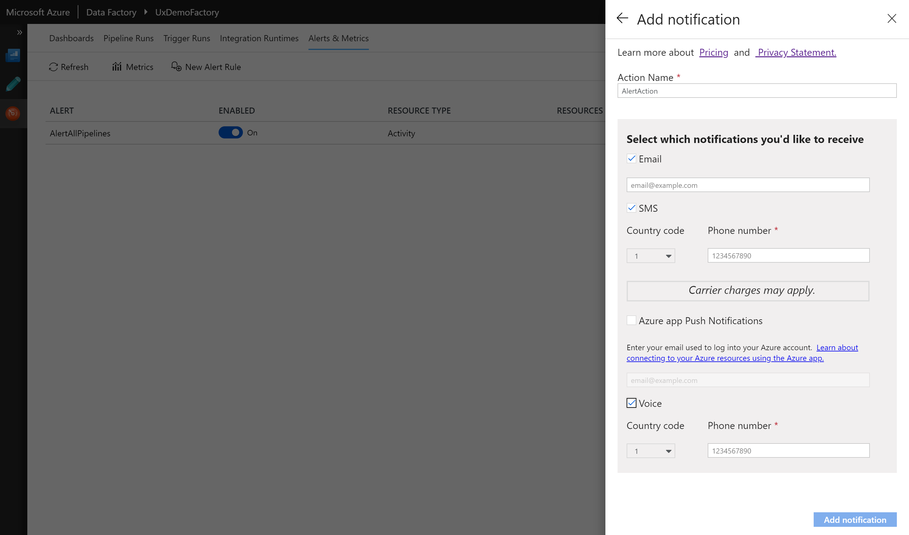
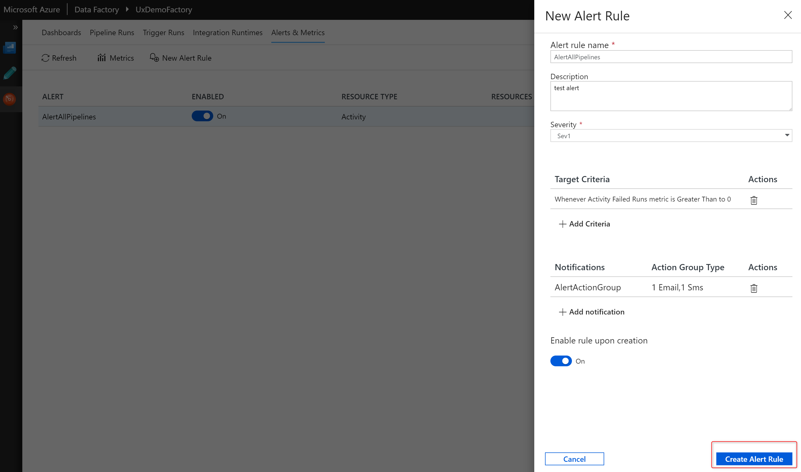

# Visually monitor Azure data factories
Azure Data Factory is a cloud-based data integration service. You can use it to create data-driven workflows in the cloud for orchestrating and automating data movement and data transformation. By using Azure Data Factory, you can:

- Create and schedule data-driven workflows (called pipelines) that can ingest data from disparate data stores.
- Process/transform the data by using compute services such as Azure HDInsight Hadoop, Spark, Azure Data Lake Analytics, and Azure Machine Learning.
- Publish output data to data stores such as Azure SQL Data Warehouse for business intelligence (BI) applications to consume.

In this quickstart, you learn how to visually monitor Data Factory pipelines without writing a single line of code.

If you don't have an Azure subscription, create a [free account](https://azure.microsoft.com/free/) before you begin.

## Monitor Data Factory pipelines

Monitor pipeline and activity runs with a simple list-view interface. All the runs are displayed in the browser's local time zone. If you change the time zone, all the date/time fields snap to the one that you selected.  

1. Start Microsoft Edge or Google Chrome. Currently, the Data Factory UI is supported only in those two web browsers.
2. Sign in to the  [Azure portal](https://portal.azure.com/).
3. Go to the blade for the created data factory in the Azure portal. Select the **Monitor & Manage** tile to start the Data Factory visual monitoring experience.

## Monitor pipeline runs
The list view shows each pipeline run for your Data Factory pipelines. It includes these columns:

| **Column name** | **Description** |
| --- | --- |
| Pipeline Name | Name of the pipeline |
| Actions | Single action available to view activity runs |
| Run Start | Start date and time for the pipeline run (MM/DD/YYYY, HH:MM:SS AM/PM) |
| Duration | Run duration (HH:MM:SS) |
| Triggered By | Manual trigger or scheduled trigger |
| Status | **Failed**, **Succeeded**, or **In Progress** |
| Parameters | Parameters for the pipeline run (name/value pairs) |
| Error | Pipeline run error (if any) |
| Run ID | ID of the pipeline run |

## Monitor activity runs
The list view shows activity runs that correspond to each pipeline run. To view activity runs for each pipeline run, select the **Activity Runs** icon under the **Actions** column. The list view includes these columns:

| **Column name** | **Description** |
| --- | --- |
| Activity Name | Name of the activity inside the pipeline |
| Activity Type | Type of the activity, such as **Copy**, **HDInsightSpark**, or **HDInsightHive** |
| Run Start | Start date and time for the activity run (MM/DD/YYYY, HH:MM:SS AM/PM) |
| Duration | Run duration (HH:MM:SS) |
| Status | **Failed**, **Succeeded**, or **In Progress** |
| Input | JSON array that describes the activity inputs |
| Output | JSON array that describes the activity outputs |
| Error | Activity run error (if any) |

> [!IMPORTANT]
> You need to select the **Refresh** button at the top to refresh the list of pipeline and activity runs. Auto-refresh is currently not supported.

## Select a data factory to monitor
Hover over the **Data Factory** icon on the upper left. Select the arrow icon to see a list of azure subscriptions and data factories that you can monitor.

## Configure the list view

### Apply rich ordering and filtering

Order pipeline runs in DESC/ASC according to the run start time. Filter pipeline runs by using the following columns:

| **Column name** | **Description** |
| --- | --- |
| Pipeline Name | Name of the pipeline. Options include quick filters for **Last 24 hours**, **Last week**, and **Last 30 days**. Or select a custom date and time. |
| Run Start | Start date and time for the pipeline run. |
| Run Status | Filter runs by status: **Succeeded**, **Failed**, or **In Progress**. |

### Add or remove columns
Right-click the list view header and choose columns that you want to appear in the list view.

### Adjust column widths
Increase and decrease the column widths in the list view by hovering over the column header.

## Promote user properties to monitor

You can promote any pipeline activity property as a user property so that it becomes an entity that you can monitor. For example, you can promote the **Source** and **Destination** properties of the copy activity in your pipeline as user properties. You can also select **Auto Generate** to generate the **Source** and **Destination** user properties for a copy activity.

> [!NOTE]
> You can only promote up to five pipeline activity properties as user properties.

After you create the user properties, you can monitor them in the monitoring list views. If the source for the copy activity is a table name, you can monitor the source table name as a column in the list view for activity runs.

## Rerun activities inside a pipeline

You can now rerun activities inside a pipeline. Select **View activity runs**, and then select the activity in your pipeline from which point you want to rerun your pipeline.

### View rerun history

You can view the rerun history for all the pipeline runs in the list view.

You can also view rerun history for a particular pipeline run.

## Gantt views

Use Gantt views to quickly visualize your pipelines and activity runs. You can look at the Gantt view per pipeline or group by annotations/tags that you have created on your pipelines.

The length of the bar informs the duration of the pipeline. You can also select the bar to see more details.

## Guided tours
Select the **Information** icon on the lower left. Then select **Guided Tours** to get step-by-step instructions on how to monitor your pipeline and activity runs.

## Feedback
Select the **Feedback** icon to give us feedback on various features or any issues that you might be facing.

## Alerts

You can raise alerts on supported metrics in Data Factory. Select **Monitor** > **Alerts & Metrics** on the Data Factory monitoring page to get started.

For a seven-minute introduction and demonstration of this feature, watch the following video:

> [!VIDEO https://channel9.msdn.com/shows/azure-friday/Monitor-your-Azure-Data-Factory-pipelines-proactively-with-alerts/player]

### Create alerts

1.  Select **New Alert Rule** to create a new alert.

    

1.  Specify the rule name and select the alert severity.

    

1.  Select the alert criteria.

    

    

1.  Configure the alert logic. You can create an alert for the selected metric for all pipelines and corresponding activities. You can also select a particular activity type, activity name, pipeline name, or failure type.

    

1.  Configure email, SMS, push, and voice notifications for the alert. Create an action group, or choose an existing one, for the alert notifications.

    

    

1.  Create the alert rule.

    

## Next steps

To learn about monitoring and managing pipelines, see the [Monitor and manage pipelines programmatically](https://docs.microsoft.com/azure/data-factory/monitor-programmatically) article.
