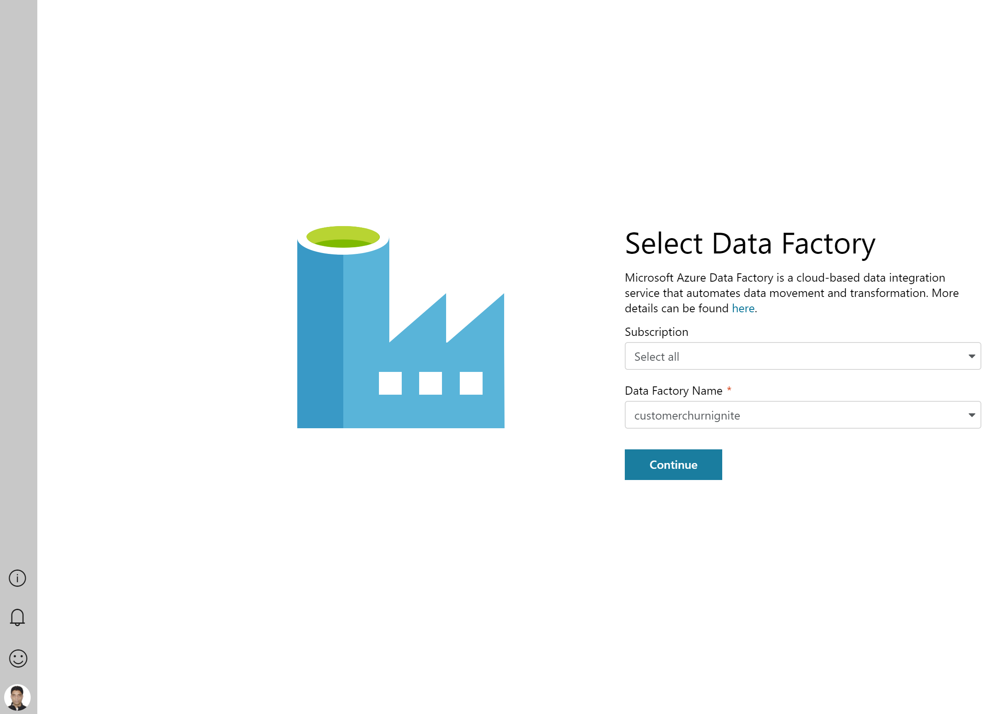
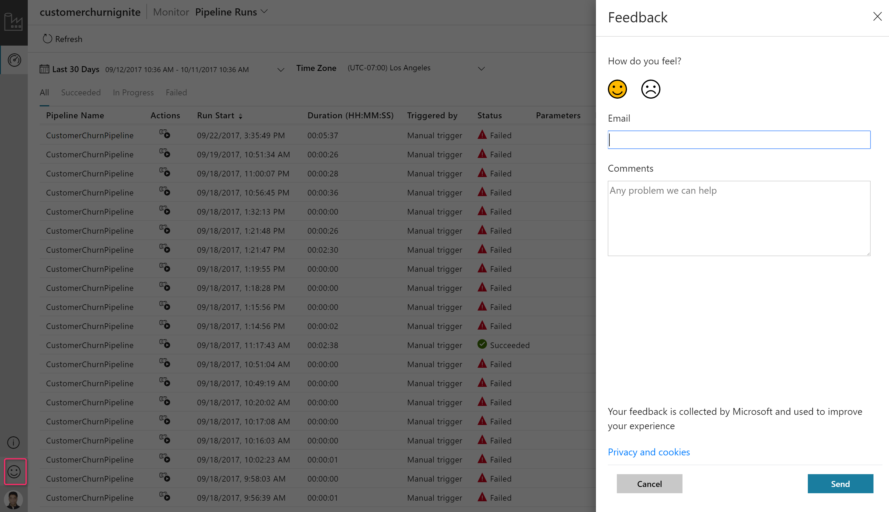

# Visually monitor Azure data factories
Azure Data Factory is a cloud-based data integration service that allows you to create data-driven workflows in the cloud for orchestrating and automating data movement and data transformation. Using Azure Data Factory, you can create and schedule data-driven workflows (called pipelines) that can ingest data from disparate data stores, process/transform the data by using compute services such as Azure HDInsight Hadoop, Spark, Azure Data Lake Analytics, and Azure Machine Learning, and publish output data to data stores such as Azure SQL Data Warehouse for business intelligence (BI) applications to consume.
In this quick start, you will learn how to visually monitor data factory v2 pipelines without writing a single line of code.
If you don't have an Azure subscription, create a [free](https://azure.microsoft.com/free/) account before you begin.

> [!NOTE]
> This article applies to version 2 of Data Factory, which is currently in preview. If you are using version 1 of the Data Factory service, which is in general availability (GA), see [Monitor and manage pipelines in Data Factory version1](v1/data-factory-monitor-manage-app.md).

## Monitor data factory v2 pipelines

1. Log in to the  [Azure portal](https://portal.azure.com/).
2. Navigate to the created data factory blade in Azure portal and click the 'Monitor & Manage' tile. This will launch the ADF v2 visual monitoring experience.

## List-View Monitoring

Monitor pipeline and activity runs with a simple list view interface. All the runs are displayed in local browser time zone. You can change the time zone and all the date time fields will snap to the selected time zone.  

#### Monitoring Pipeline Runs
List view showcasing each pipeline run for your data factory v2 pipelines. Included columns:

| **Column Name** | **Description** |
| --- | --- |
| Pipeline Name | Name of the pipeline. |
| Actions | Single action available to view activity runs. |
| Run Start | Pipeline run start date time (MM/DD/YYYY, HH:MM:SS AM/PM) |
| Duration | Run duration (HH:MM:SS) |
| Triggered By | Manual trigger, Schedule trigger |
| Status | Failed, Succeeded, In Progress |
| Parameters | Pipeline run parameters (name, value pairs) |
| Error | Pipeline run error (if/any) |
| Run ID | Id of the pipeline run |

#### Monitoring Activity Runs
List view showcasing activity runs corresponding to each pipeline run. Click **'Activity Runs'** icon under the **'Actions'** column to view activity runs for each pipeline run. Included columns:

| **Column Name** | **Description** |
| --- | --- |
| Activity Name | Name of the activity inside the pipeline. |
| Activity Type | Type of the activity i.e. Copy, HDInsightSpark, HDInsightHive etc. |
| Run Start | Activity run start date time (MM/DD/YYYY, HH:MM:SS AM/PM) |
| Duration | Run duration (HH:MM:SS) |
| Status | Failed, Succeeded, In Progress |
| Input | JSON array describing the activity inputs |
| Output | JSON array describing the activity outputs |
| Error | Activity run error (if/any) |

> [!IMPORTANT]
> You need to click **'Refresh'** icon on top to refresh the list of pipeline and activity runs. Auto-refresh is currently not supported.
>

## Features

#### Rich ordering and filtering

Order pipeline runs in desc/asc by Run Start and filter pipeline runs by following columns:

| **Column Name** | **Description** |
| --- | --- |
| Pipeline Name | Name of the pipeline. Options include quick filters for 'Last 24 hours', 'Last week',  'Last 30 days' or select a custom date time. |
| Run Start | Pipeline run start date time |
| Run Status | Filter runs by status i.e. Succeeded, Failed, In Progress |

#### Add/Remove columns to list view
Right click the list view header and choose columns that you want to appear in the list view

#### Reorder column widths in list view
Increase and decrease the column widths in list view by simply hovering over the column header

#### Select data factory
Hover on the 'Data Factory' icon on the top left. Click on the 'Arrow' icon to see a list of azure subscriptions and data factories that you can monitor.

#### Guided Tours
Click on the 'Information Icon' in lower left and click 'Guided Tours' to get step-by-step instructions on how to monitor your pipeline and activity runs.

#### Feedback
Click on the 'Feedback' icon to give us feedback on various features or any issues that you might be facing.

## Next steps

See  [Monitor and manage pipelines programmatically](https://docs.microsoft.com/en-us/azure/data-factory/monitor-programmatically) article to learn about monitoring and managing pipelines
