# Visually monitor Azure Data Factory

[!INCLUDE[appliesto-adf-xxx-md](includes/appliesto-adf-xxx-md.md)]

Once you've created and published a pipeline in Azure Data Factory, you can associate it with a trigger or manually kick off an ad hoc run. You can monitor all of your pipeline runs natively in the Azure Data Factory user experience. To open the monitoring experience, select the **Monitor & Manage** tile in the data factory blade of the [Azure portal](https://portal.azure.com/). If you're already in the ADF UX, click on the **Monitor** icon on the left sidebar.

By default, all data factory runs are displayed in the browser's local time zone. If you change the time zone, all the date/time fields snap to the one that you selected.

## Monitor pipeline runs

The default monitoring view is list of triggered pipeline runs in the selected time period. You can change the time range and filter by status, pipeline name, or annotation. Hover over the specific pipeline run to get run-specific actions such as rerun and the consumption report.

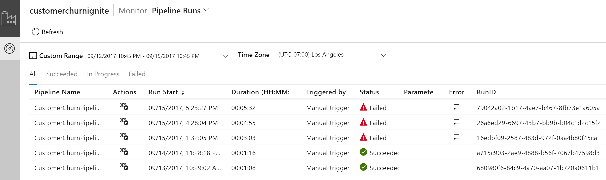

The pipeline run grid contains the following columns:

| **Column name** | **Description** |
| --- | --- |
| Pipeline Name | Name of the pipeline |
| Run Start | Start date and time for the pipeline run (MM/DD/YYYY, HH:MM:SS AM/PM) |
| Run End | End date and time for the pipeline run (MM/DD/YYYY, HH:MM:SS AM/PM) |
| Duration | Run duration (HH:MM:SS) |
| Triggered By | The name of the trigger that started the pipeline |
| Status | **Failed**, **Succeeded**, **In Progress**, **Canceled**, or **Queued** |
| Annotations | Filterable tags associated with a pipeline  |
| Parameters | Parameters for the pipeline run (name/value pairs) |
| Error | If the pipeline failed, the run error |
| Run ID | ID of the pipeline run |

You need to manually select the **Refresh** button to refresh the list of pipeline and activity runs. Autorefresh is currently not supported.

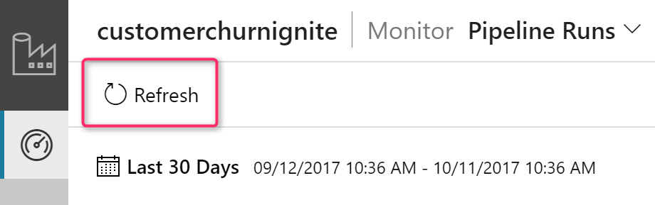

To view the results of a debug run, select the **Debug** tab.

## Monitor activity runs

To get a detailed view of the individual activity runs of a specific pipeline run, click on the pipeline name.

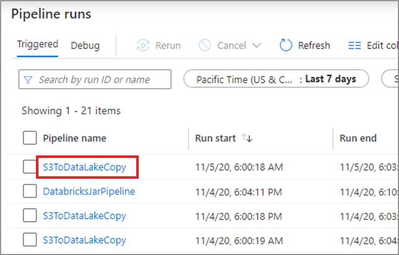

The list view shows activity runs that correspond to each pipeline run. Hover over the specific activity run to get run-specific information such as the JSON input, JSON output, and detailed activity-specific monitoring experiences.

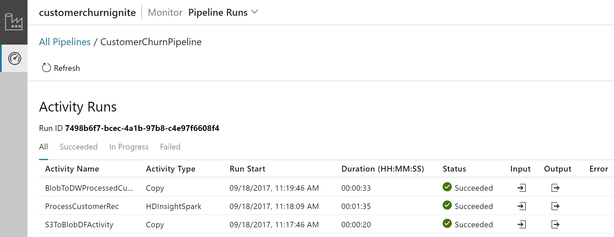

| **Column name** | **Description** |
| --- | --- |
| Activity Name | Name of the activity inside the pipeline |
| Activity Type | Type of the activity, such as **Copy**, **ExecuteDataFlow**, or **AzureMLExecutePipeline** |
| Actions | Icons that allow you to see JSON input information, JSON output information, or detailed activity-specific monitoring experiences | 
| Run Start | Start date and time for the activity run (MM/DD/YYYY, HH:MM:SS AM/PM) |
| Duration | Run duration (HH:MM:SS) |
| Status | **Failed**, **Succeeded**, **In Progress**, or **Canceled** |
| Integration Runtime | Which Integration Runtime the activity was run on |
| User Properties | User-defined properties of the activity |
| Error | If the activity failed, the run error |
| Run ID | ID of the activity run |

If an activity failed, you can see the detailed error message by clicking on the icon in the error column. 

### Promote user properties to monitor

Promote any pipeline activity property as a user property so that it becomes an entity that you monitor. For example, you can promote the **Source** and **Destination** properties of the copy activity in your pipeline as user properties.

> [!NOTE]
> You can only promote up to five pipeline activity properties as user properties.

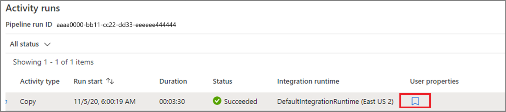

After you create the user properties, you can monitor them in the monitoring list views.

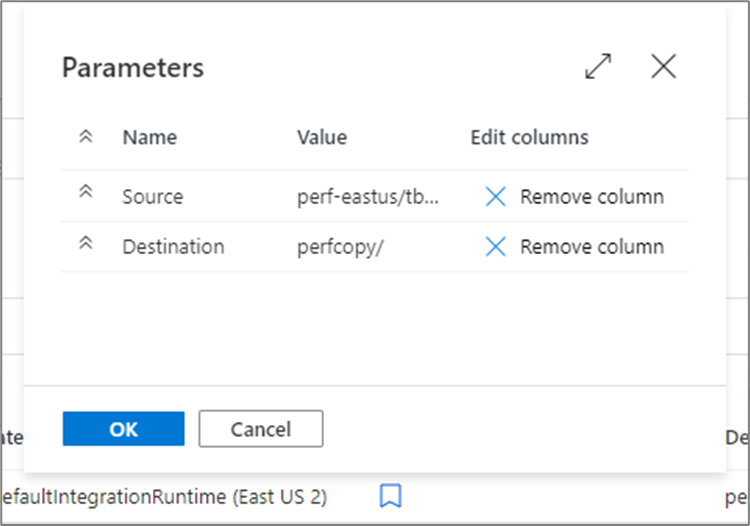

 If the source for the copy activity is a table name, you can monitor the source table name as a column in the list view for activity runs.

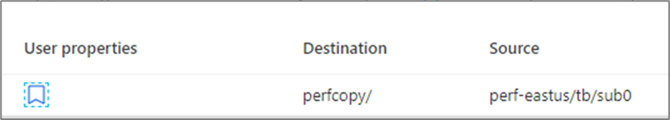

## Rerun pipelines and activities

To rerun a pipeline that has previously ran from the start, hover over the specific pipeline run and select **Rerun**. If you select multiple pipelines, you can use the **Rerun** button to run them all.

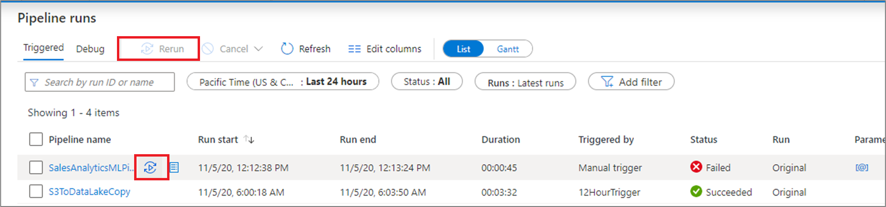

If you wish to rerun starting at a specific point, you can do so from the activity runs view. Select the activity you wish to start from and select **Rerun from activity**. 

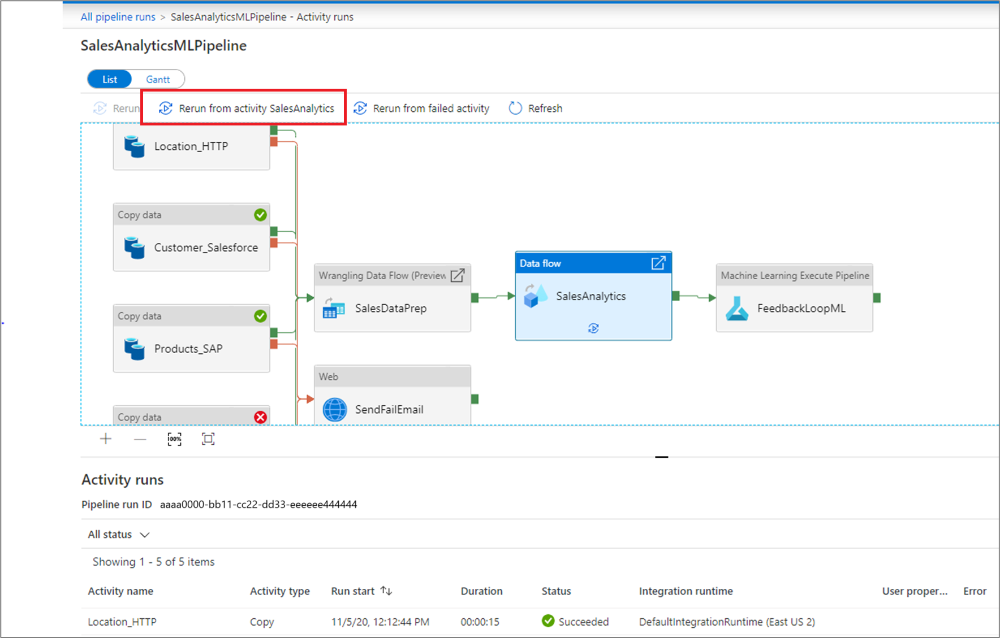

### Rerun from failed activity

If an activity fails, times out, or is canceled, you can rerun the pipeline from that failed activity by selecting **Rerun from failed activity**.

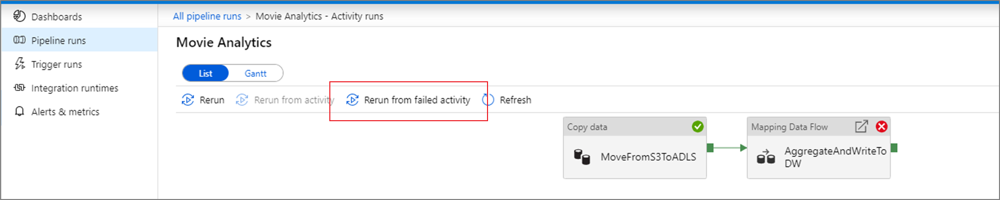

### View rerun history

You can view the rerun history for all the pipeline runs in the list view.

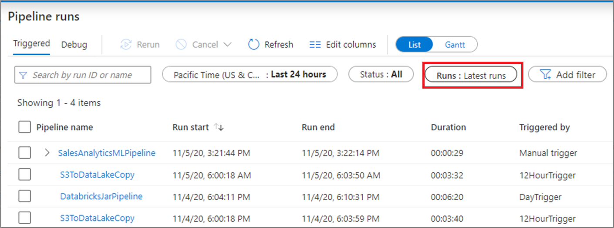

You can also view rerun history for a particular pipeline run.

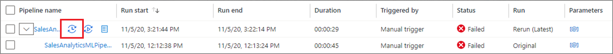

## Monitor consumption

You can see the resources consumed by a pipeline run by clicking the consumption icon next to the run. 

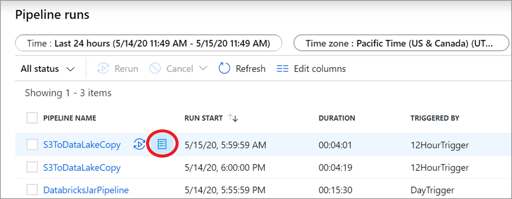

Clicking the icon opens a consumption report of resources used by that pipeline run. 

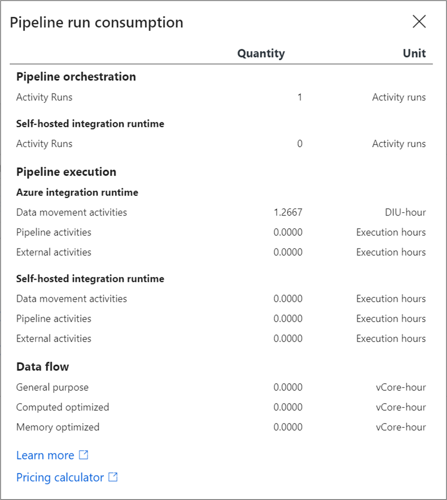

You can plug these values into the [Azure pricing calculator](https://azure.microsoft.com/pricing/details/data-factory/) to estimate the cost of the pipeline run. For more information on Azure Data Factory pricing, see [Understanding pricing](pricing-concepts.md).

> [!NOTE]
> These values returned by the pricing calculator is an estimate. It doesn't reflect the exact amount you will be billed by Azure Data Factory 

## Gantt views

A Gantt chart is a view that allows you to see the run history over a time range. By switching to a Gantt view, you will see all pipeline runs grouped by name displayed as bars relative to how long the run took. You can also group by annotations/tags that you've create on your pipeline. The Gantt view is also available at the activity run level.

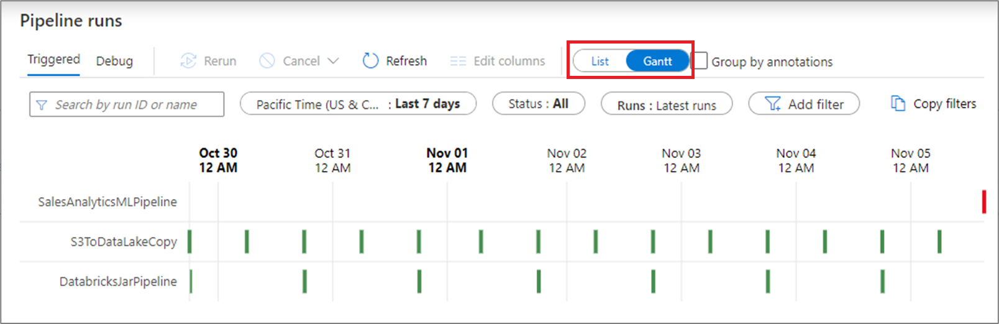

The length of the bar informs the duration of the pipeline. You can also select the bar to see more details.

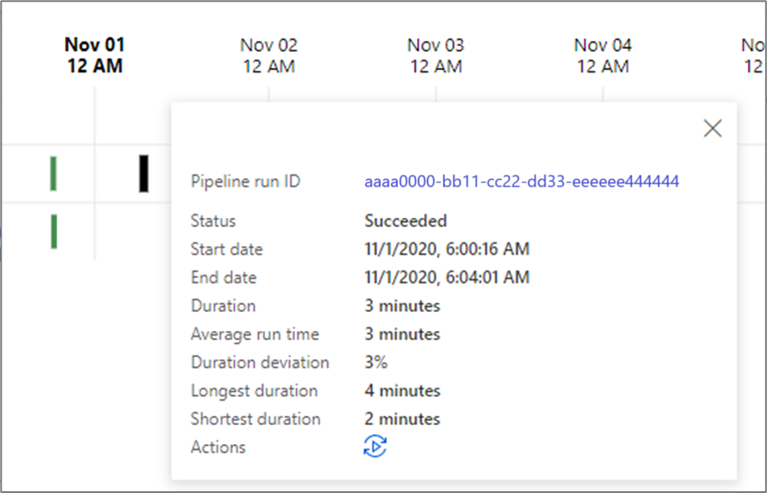

## Alerts

You can raise alerts on supported metrics in Data Factory. Select **Monitor** > **Alerts & metrics** on the Data Factory monitoring page to get started.

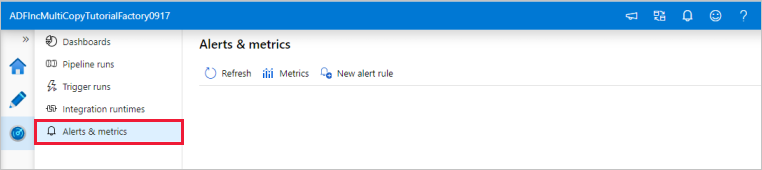

For a seven-minute introduction and demonstration of this feature, watch the following video:

> [!VIDEO https://channel9.msdn.com/shows/azure-friday/Monitor-your-Azure-Data-Factory-pipelines-proactively-with-alerts/player]

### Create alerts

1.  Select **New alert rule** to create a new alert.

    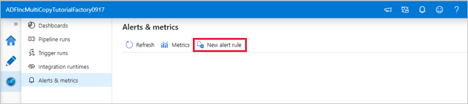

1.  Specify the rule name and select the alert severity.

    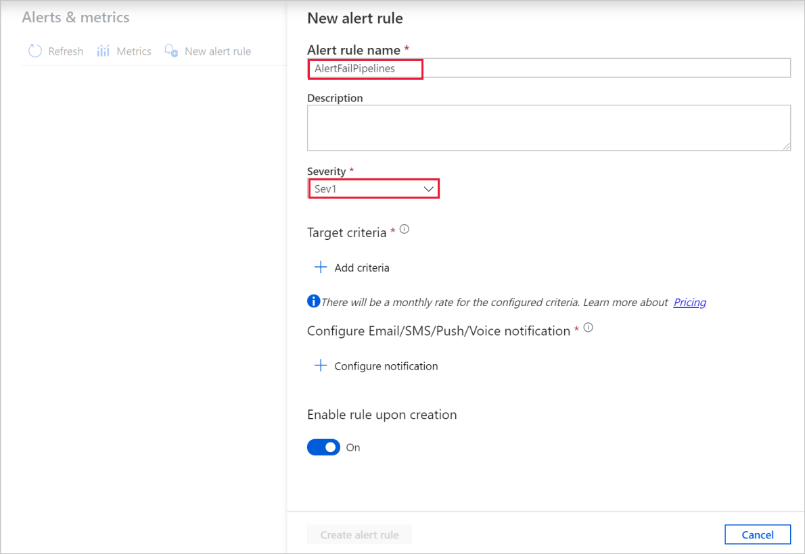

1.  Select the alert criteria.

    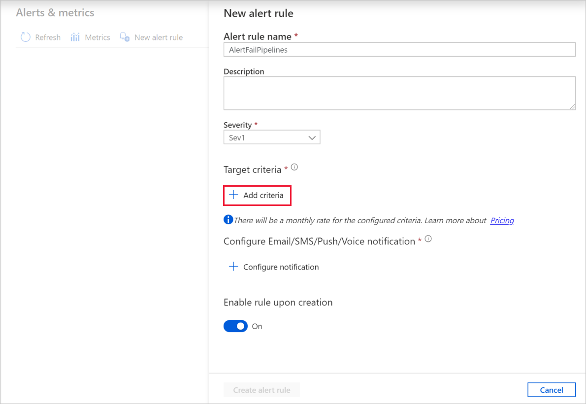

    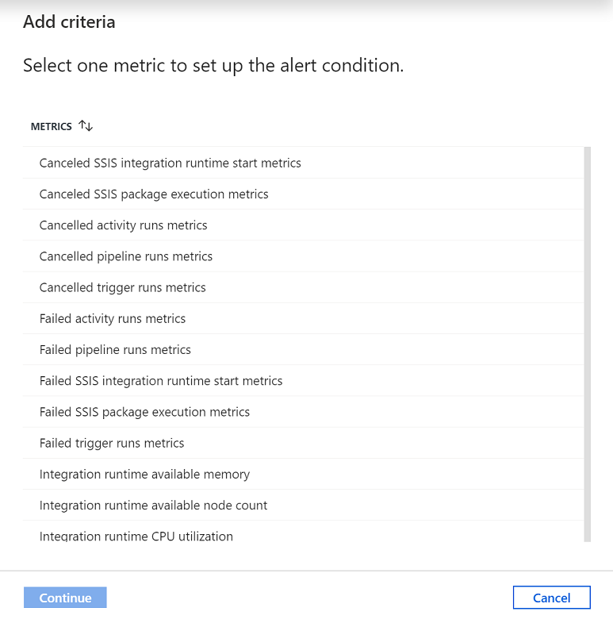

    

    You can create alerts on various metrics, including those for ADF entity count/size, activity/pipeline/trigger runs, Integration Runtime (IR) CPU utilization/memory/node count/queue, as well as for SSIS package executions and SSIS IR start/stop operations.

1.  Configure the alert logic. You can create an alert for the selected metric for all pipelines and corresponding activities. You can also select a particular activity type, activity name, pipeline name, or failure type.

    

1.  Configure email, SMS, push, and voice notifications for the alert. Create an action group, or choose an existing one, for the alert notifications.

    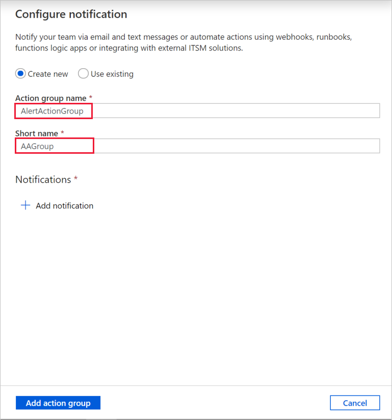

    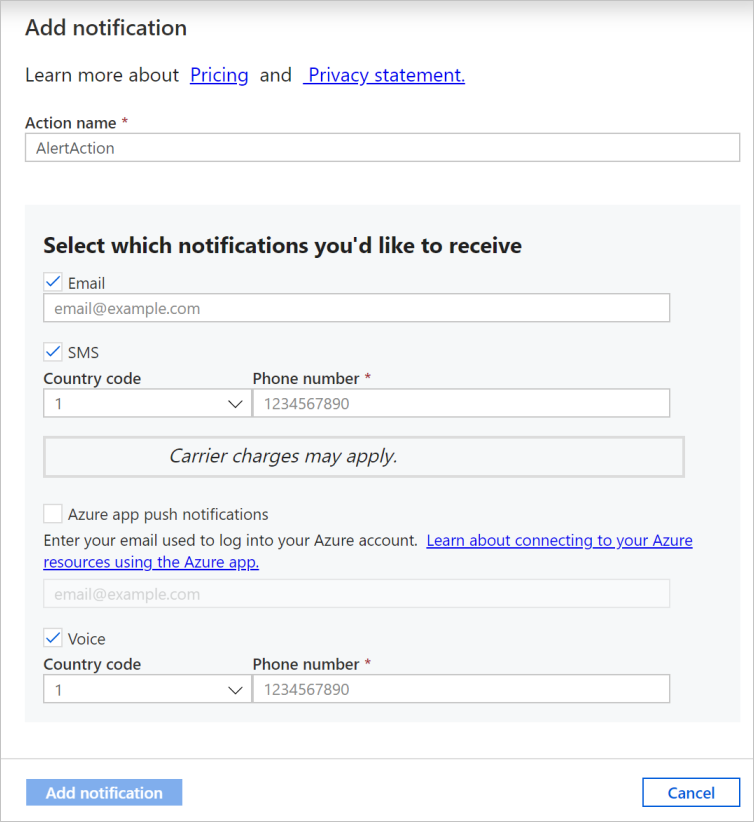

1.  Create the alert rule.

    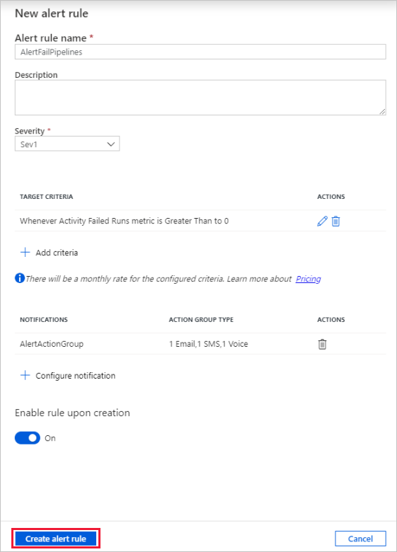

## Next steps

To learn about monitoring and managing pipelines, see the [Monitor and manage pipelines programmatically](./monitor-programmatically.md) article.