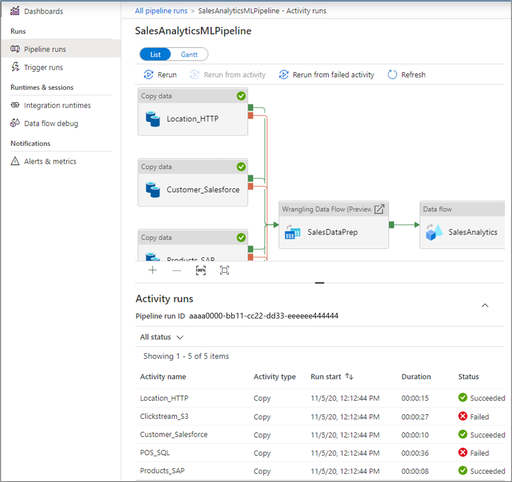

# Visually monitor Azure data factories
Azure Data Factory is a cloud-based data integration service that allows you to create data-driven workflows in the cloud for orchestrating and automating data movement and data transformation. Using Azure Data Factory, you can create and schedule data-driven workflows (called pipelines) that can ingest data from disparate data stores, process/transform the data by using compute services such as Azure HDInsight Hadoop, Spark, Azure Data Lake Analytics, and Azure Machine Learning, and publish output data to data stores such as Azure SQL Data Warehouse for business intelligence (BI) applications to consume.

In this quickstart, you learn how to visually monitor Data Factory pipelines without writing a single line of code.

If you don't have an Azure subscription, create a [free](https://azure.microsoft.com/free/) account before you begin.

## Monitor Data Factory pipelines

Monitor pipeline and activity runs with a simple list view interface. All the runs are displayed in the local browser time zone. You can change the time zone and all the date time fields snap to the selected time zone.  

1. Launch **Microsoft Edge** or **Google Chrome** web browser. Currently, Data Factory UI is supported only in Microsoft Edge and Google Chrome web browsers.
2. Log in to the  [Azure portal](https://portal.azure.com/).
3. Navigate to the created data factory blade in Azure portal and click the 'Monitor & Manage' tile to launch the Data Factory visual monitoring experience.

## Monitor pipeline runs
List view showcasing each pipeline run for your data factory v2 pipelines. Included columns:

| **Column Name** | **Description** |
| --- | --- |
| Pipeline Name | Name of the pipeline. |
| Actions | Single action available to view activity runs. |
| Run Start | Pipeline run start date time (MM/DD/YYYY, HH:MM:SS AM/PM) |
| Duration | Run duration (HH:MM:SS) |
| Triggered By | Manual trigger, Schedule trigger |
| Status | Failed, Succeeded, In Progress |
| Parameters | Pipeline run parameters (name, value pairs) |
| Error | Pipeline run error (if/any) |
| Run ID | ID of the pipeline run |

## Monitor activity runs
List view showcasing activity runs corresponding to each pipeline run. Click **'Activity Runs'** icon under the **'Actions'** column to view activity runs for each pipeline run. Included columns:

| **Column Name** | **Description** |
| --- | --- |
| Activity Name | Name of the activity inside the pipeline. |
| Activity Type | Type of the activity, such as Copy, HDInsightSpark, HDInsightHive, etc. |
| Run Start | Activity run start date time (MM/DD/YYYY, HH:MM:SS AM/PM) |
| Duration | Run duration (HH:MM:SS) |
| Status | Failed, Succeeded, In Progress |
| Input | JSON array describing the activity inputs |
| Output | JSON array describing the activity outputs |
| Error | Activity run error (if/any) |

> [!IMPORTANT]
> You need to click **'Refresh'** icon on top to refresh the list of pipeline and activity runs. Auto-refresh is currently not supported.

## Select a data factory to monitor
Hover on the **Data Factory** icon on the top left. Click on the 'Arrow' icon to see a list of azure subscriptions and data factories that you can monitor.

## Configure the list view

### Apply rich ordering and filtering

Order pipeline runs in desc/asc by Run Start and filter pipeline runs by following columns:

| **Column Name** | **Description** |
| --- | --- |
| Pipeline Name | Name of the pipeline. Options include quick filters for 'Last 24 hours', 'Last week',  'Last 30 days' or select a custom date time. |
| Run Start | Pipeline run start date time |
| Run Status | Filter runs by status - Succeeded, Failed, In Progress |

### Add or remove columns
Right-click the list view header and choose columns that you want to appear in the list view

### Adjust column widths
Increase and decrease the column widths in list view by hovering over the column header

## Promote user properties to monitor

You can promote any pipeline activity property as a user property so that it becomes an entity that you can monitor. For example, you can promote the **Source** and **Destination** properties of the Copy activity in your pipeline as user properties. You can also select **Auto Generate** to generate the **Source** and **Destination** user properties for a Copy activity.

> [!NOTE]
> You can only promote up to 5 pipeline activity properties as user properties.

After you create the user properties, you can then monitor them in the monitoring list views. If the source for the Copy activity is a table name, you can monitor the source table name as a column in the activity runs list view.

## Rerun activities inside a pipeline

You can now rerun activities inside a pipeline. Click **View activity runs** and select the activity in your pipeline from which point you want to rerun your pipeline.

### View rerun history

You can view the rerun history for all the pipeline runs in the list view.

You can also view rerun history for a particular pipeline run.

## Guided Tours
Click on the 'Information Icon' in lower left and click 'Guided Tours' to get step-by-step instructions on how to monitor your pipeline and activity runs.

## Feedback
Click on the 'Feedback' icon to give us feedback on various features or any issues that you might be facing.

## Alerts

You can raise alerts on supported metrics in Data Factory. Select **Monitor -> Alerts & Metrics** on the Data Factory Monitor page to get started.

For a seven-minute introduction and demonstration of this feature, watch the following video:

> [!VIDEO https://channel9.msdn.com/shows/azure-friday/Monitor-your-Azure-Data-Factory-pipelines-proactively-with-alerts/player]

### Create Alerts

1.  Click **New Alert rule** to create a new alert.

    

1.  Specify the rule name and select the alert **Severity**.

    

1.  Select the Alert Criteria.

    

    

1.  Configure the Alert logic. You can create an alert for the selected metric for all pipelines and corresponding activities. You can also select a particular activity type, activity name, pipeline name, or a failure type.

    

1.  Configure **Email/SMS/Push/Voice** notifications for the alert. Create or choose an existing **Action Group** for the alert notifications.

    

    

1.  Create the alert rule.

    

## Next steps

See  [Monitor and manage pipelines programmatically](https://docs.microsoft.com/azure/data-factory/monitor-programmatically) article to learn about monitoring and managing pipelines.
