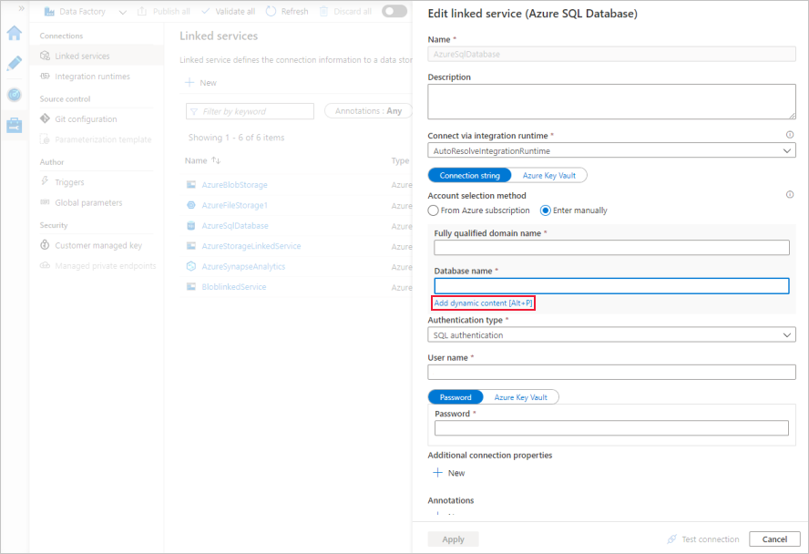
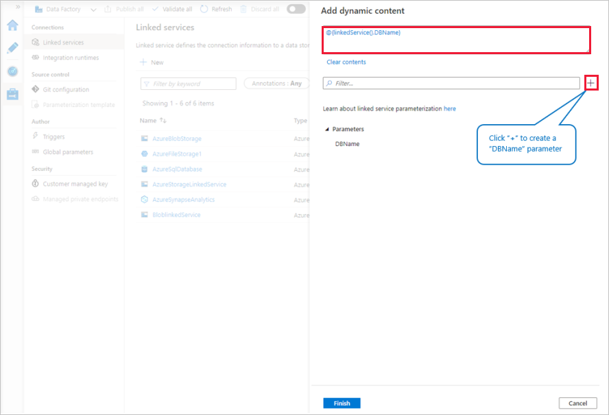

# Parameterize linked services in Azure Data Factory

You can now parameterize a linked service and pass dynamic values at run time. For example, if you want to connect to different databases on the same Azure SQL Database server, you can now parameterize the database name in the linked service definition. This prevents you from having to create a linked service for each database on the Azure SQL database server. You can parameterize other properties in the linked service definition as well - for example, *User name.*

You can use the Data Factory UI in the Azure Portal or a programming interface to parameterize linked services.

> [!TIP]
> We recommend not to parameterize passwords or secrets. Store all connection strings in Azure Key Vault instead, and parameterize the *Secret Name*.

For a seven-minute introduction and demonstration of this feature, watch the following video:

> [!VIDEO https://channel9.msdn.com/shows/azure-friday/Parameterize-connections-to-your-data-stores-in-Azure-Data-Factory/player]

## Supported data stores

At this time, linked service parameterization is supported in the Data Factory UI in the Azure portal for the following data stores. For all other data stores, you can parameterize the linked service by selecting the **Code** icon on the **Connections** tab and using the JSON editor.
- Azure SQL Database
- Azure SQL Data Warehouse
- SQL Server
- Oracle
- Cosmos DB
- Amazon Redshift
- MySQL
- Azure Database for MySQL

## Data Factory UI





## JSON

```json
{
	"name": "AzureSqlDatabase",
	"properties": {
		"type": "AzureSqlDatabase",
		"typeProperties": {
			"connectionString": {
				"value": "Server=tcp:myserver.database.windows.net,1433;Database=@{linkedService().DBName};User ID=user;Password=fake;Trusted_Connection=False;Encrypt=True;Connection Timeout=30",
				"type": "SecureString"
			}
		},
		"connectVia": null,
		"parameters": {
			"DBName": {
				"type": "String"
			}
		}
	}
}
```
