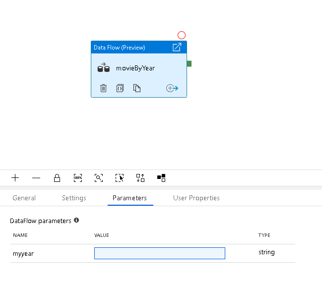
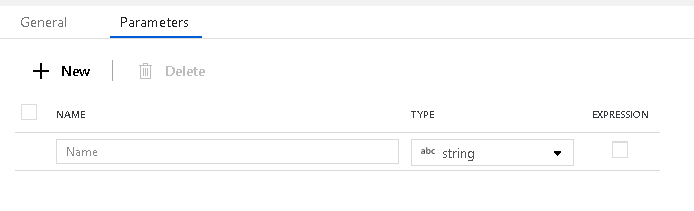
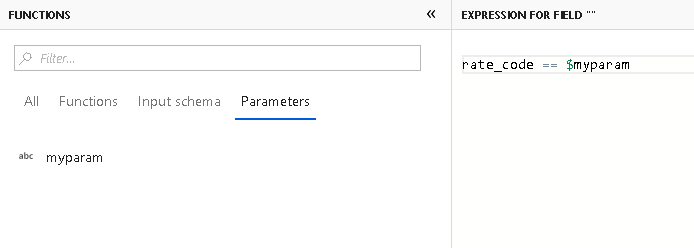
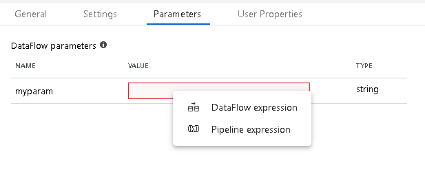
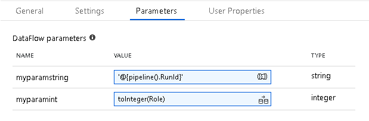

# Mapping data flow parameters

[!INCLUDE [notes](../../includes/data-factory-data-flow-preview.md)]

Mapping data flows in data factory support the use of parameters. You can define parameters inside of your data flow definition, which you can then use throughout your expressions. The parameters can then be set by the calling pipeline via the Execute Data Flow activity. You have three options to use to set the values in the data flow activity expressions:

* Use the pipeline control flow expression language to set a dynamic value
* Use the data flow expression language to set a dynamic value
* Use either expression language to set a static literal value

Use this capability to make your data flows general-purpose, flexible, and reusable. You can parameterize data flow settings and expressions with these parameters.

> [!NOTE]
> To use pipeline control flow expressions, your data flow parameter must be of type string.

* Add an Execute Data Flow activity to the pipeline canvas.
* If your data flow has parameters, you will see the list of available parameters in the Parameters tab.** Click on the text box next to each parameter to enter your parameter value.
* You can choose to create your parameter expression via the pipeline control flow expression language or data flow expressions.



## Create parameters in data flow



To add parameters to your data flow, click on the blank portion of the data flow canvas to see the general properties. In the settings pane, you will see a tab called Parameters. Click the New button to generate new parameters, which can then be set from the pipeline, passing values into your data flow. Enter a parameter name and select the data type for each parameter.

Inside of your data flow expressions, you can utilize the parameters using the values set from the pipeline. Parameters begin with $ and are immutable. You will also find the list of your available parameters inside of the Expression Builder under the Parameters tab. You can use these values within your expressions, although you may not assign new values to the parameters.



## Set data flow parameters from pipeline

Once you've created your data flow with parameters, you can now execute that data flow from a pipeline with the Execute Data Flow Activity. Once you add that activity to your pipeline design canvas, you will be presented with the available data flow parameters in the activity's parameters setting tab.



When you click in the text box to fill-in parameter values, you will be presented with the Data Flow Expression Builder. Here, you can enter any expression or literal values that you wish that match the data type of the parameter. Below are examples of data flow expression and a literal string from the expression builder:

* ```toInteger(Role)```
* ```'this is my static literal string'```

If your parameter data type is a string, then you can choose to enter either a pipeline or a data flow expression. If you choose pipeline expression, you will instead be presented with the pipeline expression panel. Make sure to include pipeline functions inside string interpolation syntax using '@{<expression>}', for example:

```'@{pipeline().RunId}'```



## Next steps

* [Execute data flow activity](control-flow-execute-data-flow-activity.md)
* [Control flow expressions](control-flow-expression-language-functions.md)
