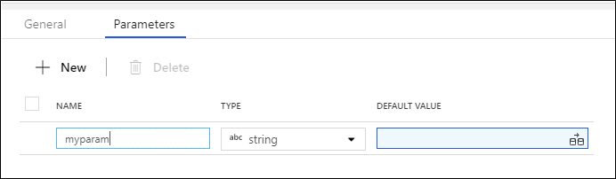
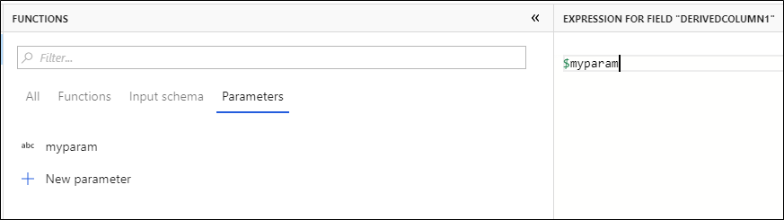
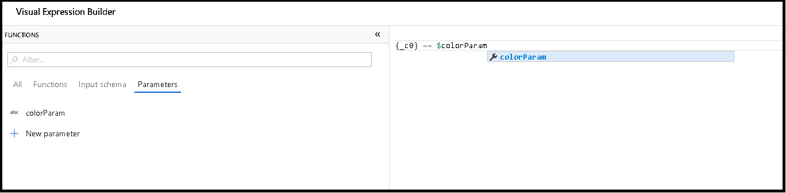
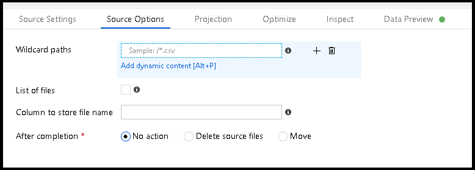
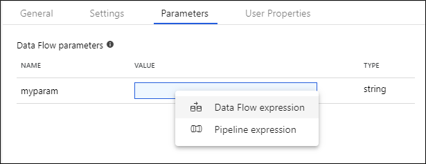

# Mapping Data Flow Parameters

[!INCLUDE [notes](../../includes/data-factory-data-flow-preview.md)]

Mapping Data Flows in Azure Data Factory support the use of parameters. You can define parameters inside of your data flow definition, which you can then use throughout your expressions. The parameter values can be set by the calling pipeline via the Execute Data Flow activity. You have three options for setting the values in the data flow activity expressions:

* Use the pipeline control flow expression language to set a dynamic value
* Use the data flow expression language to set a dynamic value
* Use either expression language to set a static literal value

Use this capability to make your data flows general-purpose, flexible, and reusable. You can parameterize data flow settings and expressions with these parameters.

> [!NOTE]
> To use pipeline control flow expressions, your data flow parameter must be of type string.

## Create parameters in Mapping Data Flow

To add parameters to your data flow, click on the blank portion of the data flow canvas to see the general properties. In the settings pane, you will see a tab called 'Parameters'. Click the 'New' button to generate a new parameter. For each parameter, you must assign a name, select a type, and optionally set a default value.



Parameters can be utilized in any data flow expression. Parameters begin with $ and are immutable. You will find the list of available parameters inside of the Expression Builder under the 'Parameters' tab.



## Use parameters in your data flow

* You can use parameter values inside of your transformation expressions. You will find the parameter list under the Parameters tab in the Expression Builder. 

* Parameters are also used to configure dynamic values for your Source and Sink transformation settings. When you click inside of configurable fields, you will see the "Add dynamic contect" link appear. Clicking there will take you to an Expression Builder where you can use parameters to use dynamic values. 

## Set Mapping Data Flow parameters from pipeline

Once you've created your data flow with parameters, you can execute it from a pipeline with the Execute Data Flow Activity. After you add the activity to your pipeline canvas, you will be presented with the available data flow parameters in the activity's 'Parameters' tab.



If your parameter data type is string, when you click the text box to set parameter values, you can choose to enter either a pipeline or a data flow expression. If you choose pipeline expression, you will be presented with the pipeline expression panel. Make sure to include pipeline functions inside string interpolation syntax using '@{<expression>}', for example:

```'@{pipeline().RunId}'```

If your parameter is not of type string, you will always be presented with the Data Flow Expression Builder. Here, you can enter any expression or literal values that you wish that matches the data type of the parameter. Below are examples of data flow expression and a literal string from the expression builder:

* ```toInteger(Role)```
* ```'this is my static literal string'```

Each Mapping Data Flow can have any combination of pipeline and data flow expression parameters. 


## Next steps
* [Execute data flow activity](control-flow-execute-data-flow-activity.md)
* [Control flow expressions](control-flow-expression-language-functions.md)
