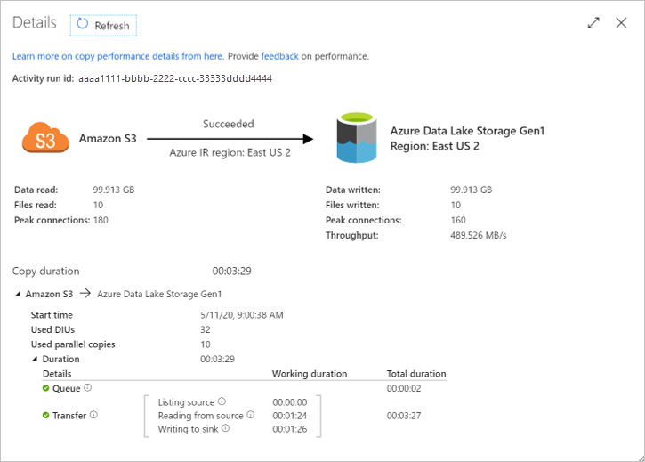
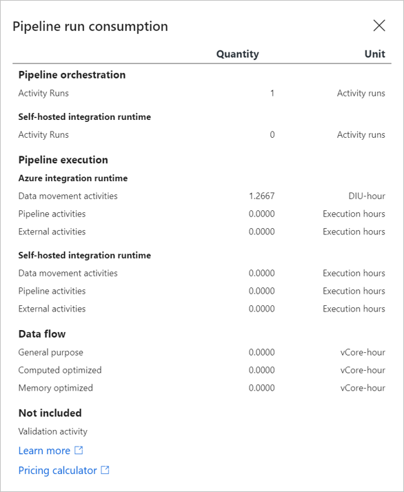
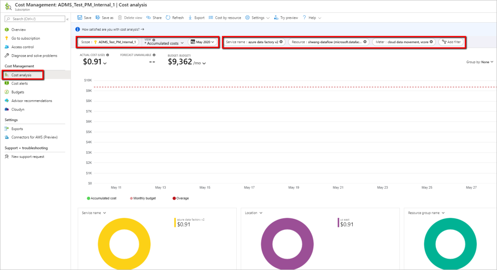
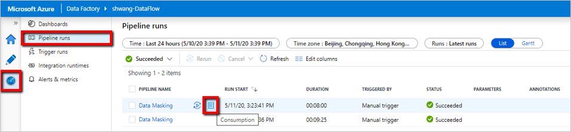
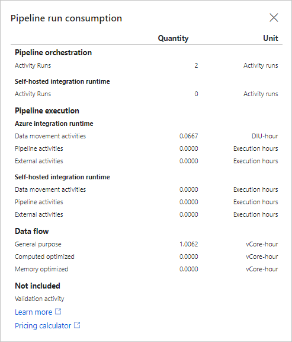
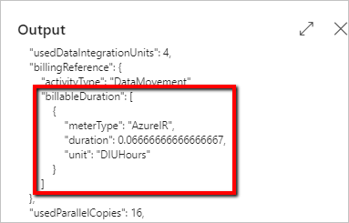
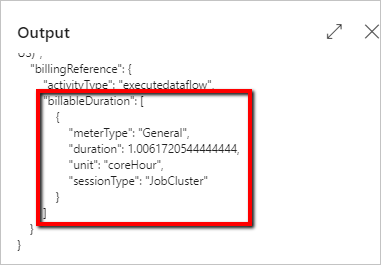

# Plan and manage costs for Azure Data Factory

[!INCLUDE[appliesto-adf-xxx-md](includes/appliesto-adf-xxx-md.md)]

Azure Data Factory is a serverless and elastic data integration service built for cloud scale.  This means there is not a fixed-size compute that you need to plan for peak load; rather you specify how much resource to allocate on demand per operation, which allows you to design the ETL processes in a much more scalable manner. In addition, ADF is billed on a consumption-based plan, which means you only pay for what you use.

This article describes how you can plan and manage costs for Azure Data Factory.

*	First, at the beginning of the ETL project, you conduct proof of concept and use a combination of per-pipeline consumption and pricing calculator to estimate costs.
*	After you have deployed your pipelines to production, you use the cost management features to set budgets and monitor costs. You can also review the forecasted costs and identify spending trends.
*	In addition, you can view per-pipeline consumption and per-activity consumption information to understand which pipelines and which activities are costliest and identify candidates for cost reduction.

## Estimate costs using pipeline and activity run consumption and pricing calculator

You can use the [ADF pricing calculator](https://azure.microsoft.com/pricing/calculator/?service=data-factory) to get an estimate of the cost of running your ETL workload in Azure Data Factory.  To use the calculator, you have to input details such as number of activity runs, number of data integration unit hours, type of compute used for Data Flow, core count, instance count, execution duration, and so on.

One of the commonly asked questions for the pricing calculator is what values should be used as inputs.  During the proof-of-concept phase, you can conduct trial runs using sample datasets to understand the consumption for various ADF meters.  Then based on the consumption for the sample dataset, you can project out the consumption for the full dataset and operationalization schedule.

> [!NOTE]
> The prices used in these examples below are hypothetical and are not intended to imply actual pricing.

For example, let’s say you need to move 1 TB of data daily from AWS S3 to Azure Data Lake Gen2.  You can perform POC of moving 100 GB of data to measure the data ingestion throughput and understand the corresponding billing consumption.

Here is a sample copy activity run detail (your actual mileage will vary based on the shape of your specific dataset, network speeds, egress limits on S3 account, ingress limits on ADLS Gen2, and other factors).

By leveraging the [consumption monitoring at pipeline-run level](#monitor-consumption-at-pipeline-run-level), you can see the corresponding data movement meter consumption quantities:

Therefore, the total number of DIU-hours it takes to move 1 TB per day for the entire month is:

1.2667 (DIU-hours) * (1 TB / 100 GB) * 30 (days in a month) = 380 DIU-hours

Now you can plug 30 activity runs and 380 DIU-hours into ADF pricing calculator to get an estimate of your monthly bill:

## Use budgets and cost alerts

You can create [budgets](https://docs.microsoft.com/azure/cost-management/tutorial-acm-create-budgets) to manage costs and create alerts that automatically notify stakeholders of spending anomalies and overspending risks.  Alerts are based on spending compared to budget and cost thresholds.  When you create a budget, you can either do it at the subscription level or at a lower granularity by adding additional filters such as resource ID and meter name.  But you cannot create budgets for individual pipelines within a factory.

## Monitor costs at factory level

As you start using Azure Data Factory, you can see the costs incurred in the [cost analysis](https://docs.microsoft.com/azure/cost-management/quick-acm-cost-analysis) pane in the Azure portal.

1. To view [cost analysis](https://docs.microsoft.com/azure/cost-management/quick-acm-cost-analysis), open the **Cost Management + Billing** window, select **Cost management** from the menu and then select **Open cost analysis**.
2. The default view shows accumulated costs for the current month.  You can switch to a different time range and a different granularity such as daily or monthly.
3. To narrow costs for a single service such as Azure Data Factory, select **Add filter** and then select **Service name**.  Then choose **Azure data factory v2** from the list.
4. You can add additional filters to analyze cost for specific factory instance and specific ADF meter granularity.

   

## Monitor consumption at pipeline-run level

Depending on the types of activities you have in your pipeline, how much data you are moving and transforming, and the complexity of the transformation, executing a pipeline will spin different billing meters in Azure Data Factory.

You can view the amount of consumption for different meters for individual pipeline runs in the Azure Data Factory user experience. To open the monitoring experience, select the **Monitor & Manage** tile in the data factory blade of the [Azure portal](https://portal.azure.com/). If you're already in the ADF UX, click on the **Monitor** icon on the left sidebar. The default monitoring view is list of pipeline runs.

Clicking the **Consumption** button next to the pipeline name will display a pop-up window showing you the consumption for your pipeline run aggregated across all of the activities within the pipeline.

The pipeline run consumption view shows you the amount consumed for each ADF meter for the specific pipeline run, but it does not show the actual price charged, because the amount billed to you is dependent on the type of Azure account you have and the type of currency used.  To view the full list of supported account types, see [Understand Cost Management data](https://docs.microsoft.com/azure/cost-management-billing/costs/understand-cost-mgt-data).

## Monitor consumption at activity-run level
Once you understand the aggregated consumption at pipeline-run level, there are scenarios where you need to further drill down and identify which is the most costly activity within the pipeline.

To see the consumption at activity-run level, go to your data factory **Author & Monitor** UI. From the **Monitor** tab where you see a list of pipeline runs, click the **pipeline name** link to access the list of activity runs in the pipeline run.  Click on the **Output** button next to the activity name and look for **billableDuration** property in the JSON output:

Here is a sample out from a copy activity run:

And here is a sample out from a Mapping Data Flow activity run:

## Next steps

See the following articles to learn more about how pricing works in Azure Data Factory:

- [Azure Data Factory pricing page](https://azure.microsoft.com/pricing/details/data-factory/ssis/)
- [Understanding Azure Data Factory through examples](https://docs.microsoft.com/azure/data-factory/pricing-concepts)
- [Azure Data Factory pricing calculator](https://azure.microsoft.com/pricing/calculator/?service=data-factory)
