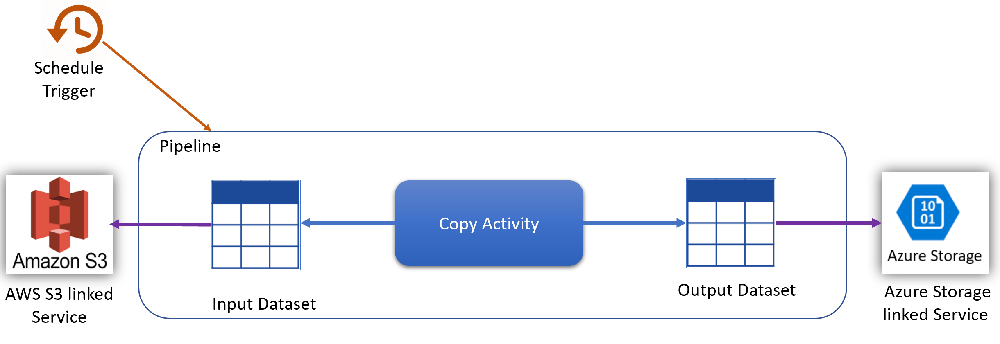
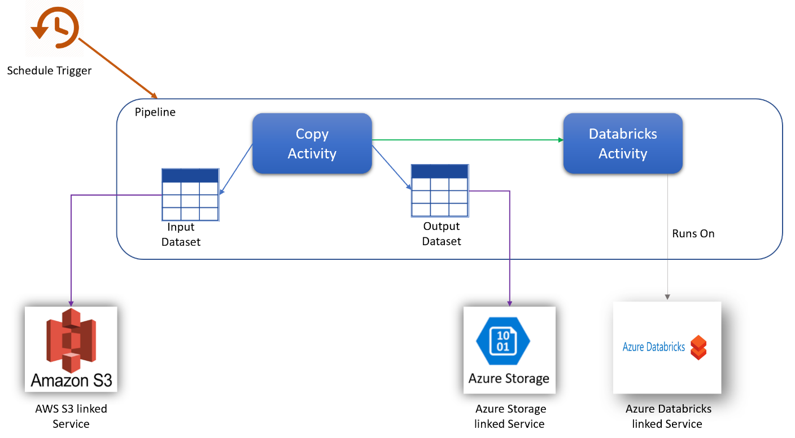
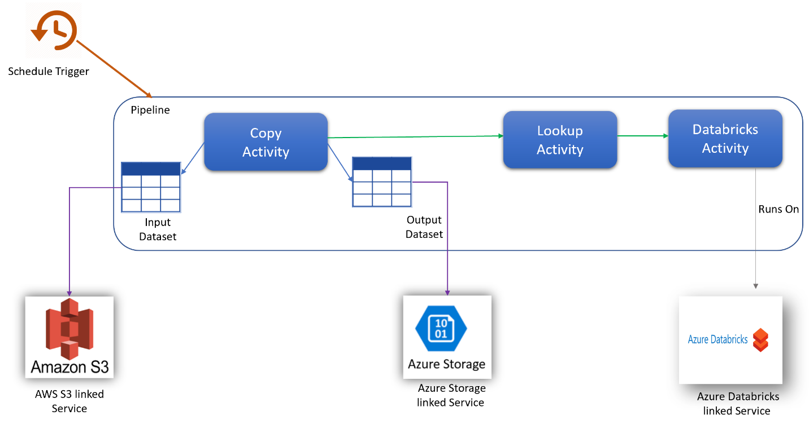

# Understanding Data Factory pricing through examples

This article explains and demonstrates the Azure Data Factory pricing model with detailed examples.

> [!NOTE]
> The prices used in these examples below are hypothetical and are not intended to imply actual pricing.

## Copy data from AWS S3 to Azure Blob storage hourly

In this scenario, you want to copy data from AWS S3 to Azure Blob storage on an hourly schedule.

To accomplish the scenario, you need to create a pipeline with the following items:

1. A copy activity with an input dataset for the data to be copied from AWS S3.

2. An output dataset for the data on Azure Storage.

3. A schedule trigger to execute the pipeline every hour.

   

| **Operations** | **Types and Units** |
| --- | --- |
| Create Linked Service | 2 Read/Write entity  |
| Create Datasets | 4 Read/Write entities (2 for dataset creation, 2 for linked service references) |
| Create Pipeline | 3 Read/Write entities (1 for pipeline creation, 2 for dataset references) |
| Get Pipeline | 1 Read/Write entity |
| Run Pipeline | 2 Activity runs (1 for trigger run, 1 for activity runs) |
| Copy Data Assumption: execution time = 10 min | 10 \* 4 Azure Integration Runtime (default DIU setting = 4) For more information on data integration units and optimizing copy performance, see [this article](copy-activity-performance.md) |
| Monitor Pipeline Assumption: Only 1 run occurred | 2 Monitoring run records retried (1 for pipeline run, 1 for activity run) |

**Total Scenario pricing: $0.16811**

- Data Factory Operations = **$0.0001**
  - Read/Write = 10\*00001 = $0.0001 [1 R/W = $0.50/50000 = 0.00001]
  - Monitoring  = 2\*000005 = $0.00001 [1 Monitoring = $0.25/50000 = 0.000005]
- Pipeline Orchestration &amp; Execution = **$0.168**
  - Activity Runs = 001\*2 = 0.002 [1 run = $1/1000 = 0.001]
  - Data Movement Activities = $0.166 (Prorated for 10 minutes of execution time. $0.25/hour on Azure Integration Runtime)

## Copy data and transform with Azure Databricks hourly

In this scenario, you want to copy data from AWS S3 to Azure Blob storage and transform the data with Azure Databricks on an hourly schedule.

To accomplish the scenario, you need to create a pipeline with the following items:

1. One copy activity with an input dataset for the data to be copied from AWS S3, and an output dataset for the data on Azure storage.
2. One Azure Databricks activity for the data transformation.
3. One schedule trigger to execute the pipeline every hour.

| **Operations** | **Types and Units** |
| --- | --- |
| Create Linked Service | 3 Read/Write entity  |
| Create Datasets | 4 Read/Write entities (2 for dataset creation, 2 for linked service references) |
| Create Pipeline | 3 Read/Write entities (1 for pipeline creation, 2 for dataset references) |
| Get Pipeline | 1 Read/Write entity |
| Run Pipeline | 3 Activity runs (1 for trigger run, 2 for activity runs) |
| Copy Data Assumption: execution time = 10 min | 10 \* 4 Azure Integration Runtime (default DIU setting = 4) For more information on data integration units and optimizing copy performance, see [this article](copy-activity-performance.md) |
| Monitor Pipeline Assumption: Only 1 run occurred | 3 Monitoring run records retried (1 for pipeline run, 2 for activity run) |
| Execute Databricks activity Assumption: execution time = 10 min | 10 min External Pipeline Activity Execution |

**Total Scenario pricing: $0.16916**

- Data Factory Operations = **$0.00012**
  - Read/Write = 11\*00001 = $0.00011 [1 R/W = $0.50/50000 = 0.00001]
  - Monitoring  = 3\*000005 = $0.00001 [1 Monitoring = $0.25/50000 = 0.000005]
- Pipeline Orchestration &amp; Execution = **$0.16904**
  - Activity Runs = 001\*3 = 0.003 [1 run = $1/1000 = 0.001]
  - Data Movement Activities = $0.166 (Prorated for 10 minutes of execution time. $0.25/hour on Azure Integration Runtime)
  - External Pipeline Activity = $0.000041 (Prorated for 10 minutes of execution time. $0.00025/hour on Azure Integration Runtime)

## Copy data and transform with dynamic parameters hourly

In this scenario, you want to copy data from AWS S3 to Azure Blob storage and transform with Azure Databricks (with dynamic parameters in the script) on an hourly schedule.

To accomplish the scenario, you need to create a pipeline with the following items:

1. One copy activity with an input dataset for the data to be copied from AWS S3, an output dataset for the data on Azure storage.
2. One Lookup activity for passing parameters dynamically to the transformation script.
3. One Azure Databricks activity for the data transformation.
4. One schedule trigger to execute the pipeline every hour.

| **Operations** | **Types and Units** |
| --- | --- |
| Create Linked Service | 3 Read/Write entity  |
| Create Datasets | 4 Read/Write entities (2 for dataset creation, 2 for linked service references) |
| Create Pipeline | 3 Read/Write entities (1 for pipeline creation, 2 for dataset references) |
| Get Pipeline | 1 Read/Write entity |
| Run Pipeline | 4 Activity runs (1 for trigger run, 3 for activity runs) |
| Copy Data Assumption: execution time = 10 min | 10 \* 4 Azure Integration Runtime (default DIU setting = 4) For more information on data integration units and optimizing copy performance, see [this article](copy-activity-performance.md) |
| Monitor Pipeline Assumption: Only 1 run occurred | 4 Monitoring run records retried (1 for pipeline run, 3 for activity run) |
| Execute Lookup activity Assumption: execution time = 1 min | 1 min Pipeline Activity execution |
| Execute Databricks activity Assumption: execution time = 10 min | 10 min External Pipeline Activity execution |

**Total Scenario pricing: $0.17020**

- Data Factory Operations = **$0.00013**
  - Read/Write = 11\*00001 = $0.00011 [1 R/W = $0.50/50000 = 0.00001]
  - Monitoring  = 4\*000005 = $0.00002 [1 Monitoring = $0.25/50000 = 0.000005]
- Pipeline Orchestration &amp; Execution = **$0.17007**
  - Activity Runs = 001\*4 = 0.004 [1 run = $1/1000 = 0.001]
  - Data Movement Activities = $0.166 (Prorated for 10 minutes of execution time. $0.25/hour on Azure Integration Runtime)
  - Pipeline Activity = $0.00003 (Prorated for 1 minute of execution time. $0.002/hour on Azure Integration Runtime)
  - External Pipeline Activity = $0.000041 (Prorated for 10 minutes of execution time. $0.00025/hour on Azure Integration Runtime)

## Using mapping data flow debug for a normal workday (Preview Pricing)

As a Data Engineer, you are responsible for designing, building, and testing Mapping Data Flows every day. You log into the ADF UI in the morning and enable the Debug mode for Data Flows. The default TTL for Debug sessions is 60 minutes. You work throughout the day for 10 hours, so your Debug session never expires. Therefore, your charge for the day will be:

**10 (hours) x 8 (cores) x $0.112 = $8.96**

## Transform data in blob store with mapping data flows (Preview Pricing)

In this scenario, you want to transform data in Blob Store visually in ADF Mapping Data Flows on an hourly schedule.

To accomplish the scenario, you need to create a pipeline with the following items:

1. A Data Flow activity with the transformation logic.

2. An input dataset for the data on Azure Storage.

3. An output dataset for the data on Azure Storage.

4. A schedule trigger to execute the pipeline every hour.

| **Operations** | **Types and Units** |
| --- | --- |
| Create Linked Service | 2 Read/Write entity  |
| Create Datasets | 4 Read/Write entities (2 for dataset creation, 2 for linked service references) |
| Create Pipeline | 3 Read/Write entities (1 for pipeline creation, 2 for dataset references) |
| Get Pipeline | 1 Read/Write entity |
| Run Pipeline | 2 Activity runs (1 for trigger run, 1 for activity runs) |
| Data Flow Assumptions: execution time = 10 min + 10 min TTL | 10 \* 8 cores of General Compute with TTL of 10 |
| Monitor Pipeline Assumption: Only 1 run occurred | 2 Monitoring run records retried (1 for pipeline run, 1 for activity run) |

**Total Scenario pricing: $0.3011**

- Data Factory Operations = **$0.0001**
  - Read/Write = 10\*00001 = $0.0001 [1 R/W = $0.50/50000 = 0.00001]
  - Monitoring  = 2\*000005 = $0.00001 [1 Monitoring = $0.25/50000 = 0.000005]
- Pipeline Orchestration &amp; Execution = **$0.301**
  - Activity Runs = 001\*2 = 0.002 [1 run = $1/1000 = 0.001]
  - Data Flow Activities = $0.299 Prorated for 20 minutes (10 mins execution time + 10 mins TTL). $0.112/hour on Azure Integration Runtime with 8 cores general compute

## Next steps

Now that you understand the pricing for Azure Data Factory, you can get started!

- [Create a data factory by using the Azure Data Factory UI](quickstart-create-data-factory-portal.md)

- [Introduction to Azure Data Factory](introduction.md)

- [Visual authoring in Azure Data Factory](author-visually.md)
