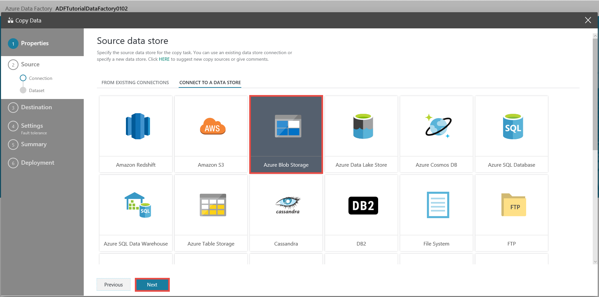
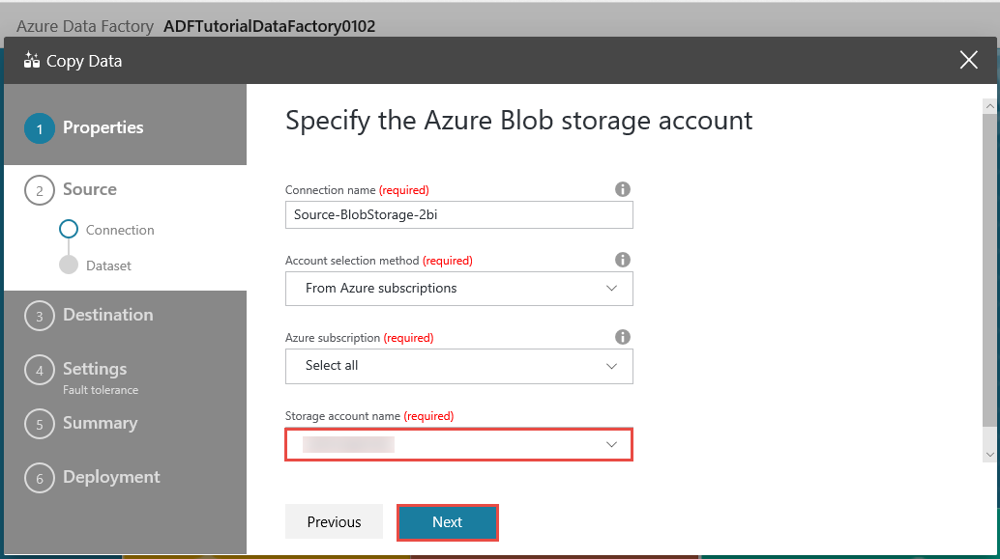
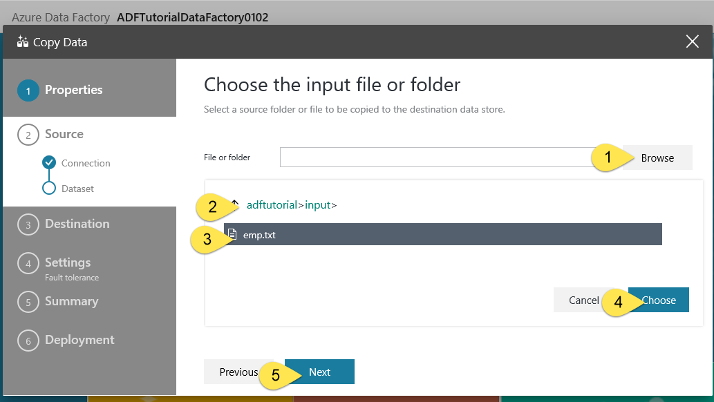
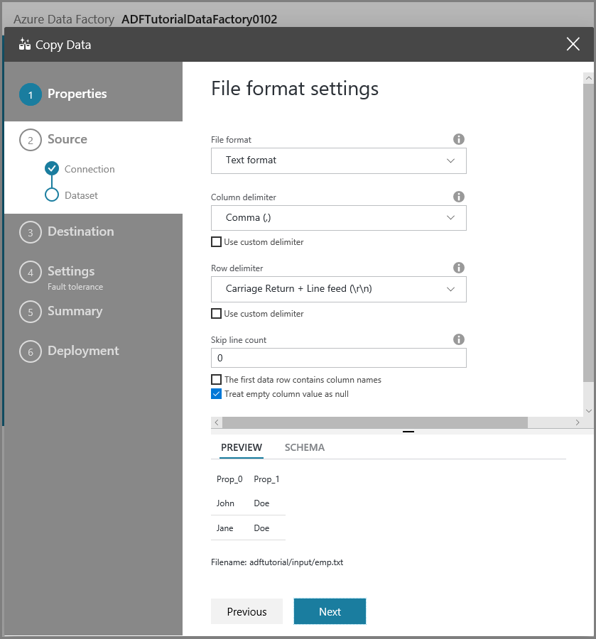
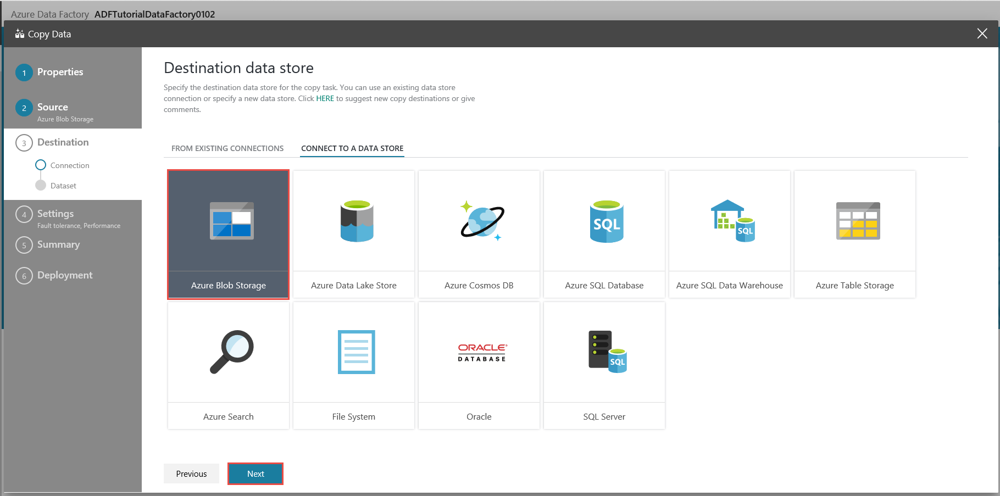
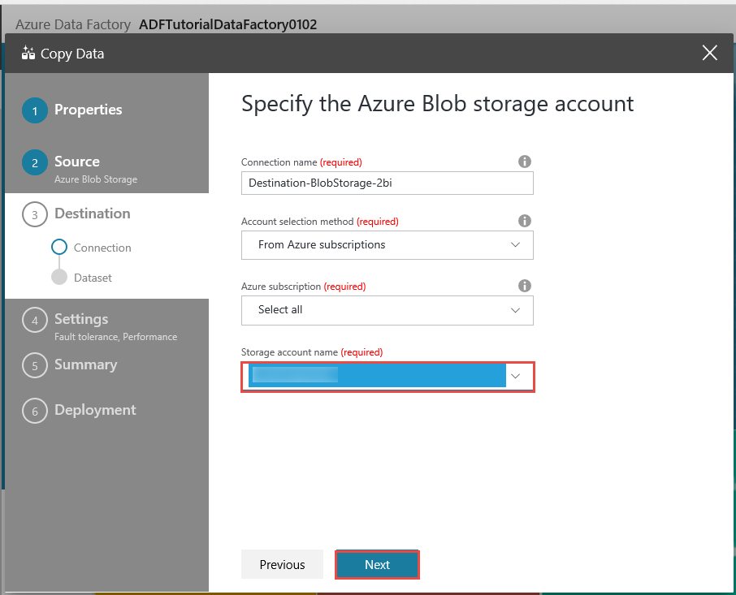
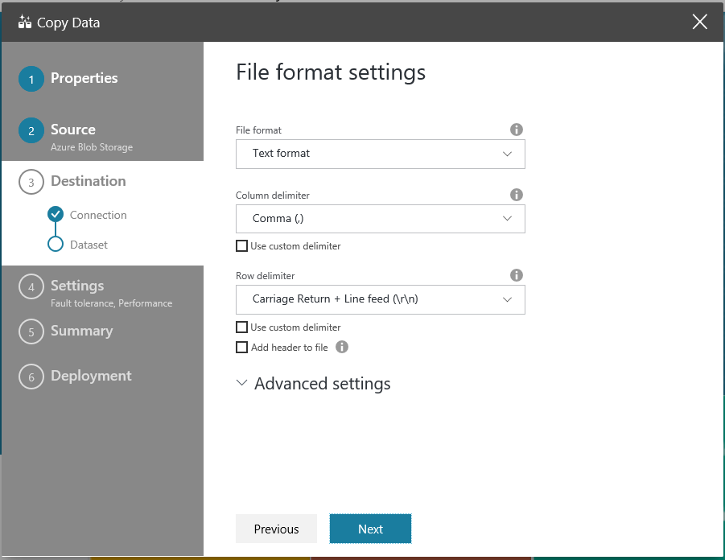
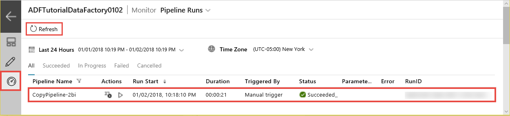
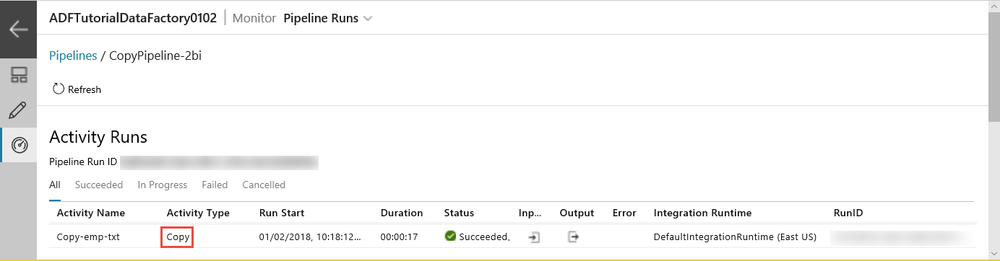
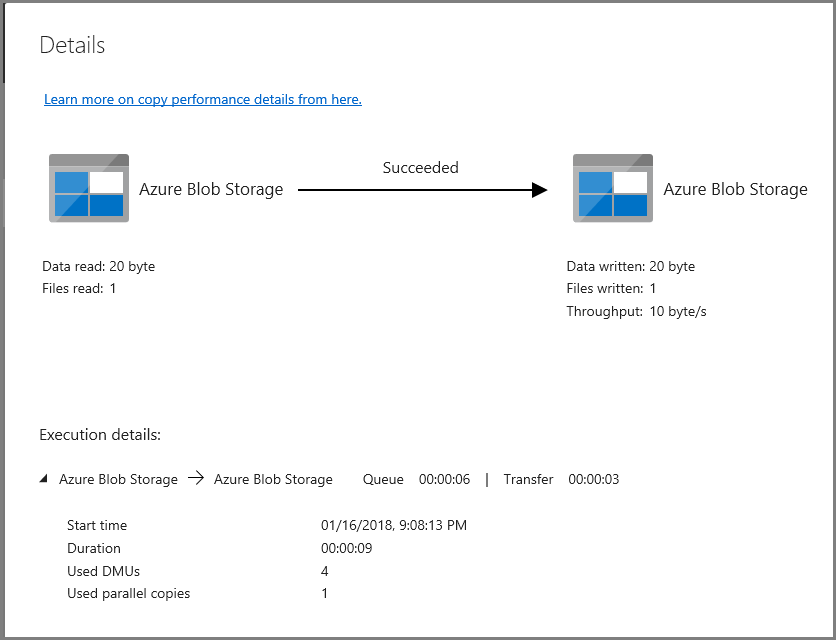

# Use the Copy Data tool to copy data 
> [!div class="op_single_selector" title1="Select the version of Data Factory service that you are using:"]
> * [Version 1 - GA](v1/data-factory-copy-data-from-azure-blob-storage-to-sql-database.md)
> * [Version 2 - Preview](quickstart-create-data-factory-copy-data-tool.md)

In this quickstart, you use the Azure portal to create a data factory. Then, you use the Copy Data tool to create a pipeline that copies data from a folder in Azure Blob storage to another folder. 

> [!NOTE]
> If you are new to Azure Data Factory, see [Introduction to Azure Data Factory](data-factory-introduction.md) before doing this quickstart. 
>
> This article applies to version 2 of Data Factory, which is currently in preview. If you are using version 1 of the service, which is in general availability (GA), see [Get started with Data Factory version 1](v1/data-factory-copy-data-from-azure-blob-storage-to-sql-database.md).

[!INCLUDE [data-factory-quickstart-prerequisites](../../includes/data-factory-quickstart-prerequisites.md)] 

## Create a data factory

1. Select **New** on the left menu, select **Data + Analytics**, and then select **Data Factory**. 
   
   
2. On the **New data factory** page, enter **ADFTutorialDataFactory** for **Name**. 
      
   
 
   The name of the Azure data factory must be *globally unique*. If you see the following error, change the name of the data factory (for example, **&lt;yourname&gt;ADFTutorialDataFactory**) and try creating again. For naming rules for Data Factory artifacts, see the [Data Factory - naming rules](naming-rules.md) article.
  
   
3. For **Subscription**, select your Azure subscription in which you want to create the data factory. 
4. For **Resource Group**, use one of the following steps:
     
   - Select **Use existing**, and select an existing resource group from the list. 
   - Select **Create new**, and enter the name of a resource group.   
         
   To learn about resource groups, see [Using resource groups to manage your Azure resources](../azure-resource-manager/resource-group-overview.md).  
4. For **Version**, select **V2 (Preview)**.
5. For **Location**, select the location for the data factory. 

   The list shows only supported locations. The data stores (like Azure Storage and Azure SQL Database) and computes (like Azure HDInsight) that Data Factory uses can be in other locations/regions.

6. Select **Pin to dashboard**.     
7. Select **Create**.
8. On the dashboard, you see the following tile with the status **Deploying Data Factory**: 

	
9. After the creation is complete, you see the **Data Factory** page. Select the **Author & Monitor** tile to start the Azure Data Factory user interface (UI) application on a separate tab.
   
   

## Start the Copy Data tool

1. On the **Let's get started** page, select the **Copy Data** tile to start the Copy Data tool. 

   
2. On the **Properties** page of the Copy Data tool, select **Next**. You can specify a name for the pipeline and its description on this page. 

   
3. On the **Source data store** page, select **Azure Blob Storage**, and then select **Next**.

   
4. On the **Specify the Azure Blob storage account** page, select your storage account from the **Storage account name** list, and then select **Next**. 

   
5. On the **Choose the input file or folder** page, complete the following steps:

   a. Browse to the **adftutorial/input** folder.

   b. Select the **emp.txt** file.

   c. Select **Choose**. You can double-click **emp.txt** to skip this step.

   d. Select **Next**. 

   
6. On the **File format settings** page, notice that the tool automatically detects the column and row delimiters, and select **Next**. You can also preview data and view schemas of the input data on this page. 

   
7. On the **Destination data store** page, select **Azure Blob Storage**, and then select **Next**. 

       
8. On the **Specify the Azure Blob storage account** page, select your Azure Blob storage account, and then select **Next**. 

   
9. On the **Choose the output file or folder** page, complete the following steps: 

   a. Enter **adftutorial/output** for the folder path.

   b. Enter **emp.txt** for the file name.

   c. Select **Next**. 

    
10. On the **File format settings** page, select **Next**. 

    
11. On the **Settings** page, select **Next**. 

    
12. Review all settings on the **Summary** page, and select **Next**. 

    
13. On the **Deployment complete** page, select **Monitor** to monitor the pipeline that you created. 

    
14. The application switches to the **Monitor** tab. You see the status of the pipeline on this tab. Select **Refresh** to refresh the list. 
    
    
15. Select the **View Activity Runs** link in the **Actions** column. The pipeline has only one activity of type **Copy**. 

    
16. To view details about the copy operation, select the **Details** (eyeglasses image) link in the **Actions** column. For details about the properties, see [Copy Activity overview](copy-activity-overview.md). 

    
17. Verify that the **emp.txt** file is created in the **output** folder of the **adftutorial** container. If the output folder does not exist, the Data Factory service automatically creates it. 
18. Switch to the **Edit** tab so that you can edit linked services, datasets, and pipelines. To learn about editing them in the Data Factory UI, see [Create a data factory by using the Azure portal](quickstart-create-data-factory-portal.md).

    

## Next steps
The pipeline in this sample copies data from one location to another location in Azure Blob storage. To learn about using Data Factory in more scenarios, go through the [tutorials](tutorial-copy-data-portal.md). 