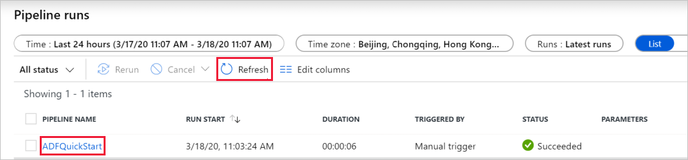
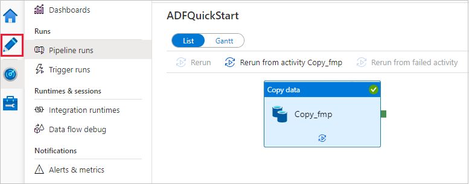

# Quickstart: Use the Copy Data tool to copy data

> [!div class="op_single_selector" title1="Select the version of Data Factory service that you are using:"]
> * [Version 1](v1/data-factory-copy-data-from-azure-blob-storage-to-sql-database.md)
> * [Current version](quickstart-create-data-factory-copy-data-tool.md)

[!INCLUDE[appliesto-adf-xxx-md](includes/appliesto-adf-xxx-md.md)]

In this quickstart, you use the Azure portal to create a data factory. Then, you use the Copy Data tool to create a pipeline that copies data from a folder in Azure Blob storage to another folder. 

> [!NOTE]
> If you are new to Azure Data Factory, see [Introduction to Azure Data Factory](introduction.md) before doing this quickstart. 

[!INCLUDE [data-factory-quickstart-prerequisites](../../includes/data-factory-quickstart-prerequisites.md)] 

## Create a data factory

1. Launch **Microsoft Edge** or **Google Chrome** web browser. Currently, Data Factory UI is supported only in Microsoft Edge and Google Chrome web browsers.
1. Go to the [Azure portal](https://portal.azure.com). 
1. From the Azure portal menu, select **Create a resource** > **Analytics** > **Data Factory**:

    

1. On the **New data factory** page, enter **ADFTutorialDataFactory** for **Name**. 
 
   The name of the Azure data factory must be *globally unique*. If you see the following error, change the name of the data factory (for example, **&lt;yourname&gt;ADFTutorialDataFactory**) and try creating again. For naming rules for Data Factory artifacts, see the [Data Factory - naming rules](naming-rules.md) article.
  
   
1. For **Subscription**, select your Azure subscription in which you want to create the data factory. 
1. For **Resource Group**, use one of the following steps:
     
   - Select **Use existing**, and select an existing resource group from the list. 
   - Select **Create new**, and enter the name of a resource group.   
         
   To learn about resource groups, see [Using resource groups to manage your Azure resources](../azure-resource-manager/management/overview.md).  
1. For **Version**, select **V2**.
1. For **Location**, select the location for the data factory.

   The list shows only locations that Data Factory supports, and where your Azure Data Factory meta data will be stored. The associated data stores (like Azure Storage and Azure SQL Database) and computes (like Azure HDInsight) that Data Factory uses can run in other regions.

1. Select **Create**.

1. After the creation is complete, you see the **Data Factory** page. Select the **Author & Monitor** tile to start the Azure Data Factory user interface (UI) application on a separate tab.
   
   

## Start the Copy Data tool

1. On the **Let's get started** page, select the **Copy Data** tile to start the Copy Data tool. 

   

1. On the **Properties** page of the Copy Data tool, you can specify a name for the pipeline and its description, then select **Next**. 

   
1. On the **Source data store** page, complete the following steps:

    a. Click **+ Create new connection** to add a connection.

    b. Select the linked service type that you want to create for the source connection. In this tutorial, we use **Azure Blob Storage**. Select it from the gallery, and then select **Continue**.
    
    

    c. On the **New Linked Service (Azure Blob Storage)** page, specify a name for your linked service. Select your storage account from the **Storage account name** list, test connection, and then select **Create**. 

    

    d. Select the newly created linked service as source, and then click **Next**.

1. On the **Choose the input file or folder** page, complete the following steps:

   a. Click **Browse** to navigate to the **adftutorial/input** folder, select the **emp.txt** file, and then click **Choose**. 

   d. Select the **Binary copy** checkbox to copy file as-is, and then select **Next**. 

   

1. On the **Destination data store** page, select the **Azure Blob Storage** linked service you created, and then select **Next**. 

1. On the **Choose the output file or folder** page, enter **adftutorial/output** for the folder path, and then select **Next**. 

    

1. On the **Settings** page, select **Next** to use the default configurations. 

1. On the **Summary** page, review all settings, and select **Next**. 

1. On the **Deployment complete** page, select **Monitor** to monitor the pipeline that you created. 

    

1. The application switches to the **Monitor** tab. You see the status of the pipeline on this tab. Select **Refresh** to refresh the list. Click the link under **PIPELINE NAME** to view activity run details or rerun the pipeline. 
   
    

1. On the Activity runs page, select the **Details** link (eyeglasses icon) under the **ACTIVITY NAME** column for more details about copy operation. For details about the properties, see [Copy Activity overview](copy-activity-overview.md). 

1. To go back to the Pipeline Runs view, select the **ALL pipeline runs** link in the breadcrumb menu. To refresh the view, select **Refresh**. 

1. Verify that the **emp.txt** file is created in the **output** folder of the **adftutorial** container. If the output folder doesn't exist, the Data Factory service automatically creates it. 

1. Switch to the **Author** tab above the **Monitor** tab on the left panel so that you can edit linked services, datasets, and pipelines. To learn about editing them in the Data Factory UI, see [Create a data factory by using the Azure portal](quickstart-create-data-factory-portal.md).

    

## Next steps
The pipeline in this sample copies data from one location to another location in Azure Blob storage. To learn about using Data Factory in more scenarios, go through the [tutorials](tutorial-copy-data-portal.md). 
