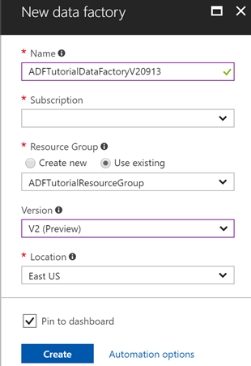
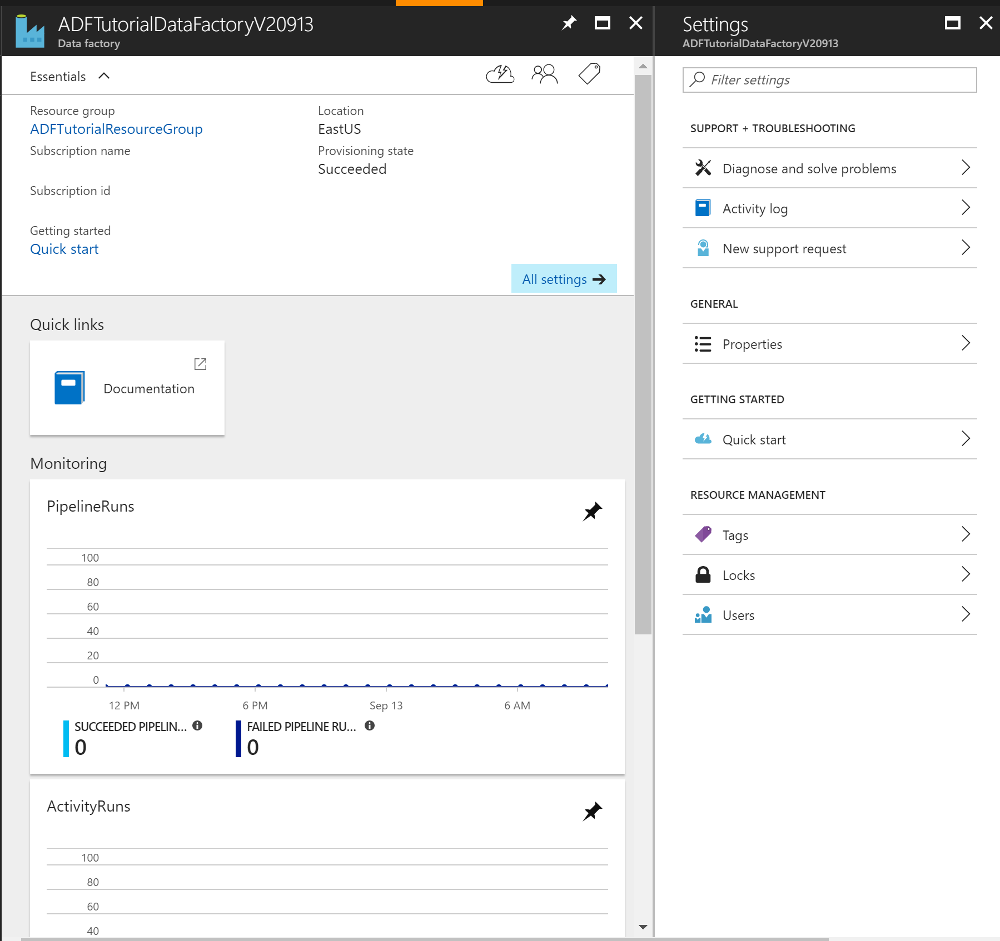

# Create a data factory using the Azure portal
> [!div class="op_single_selector" title1="Select the version of Data Factory service you are using:"]
> * [Version 1 - GA](v1/data-factory-copy-data-from-azure-blob-storage-to-sql-database.md)
> * [Version 2 - Preview](quickstart-create-data-factory-portal.md)

Azure Data Factory is a cloud-based data integration service that allows you to create data-driven workflows in the cloud for orchestrating and automating data movement and data transformation. Using Azure Data Factory, you can create and schedule data-driven workflows (called pipelines) that can ingest data from disparate data stores, process/transform the data by using compute services such as Azure HDInsight Hadoop, Spark, Azure Data Lake Analytics, and Azure Machine Learning, and publish output data to data stores such as Azure SQL Data Warehouse for business intelligence (BI) applications to consume. 

In this quick start, you use Azure portal to create a data factory. After you create the data factory, you need to use PowerShell, .NET SDK, Python SDK, or REST API as in other quick starts a data pipeline that copies data from a source data store to a destination data store. Currently, you cannot create pipelines in a data factory by using Azure portal.

> [!NOTE]
> This article applies to version 2 of Data Factory, which is currently in preview. If you are using version 1 of the Data Factory service, which is generally available (GA), see [get started with Data Factory version 1](v1/data-factory-copy-data-from-azure-blob-storage-to-sql-database.md).

If you don't have an Azure subscription, create a [free](https://azure.microsoft.com/free/) account before you begin.

## Log in to the Azure portal
Log in to the [Azure portal](https://portal.azure.com/).

## Create a data factory
Here are the steps you perform as part of this quickstart:
1. Click **New** on the left menu, click **Data + Analytics**, and click **Data Factory**. 
   
   
2. In the **New data factory** blade, enter **ADFTutorialDataFactory** for the **name**. 
      
     
 
   The name of the Azure data factory must be **globally unique**. If you receive the following error, change the name of the data factory (for example, yournameADFTutorialDataFactory) and try creating again. See [Data Factory - Naming Rules](naming-rules.md) topic for naming rules for Data Factory artifacts.
  
       `Data factory name “ADFTutorialDataFactory” is not available`
3. Select your Azure **subscription** in which you want to create the data factory. 
4. For the **Resource Group**, do one of the following steps:
     
      - Select **Use existing**, and select an existing resource group from the drop-down list. 
      - Select **Create new**, and enter the name of a resource group.   
         
      Some of the steps in this quickstart assume that you use the name: **ADFTutorialResourceGroup** for the resource group. To learn about resource groups, see [Using resource groups to manage your Azure resources](../azure-resource-manager/resource-group-overview.md).  
4. Select **V2 (Preview)** for the **version**.
5. Select the **location** for the data factory. Currently, Data Factory V2 allows you to create data factories only in the East US, East US2, and West Europe regions. The data stores (Azure Storage, Azure SQL Database, etc.) and computes (HDInsight, etc.) used by data factory can be in other regions.
6. Select **Pin to dashboard**.     
7. Click **Create**.
      
      > [!IMPORTANT]
      > To create Data Factory instances, you must be a member of the [Data Factory Contributor](../active-directory/role-based-access-built-in-roles.md#data-factory-contributor) role at the subscription/resource group level.
      > 
      > The name of the data factory may be registered as a DNS name in the future and hence become publically visible.             
3. On the dashboard, you see the following tile with status: **Deploying data factory**. 

	
1. After the creation is complete, you see the **Data Factory** blade as shown in the image.
   
   

## Next steps
The pipeline in this sample copies data from one location to another location in an Azure blob storage. Go through the [tutorials](tutorial-copy-data-dot-net.md) to learn about using Data Factory in more scenarios. 