# Create a data factory using the Azure portal
> [!div class="op_single_selector" title1="Select the version of Data Factory service you are using:"]
> * [Version 1 - GA](v1/data-factory-copy-data-from-azure-blob-storage-to-sql-database.md)
> * [Version 2 - Preview](quickstart-create-data-factory-portal.md)

This quickstart describes how to use the Azure portal to create and monitor a data factory. The pipeline you create in this data factory **copies** data from one folder to another folder in an Azure blob storage. For a tutorial on how to **transform** data using Azure Data Factory, see [Tutorial: Transform data using Spark](transform-data-using-spark.md). For a detailed overview of the Data Factory, see [Introduction to Azure Data Factory](data-factory-introduction.md).

> [!NOTE]
> This article applies to version 2 of Data Factory, which is currently in preview. If you are using version 1 of Data Factory, which is generally available (GA), see [get started with Data Factory version 1](v1/data-factory-copy-data-from-azure-blob-storage-to-sql-database.md).

[!INCLUDE [data-factory-quickstart-prerequisites](../../includes/data-factory-quickstart-prerequisites.md)] 

## Create a data factory

1. Click **New** on the left menu, click **Data + Analytics**, and click **Data Factory**. 
   
   
2. In the **New data factory** page, enter **ADFTutorialDataFactory** for the **name**. 
      
     
 
   The name of the Azure data factory must be **globally unique**. If you see the following error for the name field, change the name of the data factory (for example, yournameADFTutorialDataFactory) and try creating again. See [Data Factory - Naming Rules](naming-rules.md) article for naming rules for Data Factory artifacts.
  
       `Data factory name “ADFTutorialDataFactory” is not available`
3. Select your Azure **subscription** in which you want to create the data factory. 
4. For the **Resource Group**, do one of the following steps:
     
      - Select **Use existing**, and select an existing resource group from the drop-down list. 
      - Select **Create new**, and enter the name of a resource group.   
         
    To learn about resource groups, see [Using resource groups to manage your Azure resources](../azure-resource-manager/resource-group-overview.md).  
4. Select **V2 (Preview)** for the **version**.
5. Select the **location** for the data factory. Only locations that are supported by Data Factory are shown in the drop-down list. The data stores (Azure Storage, Azure SQL Database, etc.) and computes (HDInsight, etc.) used by data factory can be in other locations.
6. Select **Pin to dashboard**.     
7. Click **Create**.
8. On the dashboard, you see the following tile with status: **Deploying data factory**. 

    
9. After the creation is complete, you see the **Data Factory** page as shown in the image.
   
    
10. Click **Author & Monitor** tile to launch the Azure Data Factory user interface (UI) application in a separate tab. 
11. In the get started page, click **Create pipeline**, or switch to the **Edit** tab as shown in the following image: 

    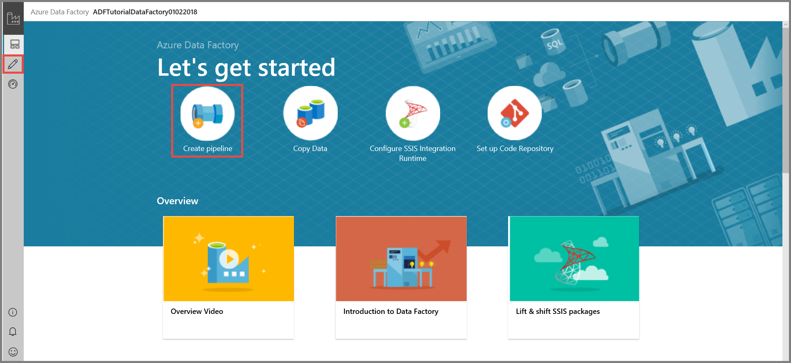

## Create Azure Storage linked service
In this step, you create a linked service to link your Azure Storage Account to the data factory. The linked service has the connection information that the Data Factory service uses at runtime to connect to it.

2. Click **Connections**, and then click the **New** button on the toolbar. 

    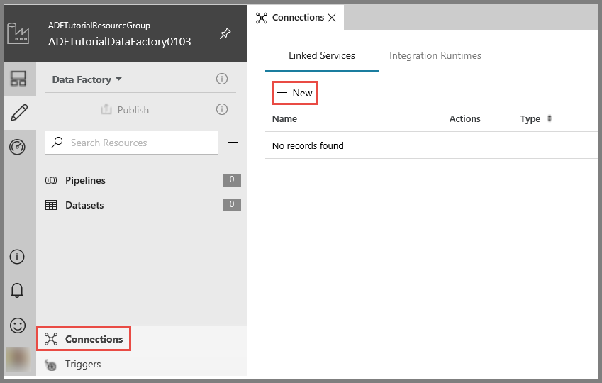    
3. In the **New Linked Service** page, select **Azure Blob Storage**, and click **Continue**. 

    
4. In the **New Linked Service** page, do the following steps: 

    1. Enter **AzureStorageLinkedService** for the **Name**.
    2. Select the name of your Azure Storage Account for the **storage account name**.
    3. Click **Test connection** to confirm that the Data Factory service can connect to the storage account. 
    4. Click **Save** to save the linked service. 

        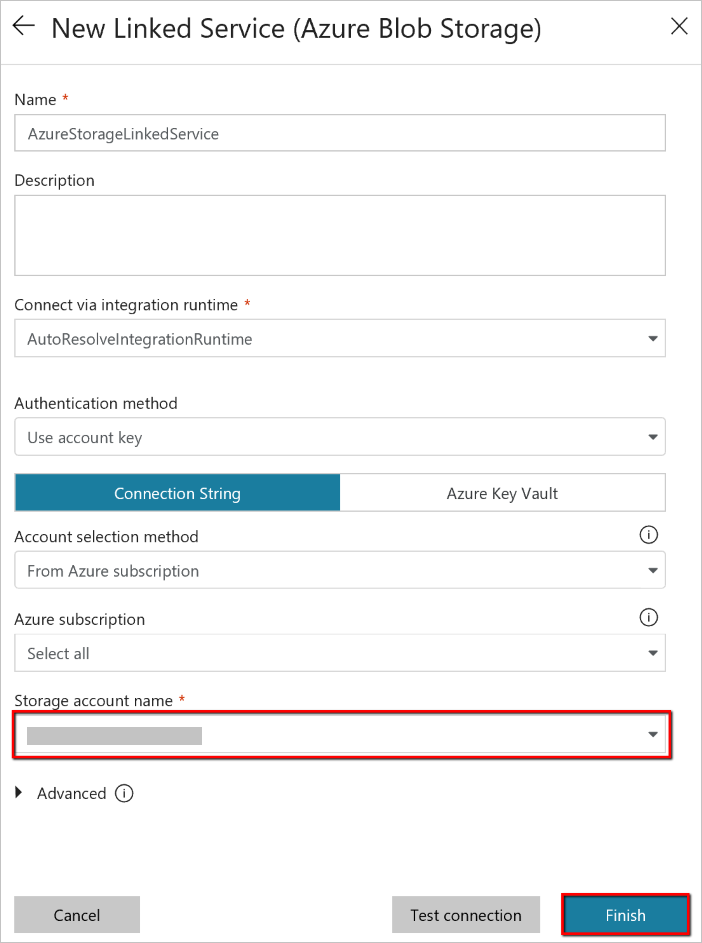 
5. Confirm that you see **AzureStorageLinkedService** in the list of linked services. 

    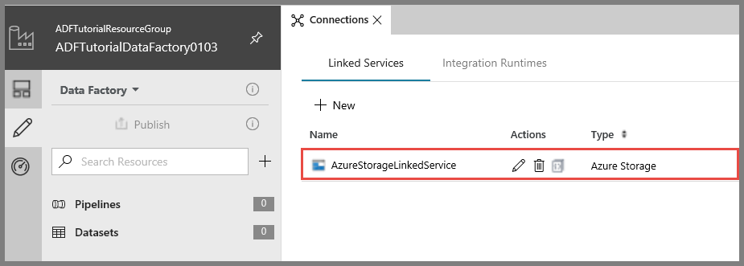

## Create datasets
In this step, you create two datasets: **InputDataset** and **OutputDataset**. These datasets are of type **AzureBlob**. They refer to the **Azure Storage linked service** you created in the previous step. 

The input dataset represents the source data in the input folder. In the input dataset definition, you specify the blob container (**adftutorial**), folder (**input**), and the file (**emp.txt**) that contains the source data. 

The output dataset represents the data that's copied to the destination. In the output dataset definition, you specify the blob container (**adftutorial**), folder (**output**), and the file to which the data is copied. Each run of a pipeline has a unique ID associated with it, which can be accessed by using the system variable **RunId**. The name of the output file is dynamically evaluated based on the run ID of the pipeline.   
 
1. Click the **+ (plus)** button, and select **Dataset**.

    
2. In the **New Dataset** page, select **Azure Blob Storage**, and click **Finish**. 

    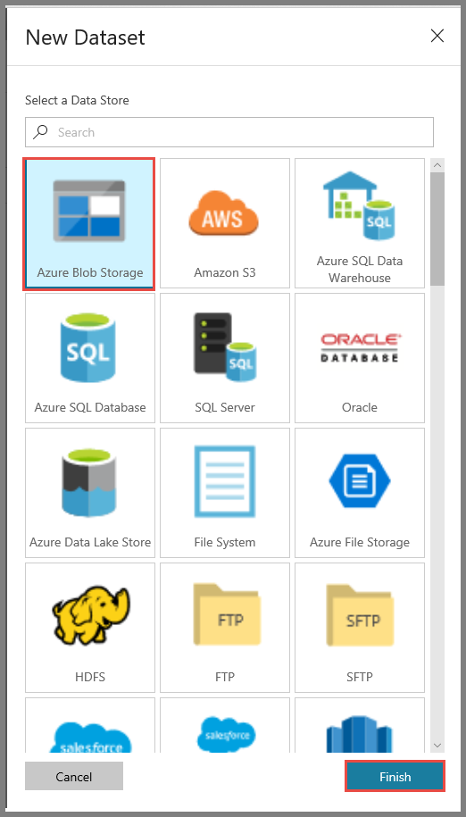
3. Enter **InputDataset** for the name. 

    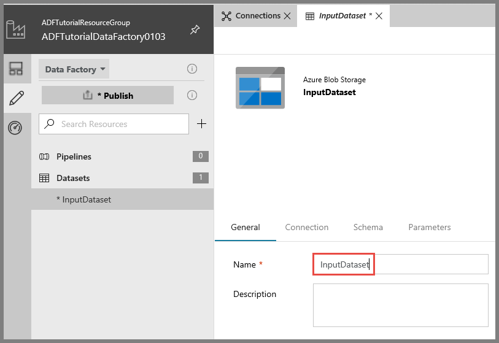
4. Switch to the **Connection** tab and do the following steps: 

    1. Select **AzureStorageLinkedService** for the linked service. 
    2. Click **Browse** button for the **File path**. 
        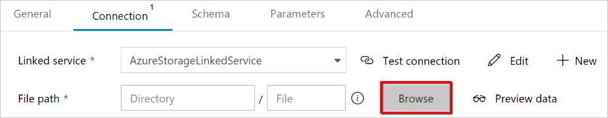
    3. In the **Choose a file or folder** window, navigate to the **input** folder in the **adftutorial** container, select **emp.txt** file, and click **Finish**.

        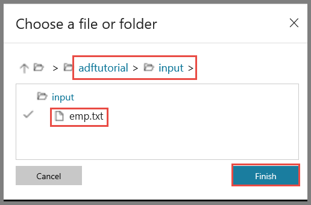
    4. (optional) Click **Preview data** to preview the data in the emp.txt file.     
5. Repeat the steps to create the output dataset. Use the following values for the settings: 

    1. Click the **+ (plus)** button, and select **Dataset**.
    2. In the **New Dataset** page, select **Azure Blob Storage**, and click **Finish**.
    3. Specify **OutputDataset** for the name.
    4. Enter **adftutorial/output** for the folder.
    5. Enter `@CONCAT(pipeline().RunId, '.txt')` for the file name. The expression uses the ID of the current pipeline run for the file name. It concatenates the **RunId** value with **.txt**. For the supported list of system variables and expressions, see [System variables](control-flow-system-variables.md) and [Expression language](control-flow-expression-language-functions.md).

        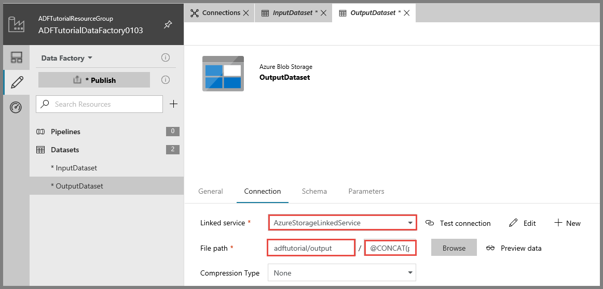

## Create a pipeline 
In this step, you create and validate a pipeline with a **Copy** activity that uses the input and output datasets.  

1. Click the **+ (plus)** button, and select **Pipeline**. 

    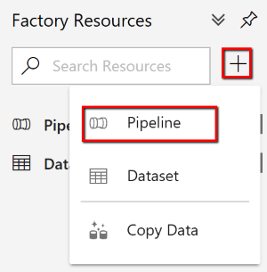
2. Specify **CopyPipeline** for the name. 

    
3. Drag-drop the **Copy** activity from the toolbox to the pipeline designer surface. Specify **CopyFromBlobToBlob** for the name.

    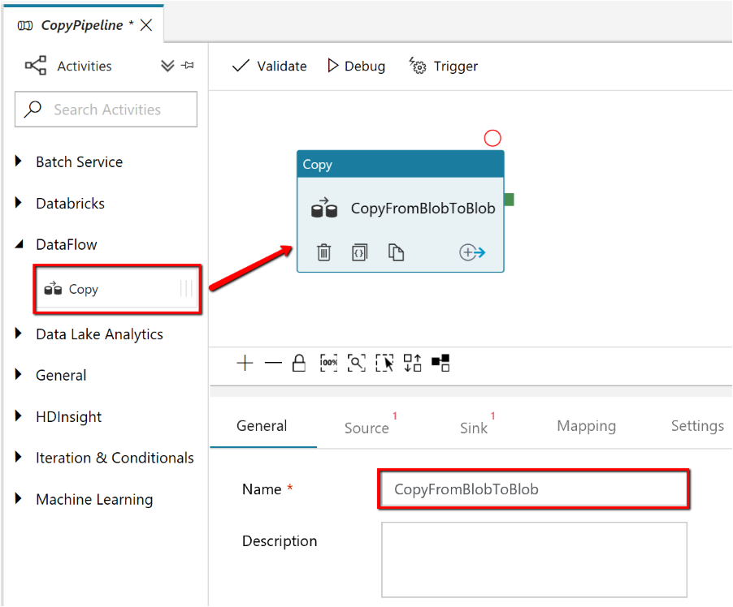
4. Switch to the **Source** tab in the copy activity settings, and select **InputDataset** for the **source dataset**.

    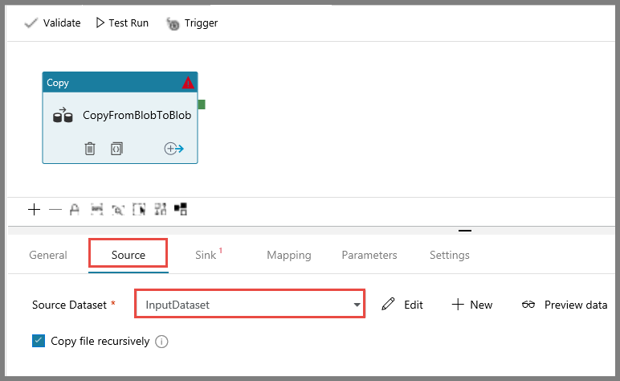    
5. Switch to the **Sink** tab in the copy activity settings, and select **OutputDataset** for the **sink dataset**.

    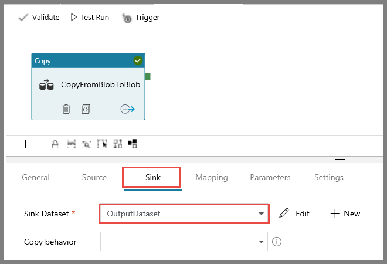    
7. Click **Validate** to validate the pipeline settings. Confirm that pipeline has been successfully validated. To close the validation output, click the **right-arrow** (>>) button. 

    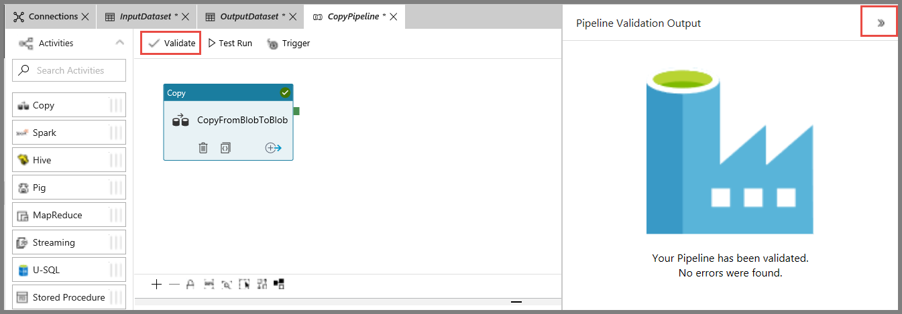

## Test run the pipeline
In this step, you test run the pipeline before deploying it to the Data Factory repository. 

1. Click **Test Run** to test run the pipeline. 
    
    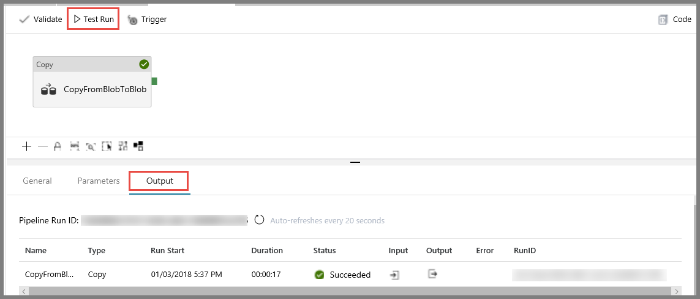
2. Confirm that you see the status of the pipeline run in the **Output** tab of the pipeline settings. 
3. Confirm that you see an output file in the **output** folder of the **adftutorial** container. If the output folder does not exist, the Data Factory service automatically creates it. 
    
    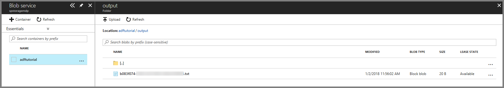

## Trigger the pipeline manually
In this step, you deploy entities (linked services, datasets, pipelines) to Azure Data Factory. Then, you trigger a pipeline run that you monitor in the step. You can also publish entities your own VSTS GIT repository, which is covered in [another tutorial](tutorial-copy-data-portal.md?#configure-code-repository).

1. Before triggering a pipeline, you must publish entities to Data Factory. To publish, click **Publish** in the left pane. 

    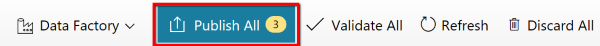
2. To trigger the pipeline manually, click **Trigger** on the toolbar, and select **Trigger Now**. 
    
    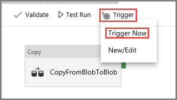

## Monitor the pipeline

1. Switch to the **Monitor** tab. Use the **Refresh** button to refresh the list.

    
2. Click the **View Activity Runs** link under **Actions**. You see the status of the copy activity run in this page. 

    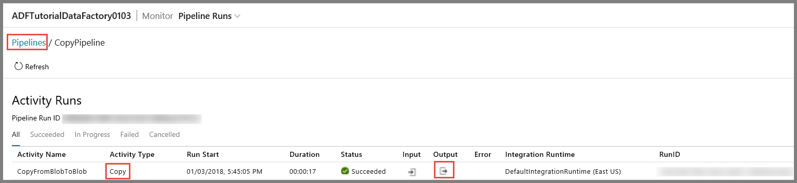
3. To view the results of copy operation, click the link in the **Output** column.
4. Confirm that you see a new file in the **output** folder. 
5. You can switch back to the **Pipeline Runs** view from the **Activity Runs** view by clicking **Pipelines** link. 

## Trigger the pipeline on a schedule
This step is optional in this tutorial. You can create a **scheduler trigger** to schedule the pipeline to run periodically (hourly, daily, etc.). In this step, you create a trigger to run every minute until the datetime you specify as the end date. 

1. Switch to the **Edit** tab. 

    
1. Click **Trigger** on the menu, and click **New/Edit**. 

    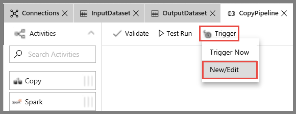
2. In the **Add Triggers** page, click **Choose trigger...**, and click **New**. 

    
3. In the **New Trigger** page, For the **End** field, select **On Date**, specify end time a few minutes after the current time, and click **Apply**.

    
4. Check the **Activated** option in the **New Trigger** page, and click **Next** 

    
5. In the **New Trigger** page, review the warning message, and click **Finish**.

    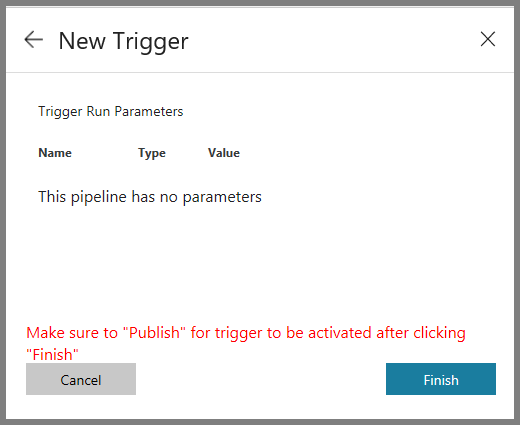
6. Click **Publish** to publish changes to Data Factory.

    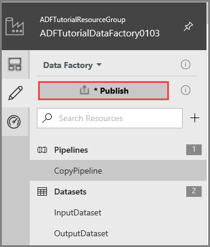
8. Switch to the **Monitor** tab on the left. You see the pipeline runs once every minute from the current time to the end time. Notice the values in the **Triggered By** column. The manual trigger run was from the step (**Trigger Now**) you did earlier. 

    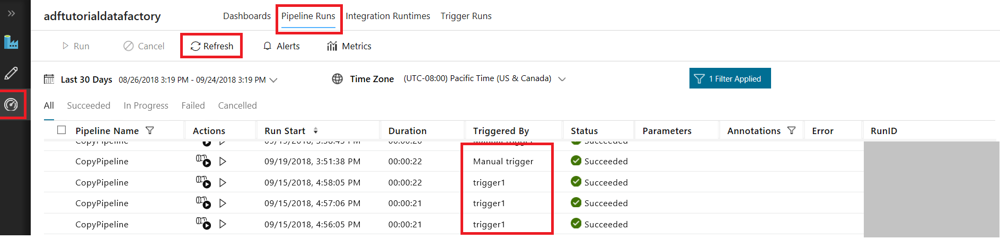
9. Click the down-arrow next to **Pipeline Runs** to switch to the **Trigger Runs** view. 

    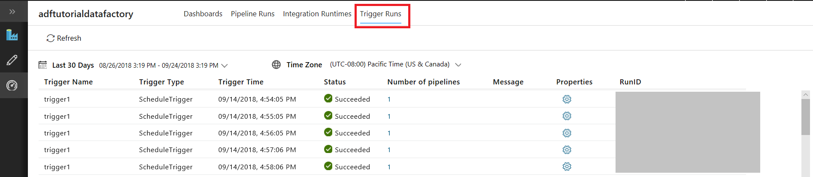    
10. Confirm that an **output file** is created for every minute until the specified end datetime in the **output** folder. 

## Next steps
The pipeline in this sample copies data from one location to another location in an Azure blob storage. Go through the [tutorials](tutorial-copy-data-portal.md) to learn about using Data Factory in more scenarios. 