# Quickstart: Create a data factory by using the Azure Data Factory UI

> [!div class="op_single_selector" title1="Select the version of Data Factory service that you are using:"]
> * [Version 1](v1/data-factory-copy-data-from-azure-blob-storage-to-sql-database.md)
> * [Current version](quickstart-create-data-factory-portal.md)

[!INCLUDE[appliesto-adf-xxx-md](includes/appliesto-adf-xxx-md.md)]

This quickstart describes how to use the Azure Data Factory UI to create and monitor a data factory. The pipeline that you create in this data factory *copies* data from one folder to another folder in Azure Blob storage. To *transform* data by using Azure Data Factory, see [Mapping data flow](concepts-data-flow-overview.md) and [Wrangling data flow (Preview)](wrangling-data-flow-overview.md).

> [!NOTE]
> If you are new to Azure Data Factory, see [Introduction to Azure Data Factory](introduction.md) before doing this quickstart. 

[!INCLUDE [data-factory-quickstart-prerequisites](../../includes/data-factory-quickstart-prerequisites.md)] 

### Video 
Watching this video helps you understand the Data Factory UI: 
>[!VIDEO https://channel9.msdn.com/Shows/Azure-Friday/Visually-build-pipelines-for-Azure-Data-Factory-v2/Player]

## Create a data factory

1. Launch **Microsoft Edge** or **Google Chrome** web browser. Currently, Data Factory UI is supported only in Microsoft Edge and Google Chrome web browsers.
1. Go to the [Azure portal](https://portal.azure.com). 
1. From the Azure portal menu, select **Create a resource**.
1. Select **Analytics**, and then select **Data Factory**. 
   
   
1. On the **New data factory** page, enter **ADFTutorialDataFactory** for **Name**. 
 
   The name of the Azure data factory must be *globally unique*. If you see the following error, change the name of the data factory (for example, **&lt;yourname&gt;ADFTutorialDataFactory**) and try creating again. For naming rules for Data Factory artifacts, see the [Data Factory - naming rules](naming-rules.md) article.
  
   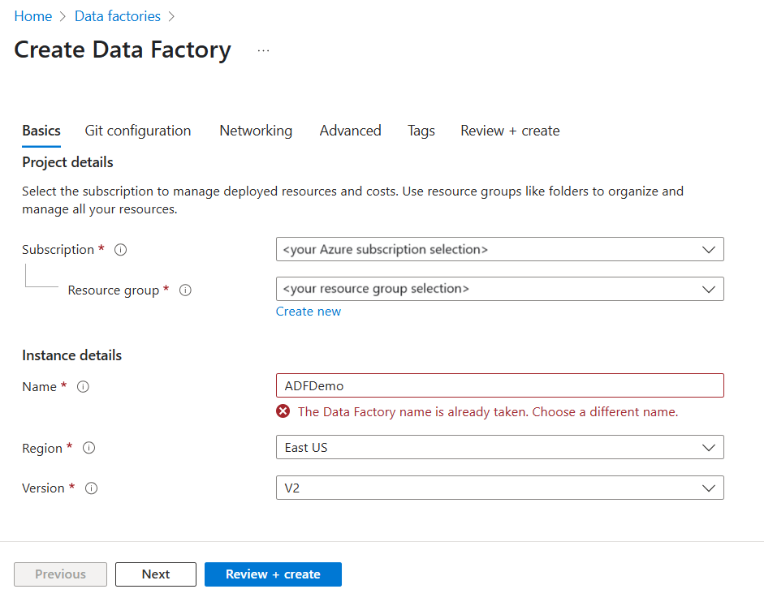
1. For **Subscription**, select your Azure subscription in which you want to create the data factory. 
1. For **Resource Group**, use one of the following steps:
     
   - Select **Use existing**, and select an existing resource group from the list. 
   - Select **Create new**, and enter the name of a resource group.   
         
   To learn about resource groups, see [Using resource groups to manage your Azure resources](../azure-resource-manager/management/overview.md).  
1. For **Version**, select **V2**.
1. For **Location**, select the location for the data factory.

   The list shows only locations that Data Factory supports, and where your Azure Data Factory meta data will be stored. The associated data stores (like Azure Storage and Azure SQL Database) and computes (like Azure HDInsight) that Data Factory uses can run in other regions.

1. Select **Create**. After the creation is complete, select **Go to resource** to navigate to the **Data Factory** page. 

1. Select the **Author & Monitor** tile to start the Azure Data Factory user interface (UI) application on a separate tab.
   
   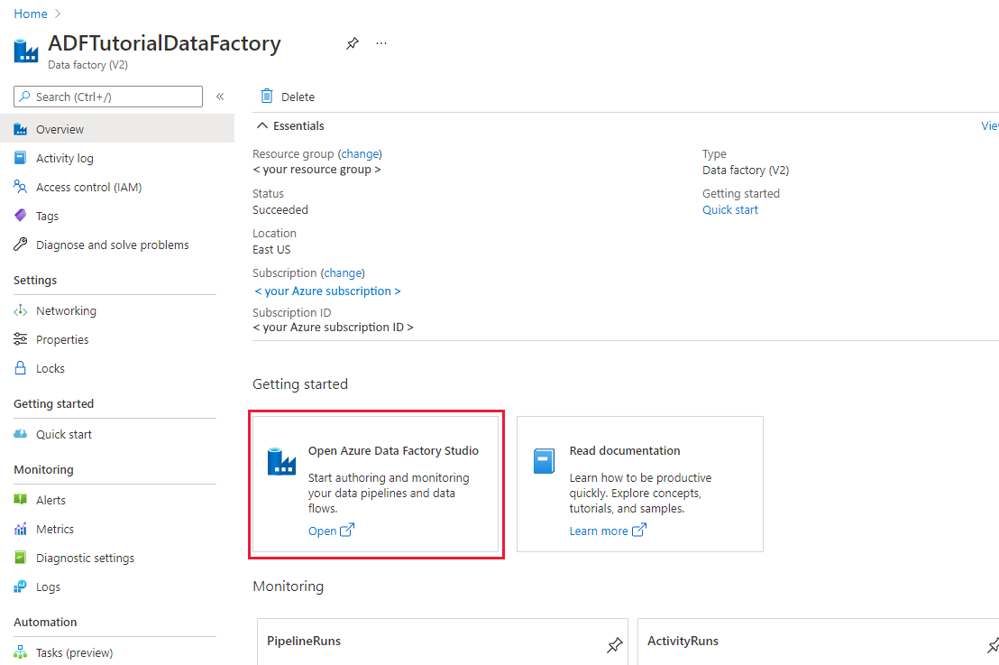
   
   > [!NOTE]
   > If you see that the web browser is stuck at "Authorizing", clear the **Block third-party cookies and site data** check box. Or keep it selected, create an exception for **login.microsoftonline.com**, and then try to open the app again.
   
1. On the **Let's get started** page, switch to the **Author** tab in the left panel. 

    

## Create a linked service
In this procedure, you create a linked service to link your Azure Storage account to the data factory. The linked service has the connection information that the Data Factory service uses at runtime to connect to it.

1. Open [Manage tab](https://docs.microsoft.com/azure/data-factory/author-management-hub) from the left pane.

1. On the Linked services page, select **+New** to create a new linked service.

   
   
1. On the **New Linked Service** page, select **Azure Blob Storage**, and then select **Continue**. 

1. On the New Linked Service (Azure Blob Storage) page, complete the following steps: 

   a. For **Name**, enter **AzureStorageLinkedService**.

   b. For **Storage account name**, select the name of your Azure Storage account.

   c. Select **Test connection** to confirm that the Data Factory service can connect to the storage account. 

   d. Select **Create** to save the linked service. 

      

## Create datasets
In this procedure, you create two datasets: **InputDataset** and **OutputDataset**. These datasets are of type **AzureBlob**. They refer to the Azure Storage linked service that you created in the previous section. 

The input dataset represents the source data in the input folder. In the input dataset definition, you specify the blob container (**adftutorial**), the folder (**input**), and the file (**emp.txt**) that contain the source data. 

The output dataset represents the data that's copied to the destination. In the output dataset definition, you specify the blob container (**adftutorial**), the folder (**output**), and the file to which the data is copied. Each run of a pipeline has a unique ID associated with it. You can access this ID by using the system variable **RunId**. The name of the output file is dynamically evaluated based on the run ID of the pipeline.   

In the linked service settings, you specified the Azure Storage account that contains the source data. In the source dataset settings, you specify where exactly the source data resides (blob container, folder, and file). In the sink dataset settings, you specify where the data is copied to (blob container, folder, and file). 
 
1. Select the **+** (plus) button, and then select **Dataset**.

   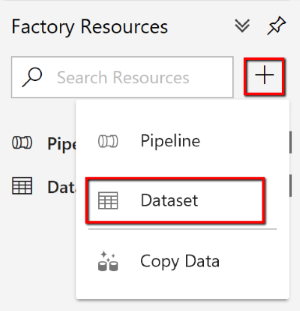
1. On the **New Dataset** page, select **Azure Blob Storage**, and then select **Continue**. 

1. On the **Select Format** page, choose the format type of your data, and then select **Continue**. In this case, select **Binary** when copy files as-is without parsing the content.

   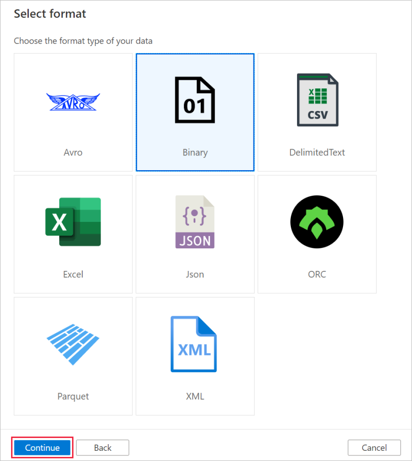
   
1. On the **Set Properties** page, complete following steps:

    a. Under **Name**, enter **InputDataset**. 

    b. For **Linked service**, select **AzureStorageLinkedService**.

    c. For **File path**, select the **Browse** button.

    d. In the **Choose a file or folder** window, browse to the **input** folder in the **adftutorial** container, select the **emp.txt** file, and then select **OK**.
    
    e. Select **OK**.   

    
1. Repeat the steps to create the output dataset:  

    a. Select the **+** (plus) button, and then select **Dataset**.

    b. On the **New Dataset** page, select **Azure Blob Storage**, and then select **Continue**.

    c. On the **Select Format** page, choose the format type of your data, and then select **Continue**.

    d. On the **Set Properties** page, specify **OutputDataset** for the name. Select **AzureStorageLinkedService** as linked service.

    e. Under **File path**, enter **adftutorial/output**. If the **output** folder doesn't exist, the copy activity creates it at runtime.

    f. Select **OK**.   

    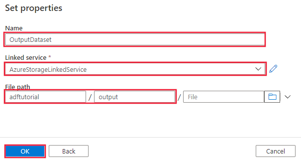

## Create a pipeline 
In this procedure, you create and validate a pipeline with a copy activity that uses the input and output datasets. The copy activity copies data from the file you specified in the input dataset settings to the file you specified in the output dataset settings. If the input dataset specifies only a folder (not the file name), the copy activity copies all the files in the source folder to the destination. 

1. Select the **+** (plus) button, and then select **Pipeline**. 

1. In the General panel under **Properties**, specify **CopyPipeline** for **Name**. Then collapse the panel by clicking the Properties icon in the top-right corner.

1. In the **Activities** toolbox, expand **Move & Transform**. Drag the **Copy Data** activity from the **Activities** toolbox to the pipeline designer surface. You can also search for activities in the **Activities** toolbox. Specify **CopyFromBlobToBlob** for **Name**.
   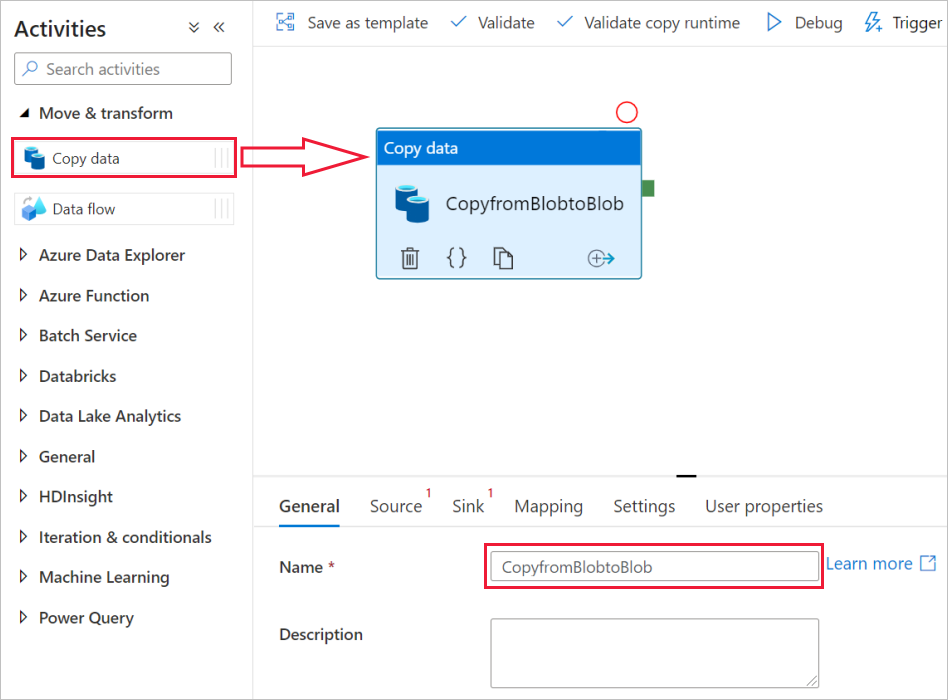

1. Switch to the **Source** tab in the copy activity settings, and select **InputDataset** for **Source Dataset**.

1. Switch to the **Sink** tab in the copy activity settings, and select **OutputDataset** for **Sink Dataset**.

1. Click **Validate** on the pipeline toolbar above the canvas to validate the pipeline settings. Confirm that the pipeline has been successfully validated. To close the validation output, select the **>>** (right arrow) button. 
   

## Debug the pipeline
In this step, you debug the pipeline before deploying it to Data Factory. 

1. On the pipeline toolbar above the canvas, click **Debug** to trigger a test run. 
    
1. Confirm that you see the status of the pipeline run on the **Output** tab of the pipeline settings at the bottom. 
 
    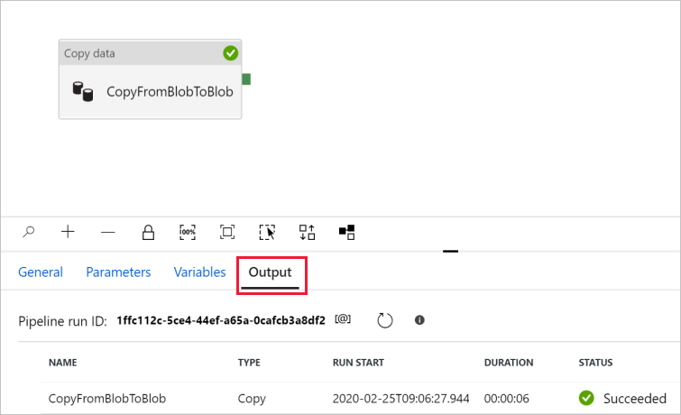

1. Confirm that you see an output file in the **output** folder of the **adftutorial** container. If the output folder doesn't exist, the Data Factory service automatically creates it. 

## Trigger the pipeline manually
In this procedure, you deploy entities (linked services, datasets, pipelines) to Azure Data Factory. Then, you manually trigger a pipeline run. 

1. Before you trigger a pipeline, you must publish entities to Data Factory. To publish, select **Publish all** on the top. 
    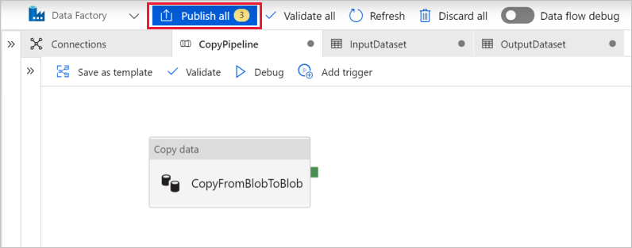

1. To trigger the pipeline manually, select **Add Trigger** on the pipeline toolbar, and then select **Trigger Now**. On the **Pipeline run** page, select **Finish**.

## Monitor the pipeline

1. Switch to the **Monitor** tab on the left. Use the **Refresh** button to refresh the list.

   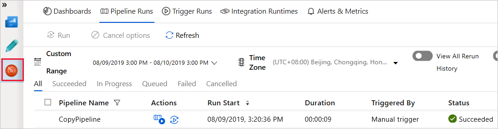
1. Select the **CopyPipeline** link, you'll see the status of the copy activity run on this page. 

1. To view details about the copy operation, select the **Details** (eyeglasses image) link. For details about the properties, see [Copy Activity overview](copy-activity-overview.md). 

   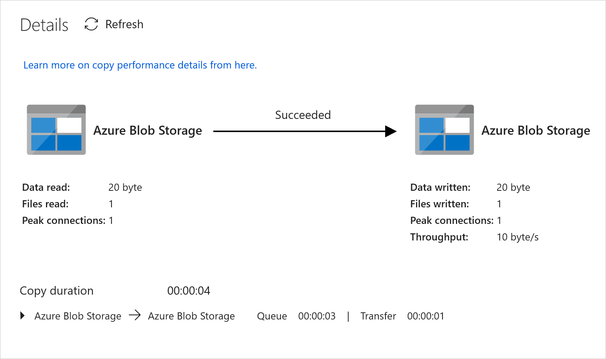
1. Confirm that you see a new file in the **output** folder. 
1. You can switch back to the **Pipeline runs** view from the **Activity runs** view by selecting the **All pipeline runs** link. 

## Trigger the pipeline on a schedule
This procedure is optional in this tutorial. You can create a *scheduler trigger* to schedule the pipeline to run periodically (hourly, daily, and so on). In this procedure, you create a trigger to run every minute until the end date and time that you specify. 

1. Switch to the **Author** tab. 

1. Go to your pipeline, select **Add Trigger** on the pipeline toolbar, and then select **New/Edit**. 

1. On the **Add Triggers** page, select **Choose trigger**, and then select **New**. 

1. On the **New Trigger** page, under **End**, select **On Date**, specify an end time a few minutes after the current time, and then select **OK**. 

   A cost is associated with each pipeline run, so specify the end time only minutes apart from the start time. Ensure that it's the same day. However, ensure that there's enough time for the pipeline to run between the publish time and the end time. The trigger comes into effect only after you publish the solution to Data Factory, not when you save the trigger in the UI. 

1. On the **New Trigger** page, select the **Activated** check box, and then select **OK**. 

   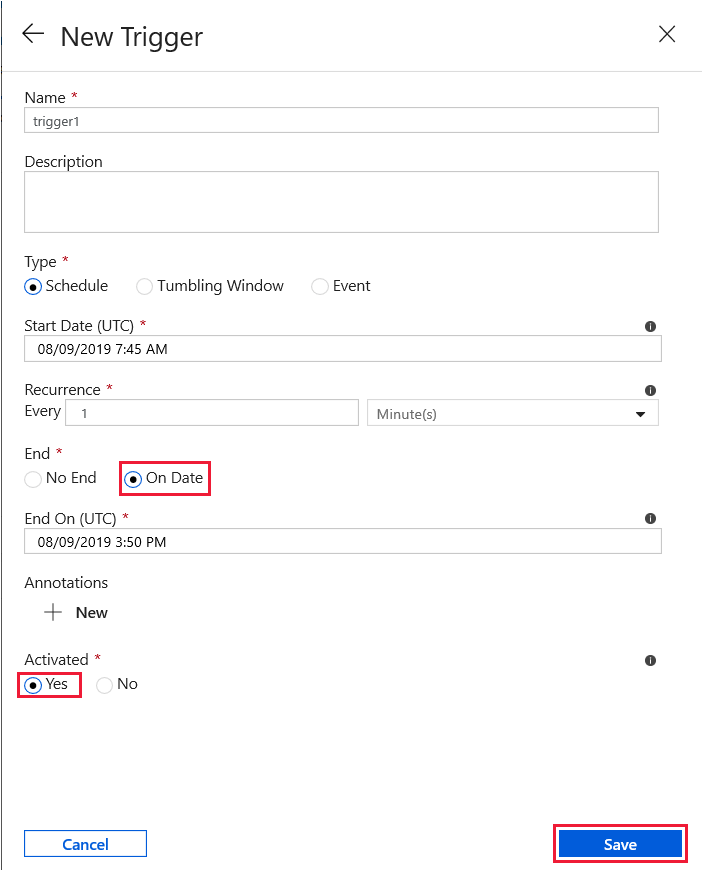
1. Review the warning message, and select **OK**.

1. Select **Publish all** to publish changes to Data Factory. 

1. Switch to the **Monitor** tab on the left. Select **Refresh** to refresh the list. You see that the pipeline runs once every minute from the publish time to the end time. 

   Notice the values in the **TRIGGERED BY** column. The manual trigger run was from the step (**Trigger Now**) that you did earlier. 

1. Switch to the **Trigger runs** view. 

1. Confirm that an output file is created for every pipeline run until the specified end date and time in the **output** folder. 

## Next steps
The pipeline in this sample copies data from one location to another location in Azure Blob storage. To learn about using Data Factory in more scenarios, go through the [tutorials](tutorial-copy-data-portal.md). 
