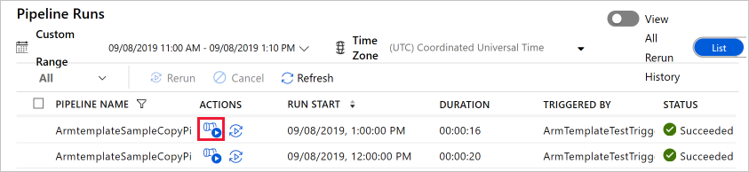
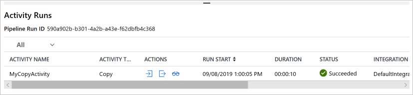

# Tutorial: Create an Azure data factory using Azure Resource Manager template

> [!div class="op_single_selector" title1="Select the version of Data Factory service you are using:"]
> * [Version 1](v1/data-factory-build-your-first-pipeline-using-arm.md)
> * [Current version](quickstart-create-data-factory-resource-manager-template.md)

[!INCLUDE[appliesto-adf-xxx-md](includes/appliesto-adf-xxx-md.md)]

This quickstart describes how to use an Azure Resource Manager template to create an Azure data factory. The pipeline you create in this data factory **copies** data from one folder to another folder in an Azure blob storage. For a tutorial on how to **transform** data using Azure Data Factory, see [Tutorial: Transform data using Spark](transform-data-using-spark.md).

> [!NOTE]
> This article does not provide a detailed introduction of the Data Factory service. For an introduction to the Azure Data Factory service, see [Introduction to Azure Data Factory](introduction.md).

[!INCLUDE [data-factory-quickstart-prerequisites](../../includes/data-factory-quickstart-prerequisites.md)]

### Azure PowerShell

[!INCLUDE [updated-for-az](../../includes/updated-for-az.md)]

Install the latest Azure PowerShell modules by following instructions in [How to install and configure Azure PowerShell](/powershell/azure/install-Az-ps).

## Resource Manager templates

To learn about Azure Resource Manager templates in general, see [Authoring Azure Resource Manager Templates](../azure-resource-manager/templates/template-syntax.md).

The following section provides the complete Resource Manager template for defining Data Factory entities so that you can quickly run through the tutorial and test the template. To understand how each Data Factory entity is defined, see [Data Factory entities in the template](#data-factory-entities-in-the-template) section.

To learn about the JSON syntax and properties for Data Factory resources in a template, see [Microsoft.DataFactory resource types](/azure/templates/microsoft.datafactory/allversions).

## Data Factory JSON

Create a JSON file named **ADFTutorialARM.json** in **C:\ADFTutorial** folder (Create the ADFTutorial folder if it doesn't already exist) with the following content:

```json
{  
    "$schema":"http://schema.management.azure.com/schemas/2015-01-01/deploymentTemplate.json#",
    "contentVersion":"1.0.0.0",
    "parameters":{  
        "dataFactoryName":{  
            "type":"string",
            "metadata":"Data Factory Name"
        },
        "dataFactoryLocation":{  
            "type":"string",
            "defaultValue":"East US",
            "metadata":{  
                "description":"Location of the data factory. Currently, only East US, East US 2, and West Europe are supported. "
            }
        },
        "storageAccountName":{  
            "type":"string",
            "metadata":{  
                "description":"Name of the Azure storage account that contains the input/output data."
            }
        },
        "storageAccountKey":{  
            "type":"securestring",
            "metadata":{  
                "description":"Key for the Azure storage account."
            }
        },
        "triggerStartTime": {
            "type": "string",
            "metadata": {
                "description": "Start time for the trigger."
            }
        },
        "triggerEndTime": {
            "type": "string",
            "metadata": {
                "description": "End time for the trigger."
            }
        }
    },      
    "variables":{  
        "factoryId":"[concat('Microsoft.DataFactory/factories/', parameters('dataFactoryName'))]"
    },
    "resources":[  
        {  
            "name":"[parameters('dataFactoryName')]",
            "apiVersion":"2018-06-01",
            "type":"Microsoft.DataFactory/factories",
            "location":"[parameters('dataFactoryLocation')]",
            "identity":{  
                "type":"SystemAssigned"
            },
            "resources":[  
                {  
                    "name":"[concat(parameters('dataFactoryName'), '/ArmtemplateStorageLinkedService')]",
                    "type":"Microsoft.DataFactory/factories/linkedServices",
                    "apiVersion":"2018-06-01",
                    "properties":{  
                        "annotations":[  

                        ],
                        "type":"AzureBlobStorage",
                        "typeProperties":{  
                            "connectionString":"[concat('DefaultEndpointsProtocol=https;AccountName=',parameters('storageAccountName'),';AccountKey=',parameters('storageAccountKey'))]"
                        }
                    },
                    "dependsOn":[  
                        "[parameters('dataFactoryName')]"
                    ]
                },
                {  
                    "name":"[concat(parameters('dataFactoryName'), '/ArmtemplateTestDatasetIn')]",
                    "type":"Microsoft.DataFactory/factories/datasets",
                    "apiVersion":"2018-06-01",
                    "properties":{  
                        "linkedServiceName":{  
                            "referenceName":"ArmtemplateStorageLinkedService",
                            "type":"LinkedServiceReference"
                        },
                        "annotations":[  

                        ],
                        "type":"Binary",
                        "typeProperties":{  
                            "location":{  
                                "type":"AzureBlobStorageLocation",
                                "fileName":"emp.txt",
                                "folderPath":"input",
                                "container":"adftutorial"
                            }
                        }
                    },
                    "dependsOn":[  
                        "[parameters('dataFactoryName')]",
                        "[concat(variables('factoryId'), '/linkedServices/ArmtemplateStorageLinkedService')]"
                    ]
                },
                {  
                    "name":"[concat(parameters('dataFactoryName'), '/ArmtemplateTestDatasetOut')]",
                    "type":"Microsoft.DataFactory/factories/datasets",
                    "apiVersion":"2018-06-01",
                    "properties":{  
                        "linkedServiceName":{  
                            "referenceName":"ArmtemplateStorageLinkedService",
                            "type":"LinkedServiceReference"
                        },
                        "annotations":[  

                        ],
                        "type":"Binary",
                        "typeProperties":{  
                            "location":{  
                                "type":"AzureBlobStorageLocation",
                                "folderPath":"output",
                                "container":"adftutorial"
                            }
                        }
                    },
                    "dependsOn":[  
                        "[parameters('dataFactoryName')]",
                        "[concat(variables('factoryId'), '/linkedServices/ArmtemplateStorageLinkedService')]"
                    ]
                },
                {  
                    "name":"[concat(parameters('dataFactoryName'), '/ArmtemplateSampleCopyPipeline')]",
                    "type":"Microsoft.DataFactory/factories/pipelines",
                    "apiVersion":"2018-06-01",
                    "properties":{  
                        "activities":[  
                            {  
                                "name":"MyCopyActivity",
                                "type":"Copy",
                                "dependsOn":[  

                                ],
                                "policy":{  
                                    "timeout":"7.00:00:00",
                                    "retry":0,
                                    "retryIntervalInSeconds":30,
                                    "secureOutput":false,
                                    "secureInput":false
                                },
                                "userProperties":[  

                                ],
                                "typeProperties":{  
                                    "source":{  
                                        "type":"BinarySource",
                                        "storeSettings":{  
                                            "type":"AzureBlobStorageReadSettings",
                                            "recursive":true
                                        }
                                    },
                                    "sink":{  
                                        "type":"BinarySink",
                                        "storeSettings":{  
                                            "type":"AzureBlobStorageWriteSettings"
                                        }
                                    },
                                    "enableStaging":false
                                },
                                "inputs":[  
                                    {  
                                        "referenceName":"ArmtemplateTestDatasetIn",
                                        "type":"DatasetReference",
                                        "parameters":{  

                                        }
                                    }
                                ],
                                "outputs":[  
                                    {  
                                        "referenceName":"ArmtemplateTestDatasetOut",
                                        "type":"DatasetReference",
                                        "parameters":{  

                                        }
                                    }
                                ]
                            }
                        ],
                        "annotations":[  

                        ]
                    },
                    "dependsOn":[  
                        "[parameters('dataFactoryName')]",
                        "[concat(variables('factoryId'), '/datasets/ArmtemplateTestDatasetIn')]",
                        "[concat(variables('factoryId'), '/datasets/ArmtemplateTestDatasetOut')]"
                    ]
                },
                {  
                    "name":"[concat(parameters('dataFactoryName'), '/ArmTemplateTestTrigger')]",
                    "type":"Microsoft.DataFactory/factories/triggers",
                    "apiVersion":"2018-06-01",
                    "properties":{  
                        "annotations":[  

                        ],
                        "runtimeState":"Started",
                        "pipelines":[  
                            {  
                                "pipelineReference":{  
                                    "referenceName":"ArmtemplateSampleCopyPipeline",
                                    "type":"PipelineReference"
                                },
                                "parameters":{  

                                }
                            }
                        ],
                        "type":"ScheduleTrigger",
                        "typeProperties":{  
                            "recurrence":{  
                                "frequency":"Hour",
                                "interval":1,
                                "startTime":"[parameters('triggerStartTime')]",
                                "endTime":"[parameters('triggerEndTime')]",
                                "timeZone":"UTC"
                            }
                        }
                    },
                    "dependsOn":[  
                        "[parameters('dataFactoryName')]",
                        "[concat(variables('factoryId'), '/pipelines/ArmtemplateSampleCopyPipeline')]"
                    ]
                }
            ]
        }
    ]
}
```
## Parameters JSON

Create a JSON file named **ADFTutorialARM-Parameters.json** that contains parameters for the Azure Resource Manager template.

> [!IMPORTANT]
> - Specify the name and key of your Azure Storage account for the **storageAccountName** and **storageAccountKey** parameters in this parameter file. You created the adftutorial container and uploaded the sample file (emp.txt) to the input folder in this Azure blob storage.
> - Specify a globally unique name for the data factory for the **dataFactoryName** parameter. For example: ARMTutorialFactoryJohnDoe11282017.
> - For the **triggerStartTime**, specify the current day in the format: `2019-09-08T00:00:00`.
> - For the **triggerEndTime**, specify the next day in the format: `2019-09-09T00:00:00`. You can also check the current UTC time and specify the next hour or two as the end time. For example, if the UTC time now is 1:32 AM, specify `2019-09-09:03:00:00` as the end time. In this case, the trigger runs the pipeline twice (at 2 AM and 3 AM).

```json
{  
    "$schema":"https://schema.management.azure.com/schemas/2015-01-01/deploymentParameters.json#",
    "contentVersion":"1.0.0.0",
    "parameters":{  
        "dataFactoryName":{  
            "value":"<datafactoryname>"
        },
        "dataFactoryLocation":{  
            "value":"East US"
        },
        "storageAccountName":{  
            "value":"<yourstorageaccountname>"
        },
        "storageAccountKey":{  
            "value":"<yourstorageaccountkey>"
        },
        "triggerStartTime":{  
            "value":"2019-09-08T11:00:00"
        },
        "triggerEndTime":{  
            "value":"2019-09-08T14:00:00"
        }
    }
}
```

> [!IMPORTANT]
> You may have separate parameter JSON files for development, testing, and production environments that you can use with the same Data Factory JSON template. By using a Power Shell script, you can automate deploying Data Factory entities in these environments.

## Deploy Data Factory entities

In PowerShell, run the following command to deploy Data Factory entities in your resource group (in this case, take ADFTutorialResourceGroup as an example) using the Resource Manager template you created earlier in this quickstart.

```powershell
New-AzResourceGroupDeployment -Name MyARMDeployment -ResourceGroupName ADFTutorialResourceGroup -TemplateFile C:\ADFTutorial\ADFTutorialARM.json -TemplateParameterFile C:\ADFTutorial\ADFTutorialARM-Parameters.json
```

You see output similar to the following sample:

```console
DeploymentName          : MyARMDeployment
ResourceGroupName       : ADFTutorialResourceGroup
ProvisioningState       : Succeeded
Timestamp               : 9/8/2019 10:52:29 AM
Mode                    : Incremental
TemplateLink            : 
Parameters              : 
                          Name                   Type                       Value     
                          =====================  =========================  ==========
                          dataFactoryName        String                     <data factory name>
                          dataFactoryLocation    String                     East US   
                          storageAccountName     String                     <storage account name>
                          storageAccountKey      SecureString                         
                          triggerStartTime       String                     9/8/2019 11:00:00 AM
                          triggerEndTime         String                     9/8/2019 2:00:00 PM
                          
Outputs                 : 
DeploymentDebugLogLevel : 
```

## Start the trigger

The template deploys the following Data Factory entities:

- Azure Storage linked service
- Binary datasets (input and output)
- Pipeline with a copy activity
- Trigger to trigger the pipeline

The deployed trigger is in stopped state. One of the ways to start the trigger is to use the **Start-AzDataFactoryV2Trigger** PowerShell cmdlet. The following procedure provides detailed steps:

1. In the PowerShell window, create a variable to hold the name of the resource group. Copy the following command into the PowerShell window, and press ENTER. If you have specified a different resource group name for the New-AzResourceGroupDeployment command, update the value here.

    ```powershell
    $resourceGroupName = "ADFTutorialResourceGroup"
    ```
2. Create a variable to hold the name of the data factory. Specify the same name that you specified in the ADFTutorialARM-Parameters.json file.

    ```powershell
    $dataFactoryName = "<yourdatafactoryname>"
    ```
3. Set a variable for the name of the trigger. The name of the trigger is hardcoded in the Resource Manager template file (ADFTutorialARM.json).

    ```powershell
    $triggerName = "ArmTemplateTestTrigger"
    ```
4. Get the **status of the trigger** by running the following PowerShell command after specifying the name of your data factory and trigger:

    ```powershell
    Get-AzDataFactoryV2Trigger -ResourceGroupName $resourceGroupName -DataFactoryName $dataFactoryName -Name $triggerName
    ```

    Here is the sample output:

    ```json

    TriggerName       : ArmTemplateTestTrigger
    ResourceGroupName : ADFTutorialResourceGroup
    DataFactoryName   : ADFQuickstartsDataFactory0905
    Properties        : Microsoft.Azure.Management.DataFactory.Models.ScheduleTrigger
    RuntimeState      : Stopped
    ```
    
    Notice that the runtime state of the trigger is **Stopped**.
5. **Start the trigger**. The trigger runs the pipeline defined in the template at the hour. That's, if you executed this command at 2:25 PM, the trigger runs the pipeline at 3 PM for the first time. Then, it runs the pipeline hourly until the end time you specified for the trigger.

    ```powershell
    Start-AzDataFactoryV2Trigger -ResourceGroupName $resourceGroupName -DataFactoryName $dataFactoryName -TriggerName $triggerName
    ```
    
    Here is the sample output:
    
    ```console
    Confirm
    Are you sure you want to start trigger 'ArmTemplateTestTrigger' in data factory 'ARMFactory1128'?
    [Y] Yes  [N] No  [S] Suspend  [?] Help (default is "Y"): y
    True
    ```
6. Confirm that the trigger has been started by running the Get-AzDataFactoryV2Trigger command again.

    ```powershell
    Get-AzDataFactoryV2Trigger -ResourceGroupName $resourceGroupName -DataFactoryName $dataFactoryName -TriggerName $triggerName
    ```
    
    Here is the sample output:
    
    ```console
    TriggerName       : ArmTemplateTestTrigger
    ResourceGroupName : ADFTutorialResourceGroup
    DataFactoryName   : ADFQuickstartsDataFactory0905
    Properties        : Microsoft.Azure.Management.DataFactory.Models.ScheduleTrigger
    RuntimeState      : Started
    ```

## Monitor the pipeline

1. After logging in to the [Azure portal](https://portal.azure.com/), Click **All services**, search with the keyword such as **data fa**, and select **Data factories**.

2. In the **Data Factories** page, click the data factory you created. If needed, filter the list with the name of your data factory.

3. In the Data factory page, click **Author & Monitor** tile.

4. In the **Let's get started** page, select the **Monitor tab**. 
    

    > [!IMPORTANT]
    > You see pipeline runs only at the hour clock (for example: 4 AM, 5 AM, 6 AM, etc.). Click **Refresh** on the toolbar to refresh the list when the time reaches the next hour.

5. Click the **View Activity Runs** link in the **Actions** column.

    

6. You see the activity runs associated with the pipeline run. In this quickstart, the pipeline has only one activity of type: Copy. Therefore, you see a run for that activity.

    
7. Click the **Output** link under Actions column. You see the output from the copy operation in an **Output** window. Click the maximize button to see the full output. You can close the maximized output window or close it.

8. Stop the trigger once you see a successful/failure run. The trigger runs the pipeline once an hour. The pipeline copies the same file from the input folder to the output folder for each run. To stop the trigger, run the following command in the PowerShell window.
    
    ```powershell
    Stop-AzDataFactoryV2Trigger -ResourceGroupName $resourceGroupName -DataFactoryName $dataFactoryName -Name $triggerName
    ```

[!INCLUDE [data-factory-quickstart-verify-output-cleanup.md](../../includes/data-factory-quickstart-verify-output-cleanup.md)]

## <a name="data-factory-entities-in-the-template"></a> JSON definitions for entities

The following Data Factory entities are defined in the JSON template:

- [Azure Storage linked service](#azure-storage-linked-service)
- [Binary input dataset](#binary-input-dataset)
- [Binary output dataset](#binary-output-dataset)
- [Data pipeline with a copy activity](#data-pipeline)
- [Trigger](#trigger)

#### Azure Storage linked service

The AzureStorageLinkedService links your Azure storage account to the data factory. You created a container and uploaded data to this storage account as part of prerequisites. You specify the name and key of your Azure storage account in this section. See [Azure Storage linked service](connector-azure-blob-storage.md#linked-service-properties) for details about JSON properties used to define an Azure Storage linked service.

```json
{  
    "name":"[concat(parameters('dataFactoryName'), '/ArmtemplateStorageLinkedService')]",
    "type":"Microsoft.DataFactory/factories/linkedServices",
    "apiVersion":"2018-06-01",
    "properties":{  
        "annotations":[  

        ],
        "type":"AzureBlobStorage",
        "typeProperties":{  
            "connectionString":"[concat('DefaultEndpointsProtocol=https;AccountName=',parameters('storageAccountName'),';AccountKey=',parameters('storageAccountKey'))]"
        }
    },
    "dependsOn":[  
        "[parameters('dataFactoryName')]"
    ]
}
```

The connectionString uses the storageAccountName and storageAccountKey parameters. The values for these parameters passed by using a configuration file. The definition also uses variables: azureStorageLinkedService and dataFactoryName defined in the template.

#### Binary input dataset

The Azure storage linked service specifies the connection string that Data Factory service uses at run time to connect to your Azure storage account. In Binary dataset definition, you specify names of blob container, folder, and file that contains the input data. See [Binary dataset properties](format-binary.md#dataset-properties) for details about JSON properties used to define a Binary dataset.

```json
{  
    "name":"[concat(parameters('dataFactoryName'), '/ArmtemplateTestDatasetIn')]",
    "type":"Microsoft.DataFactory/factories/datasets",
    "apiVersion":"2018-06-01",
    "properties":{  
        "linkedServiceName":{  
            "referenceName":"ArmtemplateStorageLinkedService",
            "type":"LinkedServiceReference"
        },
        "annotations":[  

        ],
        "type":"Binary",
        "typeProperties":{  
            "location":{  
                "type":"AzureBlobStorageLocation",
                "fileName":"emp.txt",
                "folderPath":"input",
                "container":"adftutorial"
            }
        }
    },
    "dependsOn":[  
        "[parameters('dataFactoryName')]",
        "[concat(variables('factoryId'), '/linkedServices/ArmtemplateStorageLinkedService')]"
    ]
}
```

#### Binary output dataset

You specify the name of the folder in the Azure Blob Storage that holds the copied data from the input folder. See [Binary dataset properties](format-binary.md#dataset-properties) for details about JSON properties used to define a Binary dataset.

```json
{  
    "name":"[concat(parameters('dataFactoryName'), '/ArmtemplateTestDatasetOut')]",
    "type":"Microsoft.DataFactory/factories/datasets",
    "apiVersion":"2018-06-01",
    "properties":{  
        "linkedServiceName":{  
            "referenceName":"ArmtemplateStorageLinkedService",
            "type":"LinkedServiceReference"
        },
        "annotations":[  

        ],
        "type":"Binary",
        "typeProperties":{  
            "location":{  
                "type":"AzureBlobStorageLocation",
                "folderPath":"output",
                "container":"adftutorial"
            }
        }
    },
    "dependsOn":[  
        "[parameters('dataFactoryName')]",
        "[concat(variables('factoryId'), '/linkedServices/ArmtemplateStorageLinkedService')]"
    ]
}
```

#### Data pipeline

You define a pipeline that copies data from one Binary dataset to another Binary dataset. See [Pipeline JSON](concepts-pipelines-activities.md#pipeline-json) for descriptions of JSON elements used to define a pipeline in this example.

```json
{  
    "name":"[concat(parameters('dataFactoryName'), '/ArmtemplateSampleCopyPipeline')]",
    "type":"Microsoft.DataFactory/factories/pipelines",
    "apiVersion":"2018-06-01",
    "properties":{  
        "activities":[  
            {  
                "name":"MyCopyActivity",
                "type":"Copy",
                "dependsOn":[  

                ],
                "policy":{  
                    "timeout":"7.00:00:00",
                    "retry":0,
                    "retryIntervalInSeconds":30,
                    "secureOutput":false,
                    "secureInput":false
                },
                "userProperties":[  

                ],
                "typeProperties":{  
                    "source":{  
                        "type":"BinarySource",
                        "storeSettings":{  
                            "type":"AzureBlobStorageReadSettings",
                            "recursive":true
                        }
                    },
                    "sink":{  
                        "type":"BinarySink",
                        "storeSettings":{  
                            "type":"AzureBlobStorageWriteSettings"
                        }
                    },
                    "enableStaging":false
                },
                "inputs":[  
                    {  
                        "referenceName":"ArmtemplateTestDatasetIn",
                        "type":"DatasetReference",
                        "parameters":{  

                        }
                    }
                ],
                "outputs":[  
                    {  
                        "referenceName":"ArmtemplateTestDatasetOut",
                        "type":"DatasetReference",
                        "parameters":{  

                        }
                    }
                ]
            }
        ],
        "annotations":[  

        ]
    },
    "dependsOn":[  
        "[parameters('dataFactoryName')]",
        "[concat(variables('factoryId'), '/datasets/ArmtemplateTestDatasetIn')]",
        "[concat(variables('factoryId'), '/datasets/ArmtemplateTestDatasetOut')]"
    ]
}
```

#### Trigger

You define a trigger that runs the pipeline once an hour. The deployed trigger is in stopped state. Start the trigger by using the **Start-AzDataFactoryV2Trigger** cmdlet. For more information about triggers, see [Pipeline execution and triggers](concepts-pipeline-execution-triggers.md#trigger-execution) article.

```json
{  
    "name":"[concat(parameters('dataFactoryName'), '/ArmTemplateTestTrigger')]",
    "type":"Microsoft.DataFactory/factories/triggers",
    "apiVersion":"2018-06-01",
    "properties":{  
        "annotations":[  

        ],
        "runtimeState":"Started",
        "pipelines":[  
            {  
                "pipelineReference":{  
                    "referenceName":"ArmtemplateSampleCopyPipeline",
                    "type":"PipelineReference"
                },
                "parameters":{  

                }
            }
        ],
        "type":"ScheduleTrigger",
        "typeProperties":{  
            "recurrence":{  
                "frequency":"Hour",
                "interval":1,
                "startTime":"[parameters('triggerStartTime')]",
                "endTime":"[parameters('triggerEndTime')]",
                "timeZone":"UTC"
            }
        }
    },
    "dependsOn":[  
        "[parameters('dataFactoryName')]",
        "[concat(variables('factoryId'), '/pipelines/ArmtemplateSampleCopyPipeline')]"
    ]
}
```

## Reuse the template

In the tutorial, you created a template for defining Data Factory entities and a template for passing values for parameters. To use the same template to deploy Data Factory entities to different environments, you create a parameter file for each environment and use it when deploying to that environment.

Example:

```powershell
New-AzResourceGroupDeployment -Name MyARMDeployment -ResourceGroupName ADFTutorialResourceGroup -TemplateFile ADFTutorialARM.json -TemplateParameterFile ADFTutorialARM-Parameters-Dev.json

New-AzResourceGroupDeployment -Name MyARMDeployment -ResourceGroupName ADFTutorialResourceGroup -TemplateFile ADFTutorialARM.json -TemplateParameterFile ADFTutorialARM-Parameters-Test.json

New-AzResourceGroupDeployment -Name MyARMDeployment -ResourceGroupName ADFTutorialResourceGroup -TemplateFile ADFTutorialARM.json -TemplateParameterFile ADFTutorialARM-Parameters-Production.json
```

Notice that the first command uses parameter file for the development environment, second one for the test environment, and the third one for the production environment.

You can also reuse the template to perform repeated tasks. For example, create many data factories with one or more pipelines that implement the same logic but each data factory uses different Azure storage accounts. In this scenario, you use the same template in the same environment (dev, test, or production) with different parameter files to create data factories.

## Next steps

The pipeline in this sample copies data from one location to another location in an Azure blob storage. Go through the [tutorials](tutorial-copy-data-dot-net.md) to learn about using Data Factory in more scenarios.
