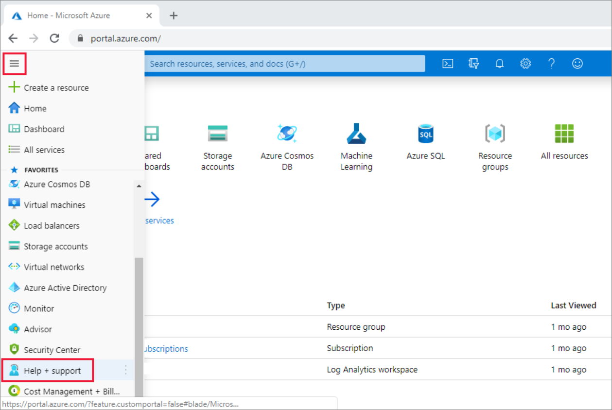

# Request quota increases and get support for Azure Data Factory

This article describes how to submit a support ticket in the Azure portal for Azure Data Factory. This process enables you to request a quota increase or to submit a technical support request for the engineering support team.

## Create a support ticket

Use the following steps to create a new support request from the Azure portal for Azure Data Factory.

1. On  the [Azure portal](https://portal.azure.com) menu, select **Help + support**.

   

1. In **Help + support**, select **Create a support request**.

    :::image type="content" source="./media/quota-increase/new-support-request.png" alt-text="Create a new support request":::

1. Review your [Azure support plan](https://azure.microsoft.com/support/plans/?WT.mc_id=Support_Plan_510979/).

   * **Billing, quota, and subscription management** support are available at all support levels.
   * **Break-fix** support is provided through [Developer](https://azure.microsoft.com/support/plans/developer/), [Standard](https://azure.microsoft.com/support/plans/standard/), [Professional Direct](https://azure.microsoft.com/support/plans/prodirect/), or [Premier](https://azure.microsoft.com/support/plans/premier/) support. Break-fix issues are problems experienced by customers while using Azure where there is a reasonable expectation that Microsoft caused the problem.
   * **Developer mentoring** and **advisory services** are available at the [Professional Direct](https://azure.microsoft.com/support/plans/prodirect/) and [Premier](https://azure.microsoft.com/support/plans/premier/) support levels.

   If you have a Premier support plan, you can also report Azure Data Factory issues on the [Microsoft Premier online portal](https://premier.microsoft.com/). See [Azure support plans](https://azure.microsoft.com/support/plans/?WT.mc_id=Support_Plan_510979/) to learn more about the various support plans, including scope, response times, pricing, etc.  For frequently asked questions about Azure support, see [Azure support FAQs](https://azure.microsoft.com/support/faq/).

1. For **Issue type**, select the appropriate issue type. For break-fix problems, select **Technical**. For quota increase requests, select **Service and subscription limits (quotas)**.

   :::image type="content" source="./media/quota-increase/select-quota-issue-type.png" alt-text="Select an issue type":::  

   > [!NOTE]
   > This remainder of this article focusses on quota-increase requests. But you can also select **Technical** here for problem-resolution support requests. If you select **Technical**, you are asked to provide a summary and then identify a problem type by selecting **Select problem type**. You may see solutions to help resolve your issue. If the solutions presented do not resolve your issue, select **Next:Details** and complete the form to submit the support ticket.

1. For quota increase requests, select **Data Factory** for the **Quota type**. Then select **Next**.

   :::image type="content" source="./media/quota-increase/select-quota-type.png" alt-text="Select a quota type":::

1. In the **Additional Details** window, enter additional information about the specific quota limit(s) you require increased.  Refer to the [Azure Data Factory limits](../azure-resource-manager/management/azure-subscription-service-limits.md#data-factory-limits) article for specific limits.  Select your preferred method of contact, and click **Next**.

   :::image type="content" source="./media/quota-increase/provide-details.png" alt-text="The &quot;Provide details&quot; section":::

## Submit your request

After reviewing the request details on the final page, select **Create** to submit the request.

## Monitor a support ticket

After you've submitted the support request, the Azure support team will contact you. To check your request status and details, select **All support requests** on the dashboard.

:::image type="content" source="./media/quota-increase/monitor-ticket.png" alt-text="Check status":::

## Other resources

You can also connect with the Azure Data Factory community on [Stack Overflow](https://stackoverflow.com/questions/tagged/azure-data-factory) or through the [Microsoft Q&A question page for Azure Data Factory](/answers/topics/azure-data-factory.html).