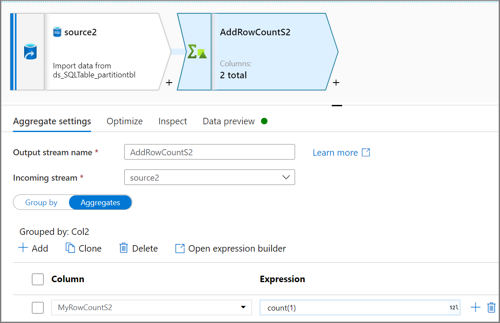
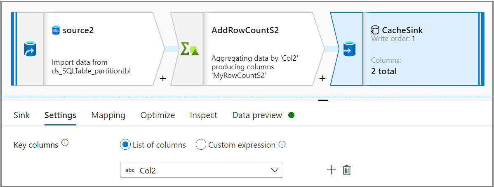
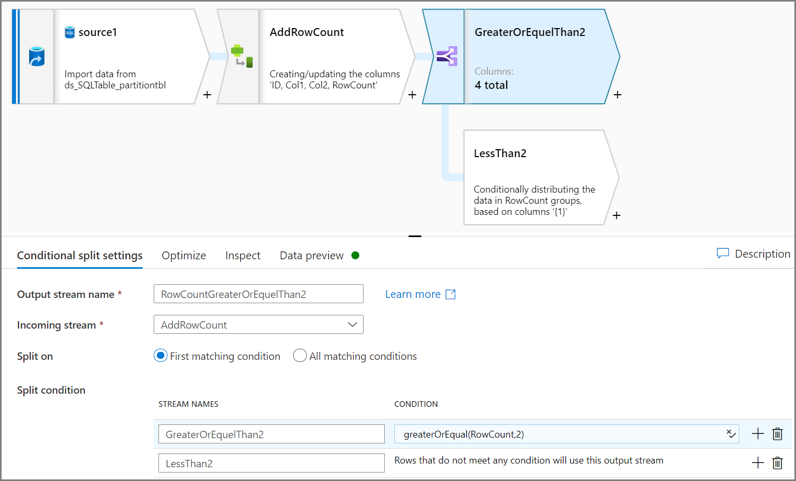
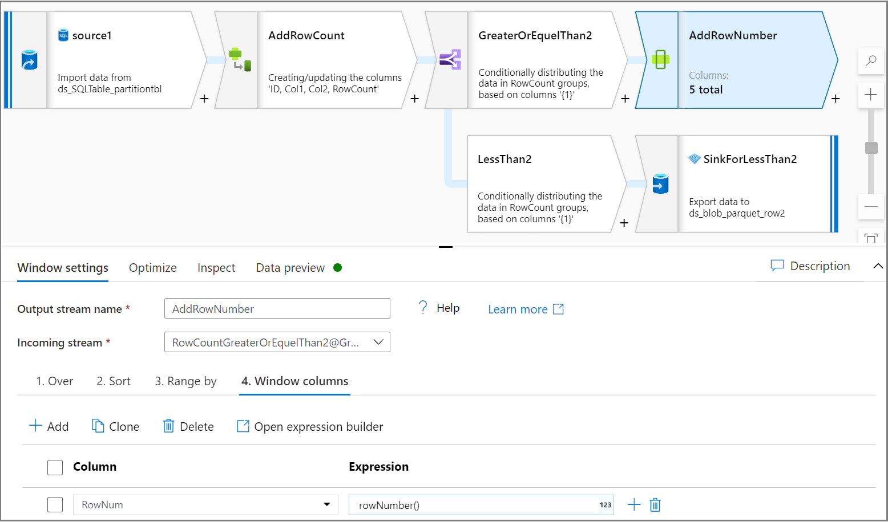
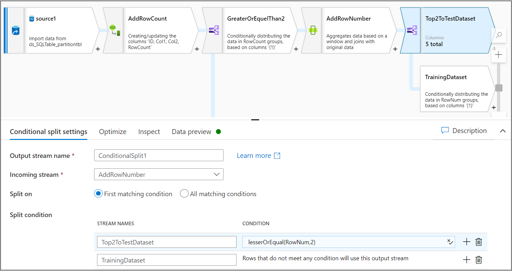
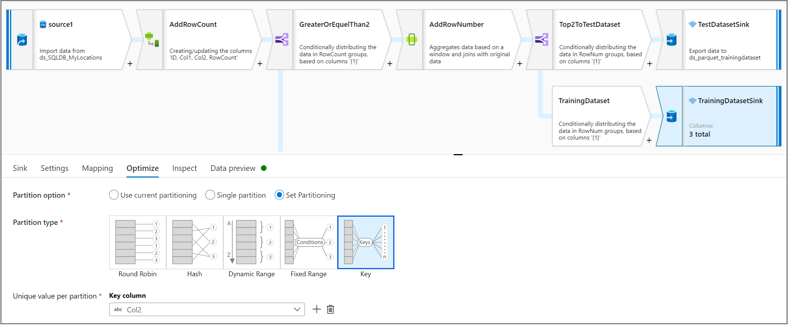
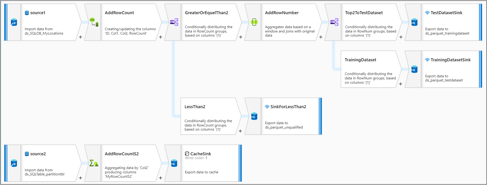

# Use Dataflow to process data for automated machine learning(AutoML) models

Automated machine learning(AutoML) is adopted by machine learning projects to train, tune and gain best model automatically using target metric you specify for classification, regression and time-series forecasting. 

One challenge is raw data from data warehouse or transactional database would be huge dataset, such as: 10GB, the large dataset requires longer time to train models, so optimize data processing is recommended before training Azure Machine Learning models. This tutorial will go through how to use ADF to partition dataset to parquet files for Azure Machine Learning dataset. 

In Automated machine learning(AutoML) project, it would apply the following three data processing scenarios:

* Partition large data to parquet files before training models. 

     [Pandas data frame](https://pandas.pydata.org/pandas-docs/stable/getting_started/overview.html) is commonly used to process data before training models. Pandas data frame works well for data sizes less than 1GB, but if data is large than 1GB, Pandas data frame slow down to process data, sometime even will get out of memory error message. [Parquet file](https://parquet.apache.org/) formats are recommended for machine learning since it's binary columnar format.
    
    Azure Data Factories Mapping data flows are visually designed data transformations with code-free to data engineers. It's powerful to process large data since the pipeline use scaled-out Spark clusters.

* Split training dataset and test dataset. 
    
    Training dataset will be used for training model, test dataset will be used for evaluate models in machine learning project. Mapping data flows conditional split activity would split training data and test data. 

* Remove unqualified data.

    You may want to remove unqualified data, such as: parquet file with zero row. In this tutorial, we will use Aggregate activity to get count numbers of rows, the row count will be a condition to remove unqualified data. 


## Preparation
Use the following table of Azure SQL Database. 
```
CREATE TABLE [dbo].[MyProducts](
	[ID] [int] NULL,
	[Col1] [char](124) NULL,
	[Col2] [char](124) NULL,
	[Col3] datetime NULL,
	[Col4] int NULL

) 

```

## Convert data format to parquet

Data flow will convert a table of Azure SQL Database to parquet file format. 

**Source Dataset**: Transaction table of Azure SQL Database

**Sink Dataset**: Blob storage with Parquet format


## Remove unqualified data based on row count

Let's suppose to remove row count less than 2. 

1. Use Aggregate activity to get count number of rows: **Group by** based on Col2 and **Aggregates** with count(1) for row count. 

    

1. Use Sink activity, choose **Sink type** as Cache in **Sink** tab, then choose desired column from **key columns** dropdown list in **Settings** tab. 

    

1. Use derived column activity to add row count column in  in master source stream. In **Derived column's settings** tab, use CacheSink#lookup expression getting row count from SinkCache.
    

1. Use Conditional split activity to remove unqualified data. In this example,  row count based on Col2 column, and the condition is to remove row count less than 2, so two rows (ID=2 and ID=7) will be removed. You would save unqualified data to a blob storage for data management. 

    

> [!NOTE]
>    *    Create a new source for getting count number of rows which will be used in original source in later steps. 
>    *    Use CacheSink from performance standpoint. 

## Split training data and test data 

1. We want to split training data and test data for each partition. In this example, for the same value of Col2, get top 2 rows as test data and the rest rows as training data. 

    Use Window activity to add one column row number for each partition. In **Over** tab choose column for partition(in this tutorial, will partition for Col2), give order in **Sort** tab(in this tutorial, will based on ID to order), and in **Window columns** tab to add one column as row number for each partition. 
    

1. Use conditional split activity to split each partition top 2 rows to test dataset, and the rest rows to training dataset. In **Conditional split settings** tab, use expression lesserOrEqual(RowNum,2) as condition. 

    

## Partition training dataset and test dataset with parquet format

1. Use Sink activity, in **Optimize** tab, using **Unique value per partition** to set a column as a column key for partition. 
    

Looks back the entire pipeline logic: 
    


## Next steps

* Build the rest of your data flow logic by using mapping data flows [transformations](concepts-data-flow-overview.md).
