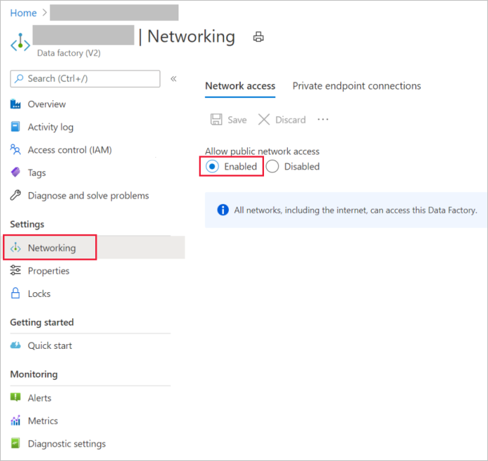

# Troubleshoot Azure Data Factory security and access control issues

[!INCLUDE[appliesto-adf-asa-md](includes/appliesto-adf-asa-md.md)]

This article explores common troubleshooting methods for security and access control in Azure Data Factory.

## Common errors and messages

### Connectivity issue in the copy activity of the cloud datastore

#### Symptoms

Various error messages might be returned when connectivity issues occur in the source or sink datastore.

#### Cause 

The problem is usually caused by one of the following factors:

* The proxy setting in the self-hosted integration runtime (IR) node, if you're using a self-hosted IR.

* The firewall setting in the self-hosted IR node, if you're using a self-hosted IR.

* The firewall setting in the cloud datastore.

#### Resolution

* To ensure that this is a connectivity issue, check the following points:

   - The error is thrown from the source or sink connectors.
   - The failure is at the start of the copy activity.
   - The failure is consistent for Azure IR or the self-hosted IR with one node, because it could be a random failure in a multiple-node self-hosted IR if only some of the nodes have the issue.

* If you're using a **self-hosted IR**, check your proxy, firewall, and network settings, because connecting to the same datastore could succeed if you're using an Azure IR. To troubleshoot this scenario, see:

   * [Self-hosted IR ports and firewalls](https://docs.microsoft.com/azure/data-factory/create-self-hosted-integration-runtime#ports-and-firewalls)
   * [Azure Data Lake Storage connector](https://docs.microsoft.com/azure/data-factory/connector-azure-data-lake-store)
  
* If you're using an **Azure IR**, try to disable the firewall setting of the datastore. This approach can resolve the issues in the following two situations:
  
   * [Azure IR IP addresses](https://docs.microsoft.com/azure/data-factory/azure-integration-runtime-ip-addresses) are not in the allow list.
   * The *Allow trusted Microsoft services to access this storage account* feature is turned off for [Azure Blob Storage](https://docs.microsoft.com/azure/data-factory/connector-azure-blob-storage#supported-capabilities) and [Azure Data Lake Storage Gen 2](https://docs.microsoft.com/azure/data-factory/connector-azure-data-lake-storage#supported-capabilities).
   * The *Allow access to Azure services* setting isn't enabled for Azure Data Lake Storage Gen1.

If none of the preceding methods works, contact Microsoft for help.


### Invalid or empty authentication key issue after public network access is disabled

#### Symptoms

After you disable public network access for Data Factory, the self-hosted integration runtime throws the following error: “The Authentication key is invalid or empty.”

#### Cause

The problem is most likely caused by a Domain Name System (DNS) resolution issue, because disabling public connectivity and establishing a private endpoint prevents reconnection.

To verify whether the Data Factory fully qualified domain name (FQDN) is resolved to the public IP address, do the following:

1. Confirm that you've created the Azure virtual machine (VM) in the same virtual network as the Data Factory private endpoint.

2. Run PsPing and Ping from the Azure VM to the Data Factory FQDN:

   `psping.exe <dataFactoryName>.<region>.datafactory.azure.net:443`
   `ping <dataFactoryName>.<region>.datafactory.azure.net`

   > [!Note]
   > You must specify a port for the PsPing command. Port 443 is shown here but is not required.

3. Check to see whether both commands resolve to an Azure Data Factory public IP that's based on a specified region. The IP should be in the following format: `xxx.xxx.xxx.0`

#### Resolution

To resolve the issue, do the following:
- Refer to the [Azure Private Link for Azure Data Factory](https://docs.microsoft.com/azure/data-factory/data-factory-private-link#dns-changes-for-private-endpoints) article. The instruction is for configuring the private DNS zone or server to resolve the Data Factory FQDN to a private IP address.

- We recommend using a custom DNS as the long-term solution. However, if you don't want to configure the private DNS zone or server, try the following temporary solution:

  1. Change the host file in Windows, and map the private IP (the Azure Data Factory private endpoint) to the Azure Data Factory FQDN.
  
     In the Azure VM, go to `C:\Windows\System32\drivers\etc`, and then open the *host* file in Notepad. Add the line that maps the private IP to the FQDN at the end of the file, and save the change.
     
     

  1. Rerun the same commands in the preceding verification steps to check the response, which should contain the private IP.

  1. Re-register the self-hosted integration runtime, and the issue should be resolved.

### Unable to register IR authentication key on Self-hosted VMs due to private link

#### Symptoms

You're unable to register the IR authentication key on the self-hosted VM because the private link is enabled. You receive the following error message:

"Failed to get service token from ADF service with key *************** and time cost is: 0.1250079 seconds, the error code is: InvalidGatewayKey, activityId is: XXXXXXX and detailed error message is Client IP address is not valid private ip Cause Data factory couldn’t access the public network thereby not able to reach out to the cloud to make the successful connection."

#### Cause

The issue could be caused by the VM in which you're trying to install the self-hosted IR. To connect to the cloud, ensure that public network access is enabled.

#### Resolution

**Solution 1**
 
To resolve the issue, do the following:

1. Go to the [Factories - Update](https://docs.microsoft.com/rest/api/datafactory/Factories/Update) page.

1. At the upper right, select the **Try it** button.
1. Under **Parameters**, complete the required information. 
1. Under **Body**, paste the following property:

    ```
    { "tags": { "publicNetworkAccess":"Enabled" } }
    ```
1. Select **Run** to run the function. 

1. Under **Parameters**, complete the required information. 

1. Under **Body**, paste the following property:
    ```
    { "tags": { "publicNetworkAccess":"Enabled" } }
    ``` 

1. Select **Run** to run the function. 
1. Confirm that **Response Code: 200** is displayed. The property you pasted should be displayed in the JSON definition as well.

1. Add the IR authentication key again in the integration runtime.


**Solution 2**

To resolve the issue, go to [Azure Private Link for Azure Data Factory](https://docs.microsoft.com/azure/data-factory/data-factory-private-link).

Try to enable public network access on the user interface, as shown in the following screenshot:



## Next steps

For more help with troubleshooting, try the following resources:

*  [Private Link for Data Factory](data-factory-private-link.md)
*  [Data Factory blog](https://azure.microsoft.com/blog/tag/azure-data-factory/)
*  [Data Factory feature requests](https://feedback.azure.com/forums/270578-data-factory)
*  [Azure videos](https://azure.microsoft.com/resources/videos/index/?sort=newest&services=data-factory)
*  [Microsoft Q&A page](/answers/topics/azure-data-factory.html)
*  [Stack overflow forum for Data Factory](https://stackoverflow.com/questions/tagged/azure-data-factory)
*  [Twitter information about Data Factory](https://twitter.com/hashtag/DataFactory)
