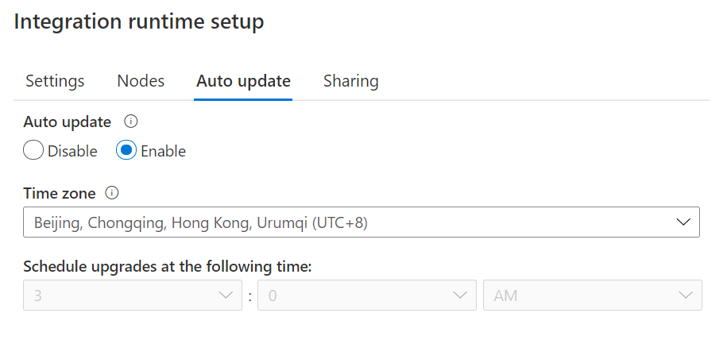
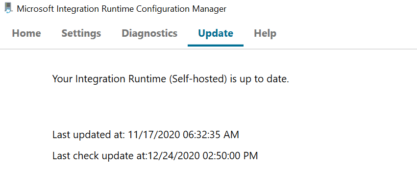

# Self-hosted integration runtime auto-update and expire notification

[!INCLUDE[appliesto-adf-asa-md](includes/appliesto-adf-asa-md.md)]

This article will describe how to let self-hosted integration runtime auto-update to the latest version and how ADF manages the versions of self-hosted integration runtime.

## Self-hosted Integration Runtime Auto-update
Generally, when you install a self-hosted integration runtime in your local machine or an Azure VM, you have two options to manage the version of self-hosted integration runtime: auto-update or maintain manually. Typically, ADF releases two new versions of self-hosted integration runtime every month which includes new feature release, bug fix or enhancement. So we recommend users to update to the latest version in order to get the newest feature and enhancement.

The most convenient way is to enable auto-update when you create or edit self-hosted integration runtime. Then it will be automatically update to the latest version. You can also schedule the update at the most suitable time slot as you wish.

You can check the last update datetime in your self-hosted integration runtime client.

> [!NOTE]
> To ensure the stability of self-hosted integration runtime, although we release two versions, we will only update it automatically once every month. So sometimes you will find that the auto-updated version is the previous version of the actual latest version. If you want to get the latest version, you can go to [download center](https://www.microsoft.com/download/details.aspx?id=39717).

## Self-hosted Integration Runtime Expire Notification
If you want to manually control which version of self-hosted integration runtime, you can disable the setting of auto-update and install it manually. Each version of self-hosted integration runtime will be expired in one year. The expiring message is shown in ADF portal and self-hosted integration runtime client **90 days** before expiration.

## Next steps

- Review [integration runtime concepts in Azure Data Factory](./concepts-integration-runtime.md).

- Learn how to [create a self-hosted integration runtime in the Azure portal](./create-self-hosted-integration-runtime.md).
