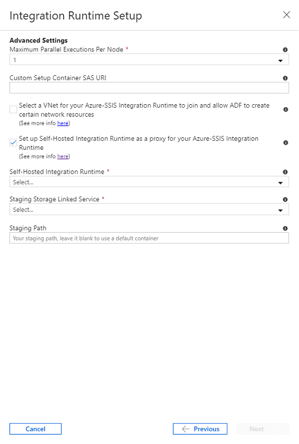

# Configure Self-Hosted IR as a proxy for Azure-SSIS IR in ADF
This article describes how to run SQL Server Integration Services (SSIS) packages on Azure-SSIS Integration Runtime (IR) in Azure Data Factory (ADF) with Self-Hosted IR configured as a proxy.  This feature allows you to access data on premises without [joining your Azure-SSIS IR to a virtual network](https://docs.microsoft.com/azure/data-factory/join-azure-ssis-integration-runtime-virtual-network).  This is useful when your corporate network has an overly complex configuration/restrictive policy for you to inject your Azure-SSIS IR in it.

This feature will split your package containing a Data Flow Task with on-premises data source into two staging tasks: the first one running on your Self-Hosted IR will first move data from the on-premises data source into a staging area in your Azure Blob Storage, while the second one running on your Azure-SSIS IR will then move data from the staging area into the intended data destination.

This feature also provides other benefits/capabilities as it allows you to provision your Self-Hosted IR in regions that are not yet supported by Azure-SSIS IR, allow the public static IP address of your Self-Hosted IR on the firewall of your data sources, etc.

## Prepare Self-Hosted IR
In order to use this feature, you will first need to create an ADF and provision your Azure-SSIS IR under it, if you have not done so already, by following the [How to provision an Azure-SSIS IR](https://docs.microsoft.com/azure/data-factory/tutorial-deploy-ssis-packages-azure) article.

You will then need to provision your Self-Hosted IR under the same ADF where your Azure-SSIS IR is provisioned by following the [How to create a Self-Hosted IR](https://docs.microsoft.com/azure/data-factory/create-self-hosted-integration-runtime) article.

Finally, you will need to download and install the latest version of Self-Hosted IR, as well as the additional drivers and runtime, on your on-premises machine/Azure Virtual Machine (VM) as follows:
- Please download and install the latest version of Self-Hosted IR from [here](https://www.microsoft.com/download/details.aspx?id=39717).
- If you use OLEDB connectors in your packages, please download and install the relevant OLEDB drivers on the same machine where Self-Hosted IR is installed if you have not done so already.  If you use the earlier version of OLEDB driver for SQL Server (SQLNCLI), you can download the 64-bit version from [here](https://www.microsoft.com/download/details.aspx?id=50402).  If you use the latest version of OLEDB driver for SQL Server (MSOLEDBSQL), you can download the 64-bit version from [here](https://www.microsoft.com/download/details.aspx?id=56730).  If you use OLEDB drivers for other database systems, such as PostgreSQL, MySQL, Oracle, etc., you can download the 64-bit version from their respective websites.
- Please download and install Visual C++ (VC) runtime on the same machine where Self-Hosted IR is installed if you have not done so already.  You can download the 64-bit version from [here](https://www.microsoft.com/download/details.aspx?id=40784).

## Prepare Azure Blob Storage linked service for staging
Please create an Azure Blob Storage linked service under the same ADF where your Azure-SSIS IR is provisioned, if you have not done so already, by following the [How to create an ADF linked service](https://docs.microsoft.com/azure/data-factory/quickstart-create-data-factory-portal#create-a-linked-service) article.  Please ensure the following:
- **Azure Blob Storage** is selected for **Data Store**
- **AutoResolveIntegrationRuntime** is selected for **Connect via integration runtime**
- Either **Account key**/**SAS URI**/**Service Principal** is selected for **Authentication method**

## Configure Azure-SSIS IR with Self-Hosted IR as a proxy
Having prepared your Self-Hosted IR and Azure Blob Storage linked service for staging, you can now configure your new/existing Azure-SSIS IR with Self-Hosted IR as a proxy on ADF portal/app.  If your existing Azure-SSIS IR is running, please stop it before you do this and then restart it afterwards.

On the **Advanced Settings** page, please check the **Set up Self-Hosted Integration Runtime as a proxy for your Azure-SSIS Integration Runtime** checkbox, select your Self-Hosted IR and Azure Blob Storage linked service for staging, and specify a blob container name for **Staging Path** if you want.

## Enable SSIS packages to connect by proxy
Using the latest SSDT with SSIS Projects extension for Visual Studio that can be downloaded from [here](https://marketplace.visualstudio.com/items?itemName=SSIS.SqlServerIntegrationServicesProjects) or as a standalone installer that can be downloaded from [here](https://docs.microsoft.com/sql/ssdt/download-sql-server-data-tools-ssdt?view=sql-server-2017#ssdt-for-vs-2017-standalone-installer), you can find a new **ConnectByProxy** property that has been added in OLEDB/Flat File Connection Managers.  

When designing new packages containing Data Flow Tasks with OLEDB/Flat File Sources to access databases/files on premises, you can enable this property by setting it to **True** on the Properties panel of relevant connection managers.

You can also enable this property when running existing packages without having to manually change them one by one.  There are 2 options:
- Opening, rebuilding, and redeploying the project containing those packages with the latest SSDT to run on your Azure-SSIS IR: The property can then be enabled by setting it to **True** for the relevant connection managers that appear on the **Connection Managers** tab of Execute Package pop-up window when running packages from SSMS.

  

  The property can also be enabled by setting it to **True** for the relevant connection managers that appear on the **Connection Managers** tab of [Execute SSIS Package activity](https://docs.microsoft.com/azure/data-factory/how-to-invoke-ssis-package-ssis-activity) when running packages in ADF pipelines.
  
  

- Redeploying the project containing those packages to run on your SSIS IR: The property can then be enabled by providing its property path, `\Package.Connections[YourConnectionManagerName].Properties[ConnectByProxy]`, and setting it to **True** as a property override on the **Advanced** tab of Execute Package pop-up window when running packages from SSMS.

  

  The property can also be enabled by providing its property path, `\Package.Connections[YourConnectionManagerName].Properties[ConnectByProxy]`, and setting it to **True** as a property override on the **Property Overrides** tab of [Execute SSIS Package activity](https://docs.microsoft.com/azure/data-factory/how-to-invoke-ssis-package-ssis-activity) when running packages in ADF pipelines.
  
  

## Debug the first and second staging tasks
On your Self-Hosted IR, you can find the runtime logs in `C:\ProgramData\SSISTelemetry` folder and the execution logs of first staging tasks in `C:\ProgramData\SSISTelemetry\ExecutionLog` folder.  The execution logs of second staging tasks can be found in your SSISDB or specified logging paths, depending on whether you store your packages in SSISDB or file system/file shares/Azure Files, respectively.  The unique IDs of first staging tasks can also be found in the execution logs of second staging tasks, e.g. 

## Billing for the first and second staging tasks
The first staging tasks running on your Self-Hosted IR will be billed separately in the same way as any data movement activities running on Self-Hosted IR are billed as specified in the [ADF data pipeline pricing](https://azure.microsoft.com/pricing/details/data-factory/data-pipeline/) article.

The second staging tasks running on your Azure-SSIS IR will not be billed separately, but your running Azure-SSIS IR will be billed as specified in the [Azure-SSIS IR pricing](https://azure.microsoft.com/pricing/details/data-factory/ssis/) article.

## Current limitations
- Only OLEDB/Flat File Connection Managers and OLEDB/Flat File Sources are currently supported.
- Only Azure Blob Storage linked services configured with **Account key**/**SAS URI**/**Service Principal** authentication are currently supported.
- Only Self-Hosted IR provisioned under the same ADF where your Azure-SSIS IR is provisioned is currently supported.

## Next steps
Once you configure your Self-Hosted IR as a proxy for your Azure-SSIS IR, you can deploy and run your packages to access data on premises as Execute SSIS Package activities in ADF pipelines, see [Run SSIS packages as Execute SSIS Package activities in ADF pipelines](https://docs.microsoft.com/azure/data-factory/how-to-invoke-ssis-package-ssis-activity).