# Troubleshoot self-hosted integration runtime

[!INCLUDE[appliesto-adf-asa-md](includes/appliesto-adf-asa-md.md)]

This article explores common troubleshooting methods for self-hosted integration runtime in Azure Data Factory.

## Gather Self-hosted IR logs from Azure Data Factory

For failed activities running on Self-hosted IR / Shared IR, Azure Data Factory supports viewing and uploading error logs. You can follow below steps to get the error report ID, and then input the report ID to locate related known issues.

1. Go to **Activity runs** page.

1. Under the **ERROR** column, click below button.

    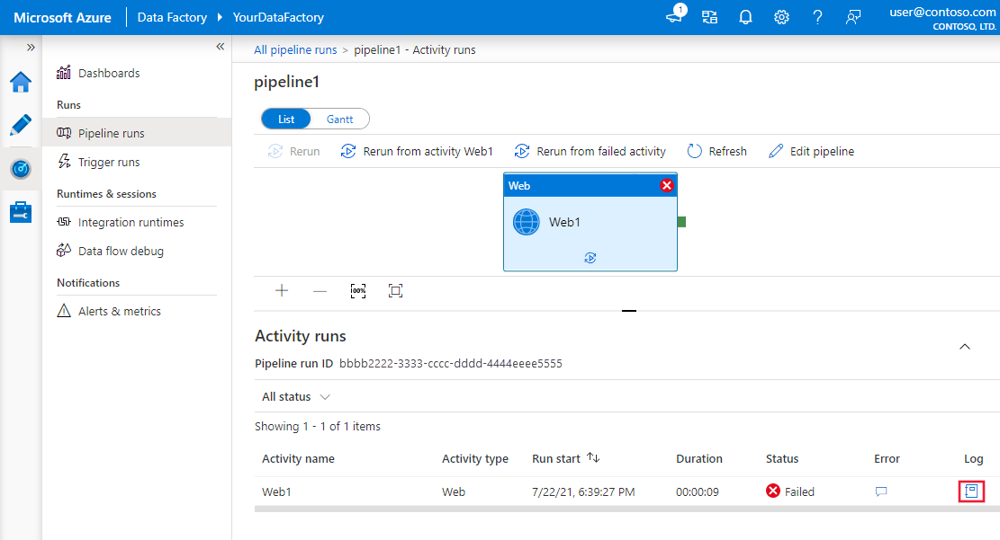

1. You will see related logs for the failed activity run. Click **Send logs** button for further assistance.

    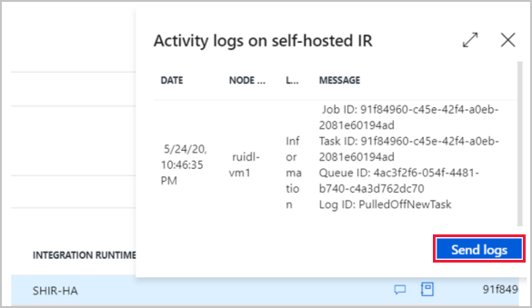

1. You can choose logs you want to send. For *Self-hosted IR*, you can upload logs related to failed activity or all logs on Self-hosted IR node. For *Shared IR*, you can only upload logs related to failed activity.

    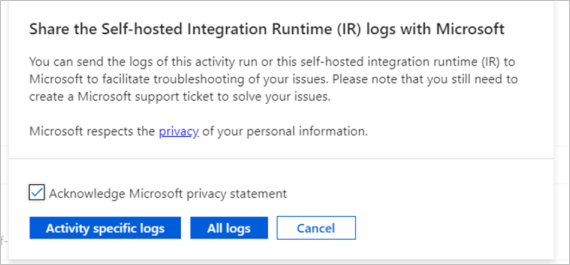

1. When the logs are uploading, keep a record of the Report ID if you need further assistance to solve the issue.

    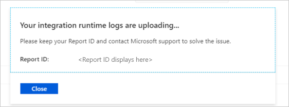

> [!NOTE]
> Log viewing and uploading requests will be executed on all online Self-hosted IR instances. Please make sure that all Self-hosted IR instances are online in case any missing logs. 


## Self-hosted IR general failure or error

### TLS/SSL certificate issue

#### Symptoms

When trying to enable TLS/SSL certificate (advanced) from **Self-hosted IR Configuration Manager** -> **Remote access from intranet**, after selecting TLS/SSL certificate, below error shows up:

`Remote access settings are invalid. Identity check failed for outgoing message. The expected DNS identity of the remote endpoint was ‘abc.microsoft.com’ but the remote endpoint provided DNS claim ‘microsoft.com’. If this is a legitimate remote endpoint, you can fix the problem by explicitly specifying DNS identity ‘microsoft.com’ as the Identity property of EndpointAddress when creating channel proxy.`

In above case, the user is using certificate with "microsoft.com" as last item.

#### Cause

This is a known issue in WCF: WCF TLS/SSL validation only checks last DNSName in SAN. 

#### Resolution

Wildcard certificate is supported in Azure Data Factory v2 Self-hosted IR. This issue normally happens because the SSL certificate is not correct. The last DNSName in SAN should be valid. Follow steps below to verify it. 
1.	Open Management Console, double check both *Subject* and *Subject Alternative Name* from the Certificate Details. In above case, for example, the last item in *Subject Alternative Name*, which is "DNS Name= microsoft.com.com", is not legitimate.
2.	Contact the certificate issue company to remove the wrong DNS Name.

### Concurrent jobs limit issue

#### Symptoms

When trying to increase the limit concurrent jobs from the Azure Data Factory UI, it hangs as *updating* forever.
The max value of concurrent jobs was set to 24 and you want to increase the count so that jobs can run faster. The minimum value that you can enter is 3 and the maximum value that you can enter is 32. You increased the value from 24 to 32 and hit on *update* button, in the UI it got stuck on *updating* as you can see below. After refreshing, the customer still saw the value as 24 and it never got updated to 32.

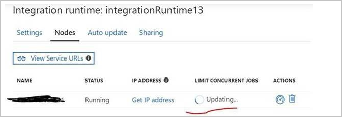

#### Cause

There is a limitation for the setting as the value depends on the computer logicCore and Memory, you can just adjust it to a smaller value such as 24 and see the result.

> [!TIP] 
> -	For details about what the logic core count is, and how to find our machine's logic core count, see [this article](https://www.top-password.com/blog/find-number-of-cores-in-your-cpu-on-windows-10/).
> -	For details about how to calculate the math.log, see [this article](https://www.rapidtables.com/calc/math/Log_Calculator.html).


### Self-hosted IR HA SSL Certificate issue

#### Symptoms

Self-hosted IR work node has reported the error below:

`Failed to pull shared states from primary node net.tcp://abc.cloud.corp.Microsoft.com:8060/ExternalService.svc/. Activity ID: XXXXX The X.509 certificate CN=abc.cloud.corp.Microsoft.com, OU=test, O=Microsoft chain building failed. The certificate that was used has a trust chain that cannot be verified. Replace the certificate or change the certificateValidationMode. The revocation function was unable to check revocation because the revocation server was offline.`

#### Cause

When we handle cases related to SSL/TLS handshake, we might encounter some issues related to certificate chain verification. 

#### Resolution

- Here is a quick and intuitive way to troubleshoot X.509 certificate chain build failure.
 
    1. Export the certificate, which needs to be verified. Go to manage computer certificate and find the certificate that you want to check and right-click **All tasks** -> **Export**.
    
        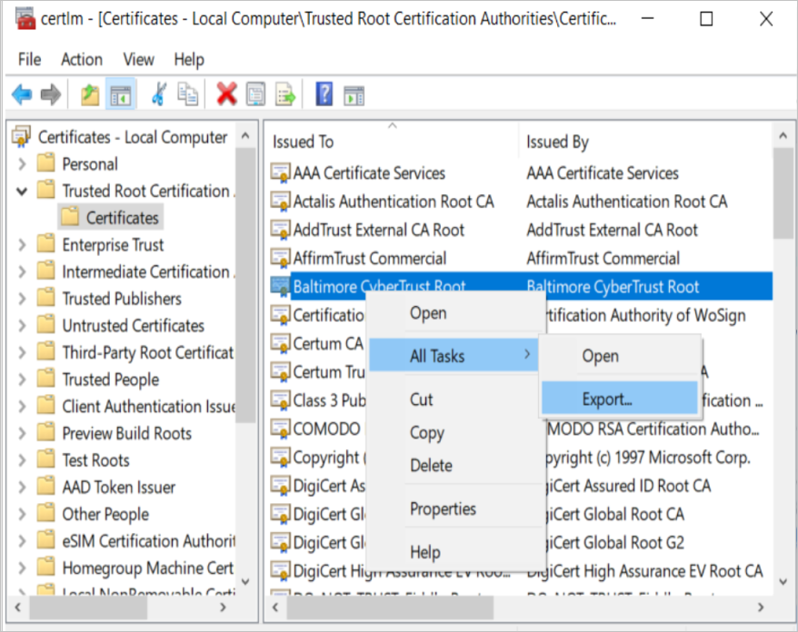

    2. Copy the exported certificate to the client machine. 
    3. On the client side, run below command in CMD. Make sure that you have replaced below *\<certificate path>* and *\<output txt file path>* placeholders with related paths.
    
        ```
        Certutil -verify -urlfetch    <certificate path>   >     <output txt file path> 
        ```

        For example:

        ```
        Certutil -verify -urlfetch c:\users\test\desktop\servercert02.cer > c:\users\test\desktop\Certinfo.txt
        ```
    4. Check if there is any error in the output txt file. You can find the error summary at the end of the txt file.

        For example: 

        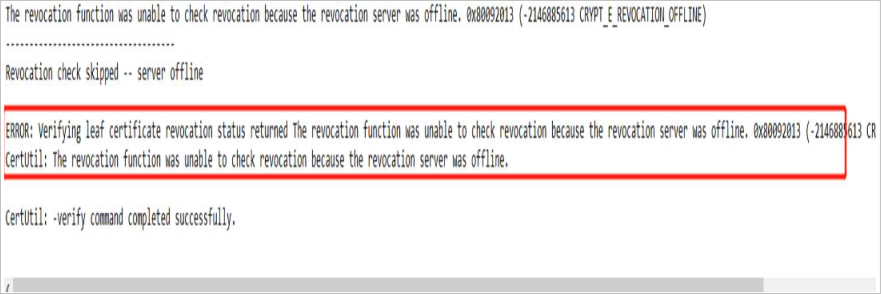

        If you do not see any error at the end of the log file as shown below, you can consider the certificate chain built up successfully in the client machine.
        
        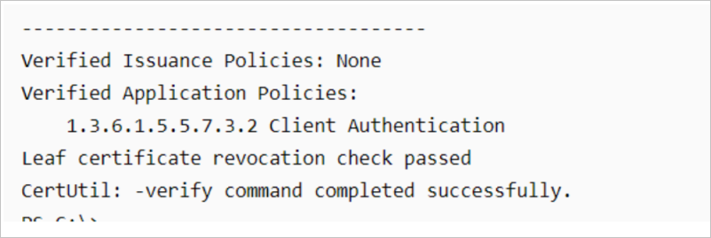      

- If there is AIA, CDP and OCSP configured in the certificate file. We can check it in a more intuitive way.
 
    1. You can get this info by checking the details of a certificate.
    
        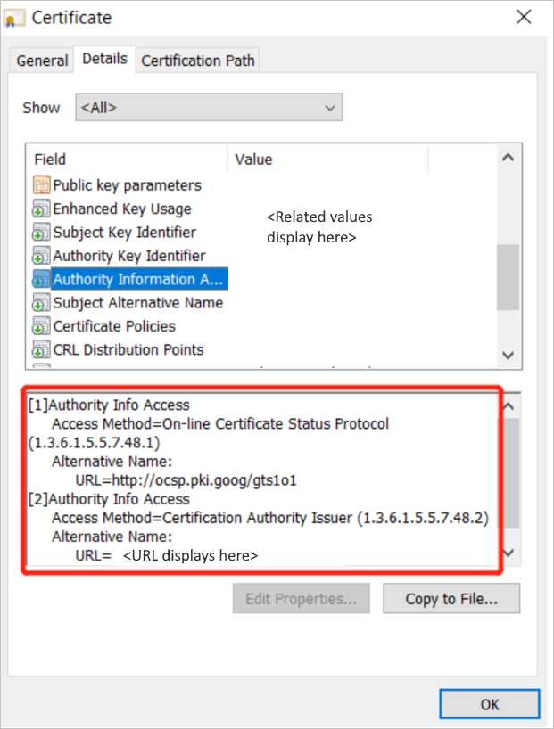
    1. Run below command. Make sure that you have replaced *\<certificate path>* placeholder with related path of the certificate.
    
        ```
          Certutil   -URL    <certificate path> 
        ```
    1. Then the **URL Retrieval tool** will be opened. You can verify certificates from AIA, CDP, and OCSP by clicking the **Retrieve** button.

        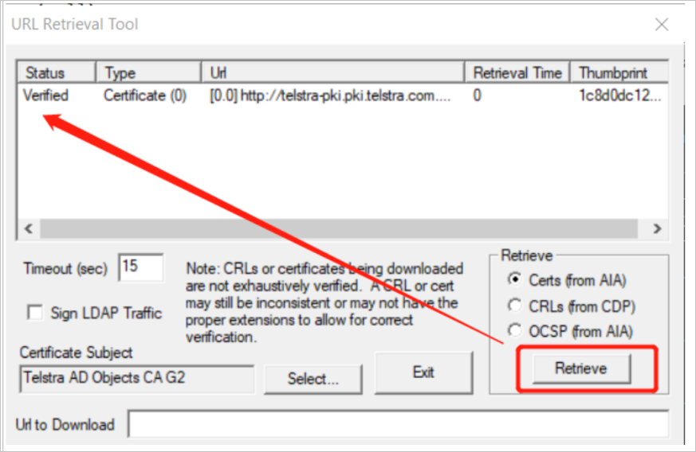
 
        The certificate chain can be built up successfully if the certificate from AIA is "Verified", and the certificate from CDP or OCSP is "Verified".

        If you see failure when retrieving AIA, CDP, work with network team to get the client machine ready to connect to target URL. It will be enough if either the http path or the ldap path is able to be verified.

### Self-hosted IR could not load file or assembly

#### Symptoms

`Could not load file or assembly 'XXXXXXXXXXXXXXXX, Version=4.0.2.0, Culture=neutral, PublicKeyToken=XXXXXXXXX' or one of its dependencies. The system cannot find the file specified. Activity ID: 92693b45-b4bf-4fc8-89da-2d3dc56f27c3`
 
For example: 

`Could not load file or assembly 'System.ValueTuple, Version=4.0.2.0, Culture=neutral, PublicKeyToken=XXXXXXXXX' or one of its dependencies. The system cannot find the file specified. Activity ID: 92693b45-b4bf-4fc8-89da-2d3dc56f27c3`

#### Cause

If you take process monitor, you can see following result:

[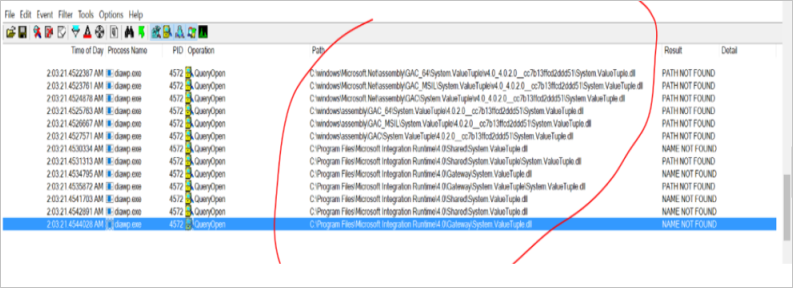](media/self-hosted-integration-runtime-troubleshoot-guide/process-monitor.png#lightbox)

> [!TIP] 
> You can set filter as shown in below screenshot.
> It tells us that the dll **System.ValueTuple** is not located in GAC related folder, or in *C:\Program Files\Microsoft Integration Runtime\4.0\Gateway*, or in *C:\Program Files\Microsoft Integration Runtime\4.0\Shared* folder.
> Basically, it will load the dll from *GAC* folder first, and then from *Shared* and finally from *Gateway* folder. Therefore, you can put the dll to any path which can be helpful.

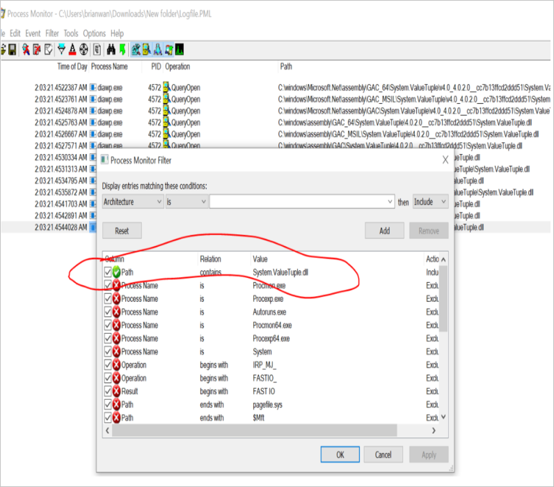

#### Resolution

You can find that the **System.ValueTuple.dll** is located at *C:\Program Files\Microsoft Integration Runtime\4.0\Gateway\DataScan* folder. Copy the **System.ValueTuple.dll** to *C:\Program Files\Microsoft Integration Runtime\4.0\Gateway* folder to resolve the issue.

You can use the same method to solve other file or assembly missing issues.

#### More Information

The reason why you see the System.ValueTuple.dll under *%windir%\Microsoft.NET\assembly* and *%windir%\assembly* is that it is a .NET behavior. 

From the error below, you can clearly see the assembly *System.ValueTuple* is not there. So such issue happens when the application tries to check the assembly *System.ValueTuple.dll*.
 
`<LogProperties><ErrorInfo>[{"Code":0,"Message":"The type initializer for 'Npgsql.PoolManager' threw an exception.","EventType":0,"Category":5,"Data":{},"MsgId":null,"ExceptionType":"System.TypeInitializationException","Source":"Npgsql","StackTrace":"","InnerEventInfos":[{"Code":0,"Message":"Could not load file or assembly 'System.ValueTuple, Version=4.0.2.0, Culture=neutral, PublicKeyToken=XXXXXXXXX' or one of its dependencies. The system cannot find the file specified.","EventType":0,"Category":5,"Data":{},"MsgId":null,"ExceptionType":"System.IO.FileNotFoundException","Source":"Npgsql","StackTrace":"","InnerEventInfos":[]}]}]</ErrorInfo></LogProperties>`
 
For more information about GAC, see [this article](https://docs.microsoft.com/dotnet/framework/app-domains/gac).


### How to audit Self-hosted IR key missing

#### Symptoms

The self-hosted integration runtime suddenly goes to offline without key, below error message shows in the Event Log: 
`Authentication Key is not assigned yet`

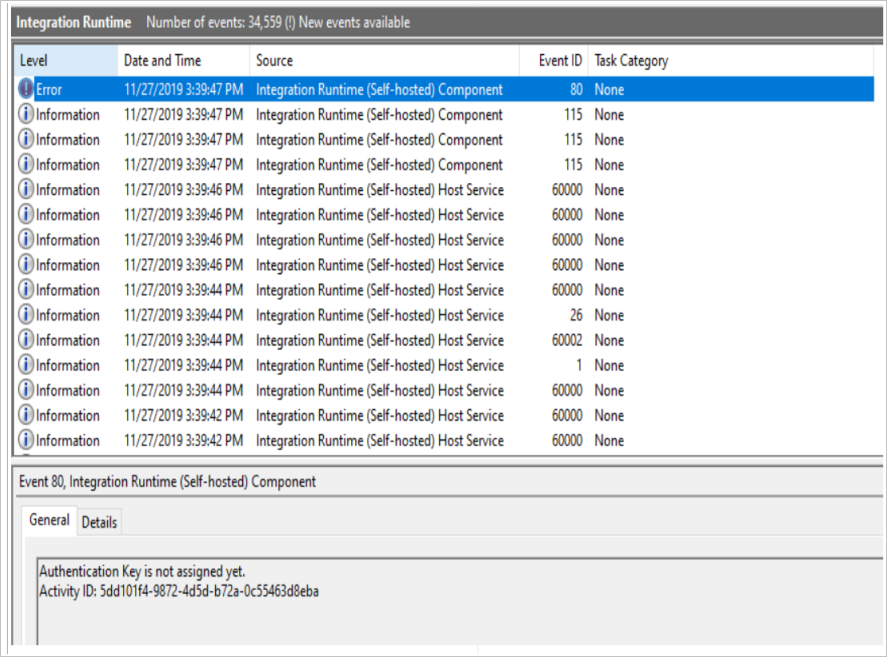

#### Cause

- The Self-hosted IR node or logical Self-hosted IR in portal is deleted.
- A clean uninstall is done.

#### Resolution

If neither of the above causes applies, you can go to the folder: *%programdata%\Microsoft\Data Transfer\DataManagementGateway*, and check whether the file named **Configurations** is deleted. If it's deleted, follow the instructions [here](https://www.netwrix.com/how_to_detect_who_deleted_file.html) to audit who deletes the file.

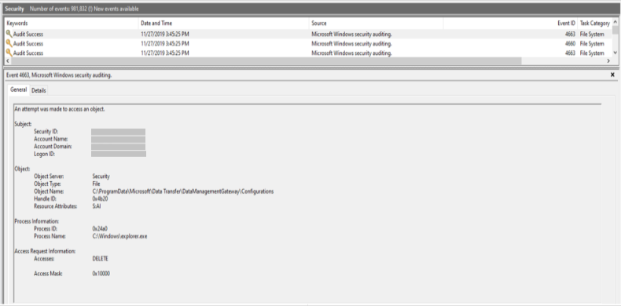


### Cannot use Self-hosted IR to bridge two on-premises data stores

#### Symptoms

After creating Self-hosted IRs for both source and destination data stores, you want to connect the two IRs together to finish a copy. If the data stores are configured in different VNETs, or they cannot understand the gateway mechanism, you will hit errors like: *the driver of source cannot be found in destination IR*; *the source cannot be accessed by the destination IR*.
 
#### Cause

The Self-hosted IR is designed as a central node of a copy activity, not a client agent that needs to be installed for each data store.
 
In above case, the linked service for each data store should be created with the same IR, and the IR should be able to access both data stores through network. No matter the IR is installed with source data store, destination data store, or on a third machine, if two linked services are created with different IRs, but used in the same copy activity, the destination IR will be used, and the drivers for both data stores need to be installed on the destination IR machine.

#### Resolution

Install drivers for both source and destination on the destination IR, and make sure it can access the source data store.
 
If the traffic cannot pass through the network between two data stores (for example, they are configured in two VNETs), you may not finish the copy in one activity even with IR installed. In that case, you may create two copy activities with two IRs, each in a VENT: 1 IR to copy from data store 1 to Azure Blob Storage, another to copy from Azure Blob Storage to data store 2. This could simulate the requirement to use the IR to create a bridge that connects two disconnected data stores.


### Credential sync issue causes credential lost from HA

#### Symptoms

The data source credential "XXXXXXXXXX" is deleted from current Integration Runtime node with payload "when you delete the link service on Azure portal, or the task has the wrong payload, please create new link service with your credential again".

#### Cause

Your Self-hosted IR is built in HA mode with two nodes, but they are not in credentials sync state, which means the credentials stored in dispatcher node aren't synced to other worker nodes. If any failover happens from dispatcher node to worker node but the credentials only existed in previous dispatcher node, the task will fail when trying to access credentials, and you will hit above error.

#### Resolution

The only way to avoid this issue is to make sure two nodes are in credentials sync state. Otherwise you have to reinput credentials for new dispatcher.


### Cannot choose the certificate due to private key missing

#### Symptoms

1.	Import a PFX file to the certificate store.
2.	When selecting the certificate through IR Configuration Manager UI, you hit below error:

    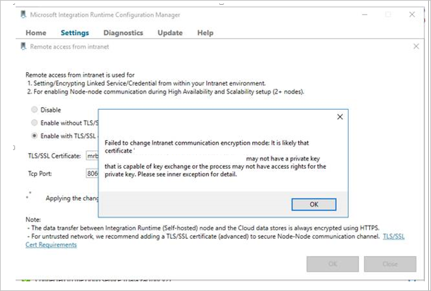

#### Cause

- The user account is in low privilege and cannot access private key.
- The certificate was generated as signature but not as key exchange.

#### Resolution

1.	Use a privileged account that can access private key to operate the UI.
2.	Run below command to import the certificate:
    
    ```
    certutil -importpfx FILENAME.pfx AT_KEYEXCHANGE
    ```


## Self-hosted IR setup

### The Integration Runtime registration error 

#### Symptoms

Sometimes we want to run Self-hosted IR in a different account for the reasons like below:
- Company policy disallows the service account.
- Some authentication is required.

After changing the service account in the Service Panel, you may find that the Integration Runtime stops working.

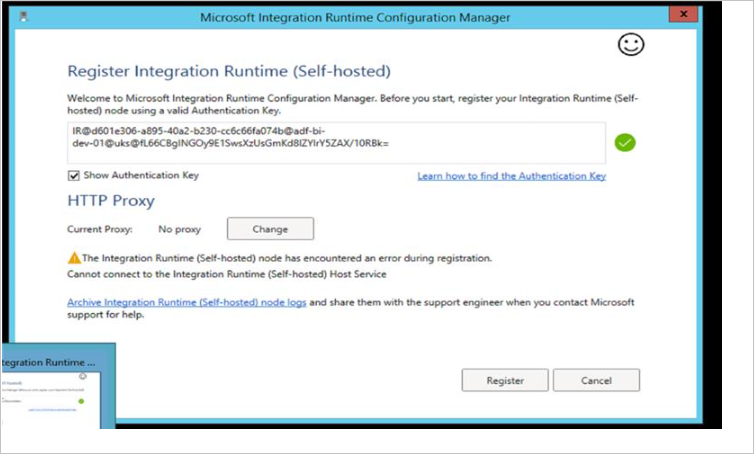

#### Cause

There are many resources that are only granted to the service account. When changing the service account to another account, the permission of all dependent resources remains the same.

#### Resolution

Go to the Integration Runtime event log to check the error.

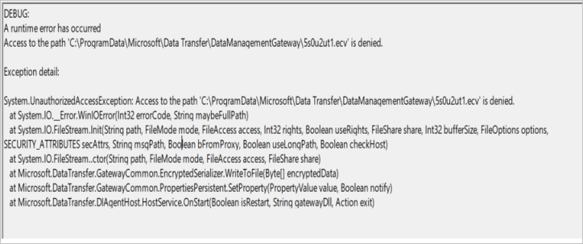

If the error shows as above *UnauthorizedAccessException*, follow below instructions:


1. Check *DIAHostService* logon service account in the Windows service panel.

    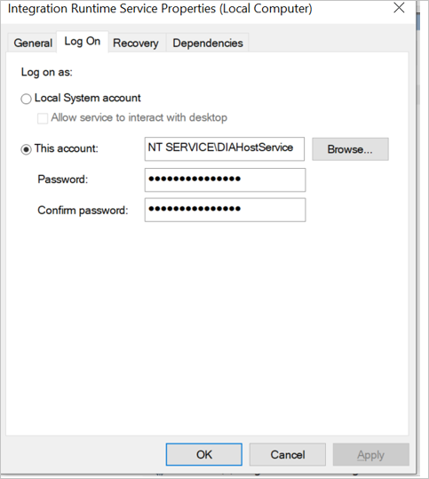

2. Check whether the logon service account has the R/W permission over the folder: *%programdata%\Microsoft\DataTransfer\DataManagementGateway*.

    - By default, if the service logon account has not been changed, it should have the permission of R/W.

        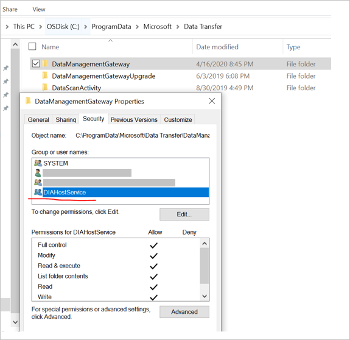

    - If you have changed the service logon account, follow below steps to mitigate the issue:
        1. Clean uninstall the current Self-hosted IR.
        1. Install the Self-hosted IR bits.
        1. Follow below instructions to change the service account: 
            1. Go to selfhosted IR's installation folder, switch to the folder: *Microsoft Integration Runtime\4.0\Shared*.
            1. Start a command line using elevated privilege. Replace *\<user>* and *\<password>* with your own username and password and then run below command:
                       
                ```
                dmgcmd.exe -SwitchServiceAccount "<user>" "<password>"
                ```
            1. If you want to change to LocalSystem account, make sure to use a correct format for this account. Below is an example of the correct format:

                ```
                dmgcmd.exe -SwitchServiceAccount "NT Authority\System" ""
                ```         
                Do **not** use format as shown below:

                ```
                dmgcmd.exe -SwitchServiceAccount "LocalSystem" ""
                ```              
            1. For alternative, since Local System has higher privilege than administrator, you can also directly change it in "Services".
            1. You can use local/domain user for the IR service logon account.            
        1. Register the Integration Runtime.

If the error shows as: *Service 'Integration Runtime Service' (DIAHostService) failed to start. Verify that you have sufficient privileges to start system services*, follow below instructions:

1. Check *DIAHostService* logon service account in the Windows service panel.
   
    

2. Check whether the logon service account has the **Log on as a service** permission to start Windows Service:

    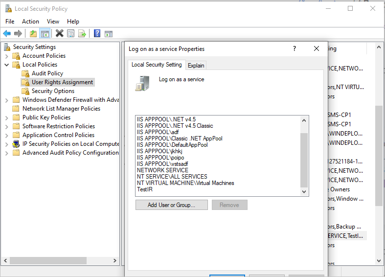

#### More Information

If neither of above two patterns in resolution apply in your case, try to collect below Windows Event logs: 
- Applications and Services Logs -> Integration Runtime
- Windows Logs -> Application

### Cannot find Register button to register a Self-hosted IR    

#### Symptoms

The **Register** button could not be found on the Configuration Manager UI when registering a Self-hosted IR.

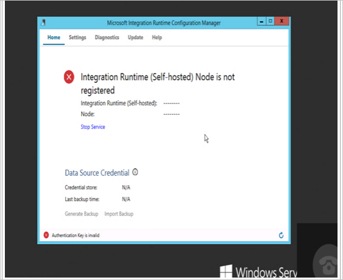

#### Cause

Since the release of the *Integration Runtime 3.0*, the **Register** button on an existing Integration Runtime Node has been removed to enable a cleaner and more secure environment. If a node has been registered to some Integration Runtime (whether online or not), to re-register it to another Integration Runtime, you must uninstall the previous node, and then install and register the node.

#### Resolution

1. Go to the control panel to uninstall the existing Integration Runtime.

    > [!IMPORTANT] 
    > In the process below, select Yes. Do not keep data during the uninstall process.

    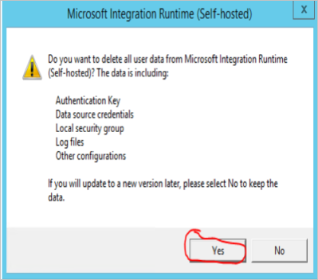

1. If you don't have the Integration runtime installer MSI, go to [download center](https://www.microsoft.com/en-sg/download/details.aspx?id=39717) to download the latest Integration Runtime.
1. Install the MSI and register the Integration Runtime.


### Unable to register the Self-hosted IR due to localhost    

#### Symptoms

Unable to register the Self-hosted IR on a new Machine when get_LoopbackIpOrName.

**Debug:**
A runtime error has occurred.
The type initializer for 'Microsoft.DataTransfer.DIAgentHost.DataSourceCache' threw an exception.
A non-recoverable error occurred during a database lookup.
 
**Exception detail:**
System.TypeInitializationException: The type initializer for 'Microsoft.DataTransfer.DIAgentHost.DataSourceCache' threw an exception. ---> System.Net.Sockets.SocketException: A non-recoverable error occurred during a database lookup at System.Net.Dns.GetAddrInfo(String name).

#### Cause

The issue usually happens when resolving localhost.

#### Resolution

Use Localhost 127.0.0.1 to host file and resolve such issue.


### Self-hosted setup failed    

#### Symptoms

Cannot uninstall an existing IR, or install a new IR, or upgrade an existing IR to a new IR.

#### Cause

The installation depends on the Windows Installer Service. There are variant reasons that may cause installation problem:
- Not enough disk space
- Lack of permissions
- NT Service is locked for some reason
- CPU utilization is too high
- MSI file is hosted in a slow network location
- Some system files or registries were touched unintentionally


## Self-hosted IR connectivity issues

### Self-hosted integration runtime can't connect to cloud service

#### Symptoms


#### Cause 

The self-hosted integration runtime can't connect to the Data Factory service (backend). This issue is typically caused by network settings in the firewall.

#### Resolution

1. Check whether the integration runtime service is running.
    
   
    
1. If the service is running, go on to step 3.

1. If there's no proxy configured on the self-hosted integration runtime (which is the default setting), run the following PowerShell command on the machine where the self-hosted integration runtime is installed:

    ```powershell
    (New-Object System.Net.WebClient).DownloadString("https://wu2.frontend.clouddatahub.net/")
    ```
        
   > [!NOTE]     
   > The service URL may vary, depending on your Data Factory location. You can find the service URL under **ADF UI** > **Connections** > **Integration runtimes** > **Edit Self-hosted IR** > **Nodes** > **View Service URLs**.
            
    The following is the expected response:
            
    
            
1. If you don't receive the expected response, use one of the following methods as appropriate to your situation:
            
    * If you receive a "Remote name could not be resolved" message, there's a Domain Name System (DNS) issue. Contact your network team to fix this issue.
    * If you receive an "ssl/tls cert is not trusted" message, check whether the certificate for https://wu2.frontend.clouddatahub.net/ is trusted on the machine, and then install the public certificate by using Certificate Manager. This action should mitigate the issue.
    * Go to **Windows** > **Event viewer (logs)** > **Applications and Services Logs** > **Integration Runtime** and check for any failure that's caused by DNS, a firewall rule, or company network settings. (If you find such a failure, forcibly close the connection.) Because every company has customized network settings, contact your network team to troubleshoot these issues.

1. If "proxy" has been configured on the self-hosted integration runtime, verify that your proxy server can access the service endpoint. For a sample command, see [PowerShell, web requests, and proxies](https://stackoverflow.com/questions/571429/powershell-web-requests-and-proxies).    
                
    ```powershell
    $user = $env:username
    $webproxy = (get-itemproperty 'HKCU:\Software\Microsoft\Windows\CurrentVersion\Internet
    Settings').ProxyServer
    $pwd = Read-Host "Password?" -assecurestring
    $proxy = new-object System.Net.WebProxy
    $proxy.Address = $webproxy
    $account = new-object System.Net.NetworkCredential($user,[Runtime.InteropServices.Marshal]::PtrToStringAuto([Runtime.InteropServices.Marshal]::SecureStringToBSTR($pwd)), "")
    $proxy.credentials = $account
    $url = "https://wu2.frontend.clouddatahub.net/"
    $wc = new-object system.net.WebClient
    $wc.proxy = $proxy
    $webpage = $wc.DownloadData($url)
    $string = [System.Text.Encoding]::ASCII.GetString($webpage)
    $string
    ```

The following is the expected response:
            


> [!NOTE] 
> Proxy considerations:
> *    Check whether the proxy server needs to be put on the Safe Recipients list. If so, make sure [these domains](https://docs.microsoft.com/azure/data-factory/data-movement-security-considerations#firewall-requirements-for-on-premisesprivate-network) are on the Safe Recipients list.
> *    Check whether the TLS/SSL certificate "wu2.frontend.clouddatahub.net/" is trusted on the proxy server.
> *    If you're using Active Directory authentication on the proxy, change the service account to the user account that can access the proxy as "Integration Runtime Service."

### Error message: Self-hosted integration runtime node/ logical SHIR is in Inactive/ "Running (Limited)" state

#### Cause 

The self-hosted integrated runtime node might have an **Inactive** status, as shown in the following screenshot:


This behavior occurs when nodes can't communicate with each other.

#### Resolution

1. Log in to the node-hosted VM. Under **Applications and Services Logs** > **Integration Runtime**, open Event Viewer, and filter all the error logs.

1. Check whether an error log contains the following error: 
    
    ```
    System.ServiceModel.EndpointNotFoundException: Could not connect to net.tcp://xxxxxxx.bwld.com:8060/ExternalService.svc/WorkerManager. The connection attempt lasted for a time span of 00:00:00.9940994. TCP error code 10061: No connection could be made because the target machine actively refused it 10.2.4.10:8060. 
    System.Net.Sockets.SocketException: No connection could be made because the target machine actively refused it. 
    10.2.4.10:8060
    at System.Net.Sockets.Socket.DoConnect(EndPoint endPointSnapshot, SocketAddress socketAddress)
    at System.Net.Sockets.Socket.Connect(EndPoint remoteEP)
    at System.ServiceModel.Channels.SocketConnectionInitiator.Connect(Uri uri, TimeSpan timeout)
    ```
       
1. If you see this error, run the following on a command line: 

   ```
   telnet 10.2.4.10 8060
   ```
   
1. If you receive the following error, contact your IT department for help with fixing this issue. After you can successfully telnet, contact Microsoft Support if you still have issues with the integrative runtime node status.
        
   
        
1. Check whether the error log contains the following:

    ```
    Error log: Cannot connect to worker manager: net.tcp://xxxxxx:8060/ExternalService.svc/ No DNS entries exist for host azranlcir01r1. No such host is known Exception detail: System.ServiceModel.EndpointNotFoundException: No DNS entries exist for host xxxxx. ---> System.Net.Sockets.SocketException: No such host is known at System.Net.Dns.GetAddrInfo(String name) at System.Net.Dns.InternalGetHostByName(String hostName, Boolean includeIPv6) at System.Net.Dns.GetHostEntry(String hostNameOrAddress) at System.ServiceModel.Channels.DnsCache.Resolve(Uri uri) --- End of inner exception stack trace --- Server stack trace: at System.ServiceModel.Channels.DnsCache.Resolve(Uri uri)
    ```
    
1. To resolve the issue, try one or both of the following methods:
    - Put all the nodes in the same domain.
    - Add the IP to host mapping in all the hosted VM's host files.

### Connectivity issue between Self-hosted IR and Data Factory or Self-hosted IR and data source/sink

To troubleshoot the network connectivity issue, you should know 
how to collect the network trace, understand how to use it, and [analyze the netmon trace](#how-to-analyze-netmon-trace) before applying the Netmon Tools in real cases from Self-hosted IR.

#### Symptoms

Sometimes, when we troubleshoot the connectivity issues such as below one between Self-hosted IR and Data Factory: 


Or the one between Self-hosted IR and data source/sink, we will encounter following errors:

`Copy failed with error:Type=Microsoft.DataTransfer.Common.Shared.HybridDeliveryException,Message=Cannot connect to SQL Server: ‘IP address’`

`One or more errors occurred. An error occurred while sending the request. The underlying connection was closed: An unexpected error occurred on a receive. Unable to read data from the transport connection: An existing connection was forcibly closed by the remote host. An existing connection was forcibly closed by the remote host Activity ID.`

#### Resolution:

When encountering above issues, refer to the following instructions to troubleshoot further:

Take the netmon trace and analyze further.
- Firstly, you can set the filter to see any reset there from the server to the client side. From below example, you can see the server side is Data Factory server.

    

- When you get the reset package, you can find the conversation by following TCP.

    

- Then you can get the conversion between client and Data Factory server below by removing the filter.

    
- Based on the netmon trace collected, we can tell that the TTL (TimeToLive) total is 64. According to the **Default TTL and Hop Limit Values** mentioned in [this article](https://packetpushers.net/ip-time-to-live-and-hop-limit-basics/) (as extracted below), we can see that it is the Linux System that resets the package and causes the disconnection.

    Default TTL and Hop Limit values vary between different operating systems, here are the defaults for a few:
    - Linux kernel 2.4 (circa 2001): 255 for TCP, UDP, and ICMP
    - Linux kernel 4.10 (2015): 64 for TCP, UDP, and ICMP
    - Windows XP (2001): 128 for TCP, UDP, and ICMP
    - Windows 10 (2015): 128 for TCP, UDP, and ICMP
    - Windows Server 2008: 128 for TCP, UDP, and ICMP
    - Windows Server 2019 (2018): 128 for TCP, UDP, and ICMP
    - macOS (2001): 64 for TCP, UDP, and ICMP

    
    
    However, it is shown as 61 instead of 64 in above example, because that when the network package reaches to destination, it needs to go through different hops like routers/network devices. The number of routers/network devices will be deducted in the final TTL.
    In this case, we can see that Reset may be sent from Linux System with TTL 64.

- We need to check the fourth hop from Self-hosted IR to confirm where the reset device may come from.
 
    *Network package from Linux System A with TTL 64 -> B TTL 64 Minus 1 = 63 -> C TTL 63 Minus 1 = 62 -> TTL 62 Minus 1 = 61 Self-hosted IR*

- In ideal situation, the TTL will be 128, which means Windows System is running our Data Factory. As shown in below example, *128 – 107 = 21 hops*, meaning that 21 hops for the package were sent from Data Factory to Self-hosted IR during the TCP 3 handshake.
 
    

    Therefore, you need to engage the network team to check what the fourth hop is from Self-hosted IR. If it is the firewall as Linux System, then check any logs on why that device resets the package after TCP 3 handshake. However, if you are not sure where to do investigation, try to get the netmon trace from Self-hosted IR and Firewall together during the problematic time to figure out which device may reset this package and cause the disconnection. In this case, you also need to engage your network team to move forward.

### How to analyze netmon trace

> [!NOTE] 
> Below instruction is applicable to netmon trace. Since netmon trace is currently out of support, you can leverage wireshark as the same.

When you try to telnet **8.8.8.8 888** with netmon trace collected, you are supposed to see below trace:


 

This means that you could not make TCP connection to the **8.8.8.8** server side based on the port **888**, so you see two **SynReTransmit** additional packages there. Since Source **SELF-HOST2** could not make connection to **8.8.8.8** at the first package, it will keep on making connection.

> [!TIP]
> - You can Click **Load Filter** -> **Standard Filter** -> **Addresses** -> **IPv4 Addresses**.
> - Input **IPv4.Address == 8.8.8.8** as filter, and click **Apply**. After that, you will only see the communication from local machine to the destination **8.8.8.8**.


        


Below example shows what a good scenario would look like. 

- If Telnet **8.8.8.8 53** is working fine without any issue, you can see TCP 3 handshake happen, and then the session finishes with TCP 4 handshake.

    
     
    

- Based on the above TCP 3 handshake, you can see below workflow:

    
 
- The TCP 4 handshake to finish the session and its work flow will be shown as following:

    

     


### Receiving email notification to update the network configuration to allow communication with new IP addresses

#### Symptoms

You may receive below email notification, which recommended you to update the network configuration to allow communication with new IP addresses for Azure Data Factory by 8 November 2020:

   

#### Resolution

This notification is for outbound communications from your private network to ADF service. For example, if you have Self-hosted IR or Azure-SQL Server Integration Services (SSIS) IR in VNET, which needs to access ADF service, then you need to add the new IP ranges in your network rule. But if you use service tag, there is no impact and no action is required.

#### More details

These new IP ranges only have impact on outbound communications from customer private network to ADF service, such as SHIR or SSIS IR in on-premise network or your virtual network, which needs to interact with ADF service. 

For existing users:

1. Check if you set up any NSG rules in the private network. If no, then there is no impact on your side.
2. If yes, check if you use service tag or not. If you use service tag, then there is no need to change or add anything as the new IP ranges are under existing service tag.
3. If you use IP addresses directly in your rule setting, then check if you add all IP ranges in service tags IP range download link. We have already put the new IP ranges in this file. 

For new users: 

You just need to follow up relevant SHIR or SSIS IR configuration in our document to configure NSG rules.

## Self-hosted IR sharing

### Share Self-hosted IR from a different tenant is not supported 

#### Symptoms

You may notice other data factories (on different tenants) while attempting to share the Self-hosted IR from Azure Data Factory UI, but cannot share the Self-hosted IR across data factories that are on different tenants.

#### Cause

The Self-hosted IR cannot be shared cross tenants.


## Next steps

For more help with troubleshooting, try the following resources:

*  [Data Factory blog](https://azure.microsoft.com/blog/tag/azure-data-factory/)
*  [Data Factory feature requests](https://feedback.azure.com/forums/270578-data-factory)
*  [Azure videos](https://azure.microsoft.com/resources/videos/index/?sort=newest&services=data-factory)
*  [Microsoft Q&A question page](https://docs.microsoft.com/answers/topics/azure-data-factory.html)
*  [Stack overflow forum for Data Factory](https://stackoverflow.com/questions/tagged/azure-data-factory)
*  [Twitter information about Data Factory](https://twitter.com/hashtag/DataFactory)
*  [Mapping data flows performance guide](concepts-data-flow-performance.md)
