# Troubleshoot self-hosted integration runtime

[!INCLUDE[appliesto-adf-asa-md](includes/appliesto-adf-asa-md.md)]

This article explores common troubleshooting methods for self-hosted integration runtime in Azure Data Factory.

## Common errors and resolutions

### Error message: 

`Self-hosted integration runtime can't connect to cloud service`


#### Cause 

The self-hosted integration runtime can't connect to the Data Factory service (backend). This issue is typically caused by network settings in the firewall.

#### Resolution

1. Check whether the integration runtime service is running.
    
   
    
1. If the service is running, go on to step 3.

1. If there's no proxy configured on the self-hosted integration runtime (which is the default setting), run the following PowerShell command on the machine where the self-hosted integration runtime is installed:

    ```powershell
    (New-Object System.Net.WebClient).DownloadString("https://wu2.frontend.clouddatahub.net/")
    ```
        
   > [!NOTE]     
   > The service URL may vary, depending on your Data Factory location. You can find the service URL under **ADF UI** > **Connections** > **Integration runtimes** > **Edit Self-hosted IR** > **Nodes** > **View Service URLs**.
            
    The following is the expected response:
            
    
            
1. If you don't receive the expected response, use one of the following methods as appropriate to your situation:
            
    * If you receive a "Remote name could not be resolved" message, there's a Domain Name System (DNS) issue. Contact your network team to fix this issue.
    * If you receive an "ssl/tls cert is not trusted" message, check whether the certificate for https://wu2.frontend.clouddatahub.net/ is trusted on the machine, and then install the public certificate by using Certificate Manager. This action should mitigate the issue.
    * Go to **Windows** > **Event viewer (logs)** > **Applications and Services Logs** > **Integration Runtime** and check for any failure that's caused by DNS, a firewall rule, or company network settings. (If you find such a failure, forcibly close the connection.) Because every company has customized network settings, contact your network team to troubleshoot these issues.

1. If "proxy" has been configured on the self-hosted integration runtime, verify that your proxy server can access the service endpoint. For a sample command, see [PowerShell, web requests, and proxies](https://stackoverflow.com/questions/571429/powershell-web-requests-and-proxies).    
                
    ```powershell
    $user = $env:username
    $webproxy = (get-itemproperty 'HKCU:\Software\Microsoft\Windows\CurrentVersion\Internet
    Settings').ProxyServer
    $pwd = Read-Host "Password?" -assecurestring
    $proxy = new-object System.Net.WebProxy
    $proxy.Address = $webproxy
    $account = new-object System.Net.NetworkCredential($user,[Runtime.InteropServices.Marshal]::PtrToStringAuto([Runtime.InteropServices.Marshal]::SecureStringToBSTR($pwd)), "")
    $proxy.credentials = $account
    $url = "https://wu2.frontend.clouddatahub.net/"
    $wc = new-object system.net.WebClient
    $wc.proxy = $proxy
    $webpage = $wc.DownloadData($url)
    $string = [System.Text.Encoding]::ASCII.GetString($webpage)
    $string
    ```

The following is the expected response:
            


> [!NOTE] 
> Proxy considerations:
> *    Check whether the proxy server needs to be put on the Safe Recipients list. If so, make sure [these domains](https://docs.microsoft.com/azure/data-factory/data-movement-security-considerations#firewall-requirements-for-on-premisesprivate-network) are on the Safe Recipients list.
> *    Check whether the TLS/SSL certificate "wu2.frontend.clouddatahub.net/" is trusted on the proxy server.
> *    If you're using Active Directory authentication on the proxy, change the service account to the user account that can access the proxy as "Integration Runtime Service."

### Error message: 
`Self-hosted integration runtime node/ logical SHIR is in Inactive/ "Running (Limited)" state`

#### Cause 

The self-hosted integrated runtime node might have an **Inactive** status, as shown in the following screenshot:


This behavior occurs when nodes can't communicate with each other.

#### Resolution

1. Log in to the node-hosted VM. Under **Applications and Services Logs** > **Integration Runtime**, open Event Viewer, and filter all the error logs.

1. Check whether an error log contains the following error: 
    
    ```
    System.ServiceModel.EndpointNotFoundException: Could not connect to net.tcp://xxxxxxx.bwld.com:8060/ExternalService.svc/WorkerManager. The connection attempt lasted for a time span of 00:00:00.9940994. TCP error code 10061: No connection could be made because the target machine actively refused it 10.2.4.10:8060. 
    System.Net.Sockets.SocketException: No connection could be made because the target machine actively refused it. 
    10.2.4.10:8060
    at System.Net.Sockets.Socket.DoConnect(EndPoint endPointSnapshot, SocketAddress socketAddress)
    at System.Net.Sockets.Socket.Connect(EndPoint remoteEP)
    at System.ServiceModel.Channels.SocketConnectionInitiator.Connect(Uri uri, TimeSpan timeout)
    ```
       
1. If you see this error, run the following on a command line: 

   ```
   telnet 10.2.4.10 8060
   ```
   
1. If you receive the following error, contact your IT department for help with fixing this issue. After you can successfully telnet, contact Microsoft Support if you still have issues with the integrative runtime node status.
        
   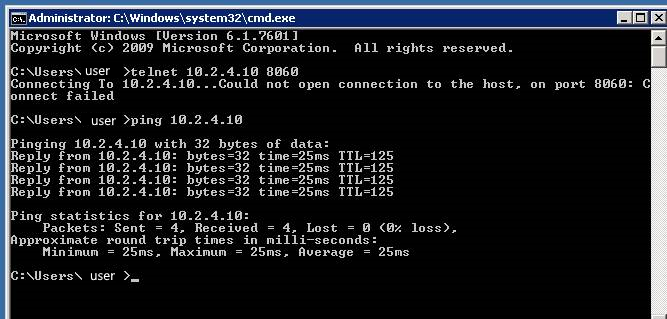
        
1. Check whether the error log contains the following:

    ```
    Error log: Cannot connect to worker manager: net.tcp://xxxxxx:8060/ExternalService.svc/ No DNS entries exist for host azranlcir01r1. No such host is known Exception detail: System.ServiceModel.EndpointNotFoundException: No DNS entries exist for host xxxxx. ---> System.Net.Sockets.SocketException: No such host is known at System.Net.Dns.GetAddrInfo(String name) at System.Net.Dns.InternalGetHostByName(String hostName, Boolean includeIPv6) at System.Net.Dns.GetHostEntry(String hostNameOrAddress) at System.ServiceModel.Channels.DnsCache.Resolve(Uri uri) --- End of inner exception stack trace --- Server stack trace: at System.ServiceModel.Channels.DnsCache.Resolve(Uri uri)
    ```
    
1. To resolve the issue, try one or both of the following methods:
    - Put all the nodes in the same domain.
    - Add the IP to host mapping in all the hosted VM's host files.


## Troubleshoot connectivity issue

### Troubleshoot connectivity issue between Self-hosted IR and Data Factory or Self-hosted IR and data source/sink

To troubleshoot the network connectivity issue, you should know 
how to [collect the network trace](#how-to-collect-netmon-trace), understand how to use it, and [analyze the netmon trace](#how-to-analyze-netmon-trace) before applying the Netmon Tools in real cases from Self-hosted IR.

Sometimes, when we troubleshoot the connectivity issues such as below one between Self-hosted IR and Data Factory: 

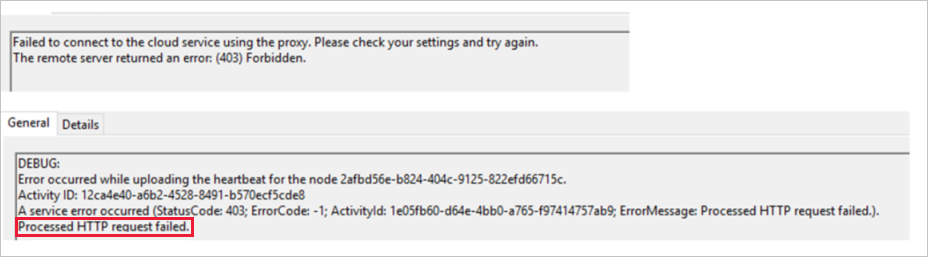

Or the one between Self-hosted IR and data source/sink, we will encounter following errors:

**Error message:**
`Copy failed with error:Type=Microsoft.DataTransfer.Common.Shared.HybridDeliveryException,Message=Cannot connect to SQL Server: ‘IP address’`

**Error message:**
`One or more errors occurred. An error occurred while sending the request. The underlying connection was closed: An unexpected error occurred on a receive. Unable to read data from the transport connection: An existing connection was forcibly closed by the remote host. An existing connection was forcibly closed by the remote host Activity ID.`

**Resolution:**
When encountering above issues, refer to the following instructions to troubleshoot further:

Take the netmon trace and analyze further.
- Firstly, you can set the filter to see any reset there from the server to the client side. From below example, you can see the server side is Data Factory server.

    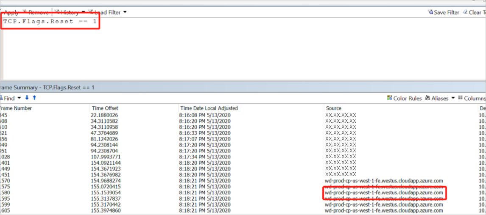

- When you get the reset package, you can find the conversation by following TCP.

    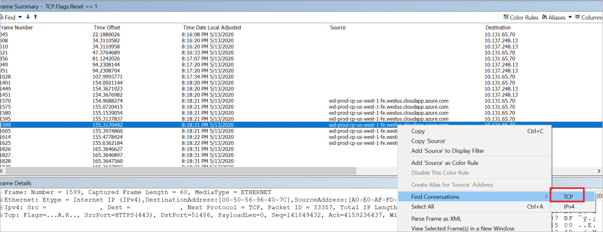

- Then you can get the conversion between client and Data Factory server below by removing the filter.

    
- Based on the netmon trace collected, we can tell that the TTL (TimeToLive) total is 64. According to the **Default TTL and Hop Limit Values** mentioned in [this article](https://packetpushers.net/ip-time-to-live-and-hop-limit-basics/) (as extracted below), we can see that it is the Linux System that resets the package and causes the disconnection.

    Default TTL and Hop Limit values vary between different operating systems, here are the defaults for a few:
    - Linux kernel 2.4 (circa 2001): 255 for TCP, UDP, and ICMP
    - Linux kernel 4.10 (2015): 64 for TCP, UDP, and ICMP
    - Windows XP (2001): 128 for TCP, UDP, and ICMP
    - Windows 10 (2015): 128 for TCP, UDP, and ICMP
    - Windows Server 2008: 128 for TCP, UDP, and ICMP
    - Windows Server 2019 (2018): 128 for TCP, UDP, and ICMP
    - macOS (2001): 64 for TCP, UDP, and ICMP

    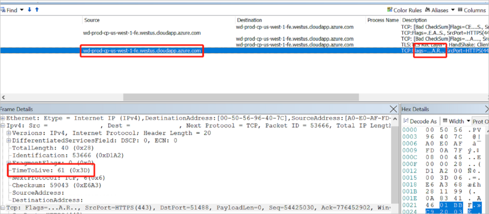
    
    However, it is shown as 61 instead of 64 in above example, because that when the network package reaches to destination, it needs to go through different hops like routers/network devices. The number of routers/network devices will be deducted in the final TTL.
    In this case, we can see that Reset may be sent from Linux System with TTL 64.

- We need to check the fourth hop from Self-hosted IR to confirm where the reset device may come from.
 
    *Network package from Linux System A with TTL 64 -> B TTL 64 Minus 1 = 63 -> C TTL 63 Minus 1 = 62 -> TTL 62 Minus 1 = 61 Self-hosted IR*

- In ideal situation, the TTL will be 128, which means Windows System is running our Data Factory. As shown in below example, *128 – 107 = 21 hops*, meaning that 21 hops for the package were sent from Data Factory to Self-hosted IR during the TCP 3 handshake.
 
    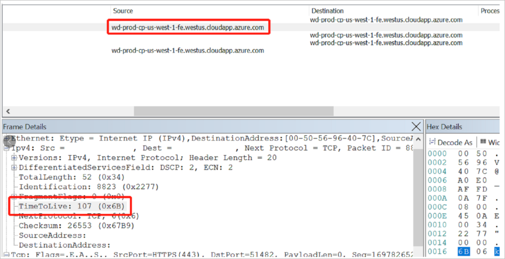

    Therefore, you need to engage the network team to check what the fourth hop is from Self-hosted IR. If it is the firewall as Linux System, then check any logs on why that device resets the package after TCP 3 handshake. However, if you are not sure where to do investigation, try to get the netmon trace from Self-hosted IR and Firewall together during the problematic time to figure out which device may reset this package and cause the disconnection. In this case, you also need to engage your network team to move forward.

### How to collect netmon trace

1.	Download the Netmon Tools from [this website](https://www.microsoft.com/en-sg/download/details.aspx?id=4865), and install it on your Server Machine (whatever server having the issue) and Client (such as Self-hosted IR).

2.	Create a folder, for example, in the following path: *D:\netmon*. Make sure that it has enough space to save the log.

3.	Capture the IP and Port Information. 
    1. Start a CMD Prompt.
    2. Select Run as admin and run the following command:
       
        ```
        Ipconfig /all >D:\netmon\IP.txt
        netstat -abno > D:\netmon\ServerNetstat.txt
        ```

4.	Capture the Netmon Trace (network package).
    1. Start a CMD Prompt.
    2. Select Run as admin and run the following command:
        
        ```
        cd C:\Program Files\Microsoft Network Monitor 3
        ```
    3. You can use three different commands to capture the network page:
        - Option A: RoundRobin File command (This will capture only one file and will overwrite old logs).

            ```
            nmcap /network * /capture /file D:\netmon\ServerConnection.cap:200M
            ```         
        - Option B: Chained File command (This will create new file if 200 MB is reached).
        
            ```
            nmcap /network * /capture /file D:\netmon\ServerConnection.chn:200M
            ```          
        - Option C: Scheduled File command.

            ```
            nmcap /network * /capture /StartWhen /Time 10:30:00 AM 10/28/2011 /StopWhen /Time 11:30:00 AM 10/28/2011 /file D:\netmon\ServerConnection.chn:200M
            ```  

5.	Press **Ctrl+C** to stop capture the Netmon trace.
 
> [!NOTE]
> If you can only collect the netmon trace on the client machine, please get the server ip address to help you analyze the trace.

### How to analyze netmon trace

When you try to telnet **8.8.8.8 888** with above netmon trace collected, you are supposed to see below trace:

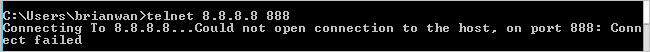

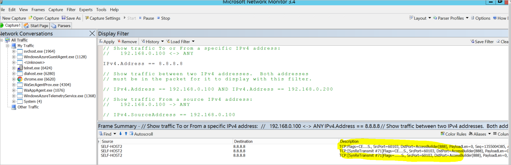
 

This means that you could not make TCP connection to the **8.8.8.8** server side based on the port **888**, so you see two **SynReTransmit** additional packages there. Since Source **SELF-HOST2** could not make connection to **8.8.8.8** at the first package, it will keep on making connection.

> [!TIP]
> - You can Click **Load Filter** -> **Standard Filter** -> **Addresses** -> **IPv4 Addresses**.
> - Input **IPv4.Address == 8.8.8.8** as filter, and click **Apply**. After that, you will only see the communication from local machine to the destination **8.8.8.8**.


        
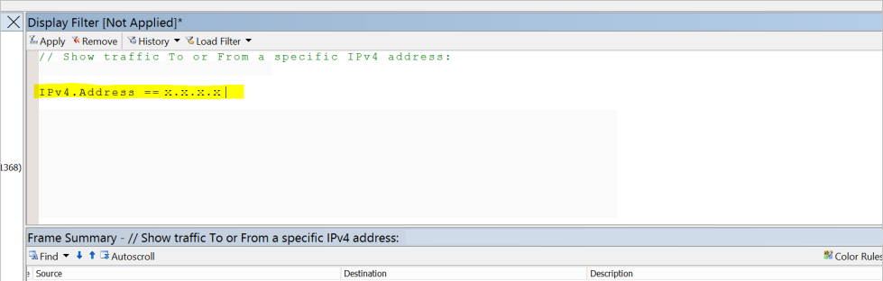

Below example shows what a good scenario would look like. 

- If Telnet **8.8.8.8 53** is working fine without any issue, you can see TCP 3 handshake happen, and then the session finishes with TCP 4 handshake.

    
     
    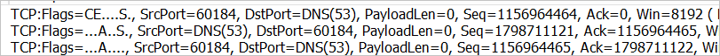

- Based on the above TCP 3 handshake, you can see below workflow:

    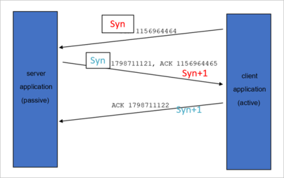
 
- The TCP 4 handshake to finish the session and its work flow will be shown as following:

    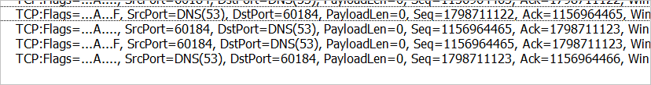

    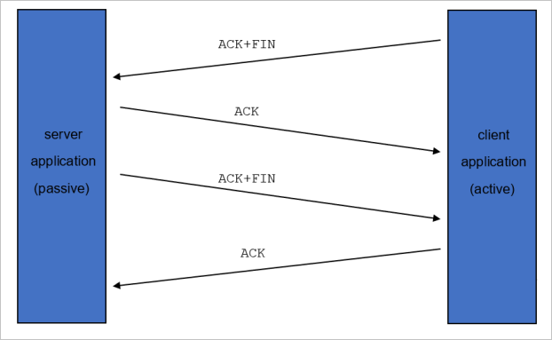 


## Next steps

For more help with troubleshooting, try the following resources:

*  [Data Factory blog](https://azure.microsoft.com/blog/tag/azure-data-factory/)
*  [Data Factory feature requests](https://feedback.azure.com/forums/270578-data-factory)
*  [Azure videos](https://azure.microsoft.com/resources/videos/index/?sort=newest&services=data-factory)
*  [Microsoft Q&A question page](https://docs.microsoft.com/answers/topics/azure-data-factory.html)
*  [Stack overflow forum for Data Factory](https://stackoverflow.com/questions/tagged/azure-data-factory)
*  [Twitter information about Data Factory](https://twitter.com/hashtag/DataFactory)
*  [Mapping data flows performance guide](concepts-data-flow-performance.md)
