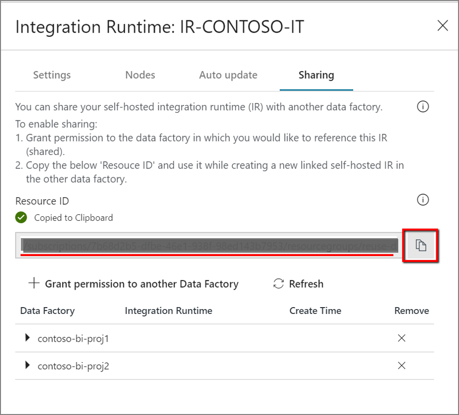
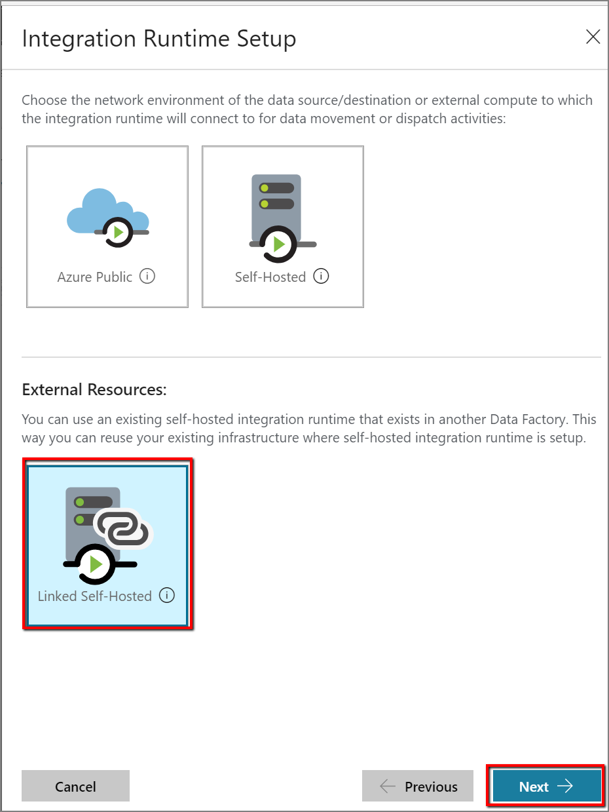
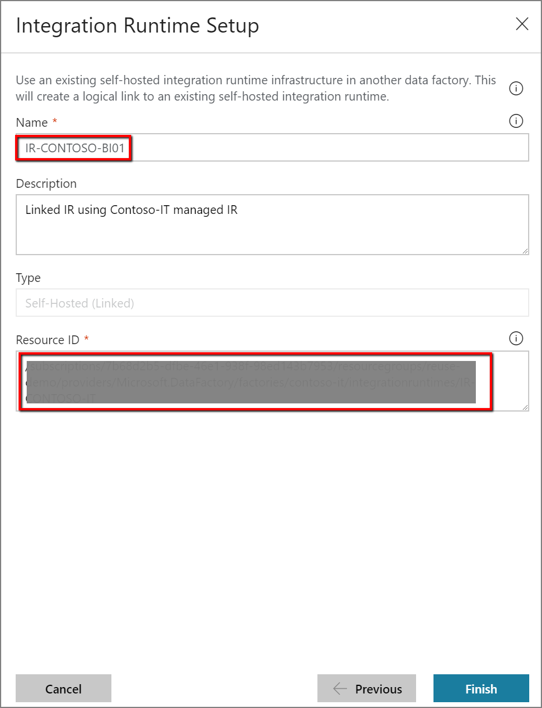

## Sharing the self-hosted integration runtime with multiple data factories

You can reuse an existing self-hosted integration runtime infrastructure that you already set up in a data factory. This enables you to create a *linked self-hosted integration runtime* in a different data factory by referencing an existing self-hosted IR (shared).

For a twelve-minute introduction and demonstration of this feature, watch the following video:

> [!VIDEO https://channel9.msdn.com/Shows/Azure-Friday/Hybrid-data-movement-across-multiple-Azure-Data-Factories/player]

### Terminology

- **Shared IR**: The original self-hosted IR that's running on a physical infrastructure.  
- **Linked IR**: The IR that references another shared IR. This is a logical IR and uses the infrastructure of another self-hosted IR (shared).

### Methods to share a self-hosted integration runtime

You can use the following methods to share a self-hosted integration runtime with multiple data factories.

- **Creating a linked self-hosted IR via PowerShell**

  To share a self-hosted integration runtime by using PowerShell, see [Create a shared self-hosted integration runtime in Azure Data Factory with PowerShell](create-shared-self-hosted-integration-runtime-powershell.md).

- **Creating a linked self-hosted IR via Azure Data Factory UI**

1. In the self-hosted IR to be shared, grant permission to the data factory in which you want to create the linked IR.

   

   

2. Note the resource ID of the self-hosted IR to be shared.

   

3. In the data factory to which the permissions were granted, create a new self-hosted IR (linked) and enter the resource ID.

   

   

### Monitoring

- **Shared IR**

  

  

- **Linked IR**

  

  

### Known limitations of self-hosted IR sharing

* The data factory in which a linked IR will be created must have an [MSI](https://docs.microsoft.com/azure/active-directory/managed-service-identity/overview). By default, the data factories created in the Azure portal or PowerShell cmdlets have an MSI created implicitly. But when a data factory is created through an Azure Resource Manager template or SDK, the **Identity** property must be set explicitly to ensure that Azure Resource Manager creates a data factory that contains an MSI. 

* The Azure Data Factory .NET SDK that supports this feature is version 1.1.0 or later.

* To grant permission, the user needs the Owner role or the inherited Owner role in the data factory where the shared IR exists.

* Sharing feature works only for Data Factories within the same Azure Active Directory tenant.

* For Active Directory [guest users](https://docs.microsoft.com/azure/active-directory/governance/manage-guest-access-with-access-reviews), the search functionality (listing all data factories by using a search keyword) in the UI [does not work](https://msdn.microsoft.com/library/azure/ad/graph/howto/azure-ad-graph-api-permission-scopes#SearchLimits). But as long as the guest user is the Owner of the data factory, they can share the IR without the search functionality, by directly typing the MSI of the data factory with which the IR needs to be shared in the **Assign Permission** text box and selecting **Add** in the Azure Data Factory UI. 

  > [!NOTE]
  > This feature is available only in Azure Data Factory V2. 
